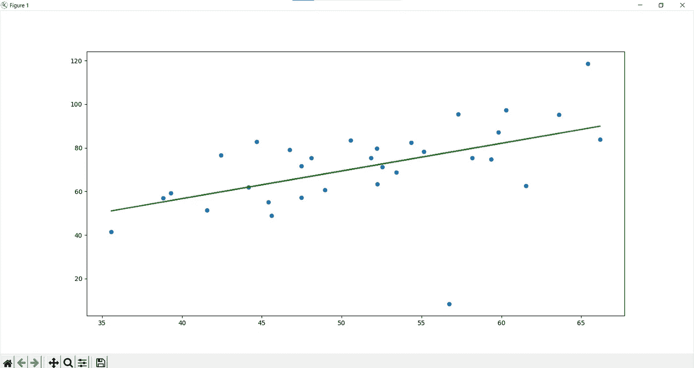

# 使用 Matplotlib、Pandas 和 Sklearn 可视化线性回归

> 原文：<https://levelup.gitconnected.com/visualize-linear-regression-with-matplotlib-pandas-and-sklearn-f5d65bc61dfe>

## 只用了 9 行代码！


[克里斯·利维拉尼](https://unsplash.com/@chrisliverani?utm_source=medium&utm_medium=referral)在 [Unsplash](https://unsplash.com?utm_source=medium&utm_medium=referral) 上拍摄的照片

您将学到的内容:

*   如何做一个简单的线性回归模型？

您需要什么:

*   对 Python 的基本理解

推荐:

*   与熊猫相处的经历
*   您选择的 IDE

# 包装

对于本教程，我们需要`matplotlib.pyplot`、`pandas`和`sklearn.linear_model`。

```
pip install matplotlib
pip install pandas
pip install scikit-learn
```

将它们导入 Python 文件:

```
import matplotlib.pyplot as plt import pandas as pd from sklearn.linear_model import LinearRegression
```

# 正在检索数据集

你可以从[这里](https://github.com/chasinginfinity/ml-from-scratch/blob/master/03%20Linear%20Regression%20in%202%20minutes/data.csv)下载数据集或者做一个叫`data.csv`的文件，把下面的几行复制进去。

```
32.502345269453031, 31.7070058465699253.426804033275019, 68.7775959816389161.530358025636438, 62.56238229794580347.475639634786098, 71.54663223356777759.813207869512318, 87.23092513368739355.142188413943821, 78.21151827079923252.211796692214001, 79.6419730498087439.299566694317065, 59.17148932186950848.10504169176825,  75.33124229706305652.550014442733818, 71.30087988685035345.419730144973755, 55.16567714595912354.351634881228918, 82.47884675749791944.164049496773352, 62.00892324572582558.16847071685779,  75.39287042599495756.727208057096611, 8.4361921588786448.955888566093719, 60.72360244067396544.687196231480904, 82.89250373145371560.297326851333466, 97.37989686216607845.618643772955828, 48.84715331735507238.816817537445637, 56.87721318626850666.189816606752601, 83.87856466460276365.41605174513407,  118.5912173025224947.48120860786787,  57.25181946226896941.57564261748702,  51.39174407983230751.84518690563943,  75.38065166531235759.370822011089523, 74.76556403215137457.31000343834809,   95.45505292257473763.615561251453308, 95.22936601755530746.737619407976972, 79.05240616956558650.556760148547767, 83.43207142132371252.223996085553047, 63.35879031749787835.567830047746632, 41.41288530370056342.436476944055642, 76.617341280074044
```

结果:

# 读取数据集

让我们加载数据集

```
data = pd.read_csv('data.csv')
```

并用以下方式重塑它

```
x = data.iloc[:, 0].values.reshape(-1, 1) y = data.iloc[:, 1].values.reshape(-1, 1)
```

这将把数据转换成这样的格式，程序可以从中学习:

```
[[53.42680403]
 [61.53035803]
 [47.47563963]
 [59.81320787]
 [55.14218841]
 [52.21179669]
 [39.29956669]
 [48.10504169]
 [52.55001444]
 [45.41973014]
 [54.35163488]
 [44.1640495 ]
 [58.16847072]
 [56.72720806]
 [48.95588857]
 [44.68719623]
 [60.29732685]
 [45.61864377]
 [38.81681754]
 [66.18981661]
 [65.41605175]
 [47.48120861]
 [41.57564262]
 [51.84518691]
 [59.37082201]
 [57.31000344]
 [63.61556125]
 [46.73761941]
 [50.55676015]
 [52.22399609]
 [35.56783005]
 [42.43647694]]
```

# 拟合模型

我们将定义另一个变量来拟合模型，并将`x`和`y`作为参数传入:

```
linear_regressor = LinearRegression().fit(x, y)
```

现在，我们可以用`.predict()`预测结果，我们将`x`作为参数传入。

```
y_pred = linear_regressor.predict(x)
```

# 绘制图表

我们将用`plt.scatter`标出所有的点，

```
plt.scatter(x, y)
```

并且用`x`和我们的预测值`y_pred`画一条线。

```
plt.plot(x, y_pred, color='green')
```

让我们展示图表。

```
plt.show()
```



**图 1:** 成品图

回归成功了！

完成的代码:

# 资源

代码灵感来自[阿达什·梅农](https://towardsdatascience.com/linear-regression-in-6-lines-of-python-5e1d0cd05b8d)。

[Sckit-Learn 的线性回归文档。](https://scikit-learn.org/stable/modules/generated/sklearn.linear_model.LinearRegression.html)

# 结论

谢谢！

我希望你喜欢读这篇文章，并且它教会了你更多关于线性回归的知识。如果您有任何问题、建议、一般反馈或您的代码不工作，请在评论中提出！

继续编码！