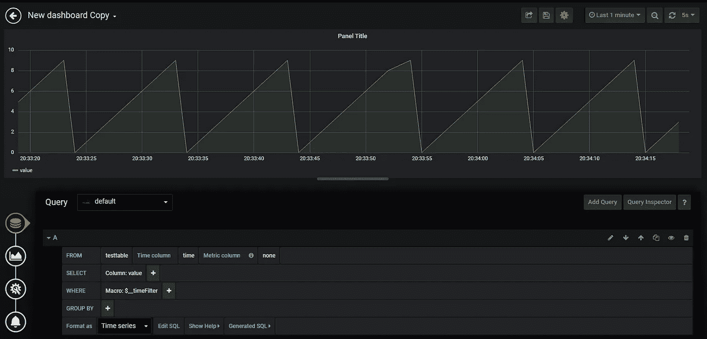
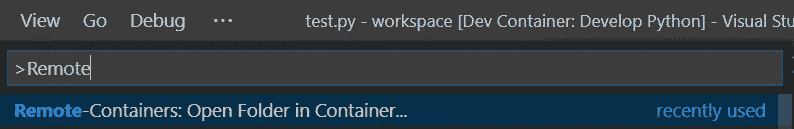
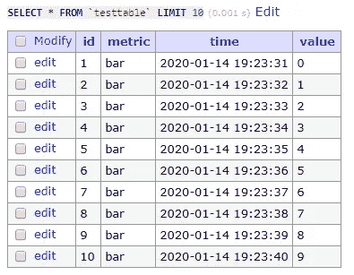
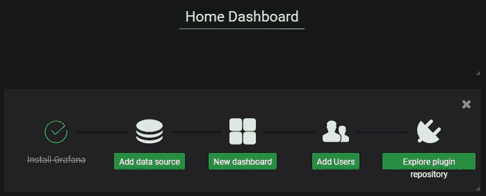
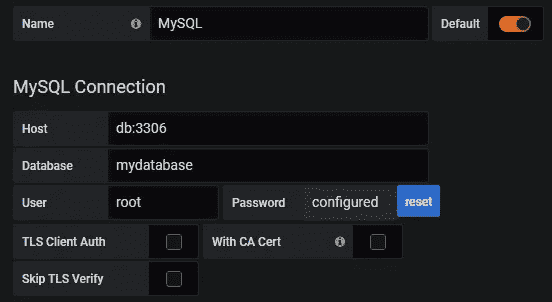
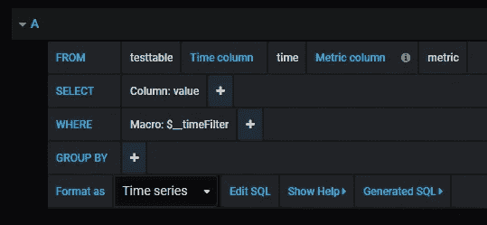
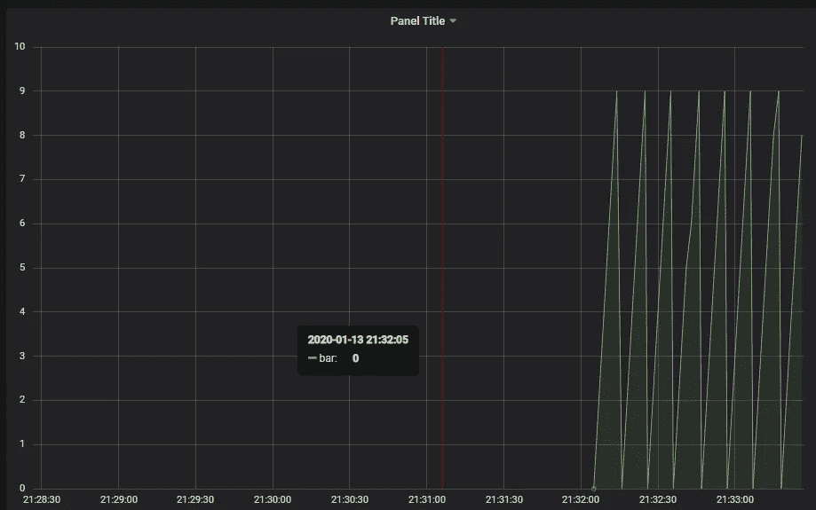

# 使用 Grafana，在几分钟内从 MySQL 可视化您的数据

> 原文：<https://levelup.gitconnected.com/visualize-your-data-from-mysql-in-a-matter-of-minutes-with-grafana-54cf3e63a160>

## 使用 Python、VS 代码和 Docker



不管你是哪种类型的开发人员，可视化数据和创建趋势或图表的需求是必不可少的。本指南向您展示了开始使用优秀工具有多快。

## 你将被介绍给什么

*   在 Docker 中运行你的开发环境并连接 VS 代码
*   将数据从 Python 脚本写入 MySQL 数据库
*   只需点击几下鼠标，就能看到 [Grafana](https://grafana.com/) 中的数据

## 先决条件

*   [Visual Studio 代码](https://code.visualstudio.com/)，以及[远程容器](https://marketplace.visualstudio.com/items?itemName=ms-vscode-remote.remote-containers)扩展
*   [Docker 和 Docker 组成](https://www.docker.com/)

要测试先决条件，使用本指南[并克隆“快速入门:尝试开发容器”下的一个示例存储库。](https://code.visualstudio.com/docs/remote/containers)

## 工具介绍以及为什么使用它们

*   **VS 代码:**最流行的文本编辑器之一**。VS code 本身是一个非常干净和标准的文本编辑器，但是添加扩展的可能性使得它可以兼容几乎所有的东西。因为受欢迎，网上找有很多帮助。**
*   **VS Code Remote-Containers 扩展:**这个扩展允许您在 Docker 容器中开发、调试和运行代码。使用容器作为开发环境有几个好处。举几个例子:运行某些软件的不同版本很快，你可以轻松地运行完全分离的多个环境，你可以将你的 docker 文件传递给你的团队，他们可以在几分钟内完成开发，没有任何安装挑战。如果您也在一个容器中运行您的生产环境，那么您的开发和您的生产环境之间将会有很小的差异或者没有差异，这减少了您在将代码推向生产时可能得到的惊喜。
*   Docker 是一个可以在你的电脑上运行容器的软件。使用 Docker 的一个很好的理由是，几乎每个开发软件都有一个你可以拉取和使用的映像。只需搜索[中枢](https://hub.docker.com/)寻找你需要的东西，拉动它，运行它。例如，在本教程中，我为 [MySQL](https://hub.docker.com/_/mysql) 、 [Adminer](https://hub.docker.com/_/adminer) 和 [Grafana](https://hub.docker.com/r/grafana/grafana) 使用了一张图片。
*   **Docker Compose:** 使运行一个包含多个容器的环境成为可能，使用一个命令，包含它们之间的网络连接。在本教程中，它使用 Python、Grafana、MySQL 和 Adminer 运行容器进行开发，其中 Grafana 使用网络从 MySQL 收集数据。
*   **Grafana:** 这是一个为你制作图表的工具。它为许多数据源和许多插件提供了“开箱即用”的解决方案。它使得在几分钟内可视化数据成为可能。在本教程中，数据是从 MySQL 中收集的，并用 Grafana 中的图形可视化。

## 我们开始吧

需要三个主要步骤。(1)启动并运行您的开发环境。(2)将数据插入 MySQL 运行的实例中。(3)连接 Grafana 向 MySQL 请求数据。

1.  启动并运行您的开发

像这样设置项目文件夹结构:

```
projectname
+-- test.py
+-- .devcontainer
    +-- devcontainer.json
    +-- docker-compose.yml
    +-- Dockerfile
```

添加文件的内容:

文件的内容

通过使用 VS 代码打开容器中的文件夹来运行环境。打开 VS 代码，点击`Ctrl+Shift+p` (Windows。打开命令选项板。)并开始键入“Remote-Containers”并选择“Remote-Containers:Open folder in container”并选择项目文件夹(不是。devcontainer)。码头工人将拉动和运行所需的 4 个集装箱，这将需要一些时间…



VS 代码命令面板

通过在`localhost:3000`访问浏览器中的 Grafana 实例来测试您的环境是否正在运行。您应该看到这个:


Grafana 登录

暂时先放着。

2.首先将一些数据插入到 MySQL 的实例中，以便能够在 Grafana 中可视化一些数据。运行 Python 文件`test.py`。这个脚本每秒钟向表中添加一个数据库、一个表和一个值。

您可以使用“Adminer”的实例来检查数据是否被插入。在`localhost:8080`上打开浏览器，用户名:`root`，密码:`example`。点击“我的数据库”，然后“测试表”，然后“选择数据”，你应该可以在一个表格中看到你的数据。



管理员测试表数据

3.连接 Grafana 从 MySQL 请求数据。在`localhost:3000`上打开浏览器，使用用户名`admin`和密码`admin`登录。系统会提示您输入新密码，您可以跳过它。



Grafana 主页仪表板

在“主页面板”点击“添加数据源”，选择“MySQL”。添加下面列出的配置:



Grafana 数据源配置

在“Home Dashboard”中，单击“Create your first dashboard”，单击“Add Query”，将查询更改为下面列出的配置:



Grafana 查询配置

在右上角，将时间范围更改为最近 5 分钟。刷新率设置为 5s。您现在应该可以看到可视化的数据。像这样:



格拉夫纳面板

保存您的仪表板以备后用，在右上角。

可以向您的仪表板添加更多面板，以便能够在同一个仪表板上查看许多不同的值。网上有很多制作仪表盘的好资源。

感谢您阅读我的作品，希望您能从中找到一些帮助！