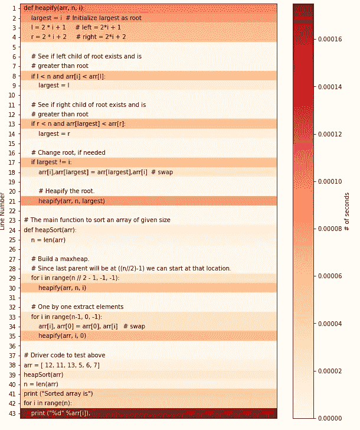
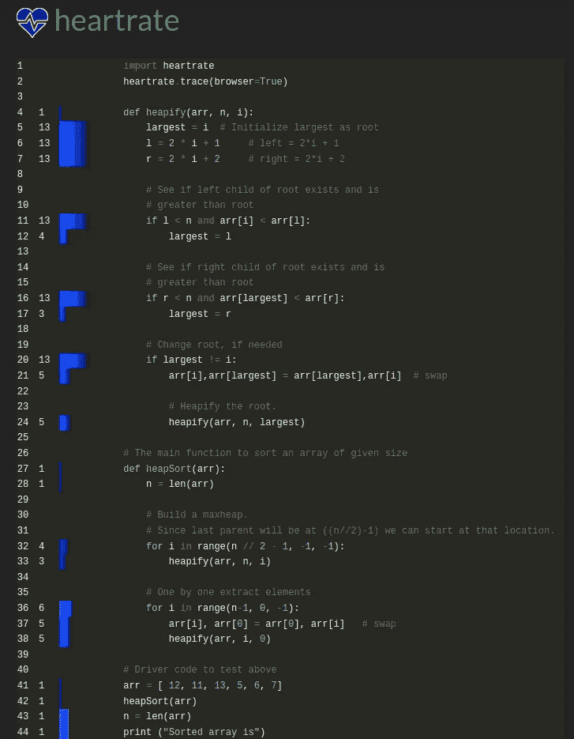

# 实时可视化您的 Python 执行

> 原文：<https://levelup.gitconnected.com/visualize-your-python-execution-in-real-time-5be3c2270279>

## 如何使用 PyHeat 和 HeartRate 运行、调试和可视化 Python 脚本运行时

一幅画胜过千言万语。这是真的，尤其是在编程中，程序会变得越来越复杂和困难。想象一下，有一天你不得不从别人那里接管一个程序，事先不知道，也可能没有未来的支持。理解程序可能需要一段时间，更不用说调试了。介绍`PyHeat`和`HeartRate`，这两个 Python 库可以通过可视化程序的运行时或执行来帮助解决这些问题！


马库斯·温克勒在 [Unsplash](https://unsplash.com?utm_source=medium&utm_medium=referral) 上拍摄的照片

```
**Table of Content**
1\. PyHeat
2\. HeartRate
```

> 请订阅我的 [**电子邮件简讯**](https://tinyurl.com/2npw2fnz) ，在那里我会定期用简单的英语和漂亮的可视化语言总结编程技巧和人工智能研究论文。

# PyHeat

首先，让我们使用`pip`安装`PyHeat`，如下所示:

```
pip install py-heat
```

然后我们要写一个`heap_sort.py`的样本程序。你可以在这里找到代码。

创建 Python 程序后，我们可以开始逐行可视化`heap_sort.py`的运行时:

*   导入`pyheat`库和`PyHeat`类

```
from pyheat import PyHeat
```

*   创建并显示热图

```
ph = PyHeat('heap_sort.py')
ph.create_heatmap()
ph.show_heatmap()
```

完成后，将绘制如下图:



PyHeat 热图(图片来自作者)

在热图中，我们可以分析程序的运行时是什么样子的。如前所述，以下代码运行时间较长(这是意料之中的):`loops`、`conditional if/else`和`recursion`。

# 心率

与`PyHeat`类似，`HeartRate`允许您实时地逐行分析您的 Python 代码。但是不同之处在于`HeartRate`能够在本地网络服务器上显示诊断信息。此外，`HeartRate`直接合并到您的代码中，而不是像`PyHeat`那样单独合并。

首先，我们要安装类似 PyHeat 的库。

```
pip install heartrate
```

现在我们将把`HeartRate`合并到我们的`heap_sort.py`程序中，如下所示(我已经编辑了主程序，并且只强调了`HeartRate)`的用法。

```
import heartrate
heartrate.trace(browser=True)def heapify():
....
```

并在终端中运行您的程序:

```
python heap_sort.py
```

通过键入以下命令(`HeartRate`正在使用端口`9999`)，您将能够在本地浏览器中访问诊断信息:

```
http://localhost:9999/file/?filename=<PROGRAM_NAME>
```

在我们的例子中，浏览器 URL 是这样的:

```
http://localhost:9999/file/?filename=heap_sort.py
```

您将得到的视觉效果如下图所示，其中行号旁边的蓝色框表示程序的预计运行时间。



心率诊断(图片来自作者)

与`PyHeat`类似，循环、条件语句和递归调用占用了大部分运行时和执行资源。这些观察是意料之中的，表明我们的程序按照要求工作！

# 结束语

所以教程到此为止！在这篇文章中，我们学习了如何安装和使用`PyHeat`和`HeartRate`。两者各有利弊。虽然`PyHeat`允许我们看到精确的执行时间，但是`HeartRate`允许你将库直接嵌入到你的程序中。根据您的使用案例和需求，它们中的任何一个都可能是有价值的诊断资产。一个可能的用例是监控您的程序在真实环境中的运行情况，在高压力条件下是否存在可能的瓶颈。

# 完整代码

如果您发现很难获得`heap_sort.py`的完整代码，下面的代码片段可能会有用。

```
def heapify(arr, n, i):
    largest = i
    l = 2 * i + 1 
    r = 2 * i + 2     if l < n and arr[i] < arr[l]: largest = l
    if r < n and arr[largest] < arr[r]: largest = r
    if largest != i:
        arr[i],arr[largest] = arr[largest],arr[i]
        heapify(arr, n, largest) def heapSort(arr):
    n = len(arr)
    for i in range(n // 2 - 1, -1, -1): heapify(arr, n, i) for i in range(n-1, 0, -1):
        arr[i], arr[0] = arr[0], arr[i]
        heapify(arr, i, 0)# Driver code to test above
arr = [ 12, 11, 13, 5, 6, 7]
heapSort(arr)
n = len(arr)
print ("Sorted array is")for i in range(n):
    print ("%d" %arr[i]),
```