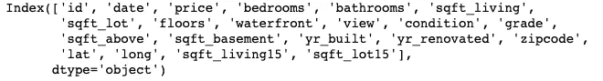
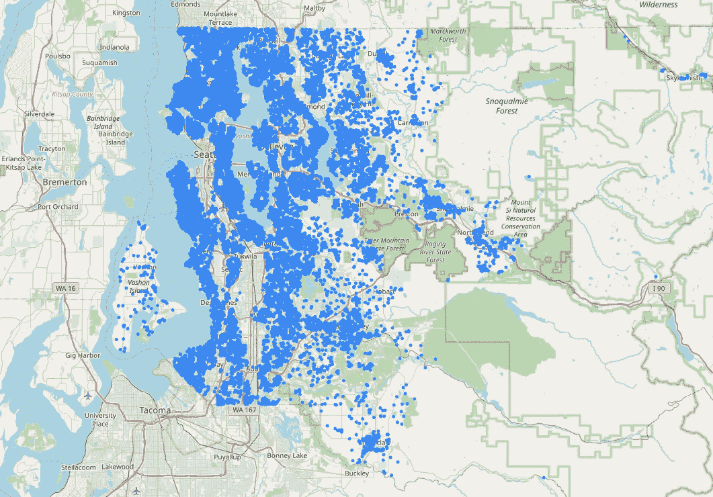
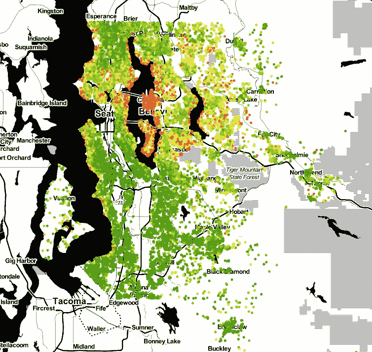
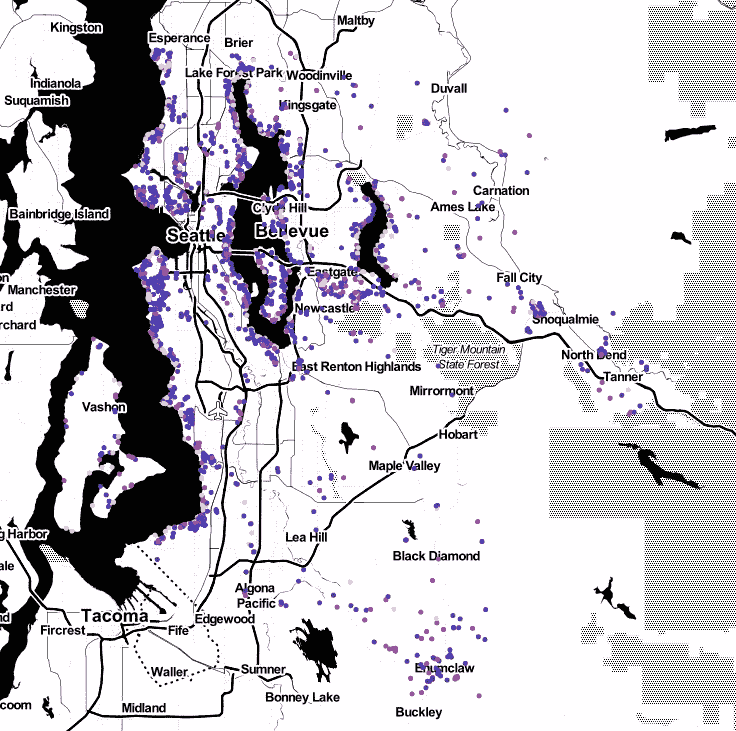
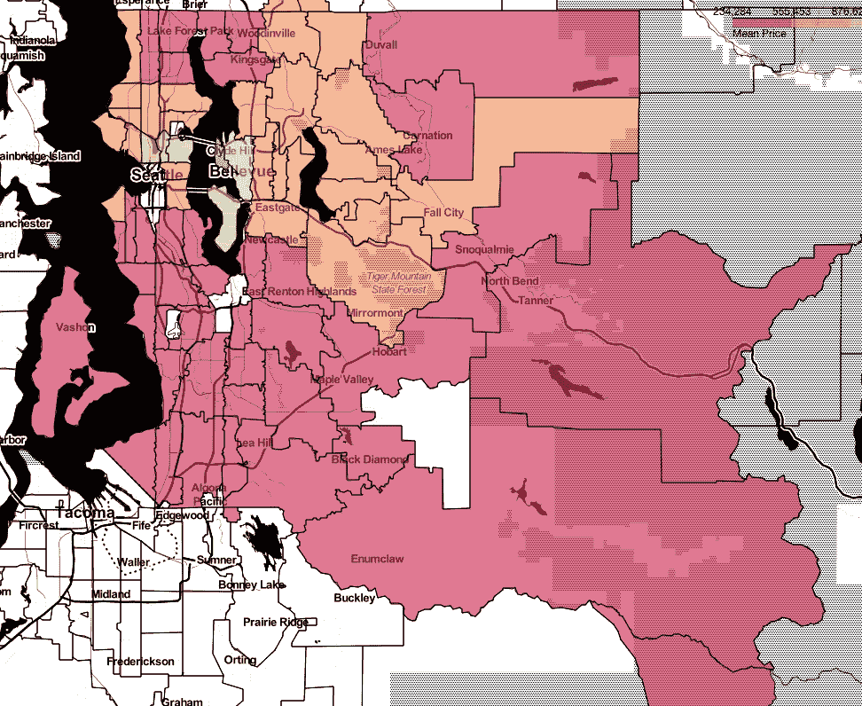
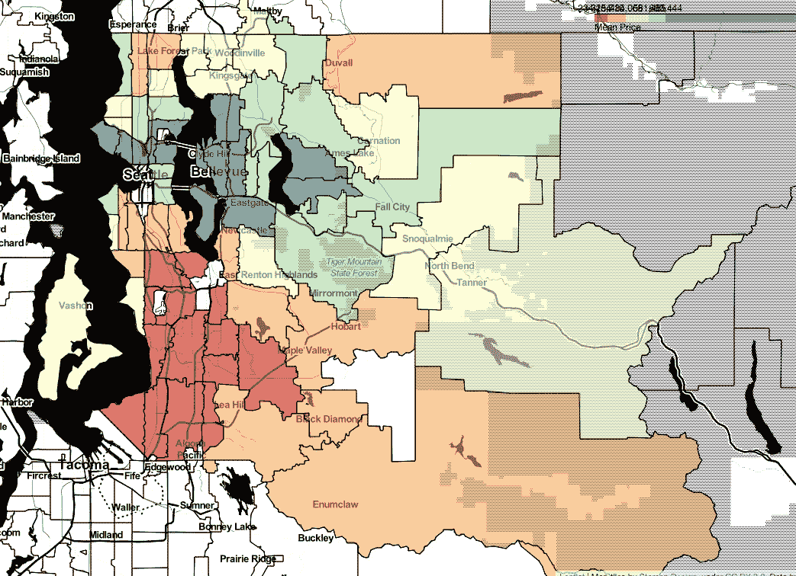
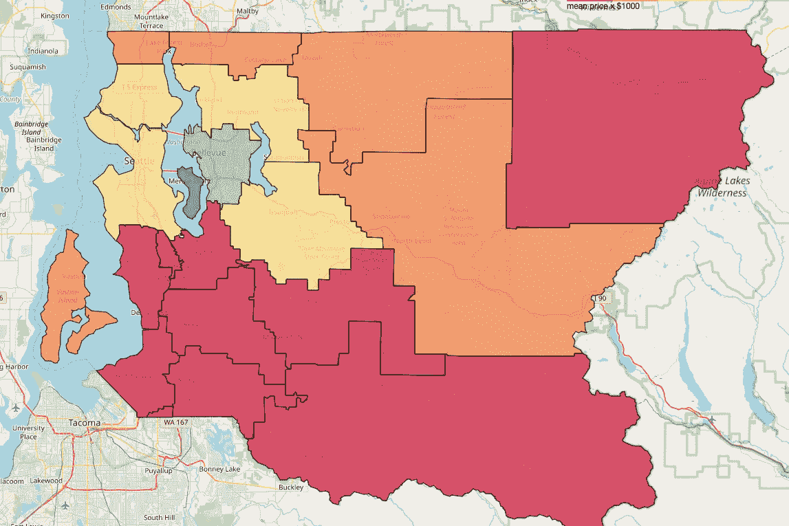
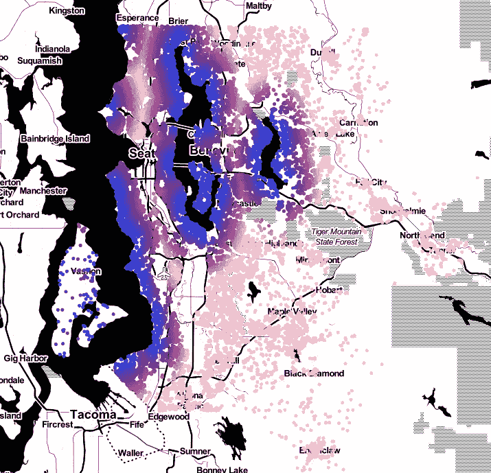

# 用树叶地图可视化住房数据

> 原文：<https://levelup.gitconnected.com/visualizing-housing-data-with-folium-maps-4718ed3452c2>

## 解释了用住房数据制作地图的例子


在 [Unsplash](https://unsplash.com?utm_source=medium&utm_medium=referral) 上由 [Breno Assis](https://unsplash.com/@brenoassis?utm_source=medium&utm_medium=referral) 拍照

用 Python 创建一个漂亮的叶子地图是一种令人难以置信的满足感。如今地理数据非常丰富，交互式地图的视觉效果、简单性和即时反馈使其成为最令人愉快的编码体验之一。我特别喜欢 choropleth 地图和彩色地图。

这个故事是为有一些使用熊猫数据框架的经验的程序员写的，他们想制作叶子地图。我们将一步一步地创造一些美丽的。

# 导入我们的数据

我们将使用的数据集是 kaggle.com 的金县住房数据。的。数据集的 csv 文件可以在下面找到([或这里](https://github.com/sciencelee/dsc-mod-2-project-v2-1-online-ds-sp-000/blob/master/kc_house_data.csv))。我们将尝试制作一个叶子地图来显示华盛顿西雅图地区(华盛顿州金县)的住宅、住宅价格和平均住宅价格。

[](https://www.kaggle.com/harlfoxem/housesalesprediction) [## 美国金县的房屋销售

### 用回归法预测房价

www.kaggle.com](https://www.kaggle.com/harlfoxem/housesalesprediction) 

让我们从导入 csv 作为熊猫数据帧开始。

您应该做一些探索性的数据分析来适应这些数据，但是可用的列有:



我看到一个又宽又长的列，对于这样的大数据集来说，这是令人兴奋的。让我们制作一些地图吧！

# 找到地图中心

你可以在地图上四处寻找中心，但当然我们希望自动化。让我们使用刚刚作为数据帧导入的数据集中的 long/lats 来找到数据的中心点。

上面的函数将返回一个(long，lat)元组中数据集的中间值，我可以用它来创建我的叶子地图。

# 制作一个简单的树叶地图

使用 leav 制作地图对象非常简单。

上面简单的代码就足够做一张地图了。这张地图实际上不会包含任何有用的东西，但它是一个起点。你只需要一个地图中心(我们使用新创建的函数)。您还应该设置缩放级别，并尝试找到最佳位置。

我喜欢将我的地图保存为 html 文件，但是如果你愿意，你也可以在代码中显示它们。

# 向地图添加点(使用圆)

我们将从绘制数据库中的所有房屋开始(超过 21，000 套)。通过快速的谷歌搜索，你可以找到如何制作一个所有点的标记图。这可能是最常用的叶子地图了。

标记地图在每个地图点放置一个单独的旗帜，如果您有 21，000 个点，它将不会执行得很好。相反，我们来画一些圈。以我的经验来看，他们画得更有效率，也能做出一些看起来很壮观的地图。

像以前一样，我们首先创建一个新的地图对象。在保存或显示地图之前，我们将添加所有房屋。



使用圆形绘制我所有家的简单地图

也许有更有效的方式来编码，但我认为它的编写方式真正显示了正在发生的事情。

*   我们使用一个循环遍历 df
*   我们为我们的每个家做了一个圆形()物体
*   我们使用。add_to()方法。

# 制作颜色图

让我们使这张地图更有吸引力和意义。它目前只是显示我的家在点。

branca 库可能已经安装了 leav，它有一个非常酷的 LinearColormap 类。它让我们能够为添加到地图中的圆形对象分配颜色，这只是几行额外的代码。



房屋价格的彩色地图

那是一张更好看的地图。交互式的看起来更好，如果你以前没有过，我希望你抓住机会做一个。

这种技术可以很容易地适用于显示其他数据列。住房数据包含一个名为“查看”的列。金县给每个家庭分配一个从 0 到 4 的观看质量等级。大多数家庭都有一个零。如果你用和上面一样的技术来绘制它，这就是它的样子。



主视图的彩色地图

当比较这两张地图时，你可以清楚地看到美景和房价之间的关系。

# 住房数据的 Choropleth 地图

注意:对于 choropleth 映射，事先了解 JSON 和/或 Python 字典以及 DataFrame groupby 方法并有使用经验是有用的(但不是必需的)。

有时，您需要在地图上绘制区域或地理数据。对于我们的数据集，我们有邮政编码。在一张地图上用邮政编码显示平均价格会很有趣。

为了绘制 choropleth 图，我们需要我们所在区域的形状。在这种情况下，我们需要一些邮政编码边界图。我们可以用几种不同的文件类型来获取数据，但是我将向您展示如何使用 geojson 文件来获取我们的 shape 对象。

我从 [King County GIS 网站](https://gis-kingcounty.opendata.arcgis.com/datasets/e6c555c6ae7542b2bdec92485892b6e6_113)获得了我的 geojson 文件。我使用的具体文件的链接可以在[这里](https://github.com/sciencelee/dsc-mod-2-project-v2-1-online-ds-sp-000/blob/master/geojson_files/Zipcodes_for_King_County_and_Surrounding_Area__Shorelines____zipcode_shore_area.geojson)找到。GeoJSON 支持多边形和多多边形数据，这是我们存储邮政编码边界的方式。

有关 GeoJSON 的信息，请访问他们的网站。在首页，它向您展示了文件格式:

```
{
  "type": "Feature",
  "geometry": {
    "type": "Point",
    "coordinates": [125.6, 10.1]
  },
  "properties": {
    "name": "Dinagat Islands"
  }
}
```

 [## 杰奥森

### GeoJSON 是一种用于编码各种地理数据结构的格式。GeoJSON 支持以下几何图形…

geojson.org](https://geojson.org/) 

我们的 GeoJSON 数据对于每个邮政编码都有一个条目。每个邮政编码都有一个几何“密钥”,它包含我们的多边形数据作为一系列坐标。这就是我们这里需要的。通过将标准 GeoJSON 格式集成到函数中，follow 节省了时间，并使绘制边界变得非常简单。

下面的代码创建了 choropleth 映射，其中包含了以下代码:

*   从第 10 行开始，我们导入 geojson 文件
*   第 26–27 行我们使用 DataFrame groupby 方法按邮政编码排序，并重置索引，以便我们可以绘制它。
*   第 32 行，地理数据被传递到 choropleth 地图。
*   第 34 行，我们给出了地图的分组数据帧。
*   第 35 行，我们指定了用于绘图的列。
*   第 36 行，通过允许我们直接从 geojson 文件中读取 ZIPCODE 并将多边形直接关联到我们的地图上，follow 把我们吸引住了。



平均价格的 choropleth 图

我们现在看到邮政编码边界覆盖在我们的地图上，每个邮政编码都用颜色编码来表示该邮政编码的平均房价。

我看到很多红色和一些其他颜色的斑点。为了改善这一点，您可以考虑规范化数据，或者您可以使用宁滨来实现相同的效果，如下所示。



那是一张更漂亮，也许更有用的地图。choropleth 的官方文档可在此处找到:

 [## 快速入门-0 . 11 . 0 文档

### 有许多标记类型，从带有弹出窗口和工具提示的简单样式位置标记开始。这里建有…

python-visualization.github.io](https://python-visualization.github.io/folium/quickstart.html#Choropleth-maps) 

# 更进一步

如果你想“升级你的游戏”,那么在 follow 网站上有很多定制技术。我还建议研究 shapely 库，它允许你操作形状对象，对多边形和点进行自定义操作。我使用 shapely 对住房数据集执行了一些特征工程，并创建了一个列来标识学区。

使用与 zipcode 示例类似的方法，我创建了一个按学区划分的平均房价 choropleth 图。



使用 choropleth 按学区划分的平均价格

通过 shapely 中更多的功能工程，我能够制作出以下地图来显示海滨景观的邻近度。



到海滨物业的距离

发挥创意，看看你还能利用 leav 制作什么。祝你地图制作好运！

如果你遇到任何问题或有疑问，请随时回复这个故事，我会尽我所能帮助你。