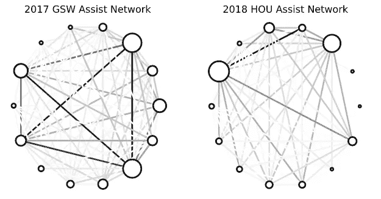
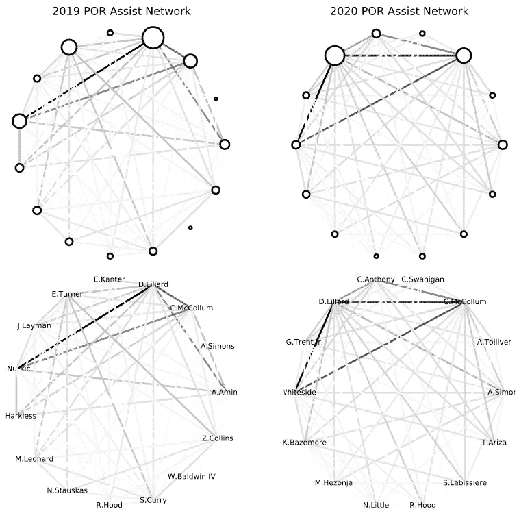

# 用 Python 可视化 NBA 传球网络

> 原文：<https://levelup.gitconnected.com/visualizing-nba-passing-networks-with-python-8302d0f68c7c>

克里斯·汉弗莱斯——今日美国体育

NBA 的统计网站有很多关于传球的很酷的数据。每个球员的页面都包括他们给队里的每个球员完成了多少次传球，以及他们从每个队友那里接到了多少次传球。这个数据还包括两个球员之间通过这些联系创造的助攻次数。例如，尼古拉·约基奇本赛季已经传球 4897 次。其中 1887 张是给贾马尔·穆雷的。穆雷的三分球有 37.2%来自约基奇的传球，而他的 3P%下降到 33.3%来自其他队友的传球。

非常简洁的信息。然而，盯着数字看会变得很无聊，所以我想做一个可视化的东西，可以很容易地在团队内部传递联系。这不是一个[新奇的想法](https://twitter.com/presidual/status/991553242520748032)，但我想尝试用 Python 的 [NetworkX](https://networkx.github.io/) 包自己做一些。

这里的想法是为了说明一个团队进攻的连接性。这里有一个例子:2017 年金州勇士队和 2018 年休斯顿火箭队都拥有历史上高效的进攻，由斯蒂芬·库里，凯文·杜兰特，詹姆斯·哈登和克里斯·保罗这样的历史上伟大的天才占据头条。然而，这些犯罪以非常不同的方式运作，我们可以通过比较它们各自的协助网络来观察:

每个节点(或圆圈)代表一名球员，每个节点的大小反映了每个球员记录的助攻次数。两个节点之间的一条线意味着球员至少已经相互助攻了一次，每条线的不透明度与两个球员之间的助攻次数相对应。为了防止混乱，方向不是这些可视化中的一个因素。换句话说，参与人 A 协助参与人 B 和参与人 B 协助参与人 A 是一样的——没有两条线。

在这一点上，两个辅助网络之间的差异非常明显。

2017 年勇士队的网络显然包括四名球员，他们与代表他们之间大量传球的黑线相连。当然，这四位球员是斯蒂芬·库里、凯文·杜兰特、克莱·汤普森和德雷蒙德·格林。

与此同时，2018 年的火箭队只有一个真正脱颖而出的联系——詹姆斯·哈登和克林特·卡佩拉。除此之外，与 2017 年的勇士队相比，休斯顿的连通性非常低。

记住，这不一定是一件坏事。火箭是一支非常优秀的球队，很大程度上是因为他们历史上高效的进攻。詹姆斯·哈登赢得了联盟 MVP，尽管克里斯·保罗因腿筋受伤而退出，他们还是成功地将 2018 年勇士队带到了西部决赛的第七场比赛。只看他们的最终结果就宣称基于孤立的进攻注定要失败是狭隘的。但是看看这些可视化的东西还是很有趣的，这样我们就可以看到不同球队之间比赛风格的不同。

让我们看另一个例子。开拓者在过去的一年里经历了很多变化。明星中锋尤素夫·努尔基奇因伤已经缺席了一整年。球队用哈桑·怀特塞德取代了他的位置，失去了像塞斯·库里、艾尔·法鲁克·阿米奴、莫·哈克雷斯、埃文·特纳和伊内斯·坎特这样的球员。卡梅隆安东尼和特雷沃阿里扎在赛季中也被选中，以填补罗德尼·胡德和扎克科林斯受伤后的空缺。那么，这一切对他们的进攻有什么影响呢？以下是 2018-19 和 2019-20 波特兰开拓者队的辅助网络:

开拓者的进攻似乎仍然建立在明星云集的达米恩·利拉德后场和 CJ·麦科勒姆以及他们的大个子之间的“三角”关系上。这个赛季，哈桑·怀特塞德显然占据着中锋的角色。

你还可以看到 2019 年代表埃文·特纳的一个相当大的节点。特纳经常承担板凳球员的控球职责，因此为扎克·科林斯、塞斯·库里和梅耶斯·伦纳德等人提供了他应得的助攻。特纳已经不在球队了，但看起来 2020 年开拓者队的任何人都没有弥补他在助攻方面的损失。毕竟，利拉德和麦科勒姆的节点并没有变大。事实证明，开拓者本赛季的助攻率已经跌至 NBA 的最后一名。

我认为可以用这些数据做更多的分析，这些可视化只是其中的一小部分。我以后一定会重提这个话题。我原本计划将本文作为一个演练教程，但是用 NetworkX 创建网络的代码变得比我预期的更复杂。现在，[这里是使用 Python](https://raw.githubusercontent.com/ahmed-cheema/bbb/master/nba_networks.py) 自己创建网络的代码。

*原载于 2020 年 3 月 22 日*[*【https://www.thespax.com】*](https://www.thespax.com/nba/visualizing-nba-passing-networks-with-python/)*。*