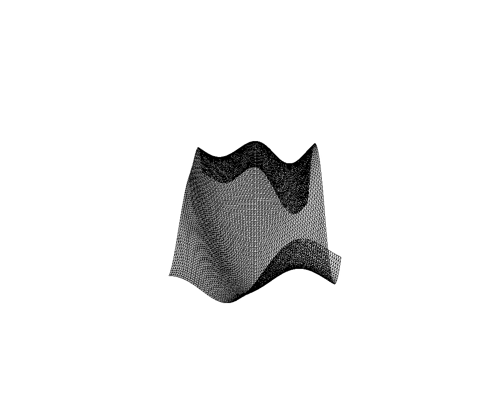
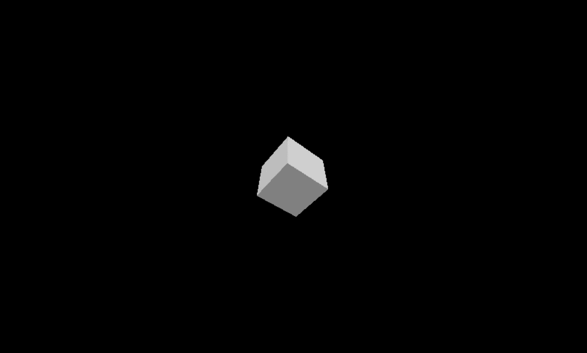
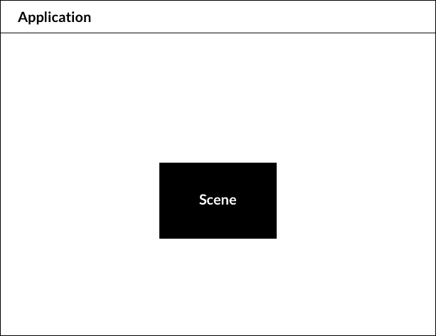
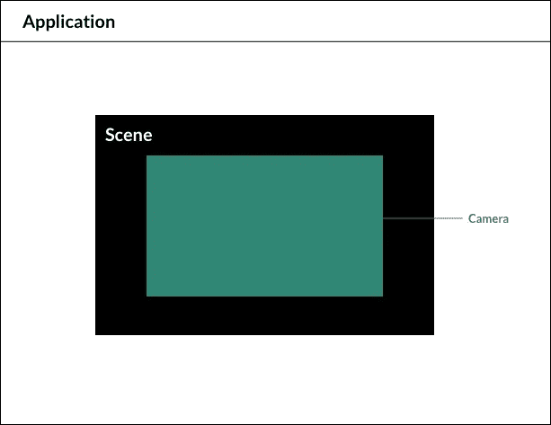
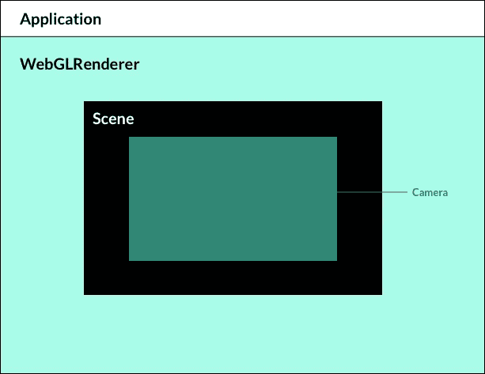

# 用 Three.js 可视化绘制 3D

> 原文：<https://levelup.gitconnected.com/visually-mapping-out-3d-with-three-js-eef3f6adfd2f>



三. js:[https://www.wearelikewater.com/noise-shifts](https://www.wearelikewater.com/noise-shifts)创作的生成艺术

每个开发人员都有自己喜欢的工具、语言和技术。有时它源自另一种激情，如解决数学问题、白帽黑客或组织。幸运的是，开源技术允许每个人拿起自己选择的工具，创造出令人惊叹的东西。现在让我告诉你如何利用我最喜欢的工具之一， [Three.js](https://threejs.org/)

# Three.js 是什么？

Three.js 是一个 JavaScript 库，用于在浏览器中创建和渲染 3D 图形，甚至制作动画。如果你对开发基于网络的游戏、创建网络动画或创造性编码感兴趣，这将是一个很好的探索选择。

在幕后，Three.js 利用了一个名为 [WebGL](https://get.webgl.org/) 的底层 API。Three.js 的创建者 Ricardo Cabello(doob 先生)知道 WebGL 的复杂性，并将其简化为任何开发人员都可以使用的易于访问的库。

# 概观

这个库有很多功能，但是对于本文，我将只关注设置一个 [three.js 场景](https://threejs.org/docs/#manual/en/introduction/Creating-a-scene)的过程。就个人而言，这是最难记住的部分。作为一名视觉学习者，我不得不使用心理图像来理解如何在平面屏幕上制作 3D 场景。

免责声明:每次你开始一个新项目的时候，练习编码。这个过程永远不会改变，但是如果你复制和粘贴设置，你就不会明白为什么某些东西不能像预期的那样工作。

*还有，Three.js 是一个 Javascript 库。可能有相当多的地方提到了面向对象编程和 Javascript 语言。*

话虽如此。我们开始吧！



Three.js 3D 旋转立方体

# 设置 Three.js

*以一个隐喻的例子开始。假设你正在为一出戏搭建舞台。现在你的舞台是空的，但是你需要在你的演员可以使用它之前添加一些东西。*

设置 Three.js 与上面的场景非常相似。你从一个场景开始，把需要的部分拉进那个场景。

下面是你将需要的东西: [**【场景】**](https://threejs.org/docs/#api/en/scenes/Scene)**[**摄像机**](https://threejs.org/docs/#api/en/cameras/Camera) 和[**渲染器**](https://threejs.org/docs/#api/en/renderers/WebGLRenderer)**

## **事件**

**场景允许你设置由 three.js 渲染的内容。这是你放置物体、灯光和摄像机的地方。**

**您的场景是您将设置的第一个组件。Three.js 使用了[面向对象的范例](https://en.wikipedia.org/wiki/Object-oriented_programming)，所以场景是一个[对象构造器](https://medium.com/@likewaterdesignco/creating-an-object-using-constructors-in-javascript-c1b33e07b3e2)。这允许您创建一个或多个场景实例，并在您的应用程序中使用它。 [*如果你对构造函数不熟悉，看看这篇文章*](https://medium.com/@likewaterdesignco/creating-an-object-using-constructors-in-javascript-c1b33e07b3e2) 。**

****

**事件**

## **照相机**

**[Camera 是相机的抽象基类。当你建立一个新的照相机时，这个类应该总是被继承。](https://threejs.org/docs/#api/en/cameras/Camera)**

**接下来你需要安装的是你的相机。就像搭建一个表演或节目的舞台一样，相机是捕捉场景中一切所需的最基本的物体之一。**

**与场景类似，相机只是另一个对象构造器。**

****

## **渲染器**

**设置好场景和相机后，您需要将它们添加到应用程序中。像任何其他 web 组件一样，您必须将场景添加到[文档对象模型](https://developer.mozilla.org/en-US/docs/Web/API/Document_Object_Model/Introduction)。这就是渲染器的用武之地。**

**Three.js 使用一个名为 [WebGLRenderer](https://threejs.org/docs/#api/en/renderers/WebGLRenderer) 的构造函数将你的场景和相机添加到 DOM 中。Three.js 文档声明，“WebGL 渲染器使用 WebGL 显示您制作精美的场景”。**

****

# **概述**

**概括一下上面的视觉效果:**

1.  **创造一个场景**
2.  **安装一台摄像机**
3.  **添加渲染器**
4.  **将场景和相机放入渲染器中**

**这些是创建场景并将其添加到应用程序中的初始步骤。**

# **代码**

**现在，您已经对场景、相机和渲染器的工作方式有了直观的了解，您可以更好地理解代码了。**

**下面是设置 Three.js 项目的 Javascript 代码。我将详细介绍每一部分。**

***免责声明:我推荐使用* [*CodePen*](https://codepen.io/) *跟随。这将允许我们只关注 Javascript 设置。***

```
let scene, camera, renderer;
init(); function init(){scene = new THREE.Scene();camera = new THREE.PerspectiveCamera(75, window.innerWidth /    window.innerHeight, 0.01, 1000);
camera.position.set(0,0,10);renderer = new THREE.WebGLRenderer();
renderer.setSize(window.innerWidth, window.innerHeight);document.body.appendChild(renderer.domElement);window.addEventListener('resize', resize, false);update();} function resize(){camera.aspect = window.innerWidth / window.innerHeight;
camera.updateProjectionMatrix();
renderer.setSize( window.innerWidth, window.innerHeight);}function update(){requestAnimationFrame(update);
renderer.render(scene, camera);}
```

## **设置变量**

**初始化你的全局变量。我们将这些变量设为全局变量，以便在所有函数中访问它们。当处理一个真实的应用程序时，你最有可能在你的 3D 组件的范围内有这些，所以它们不会与你的应用程序的其他组件冲突。**

```
let scene, camera, renderer;
```

## **创建初始化函数**

**初始化，也称为 **init** 函数，是保存所有三个. js 对象的主函数。这包括场景、摄影机和渲染器。**

```
init()function init(){//threejs code goes here
}
```

## **创造一个场景**

**在 **init** 函数中，您将创建一个**场景、摄像机、**和**渲染器**实例。**

```
let scene, camera, renderer;function init(){scene = new THREE.Scene();
camera = new THREE.PerspectiveCamera(75, window.innerWidth / window.innerHeight, 0.01, 1000);
camera.position.set(0,0,10);renderer = new THREE.WebGLRenderer();
renderer.setSize(window.innerWidth, window.innerHeight);}
```

## **摄像机设置**

```
camera = new THREE.PerspectiveCamera(75, window.innerWidth / window.innerHeight, 0.01, 1000);
camera.position.set(0,0,10);
```

**透视相机构造函数有 4 个参数:**

1.  **观点—我通常从 75 开始**
2.  **纵横比—窗口的内部宽度除以窗口的内部高度**
3.  **近剪裁路径**
4.  **远剪裁路径**

****裁剪路径**是你的场景可以被看到的界限。在这个例子中，任何在 0.01 之前的东西和任何超过 1000 的东西都会消失。为了更好的描述，检查[透视摄像机](https://threejs.org/docs/#api/en/cameras/PerspectiveCamera)。**

**设置好相机后，你需要调整好相机的位置。一个好的开始可能是:**

```
// positions.set parameters are (x,y,z) axis
camera.position.set(0,0,20);
```

## **渲染器设置**

**要创建渲染器，你需要使用 [WebGLRenderer](https://threejs.org/docs/#api/en/renderers/WebGLRenderer) 构造函数。一旦创建完毕，你可以使用 **setSize** 方法来设置渲染器的大小以适合整个屏幕。**

```
renderer = new THREE.WebGLRenderer();
renderer.setSize(window.innerWidth, window.innerHeight);
```

## **创建一个 DOM 元素**

**一旦你的场景、相机和渲染器设置好了，我们现在必须创建[画布](https://www.w3schools.com/html/html5_canvas.asp)，它将包含所有的组件。[画布](https://www.w3schools.com/html/html5_canvas.asp)也将允许我们在 [DOM](https://developer.mozilla.org/en-US/docs/Web/API/Document_Object_Model/Introduction) 中显示我们的 3D 应用程序。WebGLRenderer 有一个名为 [domElement](https://threejs.org/docs/#api/en/renderers/WebGLRenderer.domElement) 的方法。当 [domElement](https://threejs.org/docs/#api/en/renderers/WebGLRenderer.domElement) 被调用时，它将向 [DOM](https://developer.mozilla.org/en-US/docs/Web/API/Document_Object_Model/Introduction) 显示画布。**

```
renderer = new THREE.WebGLRenderer();
renderer.setSize(window.innerWidth, window.innerHeight);document.body.appendChild(renderer.domElement)
```

## **调整大小和更新功能**

**最后，我们需要创建两个基本函数，并在您的 **init** 函数中调用它们。**

1.  ****resize —** 在平板电脑和移动设备上调整应用程序大小的功能。**
2.  ****更新—** 渲染场景和摄像机并每帧更新的功能。**

```
//variables
let scene, camera, renderer;init()function init(){//threejs code goes here
}function resize(){camera.aspect = window.innerWidth / window.innerHeight;
camera.updateProjectionMatrix();
renderer.setSize( window.innerWidth, window.innerHeight);}function update(){requestAnimationFrame(update);
renderer.render(scene, camera);}
```

## **最后的步骤**

**在 init 函数中会调用 **resize** 和 **update** 函数。最后，调用 **init** 函数，如果屏幕变黑，这意味着你已经渲染了你的第一个 Three.js 场景！**

**现在，您可以开始向场景添加几何体了。查看 [Three.js 文档](https://threejs.org/docs/#api/en/geometries/BoxGeometry)了解更多信息。**

**查看下面的最后步骤。**

```
let scene, camera, renderer;init();function init(){scene = new THREE.Scene();
camera = new THREE.PerspectiveCamera(75, window.innerWidth / window.innerHeight, 0.01, 1000);
camera.position.set(0,0,10);renderer = new THREE.WebGLRenderer();
renderer.setSize(window.innerWidth, window.innerHeight);document.body.appendChild(renderer.domElement);window.addEventListener('resize', resize, false);update();}function resize(){camera.aspect = window.innerWidth / window.innerHeight;
camera.updateProjectionMatrix();
renderer.setSize( window.innerWidth, window.innerHeight);}function update(){requestAnimationFrame(update);
renderer.render(scene, camera);}
```

## **请参见下面的代码**

# **资源:**

**这里有一些帮助我开始使用 Three.js 的资源。**

 **[## 三. js

### 编辑描述

threejs.org](https://threejs.org/docs)** **[](https://threejsfundamentals.org/threejs/lessons/threejs-fundamentals.html) [## Three.js 基础

### 你的第一堂 Three.js 课从基础开始

threejsfundamentals.org](https://threejsfundamentals.org/threejs/lessons/threejs-fundamentals.html)  [## three.js / editor

### 编辑描述

threejs.org](https://threejs.org/editor/) [](https://discoverthreejs.com/) [## 欢迎来到 three.js 的失踪手册！|发现三个. js

### 用缺失的 three.js 手册把你的网站带入第三维度！Discover three.js 是一个令人兴奋的新…

discoverthreejs.com](https://discoverthreejs.com/) 

[https://www . udemy . com/course/hands-on-three js-3d-web-visualizations/learn/lecture/16247192 #概述](https://www.udemy.com/course/hands-on-threejs-3d-web-visualisations/learn/lecture/16247192#overview)**