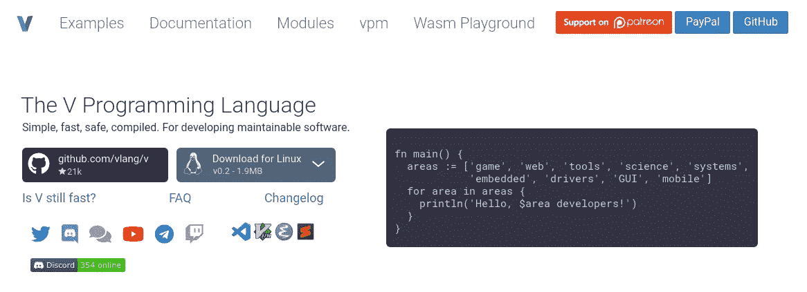
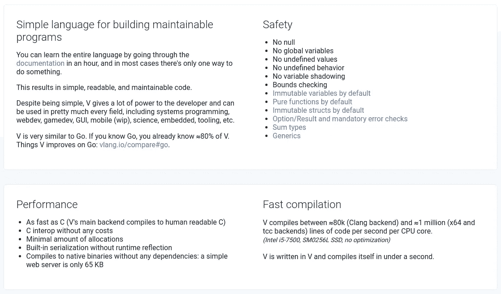
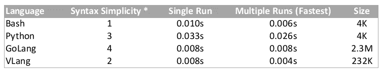

# 用于自动化脚本的 VLang

> 原文：<https://levelup.gitconnected.com/vlang-for-automation-scripting-5d977ee97de>

## 用超快的语言取代 Bash、Python 和 Go



如果你在科技行业已经呆了足够长的时间，不管你的角色是什么，你都有可能不止一次地使用 [Bash](https://www.gnu.org/software/bash/) 或 [Python](https://www.python.org/) 来自动化一些你原本需要手动重复做的事情。

很明显，我也不例外，从 2000 年初就开始编写自动化脚本。我做过的项目从为自己编写脚本来更新数千台服务器，到为工程师简化开发/部署流程，一直到为最终用户构建应用程序/固件安装程序。根据我的经验，有三个主要因素决定了我为每个项目选择什么样的脚本语言:

1.  语法有多简单？
2.  这种语言在处理复杂的自动化问题时有多强大？
3.  它的执行速度有多快？

在过去，如果自动化项目具有简单的逻辑，我会一直使用 bash 脚本，因为它相对较快，语法超级简单。自动化 shell 命令非常简单，只需将该命令放在它自己的一行中。例如，如果我想让脚本执行`cat /etc/os-release`,我所要做的就是这样:

```
#!/bin/bashcat /etc/os-release
```

与 Python 等更复杂的语言相比，这节省了大量的开发时间。为了用 Python 做同样的事情，我会写:

```
#!/usr/bin/pythonimport osres = os.system("cat /etc/os-release")
print(res)
```

从代码片段中可以看出，Bash 更容易自动化重要任务的原因很明显。然而，有一些自动化项目稍微复杂一些，超出了 bash 脚本的能力。在这种情况下，我会放弃性能，选择 Python 来实现自动化，特别是当涉及到需要更多计算或 GUI ( [Gooey](https://github.com/chriskiehl/Gooey) )来与用户交互时。

近年来，GoLang(Go)变得越来越流行，我开始用它来开发我的一些软件项目。所以我也开始使用 Go 来实现自动化，因为作为一种语法相对简单的编译语言，执行时间(性能)比 Python 快得多。此外，使用一种与软件项目中使用的语言相同的语言来自动化事情，提供了一些一致性的感觉，总的来说，对我的大脑来说更容易。这就像不管你和谁说话都要说广东话(一种中国方言)，而不是和销售团队说广东话，和运营团队说普通话，然后最终发现自己使用奇怪的术语，并在翻译中迷失方向，因为必须快速从一种方言跳到另一种方言。

然而，今年早些时候，我发现了一种非常有趣的新的跨平台编译语言，叫做 [VLang](https://vlang.io) 。这不是另一种语言，它是已经存在的东西的一对一的更好版本，就像[朱莉娅](https://julialang.org/)对于 Python 一样，而是一种语言，它就像所有最流行的现代语言的私生子，旨在同时具有小、快、安全和简单的低学习曲线。这是经过深思熟虑的，这个概念是如此引人注目，以至于我鼓励任何有兴趣的人亲自查看 VLang 网站看看这些好处是什么。真的挺让人印象深刻的。现在，这里是一些优势/差异化因素的直接峰值:



那么在保持简单语法的同时，V 的速度快了多少呢？让我们通过编写一个只执行`ls -lah`的脚本并输出带有错误处理的结果来做一个测试。代码如下所示:

## 尝试

```
#!/bin/bashset -e
ls -lah
```

## 计算机编程语言

```
#!/usr/bin/python3.8import ostry:
    res = os.system("ls -lah")
    print(res)
except:
    print("Something went wrong...")
```

## 戈朗

```
package mainimport "fmt"import "bytes"
import "os/exec"func main() {
 cmd := exec.Command("ls", "-lah")
 var out, stderr bytes.Buffer
 cmd.Stdout = &out
 cmd.Stderr = &stderr
 err := cmd.Run()
 if err != nil {
  fmt.Println(err)
 }
 fmt.Println(out.String())}
```

## VLang

```
import osfn main() {
 results := os.exec('ls -lah') or { panic(err) }
 println('$results.output')
}
```

从上面的代码片段中我们可以看出，Bash 是最简单的。VLang 位居第二，Python 与之非常接近。事实上，如果您不想对这个命令进行错误处理，Python 可能比 VLang 更简单，特别是因为据我所知，没有从 VLang 中删除错误处理的选项。然而，如果我们将错误处理从代码中移除，那么安全系数将会受到损害，这无论如何都不是我们想要的。最后，GoLang 在这方面输得很惨。

现在我们来看看执行时间(性能):

## 尝试

```
time ./ls-script.sh
...real 0m0.010s
user 0m0.005s
sys 0m0.004s
```

## 计算机编程语言

```
time ./ls-script.py 
...real 0m0.033s
user 0m0.027s
sys 0m0.006s
```

## 戈朗

```
time ./go-ls-script 
...real 0m0.008s
user 0m0.004s
sys 0m0.005s
```

## VLang

```
time ./v-ls-script
...real 0m0.008s
user 0m0.001s
sys 0m0.007s
```

首先，我要说的是，0.002 秒的增量不应该用作足够强的数据点来确认性能差异，因为 Bash 和 VLang 在短时间内连续运行时几乎每次都会得到不同的结果，而且大多数情况下，它们比 Go 快得多(最多 0.004 秒)，而其他时候比 Go 慢，但最多只慢 0.002 秒。另一方面，Go 每次运行的完成时间基本相同。

解决了这个问题后，Go 和 VLang 在单次运行时的性能与 Bash 相当或更快，而 Python 要慢得多。然而，VLang 在多次连续运行中的完成时间与 Bash 相当，如果不是更快的话，它以 0.004 秒的创纪录时间(真实时间)赢得了与 Bash 的比赛。也许当 VLang 与 Bash 正面交锋时，更令人惊叹的是，Vlang 对于更复杂的计算足够强大，并且拥有令人惊叹的[原生跨平台 GUI 库](https://github.com/vlang/ui)，就像 Python 和 Go 一样，但增加的语法复杂性最少，并且不会遭受任何性能下降。

就存储消耗而言，编译语言的二进制文件预计会占用更多的存储空间，所以让我们暂时将 Bash 和 Python(大小都是 4K)排除在外，比较一下 Go 和 VLang。

*   GoLang 编译二进制:2.3M
*   VLang 编译的二进制文件:232K

差别很大，对吧？

## 让我们一起来看看上面的结果:



* 1 表示最简单，4 表示最不简单

我认为数字说明了一切。让我们根据我之前提到的 3 个主要因素来总结 VLang，这 3 个因素帮助我决定在我的项目中使用什么语言:

1.  在保持“安全”因素的同时，语法仅次于简单性
2.  它足够强大，可以处理复杂的计算，并且有一个开发得很好的 GUI 库
3.  即使与 Bash 相比，在执行简单的系统命令时，它要么更快，要么不影响性能

这就是为什么我觉得 [VLang](https://vlang.io) 在更复杂的自动化方面是 Python 和 Go 的一个很好的替代，在许多情况下，也可以替代 Bash 实现简单的自动化。当然，你可能会说 VLang 还很新，还没有那么多的库或社区支持，但是考虑到项目的活跃程度和贡献者/采用者的快速增长，假以时日，它很可能会完全超越 Python，进入自动化领域。

也许现在这些测试中缺少的是计算速度的比较，我将在另一个时间的另一篇文章中讨论。

如果我到 1 月 1 号才再写帖子，大家新年快乐！愿 2021 年比 2020 年更好！