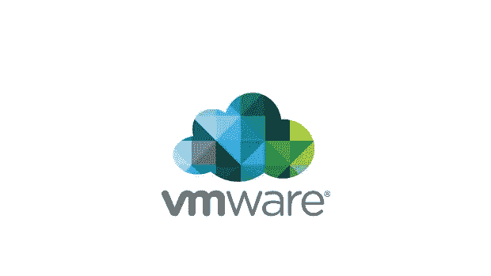

# VMware 面试体验

> 原文：<https://levelup.gitconnected.com/vmware-interview-experience-f0655f5b4692>

**VMware** 是一家美国云计算和虚拟化技术公司，总部位于加州。

VMware 被《福布斯》评为 2021 年美国最佳雇主
、2021 年第 174 位女性最佳雇主
、2000–2021 年第 383 位全球最佳雇主

*   选择状态:选定的✔️
*   级别:中等
*   面试和招聘流程:好

> ***申请流程***

我通过我们学院的校内机会申请了 VMware。我在 VMware 参加了 MTS(技术人员)职位的面试。

**面试/轮次的结构**
1。在线评估
2。技术回合 1
3。技术回合 2
4。管理轮次
5。HR 回合

> ***在线评估***

时间-: 90 分钟
站台-: Hirepro
这一轮包括 4 个部分:

***a)*******性向***
它由 10 道题组成，用 15 分钟解决。资质属于中等偏上水平。*

****b)技术(科目理论)***
它由 19 个问题组成，需要 29 分钟解决。它由来自 DBMS、OS、伪代码、数据结构和算法等主题的问题组成。*

****c)编码***
它由 1 个问题组成，需要 30 分钟解决。这个问题是一个简单的 DSA 问题，可以通过暴力来解决。*

****d)语言特定***
它由 5 个问题组成，需要 8 分钟解决。在这一轮中，需要从 **Python、C、C++和 java** 中选择一种语言。这些问题基于所选择的语言。*

> ****技术回合 1****

*时间:60 分钟*

*大约 50%的入围学生在这一轮被选中。
这一轮完全基于**数据结构和算法**。我被问到一个中等水平的问题，这个问题在不同的阶段被修改以增加难度。*

***问题:**
给了我一个数字串的数组和一个大小为 K 的窗口，我要找出这个数字串的位数相加在 K 大小的窗口中形成的最大数。*

*首先，我与他们讨论了不同的测试案例，然后继续告诉他们暴力方法，他们询问了问题的时间和空间复杂性，然后告诉我优化它。然后我和他们讨论了优化的方法并实施了它。*

*之后，他们修改了问题，进一步增加了难度。*

> ****技术回合 2****

*时间:60 分钟*

*这一轮也是基于数据结构和算法。讨论了 1 个中等水平问题和 1 个中硬水平问题，以及它们的优化方法和时间、空间复杂度。*

*大约 50%的上一轮学生从这一轮中入围。圆形。*

***问题:
*1)*** 这是一个基于递归的中硬级 leetcode 问题。
sol——通过添加更多的测试用例，在不同阶段对问题进行了修改。我告诉他们的每一个方法，我都被要求去实现它，每次我改变方法的时候，时间和空间的复杂性都会被讨论。*

****2)*** 这是一个基于字符串的中级 leetcode 问题。这个问题的主要挑战是处理边缘情况。并且覆盖所有约束，使得输出在给定范围内。*

***注**:通过在 leetcode 上练习 DSA 问题，并定期进行竞赛，可以轻松获得技术回合。可以提问的主题有:树、递归、链表、字符串、数组等。题的水平一般中等。*

*时间和空间复杂性的确定非常重要，同样重要的还有识别边缘案例、拟合正确的数据结构、应用正确的算法、大声思考和合理解释。*

> ****管理轮****

*时间:30 分钟*

*大约 40%的上一轮学生是从这一轮中挑选出来的。这一轮是基于对整体技术和软技能的测试，其中包括来自以下方面的讨论和问题:
a)项目讨论
b)项目中使用的技术讨论(JavaScript、React.js 和 redux for me)。*

*   **询问了与 react 和 java script 相关的问题，包括在 react 中设计组件、DOM、虚拟 DOM、redux 的重要性等。**

*c)数据库管理系统和 SQL*

*   *关于规范化、键、ACID 属性、并发性和事务的问题。*
*   **SQL 查询。**

*练习 SQL 查询的一些资源:[https://leetcode.com/problemset/database/](https://leetcode.com/problemset/database/)| |[https://www.hackerrank.com/domains/sql?过滤器%5B 状态% 5D % 5B % 5D =未解决的问题& badge_type=sql](https://www.hackerrank.com/domains/sql?filters%5Bstatus%5D%5B%5D=unsolved&badge_type=sql)*

*d)计算机网络*

*   *关于 HTTP 协议如何工作的问题，当一个 URL 被点击时的处理。*

*e)整体团队合作、技能、爱好、简历和 VMware 产品中的成就(因此，在为某家公司面试之前，先为该公司做**调查)。***

*这一轮主要围绕你给出的答案。所以，认真回答，不讨论自己没有把握的话题，这一点非常重要。还有一个积极的方面，你可以把这一轮的讨论引向你想要的方向。我的理论学科知识，我在简历中提到的技能，以及项目说明帮助我扫清了这一轮。*

***注意** : VMware 有时也会在管理回合中询问系统设计。系统设计问题可以围绕以下方面:*

*   *项目的架构和项目的部署。*
*   *项目中使用的数据库以及使用特定数据库的原因。*
*   *设计网飞和布料展厅(基于 2020 年的采访经验)*
*   *在线购物平台的可扩展性。*

*研究来源:【https://youtube.com/playlist? list = plmcxhnjxntnvo 6 alsjvkgxv-vh6 epyvox| | educative . io | | GFG*

> ****HR 回合****

*时间:10 分钟*

*这一轮对我们来说不是淘汰赛。这份问卷包含了与家庭背景、团队工作、梦想和你所居住的城市相关的一般性问题。*

> ***如有任何疑问**请随时通过 **Linkedin 联系我:**[https://www.linkedin.com/in/riti-nema-707b1719b/](https://www.linkedin.com/in/riti-nema-707b1719b/)*

> **VMware 从我们学院挑选了包括我在内的大约 8 名学生担任全职和兼职职位。参加 VMware 的面试是一次很棒的经历。招聘过程很顺利，面试官在整个面试过程中都很友好，乐于助人。**
> 
> **万事如意。编码快乐！！**