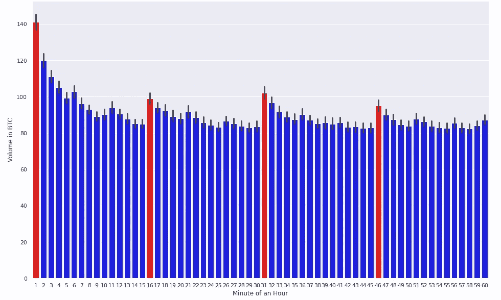
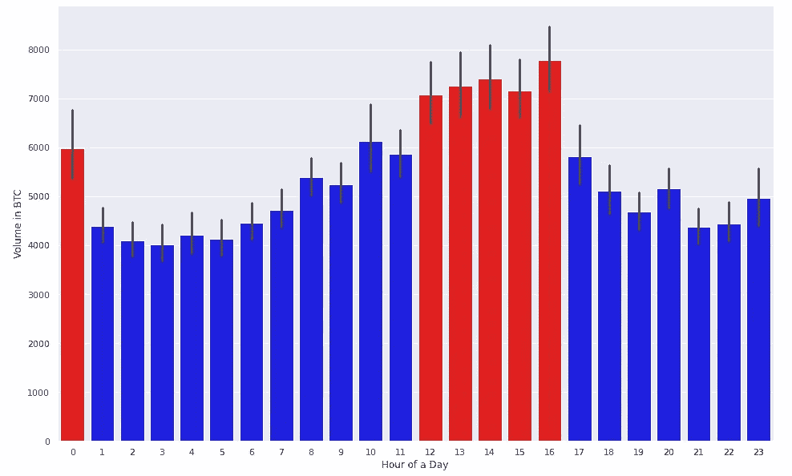
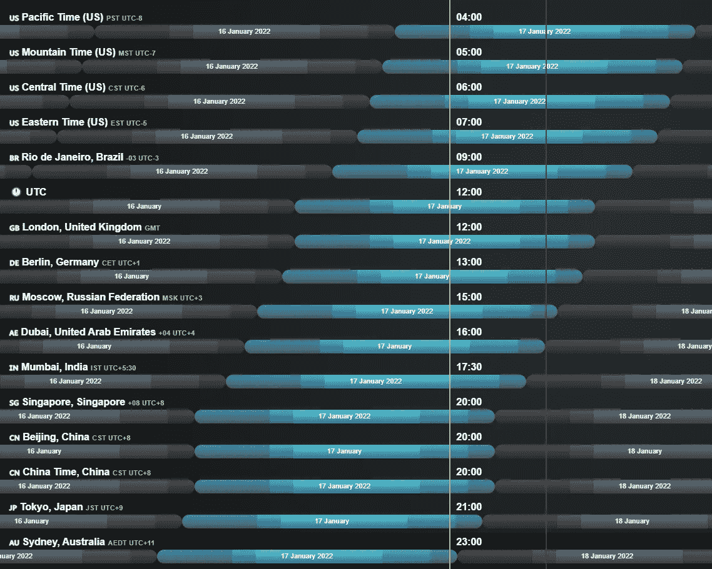
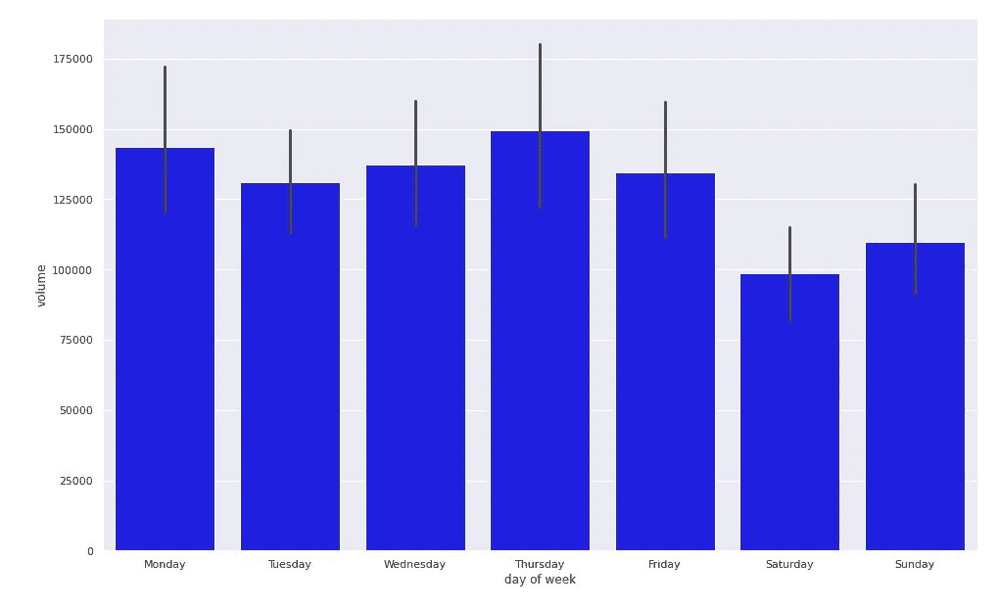

# 比特币交易中不同时间的成交量模式

> 原文：<https://levelup.gitconnected.com/volume-patterns-across-time-in-bitcoin-trading-dd432d78805f>

*试图在币安 BTC 的交易数据中变混乱为有序*

照片由[思想目录](https://unsplash.com/@thoughtcatalog?utm_source=medium&utm_medium=referral)在 [Unsplash](https://unsplash.com?utm_source=medium&utm_medium=referral) 上拍摄

**免责声明:**这篇博客文章的灵感来自彼得·汉森等人发表的论文[加密货币波动性和流动性中的周期性](https://arxiv.org/abs/2109.12142)，我鼓励你阅读它，并从不同的角度代表一个主题，以很好地补充你的理解。

加密货币数据通常是自发分析的好材料。首先，不缺。各种交换、探索者、聚合 API，可以给出千兆字节的非结构化信息。在那里有可能找到什么样的模式？

上面提到的论文引发了我对加密货币交易中递归的思考。因为我想保持简单，所以我决定在最大的海洋(币安)中探究最大的鱼(比特币)。

# 一小时内的交易量模式

由[cryptodatadownload.com](https://www.cryptodatadownload.com/data/binance/)提供的最近 2 年的数据，间隔 1m

1 号地块。BTC 一小时内每分钟的平均交易量

首先，我想重申上面文章中提到的关于算法交易潜在迹象的观点。曲线#1 非常清楚地表明，在一小时的每 15 分钟内，音量趋于增加。这种模式让我想到，有很大一部分机器人交易是基于趋势跟踪和技术分析算法。否则，我无法解释如此高频率的成交量上涨。不过，我很想在评论中听到明确的替代意见。

# 一天内的交易量模式

2 号地块。BTC 一天内每小时的平均交易量。

*数据集中的日期值以 UTC 格式提供。*

出乎意料的是，在几个小时内没有重复出现的模式(比如每第 x 个小时增加一次)，但在 0 号位出现的明显峰值暗示了每日重新平衡投资组合策略和实施这些策略的机器人。棒线 12-16 的红色区域可能可以用一个假设来解释，即所有主要市场在一天中的那个时段重叠。以下是 UTC 时区中午 12 点的可视化效果，以及其他人口密集时区的换算本地时间:

在 everytimezone.com 上可视化

# 一周内的交易量模式

3 号地块。BTC 一周内每天的平均交易量。

这个特别的节目主要是因为我喜欢一致性，我想让每个人都看到周末对加密市场的沉默效应。如果你想知道，与平日相比，平均交易量下降了近 23%。但是，当然，这种情况的发生主要是因为零售交易者想拥有他们的闲暇时间，而勤劳的机器人继续为一分钱而斗争。

# 摘要

让我强调一下这篇文章的几个要点:

*   算法交易发生的频率很高，在一小时的第 1、16、31 和 46 分钟推动交易量上升
*   尽管普遍认为加密市场 24/7 工作，但真正的行动只发生在 12-16 等时间段内
*   如果你是日内交易，周末休息一下:)