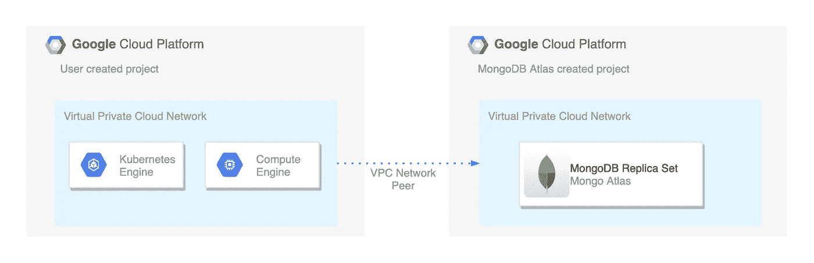
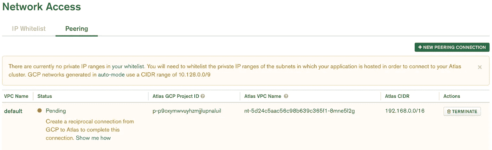

# MongoDB Atlas 和 Google Cloud 之间的 VPC 对等

> 原文：<https://levelup.gitconnected.com/vpc-peering-between-mongodb-atlas-google-cloud-eec89a261b75>



# 介绍

在 Atlas 上部署 MongoDB 集群时，确保其安全的唯一方法是将允许访问集群的 IP 地址列入白名单。这是一种非常有效的方法，但是在某些情况下会产生问题。

我最近在 Google Kubernetes 引擎上部署了一个 Kubernetes 集群，并很快意识到我的 pods 没有明确的 IP 地址范围，这限制了我使用 Mongo Atlas 白名单来保护集群。对于那些没有任何 Kubernetes 背景的人来说，微服务编排系统通过自动扩展、重新创建和修复来维护一组应用和服务。一个应用程序的每个实例称为一个 pod，因为这些 pod 会不断重新创建，所以不能有预定义的 IP 地址。

经过大量搜索，我发现解决这个问题的唯一方法是使用 NAT(网络地址转换)网关。NAT 通过相同的 IP 地址路由 VPC(虚拟私有云)网络内的所有传出流量，允许我们将该地址列入白名单。我之前在这里写了一篇关于如何设置这个基础设施的教程[一个关于 NAT 网关如何工作的简要描述](/part-2-deploy-and-secure-mongodb-on-atlas-4820d539a1dc#0d93)。

尽管这个解决方案非常有效，但我意识到仅运行这个 NAT 网关每月就要花费我 50 美元。对于小项目来说，这似乎很荒谬。**谢天谢地，Atlas 有一个叫做私有网络对等的工具，它允许你把你的 MongoDB Atlas 集群连接到一个云提供商的 VPC 网络，就好像它们在同一个私有网络上一样。问题是，直到几个月前，这还只能在 AWS 上使用。现在，** [**他们又增加了对 Google Cloud 和 Azure**](https://www.mongodb.com/blog/post/atlas-mapped-private-network-peering-on-azure--gcp) **的支持。**

# 设置谷歌云

如果您已经拥有 Google Cloud 帐户，并且已经创建了一个项目，则可以跳过这一步。

前往[https://cloud.google.com/free](https://cloud.google.com/free/)获取创建账户的指导。注册后，您将获得 300 美元的免费积分，因此不必担心需要为您在本教程中创建的资源付费。

在 Google Cloud 控制台中创建新项目。如果你以前从未这样做过，请参见[https://cloud . Google . com/resource-manager/docs/creating-managing-projects](https://cloud.google.com/resource-manager/docs/creating-managing-projects)。我们将把我们的项目称为 *vpc 对等教程*。

# 设置 MongoDB Atlas

前往 https://www.mongodb.com/cloud/atlas 的，点击*免费试用。*注册后，您应该会立即进入一个页面，在这里您可以配置和部署您的第一个 MongoDB 集群。**暂时不要创建集群，因为在此之前我们需要设置我们的 VPC 对等机。**

# 创建 VPC 对等

前往您的 [Atlas 仪表盘](https://cloud.mongodb.com/)，创建一个项目(如果您还没有创建的话),然后点击侧边栏中*安全*下的*网络访问*。点击*对等*和*新建对等连接*。选择*谷歌云平台*，点击*下一步*。

输入你的 GCP 项目 ID，可以在左上角的*项目信息*卡下的[谷歌云控制台](https://console.cloud.google.com/home/dashboard)中找到。接下来，输入您的 VPC 网络名称，如果您没有更改或创建另一个名称，这将是默认的名称。将地图集 CIDR 保留为默认值，应为 **192.168.0.0/16** 。点击*发起对等*。

现在，在 GCP 控制台中转到 [VPC 网络对等](https://console.cloud.google.com/networking/peering/list)并点击*创建连接*和*继续*。将连接命名为 **atlas-peer** ，并选择*您的 VPC 网络*下的**默认**。在*对等 VPC 网络*下选择**另一个项目**。现在我们需要获取 Atlas 部署的 GCP 项目 ID 和项目名称。这两个值都可以在 [Atlas 仪表板](https://cloud.mongodb.com/)中 *Atlas GCP 项目 ID* 和 *Atlas VPC 名称*下的*网络访问*部分的*对等*选项卡中找到(如果它们还没有显示，请等待几分钟，让 Atlas 完成对对等的初始化)。



将这些值输入到 GCP 的*项目 ID* 和 *VPC 网络名称*表格中，并点击*创建*以完成对 VPC 同行的设置。

我们需要做的最后一件事是在 Atlas 中将我们的 GCP VPC IP 地址范围列入白名单。在 Atlas Network Peering dashboard 中，您应该会在我们列出的以*结尾的 VPC 网络上方看到一条警告“…在* [*自动模式*](https://cloud.google.com/vpc/docs/vpc#subnet-ranges) *中生成的 GCP 网络使用的 CIDR 范围为****10 . 128 . 0 . 0****(您也可以在上面的截图中看到这一点)。复制这个 CIDR 范围，点击 *IP 白名单*选项卡，点击*添加 IP 地址*。在*白名单条目*下输入复制的范围，点击*确认*。该范围将匹配我们默认的 GCP VPC 网络中的所有地区(对于当前项目)。*

# *测试*

*在继续之前，确保 VPC 对等连接从 GCP 和 Atlas 都成功连接，并且我们添加的 IP 白名单已完成配置。*

*我们将创建一个 MongoDB 集群。我们将尝试从本地计算机连接到集群(这应该不起作用)，然后在 Google Cloud 中创建一个 VM 以确保它可以成功连接。*

*进入你的 [Atlas 仪表盘](https://cloud.mongodb.com/)，点击侧边栏 *Atlas* 下的*集群*，然后点击*构建集群*。在*云提供商&地区*下，选择**谷歌云平台**和**爱荷华州(美国中部)**。在*集群层*下，选择 **M10** (任何更低的层都不允许我们使用 VPC 对等体)并在*集群名称*下输入**测试集群**。点击*创建集群*。群集将需要几分钟的时间来启动。*

## *本地测试*

*确保您安装了[Mongo CLI](https://docs.mongodb.com/v3.2/administration/install-community/)，一旦集群完成配置，单击集群名称下的 *Connect* 。在*创建一个 MongoDB 用户*下，输入用户名 **admin** 和任何密码(如果只是针对本教程，不必担心会太复杂)。点击*创建 MongoDB 用户*然后*选择连接方式*。选择*连接 Mongo Shell* ，点击连接字符串旁边的*复制*。该字符串应该类似于*

```
*mongo "mongodb+srv://test-cluster-2m6rh.gcp.mongodb.net/test" --username admin*
```

*将它输入到您的终端或命令行，并在出现提示时输入您选择的密码。Mongo shell 应该尝试连接多次，但每次都失败，并出现以下错误:*

```
*Unable to reach primary for set test-cluster-shard-0Cannot reach any nodes for set test-cluster-shard-0\. Please check network connectivity and the status of the set. This has happened for 2 checks in a row.*
```

*尝试几次后，它会以一个`connection failed`异常结束。*

## *GCP 测试*

*现在，我们将在 Google Cloud 上创建一个虚拟机。前往 [GCP 计算引擎虚拟机仪表板](https://console.cloud.google.com/compute/instances)，点击*创建*(或者*创建实例*，如果你已经有一个虚拟机)。*

*在*启动盘*下点击*更换*，选择 **Ubuntu 18.04 LTS** ，点击*选择*。保持所有其他默认设置不变，点击底部的*创建*。一旦它完成旋转，点击*连接*下 *SSH* 旁边的箭头，并选择*在浏览器窗口*中打开(如果您愿意，您可以使用自己的终端或命令行，但为了简单起见，我们将通过浏览器 SSH)。运行以下命令来安装 Mongo shell(从[到这里的](https://docs.mongodb.com/manual/tutorial/install-mongodb-on-ubuntu/)):*

```
*sudo apt-key adv --keyserver hkp://keyserver.ubuntu.com:80 --recv 9DA31620334BD75D9DCB49F368818C72E52529D4echo "deb [ arch=amd64 ] [https://repo.mongodb.org/apt/ubuntu](https://repo.mongodb.org/apt/ubuntu) bionic/mongodb-org/4.0 multiverse" | sudo tee /etc/apt/sources.list.d/mongodb-org-4.0.listsudo apt-get updatesudo apt-get install -y mongodb-org*
```

*现在，从前面获取相同的连接字符串，并将其输入。出现提示时，输入相同的密码。您现在应该会看到一大堆输出，以成功连接到数据库结束:*

```
*MongoDB server version: 4.0.10
Welcome to the MongoDB shell.
For interactive help, type "help".
For more comprehensive documentation, see [http://docs.mongodb.org/](http://docs.mongodb.org/)
Questions? Try the support group
        [http://groups.google.com/group/mongodb-user](http://groups.google.com/group/mongodb-user)
MongoDB Enterprise test-cluster-shard-0:PRIMARY>*
```

*恭喜你。现在，您可以使用私有网络连接到 MongoDB Atlas 集群，在使用 Kubernetes 引擎时不再需要 NAT 网关。为了避免产生额外费用，请确保删除 Google Compute Engine VM、MongoDB Atlas 集群以及在每个集群中创建的项目。*

*希望你喜欢这个教程，欢迎在下面留下任何评论或问题！*