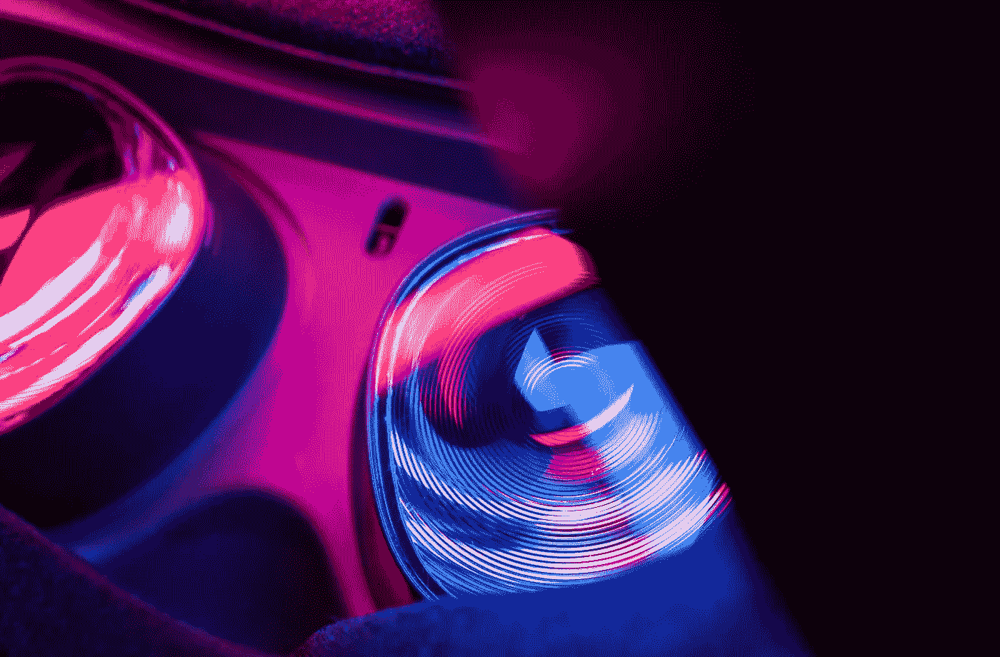
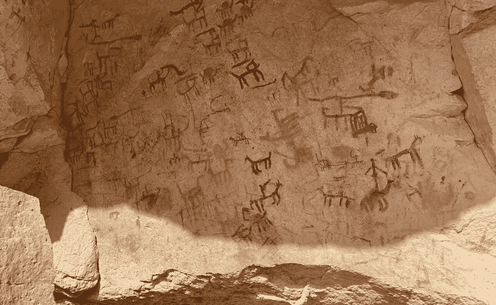
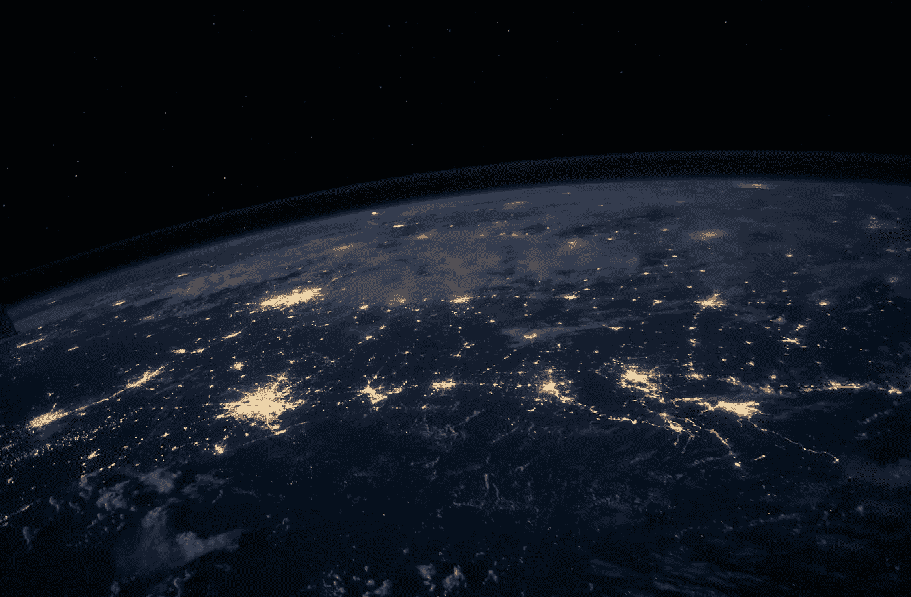
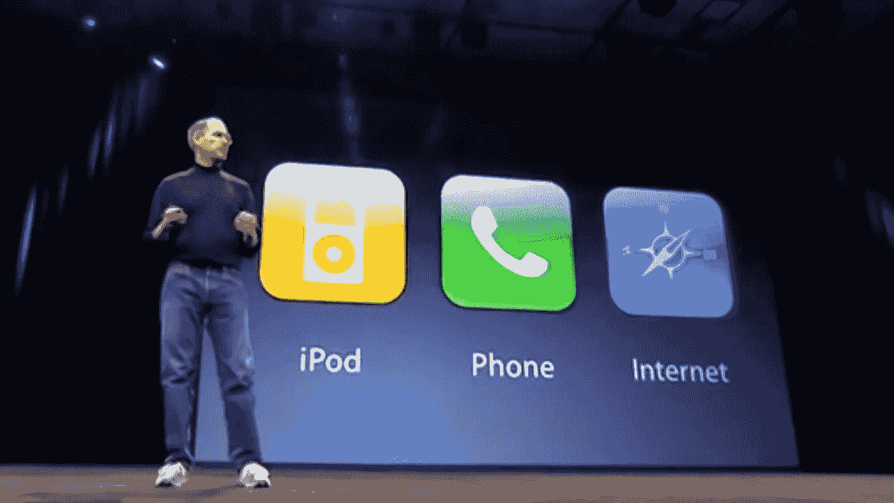
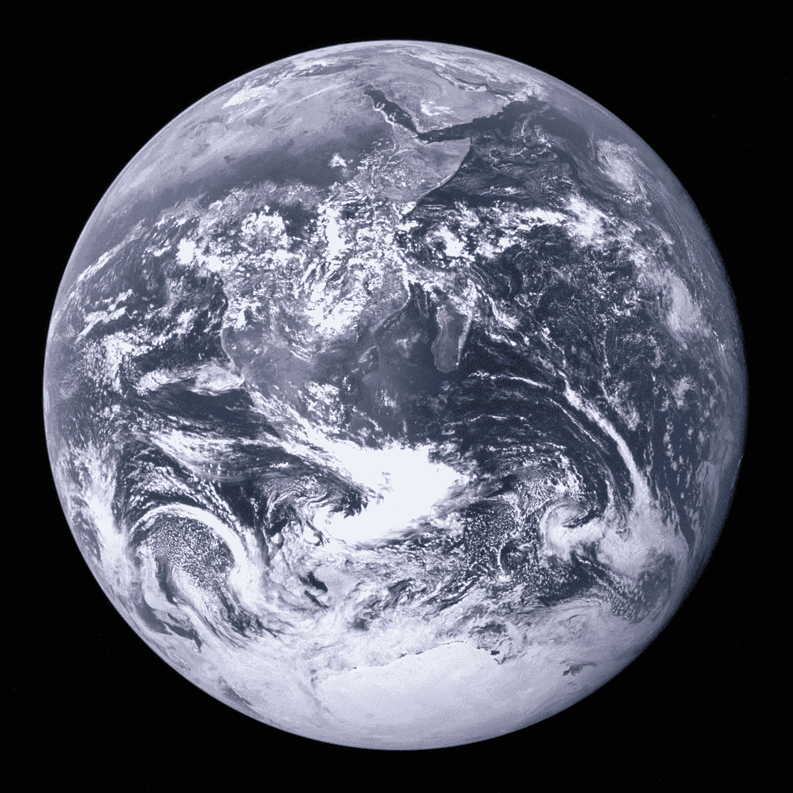

# VR 是娱乐——AR 是现实

> 原文：<https://levelup.gitconnected.com/vr-is-entertainment-ar-is-reality-a268c30a578f>

透过镜子

对一些人来说，**元宇宙**的概念是可怕的，这是可以理解的。如果不负责任的开发受到控制，那么现实的虚拟世界很有可能走向噩梦般的现实。

社交媒体上的尖酸刻薄，社会政治分歧，巨大的财富差距，媒体的煽风点火，失控的气候变化...我们已经踏上了噩梦般的现实之路。

# 对元宇宙的恐惧不会阻止它的再现和我们最终的沉浸。

自从有时间以来，人类一直在讲述故事和改变他们的世界。抵制或压制我们丰富这些基本努力的动力是徒劳的。拥抱我们推进讲故事艺术的动力，但要专注于我们讲述的故事和我们讲述它们的方式。我们将继续打造我们周围的建筑世界，但我们必须对可持续和负责任的建筑负责。

元宇宙的早期效果图，柏拉图的洞穴

艺术、音乐、语言、数学、文学、科学和宗教、戏剧、广播、电视、视频游戏、Omnimax、家庭影院……都是讲故事。小说和非小说。世界的描述和新世界的建筑。界限往往模糊不清。

## **虚拟现实**是讲故事进化的下一个飞跃。

当然，一些人会“粘在电视上”，而另一些人会高呼“关掉你的电视”一如既往，会有与健康平衡截然不同的不健康极端。与往常一样，这项技术将会缓慢发展，然后在眨眼之间变得无处不在。

尽管讲故事令人兴奋，但我一直对人类科技与 T5 周围世界的融合更感兴趣。

人类在曾经只有黑暗的地方创造了光明

# 现实是革命发生的地方。

iPhone 不是一场革命，因为它是 iPod 和电话。它作为一个“ [**互联网传播者而闻名于世。**](https://medium.com/@todd-p-marco/segregation-has-ended-remember-a1b8c96d0029) “我们当时可以想象的设备之一是能够在排队的时候回复邮件*或者在等待登机的时候观看网飞新流媒体服务的电影**。当然，这些都是进化的观点。*

然而，iPhone 已经被证明是一款完全革命性的设备。

史蒂夫·乔布斯在 2007 年介绍 iPhone

公平地说，iPhone 不是市场上唯一的智能手机，就像 iPod 不是市场上唯一的 mp3 播放器一样。但是苹果是革命性的公司，用这些产品改变了世界。

# 我们完全依赖科技。

这不是什么新鲜事。没有技术的帮助，我无法在现代世界生存。我的视线会变得模糊，我的身体会变得冰冷&光秃秃的，我的胃会饿，我的脚会酸痛。我居住的地产和周围的当地生态系统将无法维持我的生活，我将努力寻找一种可以满足我基本需求的生计。

取而代之的是，我戴眼镜，根据天气着装，从商店购买食物，开车去我需要的地方，使用电脑从事有报酬的工作，偶尔飞到地球的其他地方。再说一遍，这不是什么新鲜事。

在过去的两年里，我完全是在自己舒适的家里工作。我根据需要通勤到办公室，这通常很少见，但我仍然是 AirPods 硬件开发团队的重要成员。在整个疫情，我帮助运送了开创性的产品- *AirPods Max* 、 *AirTag* 和第三代 *AirPods* 。**全部来自我的家庭办公室。**

# 疫情启动了元宇宙。

作为一个社会，我们已经开始质疑长期以来的假设，即经常乘坐汽车和飞机旅行对生产力是必要的。当然，有时这很重要。通常情况下，好处不会超过低效。

时间就是金钱，燃料也是金钱。我们发展了一个依赖全球互动的全球文明。我们现在正在改进我们从世界上几乎任何地方传送到&的能力，以一种极其节约成本的方式，接近光速。

小小世界上的一只小手

# 不仅仅是耳机的问题。

我们可能主要通过我们的眼睛和耳朵来体验元宇宙，但它对物质世界的渗透将是深远的。它将利用机器人技术、人工智能、自动驾驶汽车、加密货币和计算的进步来*环游世界*，*了解世界*，以及*与世界互动*。这自然会导致**技术奇点**。

不像 VR & AR(和 MR 一起统称为 **xR** )背后的根本人类驱动力，**奇点不太可能是人类的好兆头**。纵观这个星球上的历史，你很难找到一个不征服被认为“劣等”的人的主导群体。

无论是政府还是社会都无法让这艘科技巨轮远离灾难。权力掌握在那些长期掌权的人手中。

# 我们必须有目的地建设元宇宙。

如果把它建成一个利润引擎，文明将会付出代价。如果它是作为一个更强大的工具，放在负责任的人手中，我们将一起前进。

我们的蓝色大理石

# 在科技行业，我们以“改变世界”为荣，但我们没有花足够的时间考虑我们是否真的在让世界变得更好。