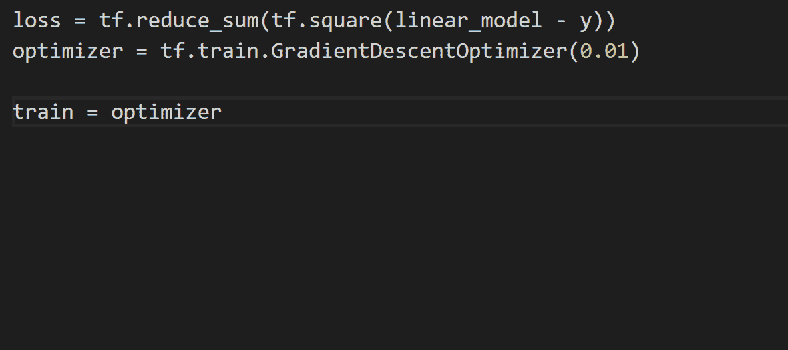

# VS 数据工程的代码扩展

> 原文：<https://levelup.gitconnected.com/vs-code-extensions-for-data-engineering-66839673ea0f>

VS code 是顶级的代码编辑器之一，因为它能够通过内置的[扩展市场](https://marketplace.visualstudio.com/vscode)轻松地扩展其功能，从而在您的编辑器中轻松找到并安装它们。例如，如果您是一名数据工程师，您可以安装一些扩展来使它完美地满足您的需求。

在这篇文章中，我将介绍一些扩展，作为一名数据工程师，在使用 VS 代码让编辑器为您工作并帮助您完成更多工作时，您可以使用这些扩展来改善您的开发体验。

# 朱皮特

如果你在 Jupyter 笔记本上做日常的数据工程工作，这个扩展是很棒的。该扩展带来了对文件格式的完全支持，允许您编辑您的笔记本块，并在 Jupyter 笔记本服务器上运行它们，类似于 Jupyter 笔记本体验。下面是一个编辑和运行笔记本程序块的例子。

 [## Jupyter - Visual Studio 市场

### 一个 Visual Studio 代码扩展，为 Jupyter 中支持的语言内核提供基本的笔记本支持…

marketplace.visualstudio.com](https://marketplace.visualstudio.com/items?itemName=ms-toolsai.jupyter) 

让您的笔记本在此扩展中运行，您可以加快开发过程，而无需在两个应用程序之间切换上下文来测试您在开发过程中所做的更改。尽管此扩展为 Jupyter 笔记本的所有核心功能提供了非常实用的体验，但并不支持所有一对一的功能。例如，该扩展目前不支持显示和编辑 Jupyter 笔记本中特定块上的标签。

# 挂架

这个扩展在 VS 代码中与 Python 一起工作，在处理 Python 代码文件时提供更高性能的语言支持。您需要使用的许多常见数据工程工具都是基于 python 的，因此投资 Python 工具链并让编辑器更好地与 Python 配合使用是非常必要的，从长远来看，这将节省您的时间。

 [## Pylance - Visual Studio 市场

### Pylance 是一个扩展，它与 Python 一起在 Visual Studio 代码中提供性能语言支持。在…下面

marketplace.visualstudio.com](https://marketplace.visualstudio.com/items?itemName=ms-python.vscode-pylance) 

该应用程序提供了改进的 Python 代码智能感知，具有丰富的类型检测、参数建议、代码完成、自动导入等功能。

有了这样的扩展，在一年多的时间里编写 Python 代码，每天可以节省几秒钟或几分钟的时间，这样你就可以有更多的时间去做你想做的事情。

# Excel 查看器

在进行数据工程时，您将经常使用 CSV 和 XLSX 文件作为您的输入或输出数据格式。因为您经常使用这些文件，所以投资一个扩展是值得的，该扩展允许您在 VS 代码中本地查看这些文件，而不需要打开整个其他应用程序来检查文件。

 [## Excel Viewer - Visual Studio 市场

### 由 Wijmo 提供支持，这个扩展提供了 CSV 文件和 Excel 电子表格的自定义编辑器和预览

marketplace.visualstudio.com](https://marketplace.visualstudio.com/items?itemName=GrapeCity.gc-excelviewer) 

该应用程序明确解决了使用 excel 文件时的一个棘手问题，因为 excel 会锁定任何打开的文件，防止其被修改。excel 的这一限制意味着，如果您的应用程序输出到 excel 已经打开的文件，可能会导致一些恼人的工作流问题和错误。这个扩展应该是每个数据工程师日常工具包的一部分。

# 智能代码

该扩展旨在为您的应用程序提供内容感知的代码完成，类似于 PyLance，但更侧重于分析您正在处理的内容，以提供更相关的更好建议。

 [## IntelliCode - Visual Studio 市场

### Visual Studio 代码的扩展-人工智能辅助开发

marketplace.visualstudio.com](https://marketplace.visualstudio.com/items?itemName=VisualStudioExptTeam.vscodeintellicode) 

像这样的扩展允许您根据扩展的建议轻松地遵循您的团队和其他代码贡献的模式和风格。该应用程序还允许您捕捉那些难以在编辑器中看到的错误，这些错误可以通过静态分析工具(如该扩展)从源代码中快速扫描出来。

# 包扎

希望您已经看到了一些扩展，它们能够帮助您成为更好的数据工程师。这些扩展大多专注于提高开发人员的工作效率，这样您就可以作为工程师做更多的工作，而不是浪费时间在糟糕的工作流程或常见错误上。

如果你想让你的 VS 代码更有情趣，看看下面这篇文章，你可以在你的编辑器中使用五个主题，让它焕然一新。

 [## 5 VS 现代代码编辑器的代码主题

### 如果你现在正在使用 VS 代码，你的主题是很久以前选择的，或者只是默认的，那可能是…

medium.com](https://medium.com/codex/5-vs-code-themes-for-a-modern-code-editor-f8e4bf4137ab) 

# 进一步连接

*   如果你正在考虑购买一份中等订阅，你可以通过我的推荐链接来帮我。
*   查看我在[媒体](https://medium.com/@aaron-kt-berry)上的其他文章，如果你想了解最新消息，请通过[电子邮件](https://aaron-kt-berry.medium.com/subscribe)订阅。
*   如果你想聊天，请在 Twitter 或 LinkedIn 上联系我，如果你想雇佣我，我在 Codementor 上。