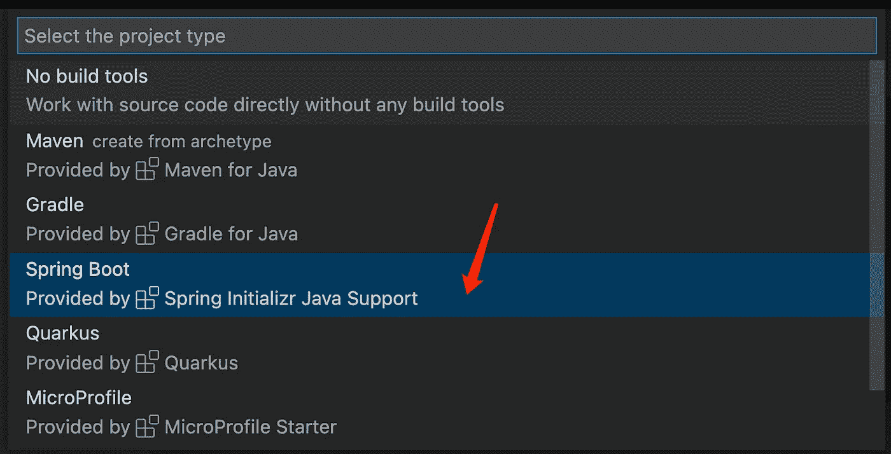
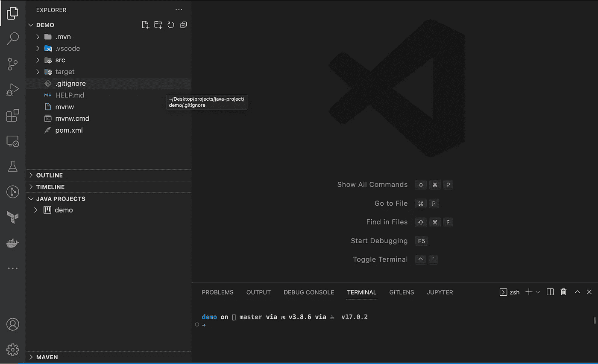

# VS 代码+Java+Spring Boot——一步一步的指南

> 原文：<https://levelup.gitconnected.com/vs-code-java-springboot-a-step-by-step-guide-beb61a4eb70c>

让我们深入 4 步指南，在 VS 代码上构建您的第一个 Java Spring Boot `GET`和`POST` API！

TL；本指南的 DR 代码报告在此处为[和](https://github.com/caopengau/demo-api)


# 步骤 0。Java 环境设置

根据您使用的操作系统，设置会有所不同

*   确保`java`和`javac`命令在您的终端上可用

# 第一步。VS 代码插件，搜索`春季开机'

*   Spring Boot 工具
*   Sprint Boot 仪表板
*   Spring Boot 扩展包
*   Spring Initializr Java 包


# 第二步。创建一个 java 项目

首先通过 Command + P 或 Ctrl + P 调出 vs 命令，然后选择如下的项目配置



挑选一些 dependenies，Spring Web 和 Lombok (Lombok 对于模板代码很有用)


选择一个您想要在其中生成项目的文件夹。


完成后，你会有这个



左下角的“Java 项目”面板是我们将比左上角的普通文件浏览器更广泛使用的面板

# 步骤 3 添加第一个控制器

展开 java 项目，点击`com.example.demo`上的+按钮，然后在输入栏上写下控制器名称`MovieController`


添加第一个`GET`路由控制器

```
package com.example.demo;import org.springframework.web.bind.annotation.GetMapping;
import org.springframework.web.bind.annotation.RestController;@RestController
public class MovieController {
 @GetMapping("/")
 public String first() {
  return "Hello World";
 }
}
```

运行项目并访问`localhost:8080`


# 第四步。添加另一个投递路线

让我们假设`Body`是我们想要接受的 post 主体。创建`Body.java`

```
package com.example.demo;class Customer {
 private String name;
 private int age;
 // getters and setters
 public String getName() {
  return name;
 }
 public void setName(String name) {
  this.name = name;
 }
 public int getAge() {
  return age;
 }
 public void setAge(int age) {
  this.age = age;
 }
}public class Body {
 private String transactionId;
 private Customer[] customers;

 public String getTransactionId() {
  return transactionId;
 }
 public void setTransactionId(String transactionId) {
  this.transactionId = transactionId;
 }
 public Customer[] getCustomers() {
  return customers;
 }
 public void setCustomers(Customer[] customers) {
  this.customers = customers;
 }
}
```

让我们假设`Response`是我们希望 post 端点响应的主体。创建`Response.java`并添加到下面

```
package com.example.demo;import java.util.ArrayList;enum TicketType {
 Adult, Senior, Teen, Children
}public class Ticket {
 private TicketType ticketType;
 private int quantity;
 private double totalCost;
 public TicketType getTicketType() {
  return ticketType;
 }
 public void setTicketType(TicketType ticketType) {
  this.ticketType = ticketType;
 }
 public int getQuantity() {
  return quantity;
 }
 public void setQuantity(int quantity) {
  this.quantity = quantity;
 }
 public double getTotalCost() {
  return totalCost;
 }
 public void setTotalCost(double totalCost) {
  this.totalCost = totalCost;
 }public void addOne(double addCost) {
  this.setQuantity(this.quantity + 1);
  this.setTotalCost(this.totalCost + addCost);
 }
}public class Response {
 private String transactionId;
 private ArrayList<Ticket> tickets = new ArrayList<Ticket>();
 private double totalCost = 0;public String getTransactionId() {
  return transactionId;
 }public void setTransactionId(String transactionId) {
  this.transactionId = transactionId;
 }public ArrayList<Ticket> getTickets() {
  return tickets;
 }public void setTickets(ArrayList<Ticket> tickets) {
  this.tickets = tickets;
 }public double getTotalCost() {
  return totalCost;
 }public void setTotalCost(double totalCost) {
  this.totalCost = totalCost;
 }public void calculateTotalCost() {
  double temp = 0;
  for (int i = 0; i < tickets.size(); i++) {
   if (tickets.get(i).getTicketType() == TicketType.Children && tickets.get(i).getQuantity() >= 3) {
    temp += tickets.get(i).getTotalCost() * 0.75;
   } else {
    temp += tickets.get(i).getTotalCost();
   }
  }
  this.setTotalCost(temp);
 }private ArrayList<TicketType> getTicketTypes() {
  ArrayList<TicketType> ticketTypes = new ArrayList<TicketType>();
  for (Ticket ticket : tickets) {
   ticketTypes.add(ticket.getTicketType());
  }
  return ticketTypes;
 }public void addTicket(Ticket ticket) {
  ArrayList<TicketType> ticketTypes = this.getTicketTypes();
  if (ticketTypes.contains(ticket.getTicketType())) {
   for (Ticket existingTicket : tickets) {
    if (existingTicket.getTicketType() == ticket.getTicketType()) {
     existingTicket.setQuantity(existingTicket.getQuantity() + 1);
     existingTicket.setTotalCost(existingTicket.getTotalCost() + ticket.getTotalCost());
     this.calculateTotalCost();
     return;
    }
   }
  } else {
   this.tickets.add(ticket);
   this.calculateTotalCost();
  }
 }
}
```

将 post 路线添加到我们的控制器

```
@PostMapping(path = "/", consumes = "application/json", produces = "application/json")
 @ResponseBody
 public Response post(@RequestBody Body body) {
  Response response = new Response();
  response.setTransactionId(body.getTransactionId());
  for (int i = 0; i < body.getCustomers().length; i++) {
   Customer customer = body.getCustomers()[i];
   Ticket ticket = getTicketForAge(customer.getAge());
   response.addTicket(ticket);
  }
  return response;
 }
```

运行项目并使用另一个 vscode 插件 [Thunder 客户端](https://marketplace.visualstudio.com/items?itemName=rangav.vscode-thunder-client)或 Postman 发出 post 请求

```
// URL: localhost:8080// post body
{
  "transactionId": "111",
  "customers": [
    {

      "name": "Alert",
      "age": 72
    }
  ]
}
```


**行动呼吁**

如果你觉得这个指南有帮助，请鼓掌并跟我来。通过[链接](https://medium.com/@caopengau/membership)加入 medium，获取我和所有其他优秀作家在 medium 上发表的所有优质文章。