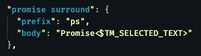
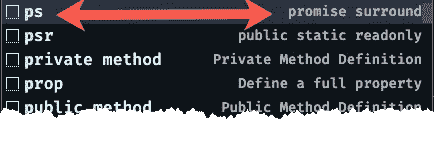
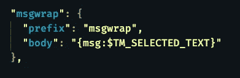
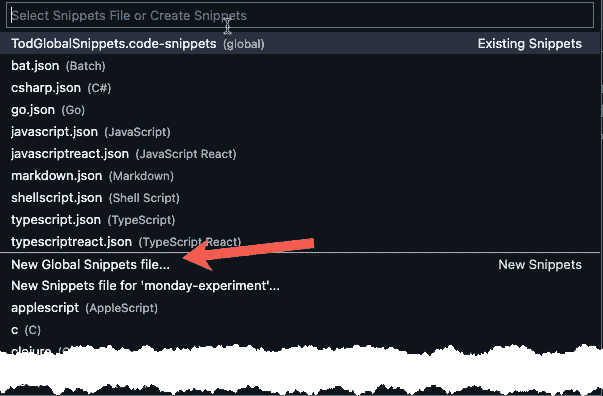

# VS 代码中最有用的片段变量

> 原文：<https://levelup.gitconnected.com/vs-codes-most-useful-snippet-variable-788827d287f>

## 学习在代码片段中使用当前选定的文本

奥斯卡·王尔德的“什么是愤世嫉俗者”片段

当你写 VS 代码片段时，不要忽略`$TM_SELECTED_TEXT`变量。有了它，每当您调用代码片段时，您当前选择的任何文本都会被放入该变量中。

# 用例

最近我写了很多 TypeScript，如果我不指定返回类型，linter 会让我很恼火。当我写一个异步函数时，我经常忘记我必须返回一个形式为`Promise<>`的 promise 泛型，我输入了我返回的对象的接口名。

`async function getBoardItemResponse(): BoardItemResponse {`

最初的几次我犯了这个错误，回去纠正它

`async function getBoardItemResponse(): **Promise<**BoardItemResponse**>** {`

还不算太糟。但是大约在我第 1000 次犯这个错误的时候，是时候保存一些击键了，产生了这个片段:

制作许诺对象的片段

现在我双击`BoardItemResponse`，输入字母`p`，我选择的代码消失了，我看到下面的下拉菜单

下拉自动完成列表

按下回车键后，我的短信被承诺包围了。我真希望我至少在 500 个错误之前就写好了。它仍然几乎每天都在使用。有些程序员从不学习。

# 再举一个例子

我使用一种宽容的测井工具。我几乎可以传递任何东西给它，它会在日志中输出一些有意义的东西。但是，如果我在传递的对象的一个`msg`属性中指定我想要显示的文本，我可以减少日志中多余的噪声。下面的代码片段允许我选择原始文本参数并键入`msg`，然后快速清理几十条日志消息。我不确定我做代码审查的队友是否欣赏这一点，但我很高兴。

将选定的文本放入对象的属性中

# 离开的小费

我过去常常把我的建议放在特定语言的文件中。在某个时候，我注意到当我使用`Command Palette`，键入`snip`，并选择`Preferences: Configure User Snippets`时，有一个`New Global Snippets file…`的选项

新的全局代码片段文件…选项

在任何对类似文件使用多种扩展名的语言中，比如`.js, .ts, .tsx`——我发现把我的省时器藏在一个全局 snippets 文件中是更好的选择。

你可以阅读更多我的 [Visual Studio 代码文章](https://gentille.us/visual-studio-code-articles-8250ada42f2?sk=c0cfa155220a13855ce6ea72514c7a88)
代码平平安安。