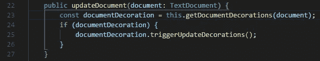
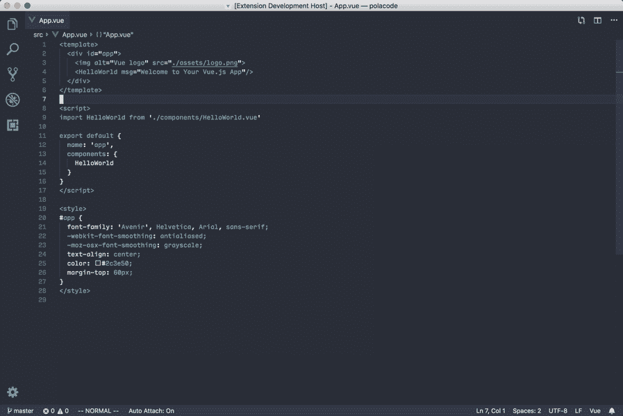

# 您需要立即开始使用的 VSCode 扩展

> 原文：<https://levelup.gitconnected.com/vscode-extensions-you-need-to-start-using-right-now-3520afb3bb5b>

4 周前从 WebStorm 过渡到 VSCode，这些扩展让我的生活变得更加轻松！

我成为 IntelliJ (WebStorm / PyCharm)用户已经超过一年半了。老实说，我仍然很喜欢它，它提供了一些 VSCode 不能开箱即用的功能(Git 支持在 IntelliJ 代码编辑器中非常出色)，但在我的工作笔记本电脑死机后，我不得不从头设置一个替代品，我决定尝试一下 VSCode。

恋爱 7 天，仅此而已。

当您将 VSCode 与正确的扩展结合使用时，它是轻量级的，并且非常强大。但是在 VSCode 市场上有大量可用的扩展，很难找到满足您需求的最佳扩展。

作为一名开发人员，您可能没有太多时间来尝试每个扩展，所以我已经列出了您确实应该配置的所有 VSCode 扩展。让我们开始吧。

# 效用/生产力

## 更漂亮—代码格式化程序

在团队中工作的缺点之一是对代码格式和样式有不同的看法。我讨厌看到非格式化的代码，而且我了解到(有足够的经验)你不能依赖人们同意一个适当的代码风格，所以为什么不使用一个代码格式化程序为你做繁重的工作呢？

它通过解析您的代码并根据自己的规则(考虑到最大行长度，必要时换行)重新打印代码来强制执行一致的风格。而且它支持很多开箱即用的语言:JavaScript、TypeScript、Flow、JSX、JSON、CSS、SCSS、Less、HTML、Vue、Angular、GraphQL、Markdown、YAML……唷，真多！

链接到市场:[更漂亮的](https://marketplace.visualstudio.com/items?itemName=esbenp.prettier-vscode)

## 自动重命名标签

这是救命恩人。当您处理大块的 HTML 代码并需要重命名一些标签时，寻找结束标签并重命名它会非常困难。这个扩展将节省您的时间和精力&重命名 HTML 中相应的结束标记。

链接到市场:[自动重命名标签](https://marketplace.visualstudio.com/items?itemName=formulahendry.auto-rename-tag)

## 括号对着色机

又一个救命恩人！如果你使用深色主题，看起来会很棒。如果你有太多的括号，这将节省你一些宝贵的时间，帮助你弄清楚你的代码的范围，并给它添加一点颜色。

很多时候，我最终删除了错误的括号，并盯着我的代码编辑器滚动条变成红色的错误。不再是了！

链接到市场:[支架对上色器](https://marketplace.visualstudio.com/items?itemName=CoenraadS.bracket-pair-colorizer)

## **颜色高亮**

这使得阅读样式表更加容易。不用再搜索颜色的十六进制代码了。这突出显示了 VSCode 文件中的十六进制值。

## HTML5 样板文件

我讨厌 HTML 文件的一点是 HTML & body 标签的初始设置。您经常会忘记重要的元标签，这对于以后的调试来说是一件痛苦的事情。

这个扩展允许你通过将`html`写入文件来生成所有重要的东西。非常方便省时的扩展！

链接到市场: [HTML 样板文件](https://marketplace.visualstudio.com/items?itemName=sidthesloth.html5-boilerplate)

## 雄孔雀

孔雀是一个惊人的定制扩展。通过为侧栏和工具栏引入您自己的颜色，使 VSCode 成为您自己的。我承认我确实喜欢我的深色主题编辑器中的一些颜色。

如果你一整天都在处理多个项目/回购，Peacock 会有所帮助。它有助于定制每个窗口，并确保您看到的是正确的项目。

市场链接:[孔雀](https://marketplace.visualstudio.com/items?itemName=johnpapa.vscode-peacock)

## Polacode —宝丽来代码

现在我们都在家工作，当你想把你的代码片段发送给你的团队时，这个扩展肯定会有帮助，并且在你这么做的时候看起来很酷。Polacode 为您的代码创建一个宝丽来类型的图像，您可以快速地与您的团队共享。它看起来干净整洁，而且你可以调整页边距。

链接到市场: [Polacode](https://marketplace.visualstudio.com/items?itemName=pnp.polacode)

## VS 颜色选择器

给前端开发者的另一份礼物。在你的编辑器里安装一个颜色选择器。当你进行徒手设计并且需要快速决定颜色时，它会很有帮助！

链接到市场: [VS 颜色选择器](https://marketplace.visualstudio.com/items?itemName=lihui.vs-color-picker)

# 主题

我非常喜欢用主题定制我的代码编辑器。当我编码时，它让我感觉更自在。我每周都会尝试一个新主题，所以我有几个我最喜欢的主题，你可以试试。

## 超级一暗

这是我目前的最爱。它给人的感觉比我检查过的大多数其他主题都要阴暗。用来对比黑暗的颜色确保你的代码有很高的可视性。

链接到市场:[超级一暗](https://marketplace.visualstudio.com/items?itemName=seansassenrath.vscode-theme-superonedark)

## XCode 10

作为一名 Mac 用户，我一直很欣赏 XCode 的配色方案，干净、优雅。它在 VSCode 上看起来也很棒。

链接到市场: [XCode 10](https://marketplace.visualstudio.com/items?itemName=codekidX.xcode10)

## 一个 Monokai

虽然这个没有纯黑色的背景，但它看起来很有色彩，增加了代码的可读性。这是一个黑暗和 Monokai 主题的交叉，结果绝对是华丽的！

链接到市场:[一个 Monokai](https://marketplace.visualstudio.com/items?itemName=azemoh.one-monokai)

这就是你现在需要开始使用的 VSCode 扩展。当然，还有其他包含代码片段和语言支持的，但是你可以根据需要安装！

让您的 VSCode 有家的感觉！

编码快乐！❤️