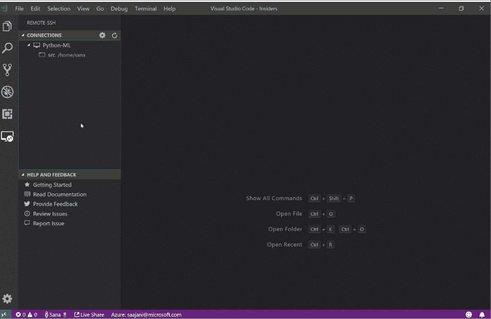
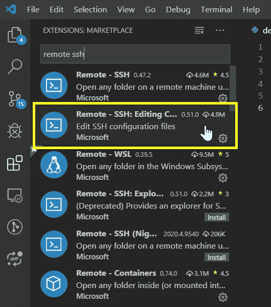
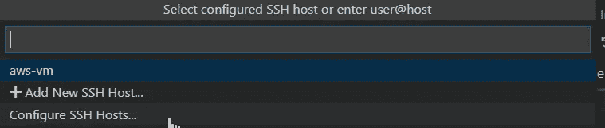
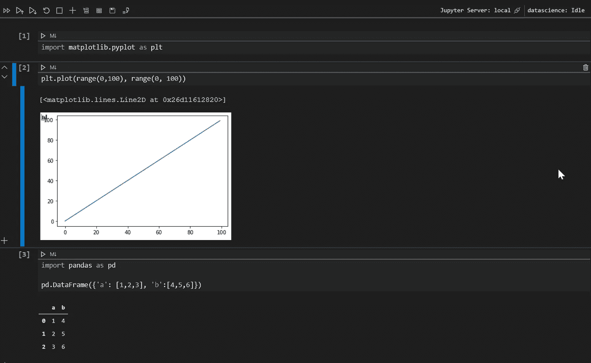
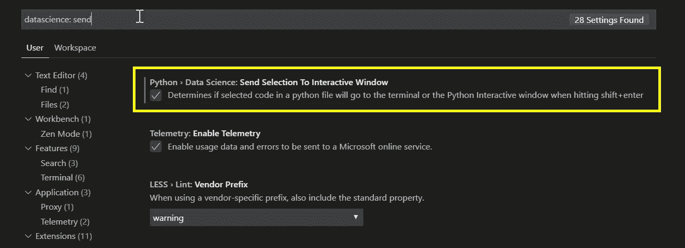
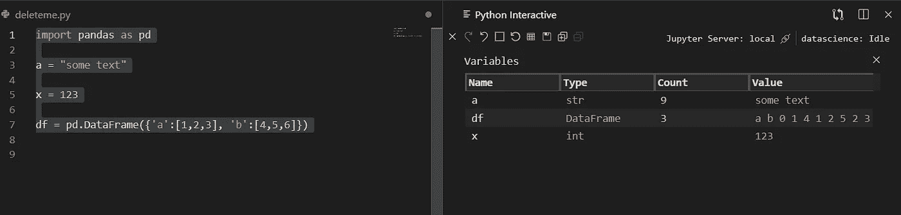
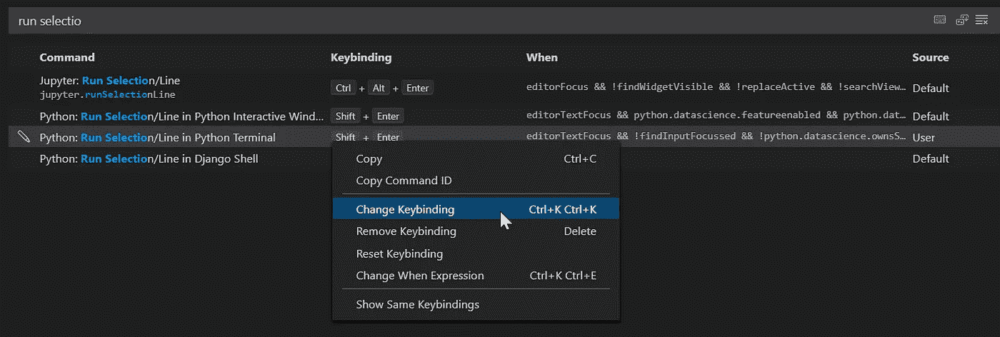
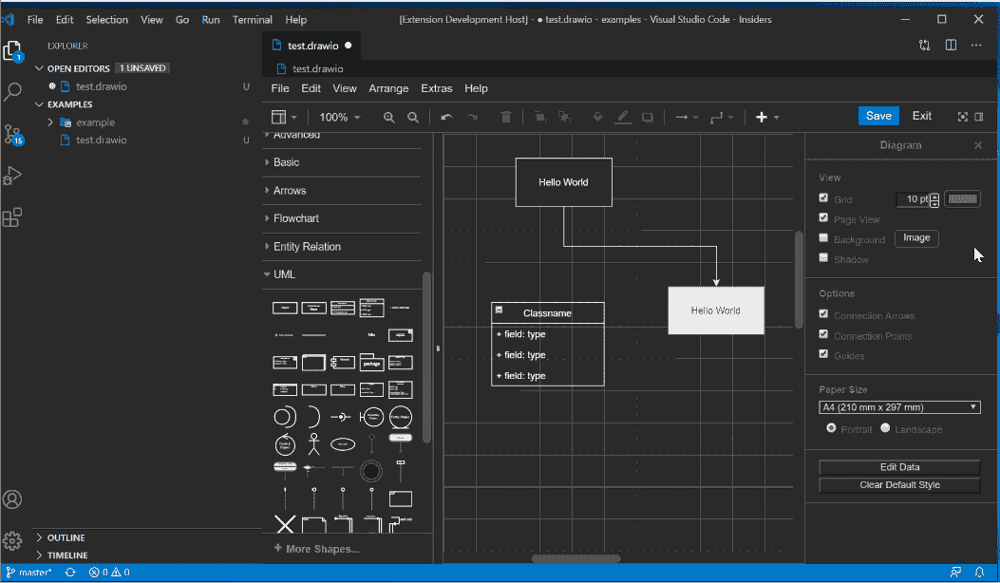

# VSCode for Python:终极编辑器？

> 原文：<https://levelup.gitconnected.com/vscode-for-python-the-ultimate-editor-669dd7cadb3c>

## 我试过 Visual Studio 代码。这是我的外卖。

由 [Alexander Sinn](https://unsplash.com/@swimstaralex?utm_source=medium&utm_medium=referral) 在 [Unsplash](https://unsplash.com?utm_source=medium&utm_medium=referral) 上拍摄的照片

谈到 python，我总是使用 PyCharm、Spyder 和 Jupyter 的组合。PyCharm，因为它是严肃项目的严肃 IDE。Spyder，因为我喜欢变量浏览器和逐行运行代码的能力。还有 Jupyter 笔记本，因为…我真的要解释吗？

我最近决定尝试一下 VSCode。最初，我被 VSCode 吸引的原因是:

# 远程编码

我在一台 windows 笔记本电脑上工作，一些 python 包不能在这个操作系统上工作(例如 [Ray](https://docs.ray.io/en/master/) )。我试过 Linux 的 Windows 子系统之类的，没什么成功。因此，当我必须在 Unix 上工作时，我会在 AWS 上创建一个微实例并在那里编码。

以前我有两种选择:用 Vim 在远程机器上编码，或者在本地编码并通过 git 同步。这两个选项都不错，但是有点复杂，所以我开始考虑是否可以从本地 IDE 编辑远程代码文件。

事实证明，这是可能的。PyCharm 支持，但仅限于专业版！然后我了解到 VSCode 用 [Remote — SSH 扩展](https://marketplace.visualstudio.com/items?itemName=ms-vscode-remote.remote-ssh)支持它。

您可以从上面的链接或直接从 VSCode 安装该扩展:

安装完成后，您可以通过按下 **Ctrl+Shift+P** 打开命令栏并键入`remote ssh`来连接到远程主机。选择`Remote-SSH: Connect to Host...`,在那里，您应该首先配置您的 SSH 主机:

重复上述步骤后，您将在列表中看到您的主机。

我爱上 VSCode 的第二个原因是:

# 盒子里的 Jupyter(和 Spyder)

在原型模式下，我总是在 Jupyter 上。这很好，只是这意味着从 IDE 切换到命令行(启动 Jupyter)到笔记本本身。

使用 VSCode，我可以在编辑器中打开任何笔记本(打开任何文件的快捷键是 **Ctrl+P** )，它看起来非常漂亮:

笔记本的行为完全符合预期，并且所有典型的键盘快捷键都按预期工作( **Ctrl+Enter** 运行单元格， **a** 和 **b** 运行单元格上方/下方，等等)。).

不仅如此，还可以模仿 Spyder 的功能，将任何 python 脚本中的行发送到交互式 python 窗口。键盘快捷键是 **Shift+Enter** ，但是默认情况下，这会将选中的行发送到常规终端。要改为重定向到 IPython，我们需要对其进行配置:按 **Ctrl+，**打开设置，然后搜索:`datascience: send`，勾选“发送选择到交互窗口”复选框。

顶部的樱桃:我们有一个可变的浏览器！！

我仍然喜欢有发送到终端的选项，所以为了重新映射键盘快捷键，我按下 **Ctrl+K Ctrl+S，**搜索**运行选择**，然后从那里更改键绑定:

# 这么多其他的好东西

VSCode 的扩展市场简直令人惊叹。我将在这里提到几个突出的例子:

*   draw.io:我是这个在线流程图制作工具的粉丝，它现在可以从 VSCode 中获得。多酷啊。！

*   markdown:不需要扩展，这是现成的支持。只需打开或编辑一个. md 文件，瞧！我喜欢一边打字一边预览输出，所以用 **Ctrl+K V** 打开并排实时预览。
*   vim:如果你是 vim 的粉丝(如果你不是，你就错过了)，你会对这个扩展[感到高兴。](https://marketplace.visualstudio.com/items?itemName=vscodevim.vim)
*   Python Docstring 生成器:您可以猜猜它是做什么的。下面是安装它的[链接](https://marketplace.visualstudio.com/items?itemName=njpwerner.autodocstring)。

# 裁决

抱歉，PyCharm，你要被卸载了😘。