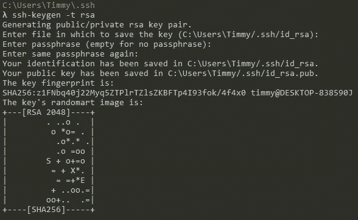
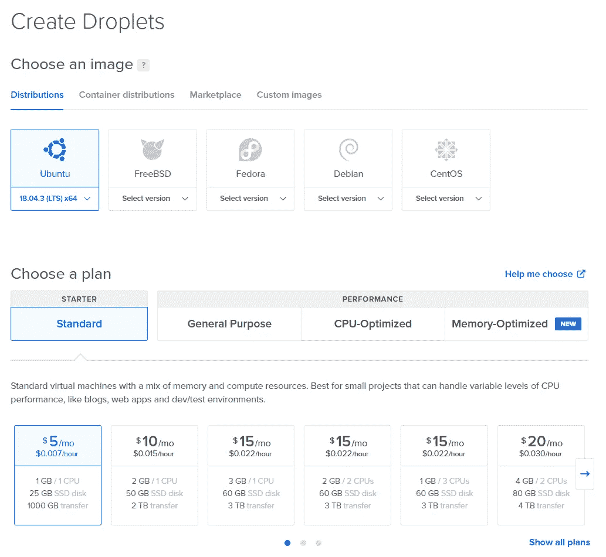
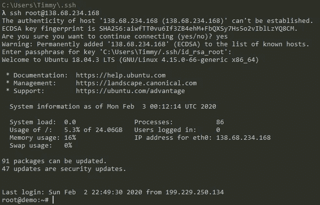
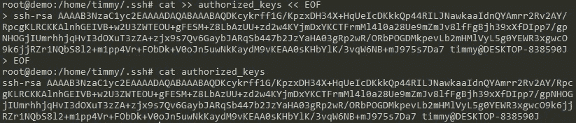
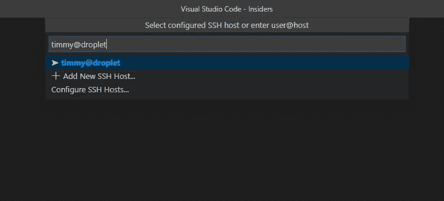

# 基于数字海洋的 VSCode 远程开发

> 原文：<https://levelup.gitconnected.com/vscode-remote-development-with-digital-ocean-a875cab79f25>


什么是远程开发，为什么它越来越受开发人员的欢迎？

如果你和我一样，讨厌新 Macbooks 自带的触摸条(物理退出键被低估)，并且你使用的是旧型号，有时在本地进行开发会把你的电脑变成一个由喷气发动机驱动的空间加热器。这不是一个有趣的体验，而且可能对你的电脑也不好。

或者也许你像我一样，你有一台 Windows 机器，你想用它来进行开发，但你真的不想让所有东西都与 Windows 兼容，因为你阅读的每个教程都是为*nix (Linux，Mac)编写的。

进入远程开发——在云中的机器上进行开发，这样您在本地做的唯一事情就是运行文本编辑器和 bash。即使是最古老的计算机也应该能够毫不费力地做到这一点。

在远程机器上开发有很多优点和缺点，但是为了简洁起见，这里以列表的形式列出了一些:

远程开发的优点:

*   从任何计算机重新连接到同一工作空间
*   机器的资源仅用于满足您的开发需求
*   你的电脑粉丝不会为了处理你的代码/服务器/模拟/等等而过度兴奋
*   机器始终处于运行状态(无论本地计算机的状态如何，您运行的任何服务仍在运行)
*   轻松拆卸或安装新机器
*   您的服务通常在互联网上托管/公开

远程开发的缺点:

*   需要稳定的互联网连接
*   这(通常)要花钱
*   与底层机器的交互需要命令行知识(如果您习惯使用 bash，这可能是专业的)
*   您的服务通常在互联网上托管/公开

# 设置

开始之前，您应该:

*   创建一个数字海洋账户(在[注册此链接](https://m.do.co/c/e03008829614)，在 60 天内获得 100 美元的信用点数)
*   下载并安装 [VSCode Insiders](https://code.visualstudio.com/insiders/) ，它允许你测试更新的特性。与稳定版本不冲突。

# 设置数字海洋水滴

通过创建一个数字海洋水滴，我们正在租用在线服务器空间，这将产生一些费用。在撰写本文时，最便宜的 droplet 配备了 1GB RAM、1 个 CPU、25GB 磁盘空间(SSD)，每月费用为 5 美元。Droplet 的费用是根据你拥有它的时间长短按比例分配的，所以如果你启动这个 droplet 并在一周后删除它，它只会花费你一美元和零钱。只要知道液滴即使不被使用也会产生费用——如果你不想为一滴而被收费，你必须销毁它。

在我们创建 droplet 之前，我们需要一个 SSH 密钥。如果你已经有了一个可以用于这个目的的键，跳到“创建水滴”

## 生成新的 SSH 密钥

您将需要一个 SSH 密钥来使用 VSCode Insiders 进行远程开发，这是从整体上访问您的远程机器的推荐方法。Digital ocean 有一些关于生成 SSH 密钥的好文档，网上甚至有更多的资源，但是 TL；博士是:

1.  打开你的外壳:终端(Mac)或类似 Windows 的 [Cmdr](https://cmder.net/)
2.  输入`ssh-keygen -t rsa`
3.  按 enter 键使用默认的文件路径，或者选择一个新的路径(如果您不熟悉这个，建议使用默认路径)
4.  输入密码短语(两次)



就这样，你得到了两个新文件，可能叫做`id_rsa`和`id_rsa.pub`。前者是您的私钥—不要与任何人共享该文件的内容。如果您需要复习一下公钥加密是如何工作的，[这里有一篇简短的 Cloudflare 文章](https://www.cloudflare.com/learning/ssl/how-does-public-key-encryption-work/)。

## 创建液滴

首先，在你的数字海洋仪表盘上，点击“创建”->“水滴”或者直接点击“创建水滴”。

确保选择 Ubuntu v18，选择首选的大小和价格(如果您只是尝试一下，我们建议您选择最小类型的 Droplet)，并选择离您最近的数据中心区域。



在 Authentication 下，点击“New SSH Key”，粘贴你的公钥(你的`id_rsa.pub`文件的内容)，给它一个名字，点击“Add SSH Key”。数字海洋会验证密钥，所以如果你忘记复制一个字符或什么的，它会让你知道。

在主机名下，为 droplet 命名。最好是简单的。为了这篇文章的目的，我将命名我的`demo`。

就是这样！点击“创建液滴”按钮，让魔法展开。

# 第一次连接到水滴

获取 droplet 的 IP 地址，并在您的 shell 中运行以下命令(不带尖括号):

```
ssh root@<droplet's IP address>
```

你会得到一些关于你的计算机不确定主机是否是它应该是谁的信息。这将发生在你第一次连接任何东西的任何时候。在这里说“是”，然后输入您的密码短语(如果您设置了密码短语的话)。



我们可能不应该以 root 用户的身份做任何事情，所以让我们为将来的 ssh 登录创建一个新用户:

## 创建新用户

1.  通过运行`sudo adduser <username>`创建新用户，例如`sudo adduser timmy`创建一个名为`timmy`的用户
2.  浏览创建用户的流程
3.  键入`exit`返回到您的本地机器

## 为新用户创建 SSH 密钥

1.  运行`mv id_rsa id_rsa_root;mv id_rsa.pub id_rsa_root.pub`重命名之前生成的密钥
2.  在您的本地机器上，运行`ssh-keygen -t rsa`并完成动作。除非你真的关心你的 droplet 的安全，否则你不需要在这个上面设置密码
3.  在您制作密钥的文件夹中(通常是用户主文件夹中的目录`.ssh`，编辑`config`文件，或者创建一个不存在的文件。该文件没有扩展名。
4.  粘贴以下内容(不带`<>` s，`username`是您在远程机器上创建的用户名):

```
Host droplet
    HostName <ip address>
    User root
    IdentityFile ~/.ssh/id_rsa_root
Host droplet
    HostName <ip address>
    User <username>
    IdentityFile ~/.ssh/id_rsa
```

这将允许您使用`droplet`代替 IP 地址。在您的 shell 中，只需使用`ssh root@droplet`以 root 用户身份登录。

如果您尝试过，您可能会注意到运行`ssh username@droplet`不起作用。这是因为新用户没有任何被列为授权的 SSH 密钥。

要解决这个问题，请在您的远程计算机上运行以下命令:

```
cd /home/<username>
mkdir .ssh
touch .ssh/authorized_keys
```

现在是棘手的部分。如果您愿意使用 vim 或 emacs 将您的公钥粘贴到`authorized_keys`中，那么就这样做。否则，您可以在没有任何终端编辑器的情况下这样做:

仍然在您的新用户的远程机器`.ssh`目录中，键入以下内容:`cat >> authorized_keys << EOF`并按回车键。

粘贴您的公钥。

键入`EOF`并按回车键。

作为健全性检查，键入`cat authorized_keys`并按 enter，您应该看到您的公钥被打印到终端上。



您现在可以通过`ssh <username>@droplet`以您的用户身份登录`exit`！

# 设置 VSCode 远程开发

现在是有趣的部分——发布 VSCode Insiders。

应该已经安装了“Remote — SSH”扩展。如果没有，请在扩展选项卡中安装它。

按 Ctrl+Shift+P (Windows)或 Cmd+Shift+P (Mac)调出编辑器命令面板，找到/选择“Remote — SSH: Connect to Host”。

输入`<username>@droplet`并按回车键。



应该会出现一个新窗口，左下角显示绿色的“SSH: droplet”。

就是这样！您的 VSCode 现在可以打开/编辑远程机器上的文件了！再次打开编辑器命令调板，找到“终端:创建新的集成终端”在编辑器中打开一个终端。

请随时留下您的任何反馈或问题！

*别担心，为创建本教程而生成的任何键或液滴都将不复存在。*