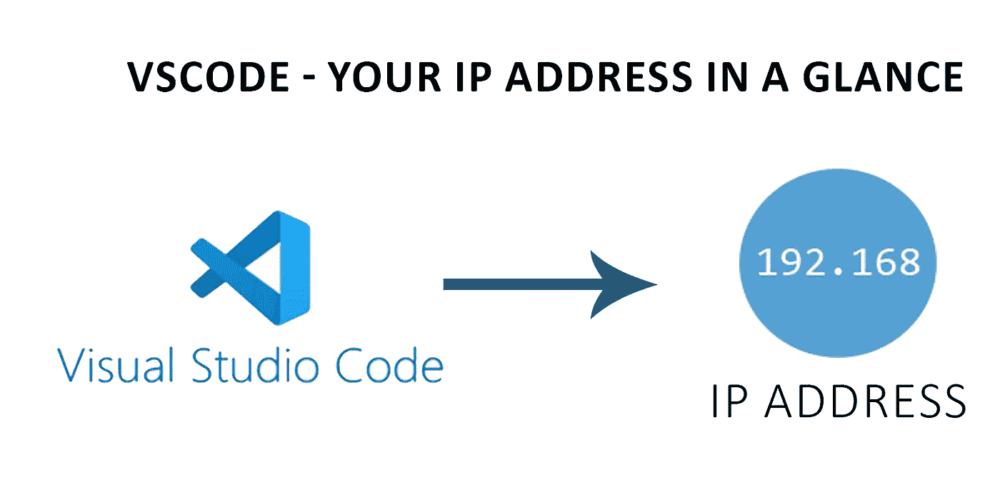
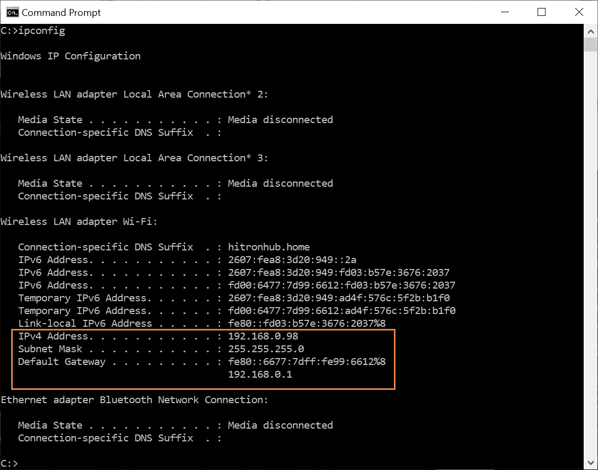
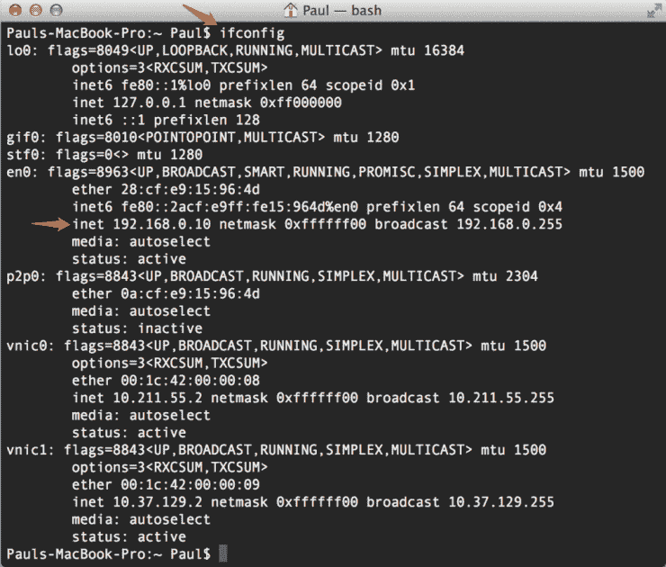
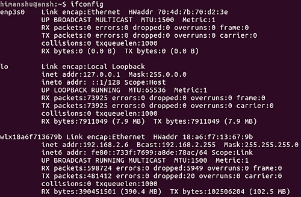
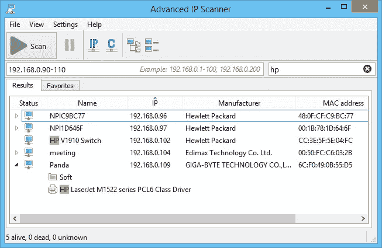
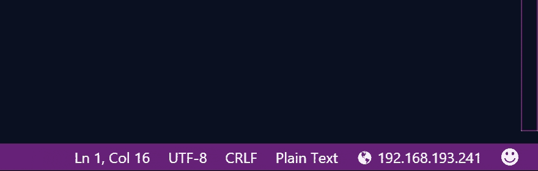
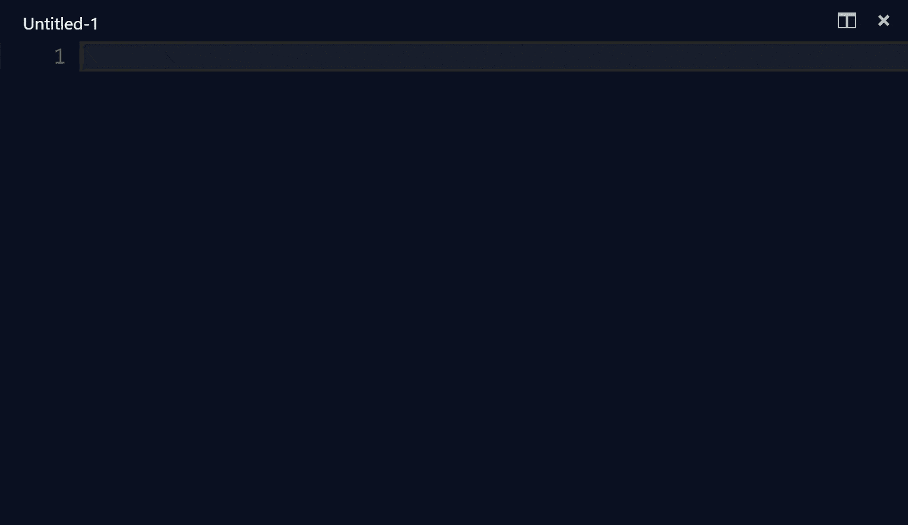

# vs code-您的 IP 地址一览

> 原文：<https://levelup.gitconnected.com/vscode-your-ip-address-in-a-glance-4992d22b5c8e>

只需单击一下，即可在 VSCode 状态栏中显示 IP 地址。

**获取 VSCode 中 IP 地址的描述**

# 问题陈述

**时间就是金钱**

当您在 Visual Studio 代码 IDE 中工作时，有时会需要您所工作的计算机上的 IP 地址。根据你的操作系统，打开浏览器太麻烦了；在互联网上搜索会显示一长串 IP 地址的相关命令，并最终挑选出您需要的一个。

此外，如果 IP 地址不是静态的，手动重复这个过程是一件令人沮丧的工作。作为一名开发人员，您不希望整天兜圈子，浪费宝贵的时间。

# 我们通常采用的解决方案

## 对于 MICROSOFT WINDOWS

如果你的机器运行在微软视窗操作系统上，你可以打开命令提示符并输入“ipconfig ”,它会给出一个详细的结果，如下所示。

【来源:】[**ipconfig-highlighted.png(1128×886)【meridianoutpost.com】**](https://www.meridianoutpost.com/resources/articles/command-line/images/ipconfig-highlighted.png)

## 对于 MAC OS

如果你在 Macintosh 笔记本上工作，你可以在终端中输入“ifconfig ”,产生一个综合的输出，如下图所示。

**来源:**[**Ipconfig Mac OS X | egeek**](https://egeek.io/ipconfig-mac-os-x/)

## 对于 LINUX 操作系统

如果您使用基于 Linux 的操作系统，您将导航到 bash 终端，键入' ifconfig ',并产生如下图所示的输出。

**来源:**[**ifconfig-basic.png(500×328)【howtoforge.com】**](https://www.howtoforge.com/images/command-tutorial/ifconfig-basic.png)

## 第三方软件

如果你是一个专家，你会用任何编程语言写一个脚本或者一些 shell 脚本来触发并给你 IP 地址。

**获取 IP 地址的 Python 脚本**

如果你害怕编程，你会希望坚持使用简单的用户界面、在线网站或第三方软件为你工作。以下是几个例子:

**来源:**[**https://whatismyipaddress.com/**](https://whatismyipaddress.com/)

**来源:**[**main.png(653×425)【advanced-ip-scanner.com】**](https://www.advanced-ip-scanner.com/images/aips/screenshots/25/en/main.png)

# VSCODE 提供了什么

Visual Studio 代码是一个免费的、轻量级的跨平台工具，它为开发人员提供了一个健壮的环境来轻松地执行编程任务。它的一个显著特点是，它允许通过安装来自 VSCode Marketplace 的扩展来实现广泛的功能。

此时此刻，我也想分享一下我的问题。为了在物理设备上运行 firebase 本地仿真器套件，我需要我的笔记本电脑的主 IP 地址。手动打开终端并获取 IP 地址是一项相当浪费时间的工作；特别是如果我失去了互联网连接，我将需要重做同样的流程了。

感谢 [Compulim](https://marketplace.visualstudio.com/publishers/Compulim) 发布 [IP 地址](https://marketplace.visualstudio.com/items?itemName=Compulim.vscode-ipaddress&ssr=false#overview)扩展；现在，只需一眨眼的时间，我就可以在 VSCode 状态栏上看到我想要的 IP 地址。

【raw.githubusercontent.com】来源:[**demo-status-bar . gif(880×280)**](https://raw.githubusercontent.com/compulim/vscode-ipaddress/master/demo-status-bar.gif)

我甚至可以从命令调板菜单插入 IP 地址(按 F1 或 ctrl+shift+P 或 cmd+shift+P)；见下图。

**来源:**[**demo-insert . gif(1384×800)(raw.githubusercontent.com)**](https://raw.githubusercontent.com/compulim/vscode-ipaddress/master/demo-insert.gif)

# 结论

作为一名开发人员，我会说这是一个完美的解决方案，节省了我的宝贵时间，我希望它能为您节省时间。如果你喜欢这篇文章，请不要按任何按钮；按 50 次。

# 分级编码

感谢您成为我们社区的一员！[订阅我们的 YouTube 频道](https://www.youtube.com/channel/UC3v9kBR_ab4UHXXdknz8Fbg?sub_confirmation=1)或者加入 [**Skilled.dev 编码面试课程**](https://skilled.dev/) 。

 [## 编写面试问题+获得开发工作

### 掌握编码面试的过程

技术开发](https://skilled.dev)