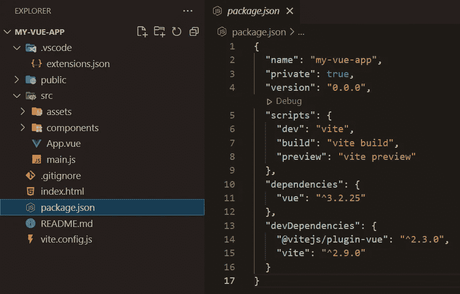
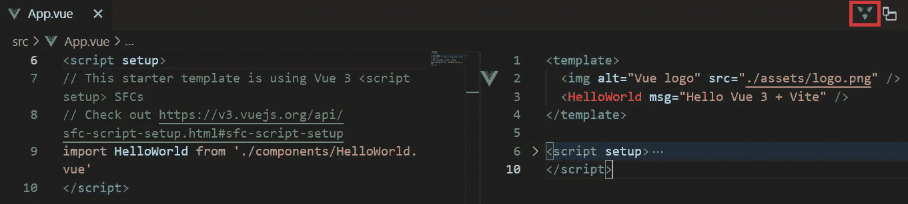

# 带有 Vite 和顺风 CSS 的 Vue 3 组合

> 原文：<https://levelup.gitconnected.com/vue-3-composition-with-vite-and-tailwind-css-221358b4d7b5>


上个月开始学习 Vue 3。当前版本是 3.2.31。在你使用 Vue 之前，请先学习 HTML、CSS 和 JavaScript 的基础知识。

# 设置

我使用的是 Visual Studio 代码。它是免费的，并有许多扩展，使您的 Vue 开发更容易。下面是我的**扩展。json** 推荐的扩展

```
{
  "recommendations": [
    "johnsoncodehk.volar",
    "bradlc.vscode-tailwindcss",
    "dbaeumer.vscode-eslint",
    "esbenp.prettier-vscode",
    "sdras.vue-vscode-snippets",
    "EditorConfig.EditorConfig"
  ]
}
```

还可以查看 Jonas Schmedtmann 以获得更多扩展。他在 HTML、CSS 和 JavaScript 方面的课程是一流的。

[](https://github.com/jonasschmedtmann/html-css-course/blob/master/vscode-setup.md) [## 主网站上的 html-CSS-course/vs code-setup . MD/html-CSS-course

### 我会在课程的第一部分，在讲座中展示如何用这些主题、扩展和设置来设置 VS 代码…

github.com](https://github.com/jonasschmedtmann/html-css-course/blob/master/vscode-setup.md) 

## 用 Vite 创建 Vue 项目

来自 Vite 网站

> Vite 是一个构建工具，旨在为现代 web 项目提供更快、更精简的开发体验。

在本教程中，我使用的是 Node.js v16.14.2

安装 Node.js 后，在命令提示符下运行以下命令。您将得到两个提示。为两者选择 vue。

```
λ npm create vite my-vue-app
Need to install the following packages:
  create-vite
Ok to proceed? (y) y
√ Select a framework: » vue
√ Select a variant: » vue
```

一旦你安装了它，这就是你的工作空间的样子



在顶部菜单上，单击运行>添加配置。点击 Chrome。这将在**中创建一个 **launch.json** 文件。vscode**

```
{
  "version": "0.2.0",
  "configurations": [
    {
      "name": "Launch Chrome",
      "request": "launch",
      "type": "pwa-chrome",
      "url": "[http://localhost:3000](http://localhost:3000)",
      "webRoot": "${workspaceFolder}"
    }
  ]
}
```

你现在可以在 Chrome 运行时调试你的代码了。

## 安装顺风 CSS

看下面的指南来安装 Tailwind CSS。

[](https://tailwindcss.com/docs/guides/vite) [## 安装带 Vue 3 的顺风 CSS 和 Vite - Tailwind CSS

### 顺风 CSS 框架的文档。

tailwindcss.com](https://tailwindcss.com/docs/guides/vite) 

虽然编写多个类看起来很混乱，比如

```
<div class="grid justify-items-center gap-4 py-12">
```

我喜欢 html 内部的样式，这样你就可以马上看到你的元素看起来是什么样子。您不再需要跟踪您的类名。

也有一个不和谐的服务器，为任何问题，你可能有

[](https://tailwindcss.com/discord) [## 加入顺风 CSS Discord 服务器！

### 查看 Discord 上的顺风 CSS 社区-与 25，190 名其他成员一起玩，享受免费语音和文本…

tailwindcss.com](https://tailwindcss.com/discord) 

## 埃斯林特和更漂亮

我还安装了以下代码样式

*   埃斯林特
*   eslint-config-appeller
*   eslint-插件-更漂亮
*   eslint-plugin-vue
*   较美丽
*   更漂亮的插件

 [## 用户指南| eslint-plugin-vue

### Via vue-cli(推荐):vue add @ vue/CLI-plugin-eslint NPM install-save-dev eslint eslint-plugin-vue 要求…

eslint.vuejs.org](https://eslint.vuejs.org/user-guide/#faq) 

下面是我的 **.eslintrc.js**

```
module.exports = {
  env: {
    browser: true,
    es2021: true,
    'vue/setup-compiler-macros': true,
  },
  extends: ['eslint:recommended', 'plugin:vue/vue3-recommended', 'prettier'],
  parser: 'vue-eslint-parser',
  parserOptions: {
    ecmaVersion: 'latest',
    sourceType: 'module',
  },
  plugins: ['vue', 'prettier'],
  rules: { 'prettier/prettier': ['warn'] },
};
```

这是我的**。prettierrc**

```
{
  "trailingComma": "es5",
  "tabWidth": 2,
  "semi": true,
  "singleQuote": true
}
```

## 手掌的

在屏幕的右上角，您可以将模板(html)代码与 javascript 代码分开



## Windows 的可选设置

我使用 EditorConfig 来确保我在 Windows 上的新行默认为 Unix。如果这是一个单独的项目，它是可选的。但是，如果您使用的是 Mac/Linux

这就是我的**。editorconfig** 看起来像。将它放在项目的根目录中

```
root = true[*]
end_of_line = lf
```

还要更改您的 git 设置。在命令提示符下运行以下命令。

```
git config --global core.eol lf
git config --global core.autocrlf input
```

最后，这里是添加到您的 **settings.json** 文件中的内容。按 ctrl-shift-p 并键入开放设置(JSON)

```
{
...
// If running on windows
  "files.eol": "\n"
}
```