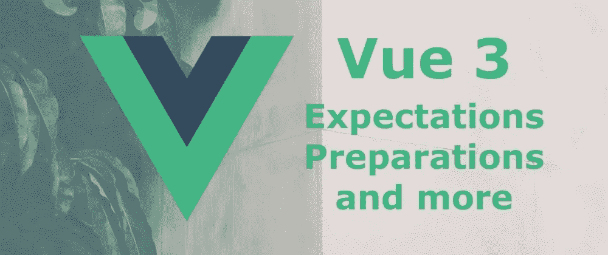
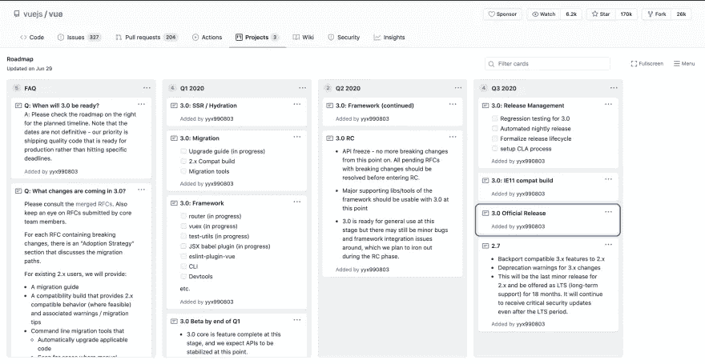

# Vue 3 即将到来—期待什么以及如何准备

> 原文：<https://levelup.gitconnected.com/vue-3-is-coming-what-to-expect-and-how-to-prepare-dbf35c67c52d>

有很多关于 Vue 3 即将发布的传言。这让我想帮助开发者社区为这个流行框架的下一个版本做好准备。希望你会发现这篇文章对❤️有用

**在这篇文章中，我将讲述以下主题:**

*   为什么 Vue 3 如此激动人心
*   Vue 3 的功能和变化
*   发布日期说明
*   实验 Vue 3:可用的重要工具
*   如何准备从 Vue 2 迁移
*   学习 Vue 3 —教程和指南
*   常见问题

开始吧！🚀

# Vue 3 会很棒的

Vue 的受欢迎程度越来越高，随着每次更新，这个项目变得更快更好。[尤雨溪](https://twitter.com/youyuxi)于 2018 年 11 月 15 日在伦敦的一次会议上公布了新的 Vue 版本。Vue 3 的主要焦点是**让它更快、更舒适地瞄准原生用户&甚至更加用户友好**。

除此之外，还有一个新的用于创建组件的组合 API。它没有向 Vue 引入新概念，而是公开了 Vue 的核心功能，如作为独立功能创建和观察反应状态。这对所有级别的 Vue 开发人员都非常有用。

简单地说，Vue 团队正在做一项密集的工作来改进框架 API，以使 Vue 3:

*   **更快**
*   **变小**
*   **更易维护**
*   **更容易瞄准本地人**
*   **改善开发者体验**

等不及发布了？你可以开始尝试 Vue 3 的 [alpha 版本。还有一个初始的](https://github.com/vuejs/vue-next) [API 引用](https://vue-composition-api-rfc.netlify.com/api.html#setup)。

# Vue 3 的功能和变化

## 对 Vue 3 有什么期待—概述

*   合成 API :这个新的 API 提醒了 React 钩子一点。这是一种新的语法，允许您使用函数按特性而不是按对象组织代码。该 API 将与 Vue 2 中众所周知的选项 API 共存，但不会取代它。这意味着您可以继续以您习惯的方式构建组件，而不必担心。但是，您也可以开始使用 Composition API 进行构建，它提供了更灵活的代码组织和逻辑重用能力以及其他改进。
*   类型脚本支持:web 开发中最令人期待的集成之一。Vue 3 将有内置的 TypeScript，并允许您在项目中随意使用 TS。反正和 ES 合作的开发者不会受到影响。
*   **更快的安装和修补速度**:虚拟 DOM 为了更快的性能进行了完全重写。添加了编译时提示以减少运行时开销。它将帮助你跳过不必要的条件分支，避免重新渲染。组件实例初始化速度提高了一倍，内存使用量减少了一半。真贴心。
*   **查看声明** : Vue 3 将继续支持模板以及渲染功能。主要的一点是 Vue 3 优化了渲染速度，例如通过加速在幕后运行的“diff”算法，以便 Vue 知道什么需要重新渲染而不受干扰。
*   **它要小得多**:你将能够快速摆脱不用的代码。当前缩小和压缩的 Vue 运行时重量约为 20kB(当前 2.6.10 版本为 22.8kB)。Vue 3 bundle 估计重一半左右，也就是大约~10kB！
*   原生传送门:现在叫做传送
*   **片段**:不会在 DOM 树中渲染的虚拟元素。
*   **钩子 API** (仍在实验中)
*   **时间分片支持**(仍在实验中)

## 关于 Vue 3 即将推出的功能的更多信息

我们不想用描述淹没你。那里有大量的帖子，我们只挑选了那些既有**技术性、专业性又包含实际例子的**:

*   [过程:由](https://increment.com/frontend/making-vue-3/)[尤雨溪](https://twitter.com/youyuxi)制作 Vue 3 。Vue 的创作者 2020 年 5 月的最新故事。
*   [令人兴奋的 Vue 3 新特性](https://vueschool.io/articles/vuejs-tutorials/exciting-new-features-in-vue-3/)作者[菲利普·拉科夫斯基](https://twitter.com/filrakowski)
*   [Vue 3 新特性总结](https://dev.to/daiyanze/vue-3-new-features-summary-2cie)作者[严泽戴](https://dev.to/daiyanze)

# 发布日期说明

正式版本目前计划在 2020 年第三季度发布(从现在到 2020 年 9 月 30 日)。该信息基于 Vue 3 大型项目的[官方路线图](https://github.com/vuejs/vue/projects/6)。

GitHub 官方路线图截图

## 对发布日期保持乐观的理由🤩

*   已经在发布候选(RC)阶段了，是[公开宣布的](https://github.com/vuejs/rfcs/issues/189)！**这意味着 API &的实现是稳定的**，不会再有任何改动。在这个阶段，他们正在开发一个“兼容版本”:一个包含 2.x API 兼容层的 3.0 版本。该版本还附带了一个标志，您可以打开该标志，针对应用程序中 2.x API 的使用发出不赞成使用的警告。尽管尤雨溪的第一次估计是在 2019 年，但他们已经达到了如此先进的阶段，这提供了一个理由相信他们非常有动力在 2020 年内发射。
*   许多用于 Vue 3 的**最重要的工具已经处于实验阶段**或公共 alpha 阶段(我将在下面详细介绍它们)。
*   **Vue 3****的** [**文档和一个**](https://v3.vuejs.org/) [**迁移指南**](https://v3.vuejs.org/guide/migration/introduction.html) **已经发布**，向您解释新增内容。两者都还在测试阶段，但已经相当完整了(可读性很强，结构良好，就像 Vue 文档一直以来的那样)。

## 质疑发布日期的理由😒

*   现阶段我觉得还是半信半疑的拿这个日期(2020 年第三季度)比较好。即将发布的 Vue 3 是很久以前[宣布的](https://medium.com/the-vue-point/plans-for-the-next-iteration-of-vue-js-777ffea6fabf)2018 年，发布日期早已被多次推迟。
*   此外，路线图的最后一次更新是在 6 月 29 日。从那以后可能发生了许多事情，这些事情可能会影响发布日期。

如果你想了解官方公布的细节，请查看 2020 年 4 月 Vue 的[状态的完整演示，并关注](https://docs.google.com/presentation/d/1LHp-8hEtXEMSE1fd6YLAhYmtndQelQKbWlGggZKe4y8/preview)[最近的变化](https://github.com/vuejs/rfcs/pulls?q=is%3Apr+is%3Amerged+label%3A3.x)。

# 实验 Vue 3:可用的重要工具

*   Composition API 现在可以作为 Vue 2 的[插件获得，所以你可以尝试一下。](https://github.com/vuejs/composition-api)
*   新 [Vue Devtools](https://github.com/vuejs/vue-devtools/releases/tag/v6.0.0-beta.1) 的测试版
*   Vue 3 官方[路由器](https://github.com/vuejs/vue-router-next)
*   即将发布的 Vue 3 版本的 Vue CLI [插件](https://github.com/vuejs/vue-cli-plugin-vue-next)
*   Vue 3 版本的 [Vue 测试工具](https://github.com/vuejs/vue-test-utils-next)

# 如何准备从 Vue 2 迁移

如果您的项目相对较小，并且您一直遵循 RFC 并避免被否决的功能，这个过程应该会非常快！。无论如何，最好的方法是从查看[迁移指南](https://v3.vuejs.org/guide/migration/introduction.html#overview)开始。请注意，迁移指南仍处于测试阶段，随着 Vue 3 正式发布，您应该会很快看到变化。

# 学习 Vue 3 —教程和指南

*   学习 Vue 3 的好课程由 [Vue Mastery](https://www.vuemastery.com/courses-path/vue3/) 提供:推荐给已经有 Vue 知识的高级开发人员。
*   [Vue 3 中的新特性](https://codecourse.com/courses/new-in-vue-3):Vue 3 中新特性的总结，包括对组合 API 的深入研究和大量实际例子。
*   [Vue 3 教程(针对 Vue 2 用户)](https://vuejsdevelopers.com/2020/03/16/vue-js-tutorial/):涵盖了 Vue 3 的许多新东西，包括片段、传送、合成 API 和几个更模糊的变化。
*   [来自 Vue.js Amsterdam 2020 的组合 API 最佳实践讲座](https://www.youtube.com/watch?v=6D58SI9P-aU&)
*   [你好 Vue 3:第一次看 Vue 3 &合成 API](https://www.youtube.com/watch?v=UAgO2JanN9Y&) :在这个由 [Dan Vega](https://twitter.com/therealdanvega) 制作的视频中，你将会对 Vue 3 有一个初步的了解，并获得一些使用它的实践经验。

# 常见问题

## 我想学 Vue。我应该从 Vue 2 还是 Vue 3 开始？

如果你是刚开始学习框架，建议你从 Vue 2 开始。主要原因是 Vue 3 不涉及戏剧性的重新设计，你绝大部分的 Vue 2 知识还是会适用于 Vue 3。所以，等待 Vue 3 的正式发布日期是没有意义的。开始学习 Vue 2，一旦 Vue 3 发布，你将处于正确的位置赶上来。

## Vue 3 发布后 Vue 2.x 会有什么变化？

还会有一个次要版本(2.7)，将兼容的 3.x 特性反向移植到 2.x.
，并对 3.x 的改动提供弃用警告。这将是 2.x 的最后一个次要版本，将作为 LTS(长期支持)提供 18 个月。即使在 LTS 时期之后，它也将继续收到重要的安全更新。

## 我看到了一些对 Vue 3 的批评。有什么是我应该关心的吗？

事实上，在网络上(主要是在 Reddit 上)有一个活跃的讨论，提出了严重的担忧，但被证明是错误的。在这些担忧中，开发者声称 Vue 3 新的组合 API 可能不完全是附加的，并且 Vue 2 的当前 API 将被弃用。那些谣言导致人们害怕他们花在学习 Vue 上的时间完全是浪费时间。但是，这一切都无关紧要了。您可以放心，组合 API 将是纯添加性的，当前的 API 将继续得到支持。

# 包裹

目前就这些。我希望你能在这篇文章中找到有价值的资源，并对 Vue 3 有一个清晰的认识。有理由假设我们都应该期待更多的新闻即将到来，所以请确保您关注官方 Vue 新闻网站的更新。

*这篇客座博文是❤️与*[***daily . dev***](https://r.daily.dev/gitconnected)*合作，向*[*git connected*](https://levelup.gitconnected.com/)*社区发布的。daily.dev 在每个新标签页提供最好的节目新闻。它将为您排列数百个合格的来源，以便您可以侵入未来。*

