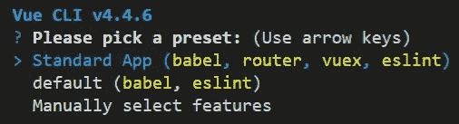
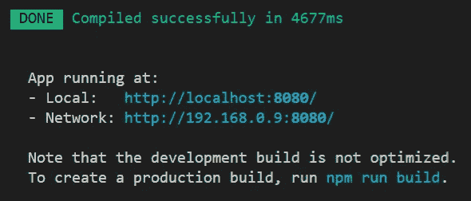
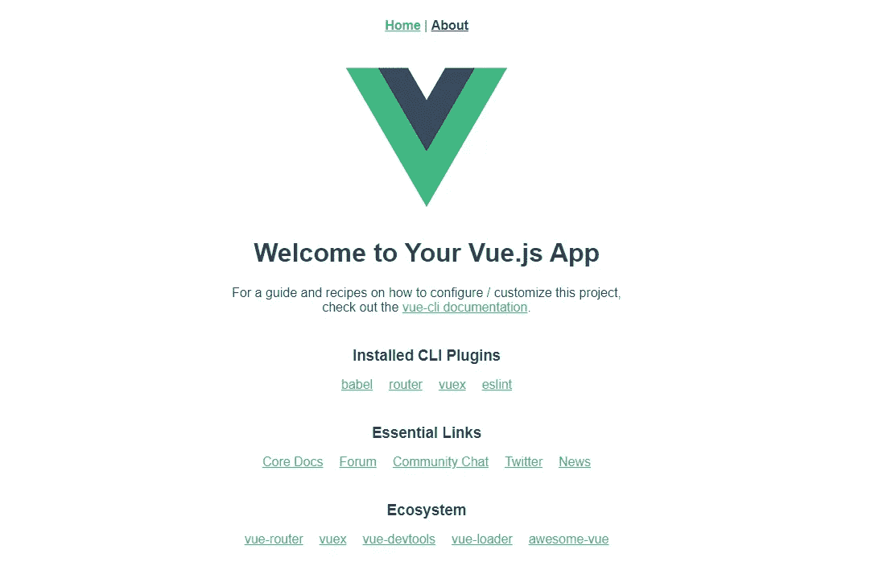
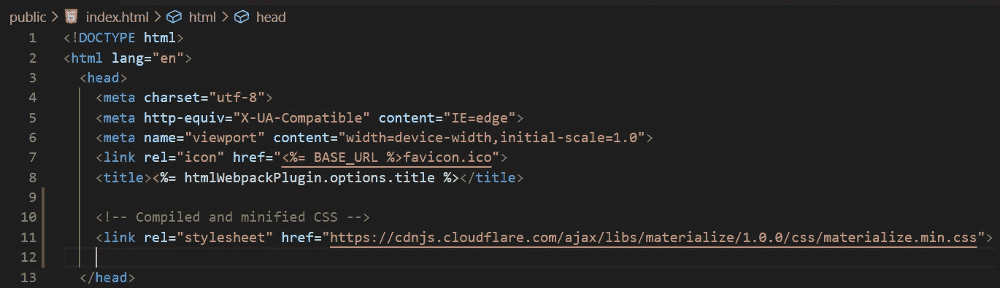
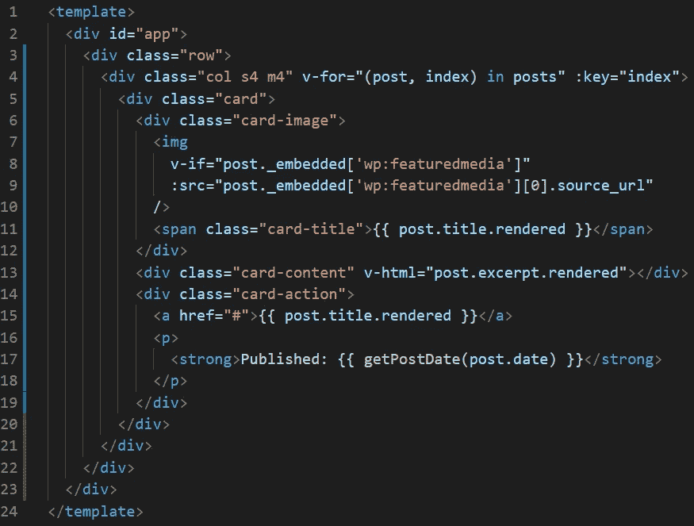
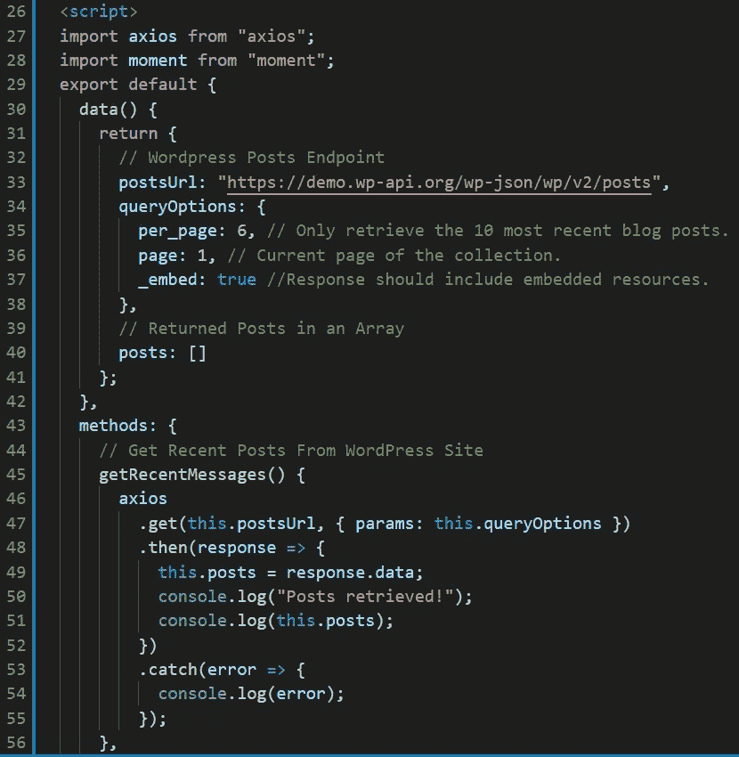
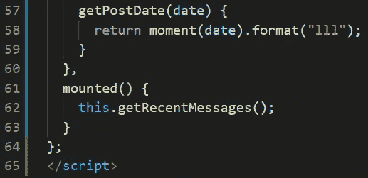
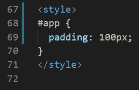
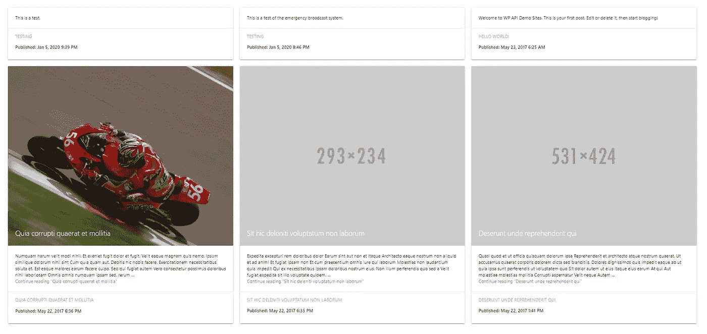

# Vue 和 WordPress——从你的 WordPress 站点轻松检索博客文章

> 原文：<https://levelup.gitconnected.com/vue-and-wordpres-easily-read-data-from-your-wordpress-site-82b46c6f964>

## 你的 Vue 和 WordPress 权威指南——第 1 部分

## 如何在 Vue 中从 WordPress 站点检索博客文章？Js 应用程序使用 WordPress Rest API 和 Axios


卢卡·布拉沃在 [Unsplash](https://unsplash.com?utm_source=medium&utm_medium=referral) 上的照片

我目前正在从事一个自由职业项目，涉及从 WordPress 网站检索帖子，并将其显示在自定义仪表板和 Android 及 iOS 应用程序上。到目前为止，这是一个有趣的项目，我想我会分享我使用 WordPress REST API 和 Vue 的经验。我很快会发表另一篇关于移动应用体验的文章！我还将在另一篇文章中讲述如何从 Vue 应用程序中创建新帖子。

# 如何使用 WordPress Rest API 检索文章

为了从 WordPress 站点读取数据，我们将使用已经内置在 WordPress 站点中的 API。WordPress REST API 为应用程序提供了一个接口，通过发送和接收作为 [JSON](https://en.wikipedia.org/wiki/JSON) (JavaScript 对象符号)对象的数据来与你的 WordPress 站点交互。要成功地使用这个 API，需要了解一些事情。

## 我的 API 端点在哪里？y

关于 WordPress REST API 端点的完整列表，请查看下面的链接。

[REST API 开发者端点参考](https://developer.wordpress.org/rest-api/reference/#rest-api-developer-endpoint-reference)

要从你的 WordPress 站点读取数据，你必须知道在哪里请求它。要从你的 WordPress 站点获取文章，你可以使用下面的端点。

你的网站 /wp-json/wp/v2/posts

对于本文，我们将使用 WordPress Rest API 文档中提供的示例站点。

[https://demo.wp-api.org](https://demo.wp-api.org/)

要从上面链接的站点中检索帖子，您的端点应该如下例所示:

[https://demo.wp-api.org/wp-json/wp/v2/posts](https://demo.wp-api.org/wp-json/wp/v2/posts)

上面的端点返回一个 JSON 对象，表示来自演示 WordPress 站点的帖子。如果你点击链接，你会看到原始数据。为了在 Vue 应用中处理这些数据，我们必须决定如何使用 WordPress REST API。

## Axios 来救援了！

Axios 是浏览器和 node.js 的 HTTP 客户端，下面我已经链接了 Github repo。

[](https://github.com/axios/axios) [## axios/axios

### 用于浏览器和 node.js - axios/axios 的基于 Promise 的 HTTP 客户端

github.com](https://github.com/axios/axios) 

有了 Axios，我可以向我的网站的 WordPress API 端点发出 GET 和 POST 请求。下面是从 WordPress 站点检索文章所需的所有代码的简单例子。

```
// Wordpress Posts Endpoint
postsUrl: “[https://demo.wp-api.org/wp-json/wp/v2/posts](https://demo.wp-api.org/wp-json/wp/v2/posts)",// Returned Posts in an Array
posts: [],queryOptions: {        
    per_page: 3, // Only retrieve the 3 most recent blog posts.
    page: 1, // Current page of the collection.
    _embed: true, //Response should include embedded resources.
},// Get Recent Posts From WordPress Site
getRecentBlogPosts() {
    axios
        .get(this.postsUrl, { params: this.queryOptions})
        .then(response => {
            this.posts= response.data;
        })
        .catch(error => {
            console.log(error);
        });
},
```

现在我们知道了 WordPress API 端点是什么，以及如何向它们发送请求。让我们创建一个简单的 Vue 应用程序，它可以从 WordPress 站点检索数据。

## **创建新项目**

让我们从创建一个新的 Vue 应用程序开始。如果你以前从未创建过 Vue 应用，我强烈推荐[这篇文章](https://code.visualstudio.com/docs/nodejs/vuejs-tutorial)来指导你如何设置你的开发环境。我将使用一个名为 [Visual Studio Code](https://code.visualstudio.com/) 的免费 IDE。

在我的终端中，我将键入以下内容，为我的项目创建一个名为 *VuePress* 的目录。我应该注意到我使用的是 Windows 操作系统。

```
mkdir VuePress
```

现在，我的项目目录已创建，我将进入该目录，并使用以下命令创建一个 Vue 应用程序:

```
cd VuePress
vue create vuepress
```

确保您的应用程序目录全部使用小写字母。

我目前正在使用 Vue CLI v4.4.6 来创建我的 Vue 应用程序。运行 *vue create* 命令后，我得到以下提示。我将选择标准应用程序，然后按回车键。



Vue CLI 预设选择

在我的 Vue 应用程序被创建后，我进入应用程序的目录，并键入一个命令在同一个目录中打开我的 IDE。

```
cd vuepress
code .
```

我现在可以在 Visual Studio 代码中打开一个终端，并通过键入以下命令来启动我的 Vue 应用程序:

```
npm run serve
```

如果一切顺利，您应该会看到下面的响应。您的本地网络地址可能与我的不同。



如果我打开我的网络浏览器并导航到本地或网络地址，我应该看到我新创建的 Vue 应用程序。



新鲜的 Vue 应用

我们唯一缺少的部分是轴。首先，我确保我在我的应用程序的目录中，然后我运行以下命令为我的项目安装 Axios。

```
npm install axios
```

我还添加了另一个名为 [Moment](https://www.npmjs.com/package/moment) 的包，让帖子的发表日期更漂亮。

```
npm install moment
```

我们终于准备好使用 WordPress Rest API 了！

为了让我们能够专注于使用 API，我将进入公共目录，通过引用 CDN 链接将 [Material CSS framework](https://materializecss.com/getting-started.html) 添加到我的项目中的*index.html*文件中。



我们的应用程序的标题部分，通过 CDN 参考添加了材料 CSS 框架。

现在我将打开我的 *App.vue* 文件，并编写通过 WordPress API 检索帖子所需的实际代码。

# 模板部分

首先，我的模板部分有一个包含帖子数据的材料卡。



App.vue 文件的模板部分。

```
// Line 4: For each post in posts, create a Material Card.
// Line 7-10: If the post has a featured image, set the image source to it.
// Line 11: Display the post title.
// Line 13: Display the post excerpt.
// Line 15: Display the post title.
// Line 17: Custom method that formats the post's published date and displays it.
```

# 脚本部分

我的应用程序的脚本部分如下所示:



App.vue 的脚本部分的第一部分



App.vue 的脚本部分的第二部分

在第 27–28 行，我导入了轴和力矩。第 33 行指向演示 WordPress 站点的 posts API 端点。在第 34–38 行，我设置了我的查询选项。在这种情况下，我想要最近的 6 篇博客文章。

我仅有的两个方法是 *getRecentMessages()* 和 *getPostDate()* 。

## *getRecentMessages()*

这个方法使用 Axios 向发布的 WordPress API 端点发出 HTTP 请求。*。get* 部分需要一个 URL 和一个对象作为参数。在*里。然后*部分，我们处理我们可能得到的任何响应。*。catch* 部分捕获我们可能遇到的任何错误。

## *getPostDate()*

这个方法是一个帮助器方法，用于重新格式化我们在 post 数据中收到的日期。

没有格式化:2020–01–05t 20:46:15

带格式:2020 年 1 月 5 日晚上 9:39

格式化选项可以在 [Moment 主页](https://momentjs.com/)找到。

# 样式部分

样式部分包含最少的样式。我添加的唯一代码在内容周围提供了一些填充。



App.vue 的样式部分

[这里是整个文件的 Github 要点。](https://gist.github.com/jsingram/983c78c3bc41b1db519906832de32253)

有了上面的所有代码，我们现在可以使用 WordPress Rest API 检索博客文章了！如果您使用我的代码，您应该会看到类似下面的截图。



最终结果。

感谢您的宝贵时间！请在评论区告诉我你的想法。在不久的将来，我将发布另一篇文章，展示我们如何通过 WordPress API 创建帖子。编码快乐！