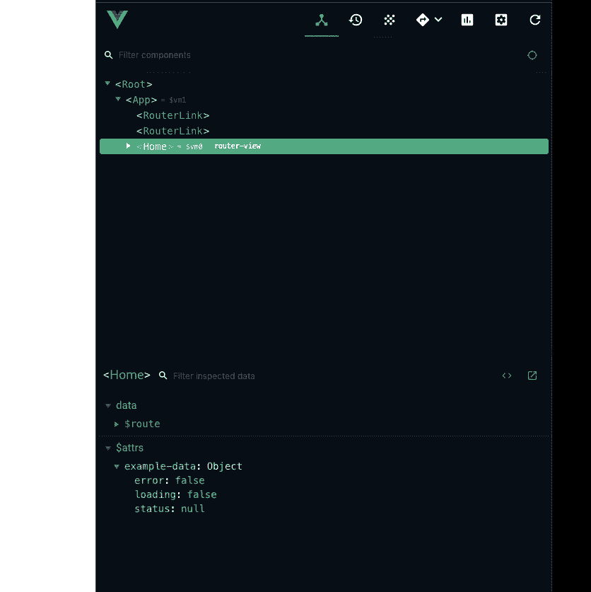
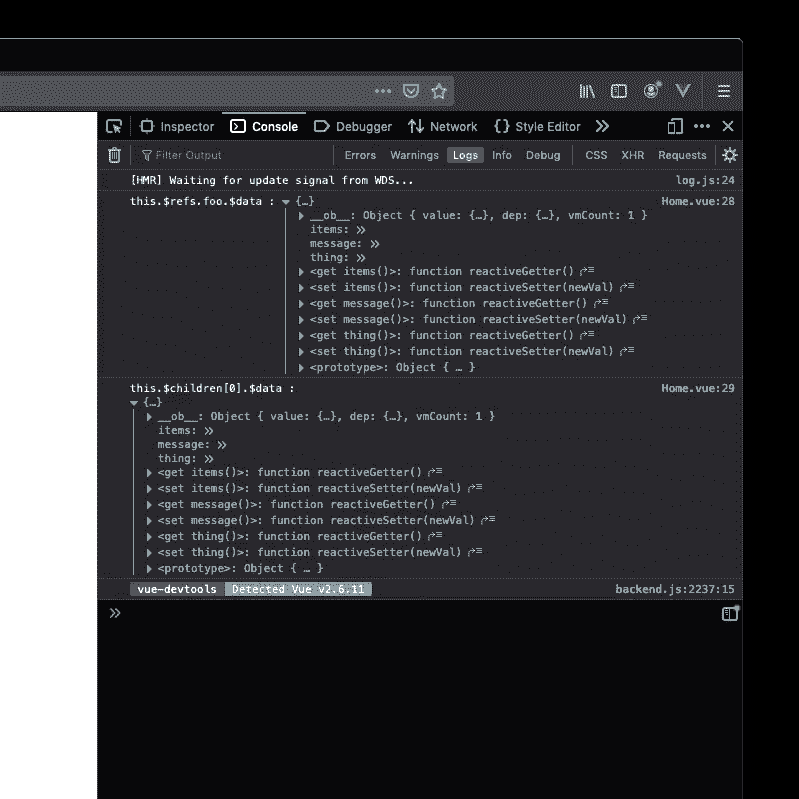
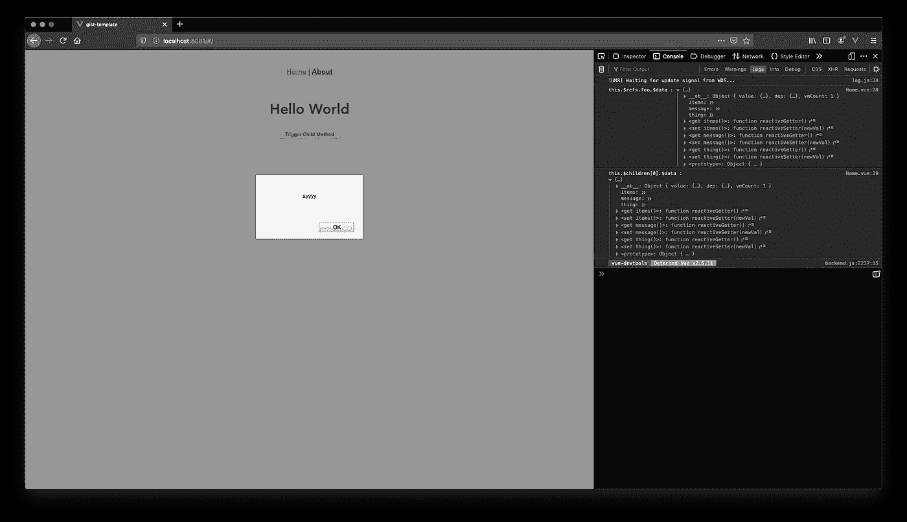

# Vue.js 热点提示№398

> 原文：<https://levelup.gitconnected.com/vue-component-communication-4356e532b45b>


安妮·斯普拉特在 [Unsplash](https://unsplash.com?utm_source=medium&utm_medium=referral) 上拍摄的照片

最近我一直在用 [@vue/test-utils](http://twitter.com/vue/test-utils) 学习 Jest，并且遇到了一个引人注目的测试案例。我需要断言我的组件正在调用一个方法来响应子组件发出的事件。这让我发现了一些访问父组件和子组件选项的新方法。

## 一次传递所有道具/数据

有时，我们可能只想简单地将所有父组件属性传递给子组件。这很容易做到，就像这样:`<child-component :example-data="$props" />`和数据也是`<child-component :example-data="$data" />`。快速无痛。

**奖励**:你也可以把道具传到`<router-view />`上。在这个例子中，all-props.vue 组件的数据:items、error 和 loading 在`this.$attrs['example-data']`下的所有子路由中都是可访问的

```
<template>
  <div class='all-props'>
    <child-component :example-data="$props" />
    <router-view :example-data="$data" />
  </div>
</template>
<script>
import { ChildComponent } from "./components"
export default {
  name: "all-props",
  components: {
    ChildComponent
  },
  props: {
    status: {
      type: String,
      required: true,
      validator: val => ['loading','error','complete'].indexOf(val) > -1
    }
  },
  data:() => ({
    items:[],
    error: false,
    loading: false
  })
};
</script>
```



## 父/子选项

您还可以轻松访问父/子组件选项。假设我们想直接调用一个名为`coolFunction()`的父组件中的方法，为此，我们可以编写`this.$parent.coolFunction()`。这是双向的，所以一个组件可以对子组件做同样的事情。在下面的示例中，来自 vue-cli 默认项目脚手架的 Home.vue (parent)和 HelloWorld.vue (child)。我们可以使用$refs 或$children 直接调用子方法`triggerAlert()`。

*Home.vue*

```
<template>
  <div class="home">
    <HelloWorld ref="foo" msg="Hello World" />
    <button
      [@click](http://twitter.com/click).exact="triggerChildMethod"
      [@keydown](http://twitter.com/keydown).enter="triggerChildMethod"
    >
      Trigger Child Method
    </button>
  </div>
</template>
<script>
import HelloWorld from "@/components/HelloWorld.vue";
export default {
  name: "Home",
  components: {
    HelloWorld
  },
  props: {
    items: {
      type: Array,
      default: () => []
    }
  },
  data: () => ({
    lorem: "ipsum"
  }),
  methods: {
    triggerChildMethod() {
      this.$refs.foo.triggerAlert();
    }
  },
  /**
   * [@note](http://twitter.com/note) $refs and $children not available in created hook
   */
  mounted() {
    console.log("this.$refs.foo.$data :", this.$refs.foo.$data);
    console.log("this.$children[0].$data :", this.$children[0].$data);
  }
};
</script>
```

你好，世界。某视频剪辑软件

```
<template>
  <div class="hello">
    <h1>{{ msg }}</h1>
  </div>
</template><script>
export default {
  name: "HelloWorld",
  props: {
    msg: String
  },
  data: () => ({
    message: null,
    items: false,
    thing: true
  }),
  methods: {
    triggerAlert() {
      alert("ayyyy");
    }
  }
};
</script>
```

组件数据的控制台日志:



这里我们触发了警报:



## 单元测试

就像我开始写这篇文章的场景一样，这里我们可以访问子组件实例，调用它的方法，并断言调用了父组件的方法。该测试可能是这样的:

```
import { mount } from '[@vue/test-utils](http://twitter.com/vue/test-utils)'
import Home from '@/views/home.vue'
import HelloWorld from '@/components/HelloWorld.vue'describe('Home.vue', () => {it('child can access and invoke a parent method', () => {const triggerChildMethod = jest.fn()const wrapper = mount(Home, {
      methods: {
        triggerChildMethod
      }
    })wrapper.find(HelloWorld).vm.triggerParentMethod()expect(triggerChildMethod).toHaveBeenCalledTimes(1)})
})
```

## 谢谢你

感谢你的阅读，希望你和我一样发现这些令人兴奋/有帮助！我计划分享我发现的更多有趣的花絮。敬请关注。