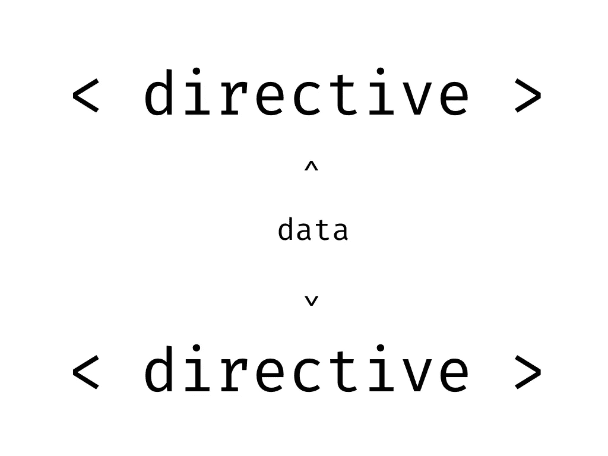

# Vue:跨方向数据共享

> 原文：<https://levelup.gitconnected.com/vue-cross-directive-data-sharing-7a6a69ef3a4c>



Vue 跨方向数据共享

# 介绍

在 Vue 中创建指令是跨应用程序重用的强大工具。从简单的 DOM 处理到复杂的验证，指令可以是实现解决方案的一种干净的方式，使前端应用程序的开发更快更容易。

但是，有时需要将大量信息传递到指令中。这就是指令的设计带来许多选择的地方。

实现这一点的一种方法是通过对象传递配置。例如:

```
<template>
  <custom-web-component-input 
    v-my-required-validator="validator" />
</template><script>
  export default {
    name: 'ValidationExample',
    data() {
      return {
        validator: {
          changeEvent: 'change'
          inputEvent: 'input'
          showErrorOnInput: false
        }
      }
    }
  }
</script>
```

这是可行的，大多数开发人员对此不会有问题，但是现在有一些数据属性在代码中从来不会被访问。Vue 开发人员应该尽可能地减少这些用例。然而，可以理解的是，有时使用数据属性是不可避免的。在这种情况下，使用计算属性，因为它们不能被变异。

上面的工作，因为它很简单，它看起来像一个干净的解决方案。但是如果我们把它变成下面这样:

```
<template>
  <custom-web-component-input 
         v-my-required-validator="validator"
         v-my-change-event="'myChange'"
         v-my-input-event="'myInput'"
         v-my-show-error-on-input=true />
</template><script>
  export default {
    name: 'ValidationExample'
  }
</script>
```

我们可以分离关注点，为指令的消费者和开发者创建一个更干净的开发体验。

上面的例子是一个“HTML 可配置方法”。当传入的数据是简单的数据类型时，这通常会成为最佳解决方案。它使指令的消费者不必在组件中添加不必要的数据。

那么，我们如何让这种模式高效而干净地工作呢？更好的方法是使用`[dataset](https://developer.mozilla.org/en-US/docs/Web/API/HTMLOrForeignElement/dataset)`属性。

# 什么是数据集属性？

`[dataset](https://developer.mozilla.org/en-US/docs/Web/API/HTMLOrForeignElement/dataset)`属性不同于其他自定义 HTML 属性或特性。当在 HTML 元素上设置时，它创建一个可读写的属性，在 Javascript 和 HTML 中都可以访问。

例如:

```
<input id="input-1" data-input-event-listen="change" />
```

可以用 Javascript 访问，如下所示:

```
const input1 = document.querySelector('#input-1');console.log(input1.dataset.inputEventListen);
// Output: change// it can also be changedinput1.dataset.inputEventListen = 'input';console.log(input1.dataset.inputEventListen);
// Output: input
```

上面的代码不需要使用两种不同的 DOM 方法(`input1.setAttribute('data-input-event-listen')`或`input1.getAttribute('data-input-event-listen'`)来获取和设置属性。它是可用的，并且能够使用对象符号来读取和覆盖。

# 如何使用`dataset`

那么，Vue 指令如何利用`dataset`?

让我们看看上面例子中的一组指令。(*注:本文只看主指令* `*v-my-required-validator*` *和其中一个配置指令* `*v-my-change-event*` *。所有其他配置指令将遵循相同的模式。*

记住理想的解决方案:

```
<template>
  <custom-web-component-input 
         v-my-required-validator
         v-my-change-event="'myChange'"
         v-my-input-event="'myInput'"
         v-my-show-error-on-input=true />
</template><script>
  export default {
    name: 'ValidationExample'
  }
</script>
```

首先让我们设置变更事件指令`v-my-change-event`，然后看看主指令如何使用它:

```
Vue.directive('my-change-event', {
  bind(el, binding){
    const { value } = binding;
    el.dataset.changeEvent = value;
  }
});
```

上面的代码获取了传入的变更事件名称，并将其存储在`value`中。然后将其设置为`dataset`变量`changeEvent`。

接下来，让我们构建`v-my-required-validator`指令来使用变更事件`dataset`变量`changeEvent`。

```
Vue.directive('my-validator', {
  bind(el, binding){
    // ensures that if not set, give it a default
    const changeListener = el.dataset.changeEvent || 'change'; 

    el.addEventListeners(changeListener, (event) => {
      const { value } = event.target;
      if (value && value.trim() !== '') {
        el.setAttribute('valid', true);
        el.removeAttribute('invalid');
      } else {
        el.setAttribute('invalid', true);
        el.removeAttribute('valid');
      }
    });
  }
});
```

上面的`v-my-validator`指令首先获取由`v-my-change-event`指令设置的`changeEvent`的`dataset`属性。(*注意，如果该指令不存在，它会设置一个默认值* `*change*` *。*)

然后它监听设置变量`changeListener`。当事件被触发时，它设置 css 选择器或代码可以对其做出反应的属性。

# 结论

`dataset`属性不仅使跨指令数据共享成为可能，它还为更复杂的用例开辟了可能性，在这些用例中，指令可以[观察数据集属性的变化](https://stackoverflow.com/a/44396986/595770)并使用可观察值对它们做出反应。