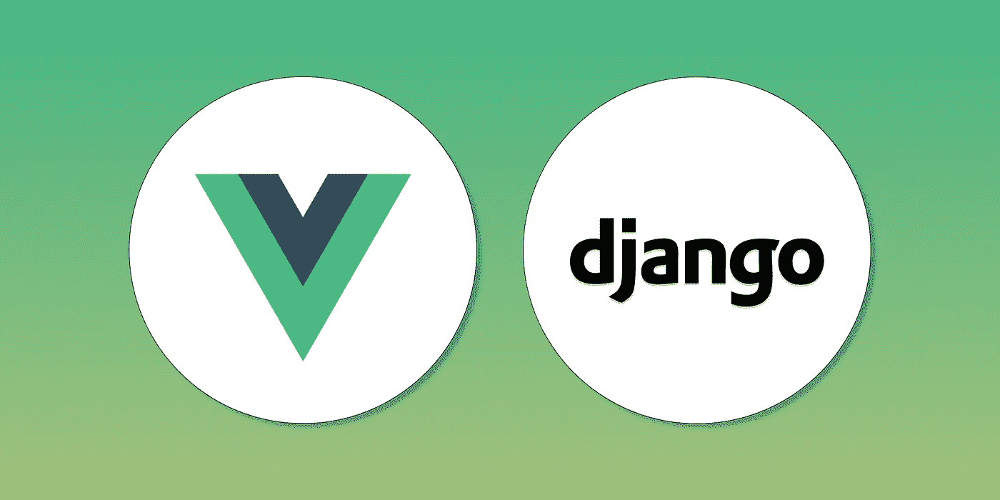
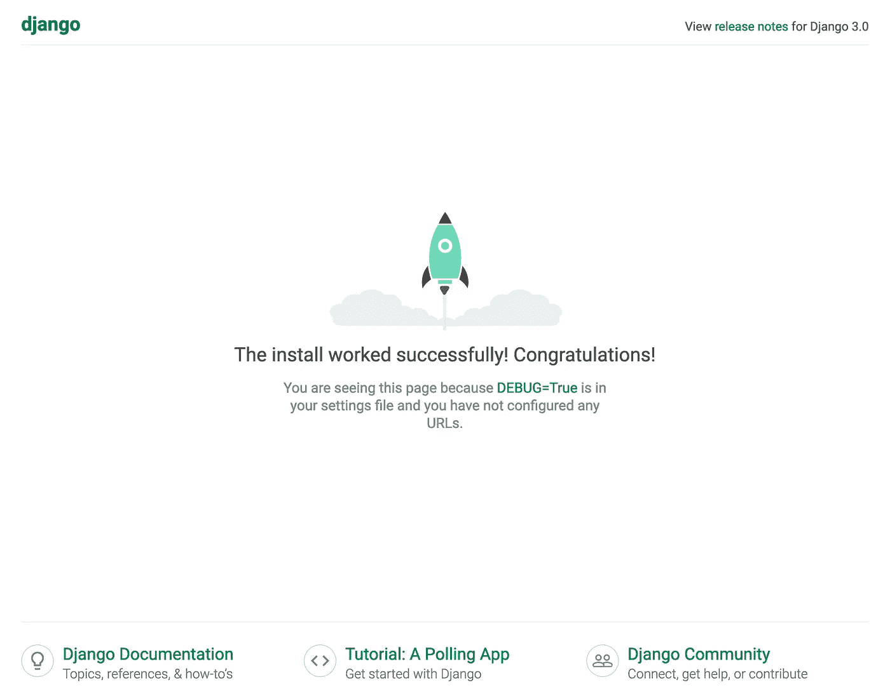
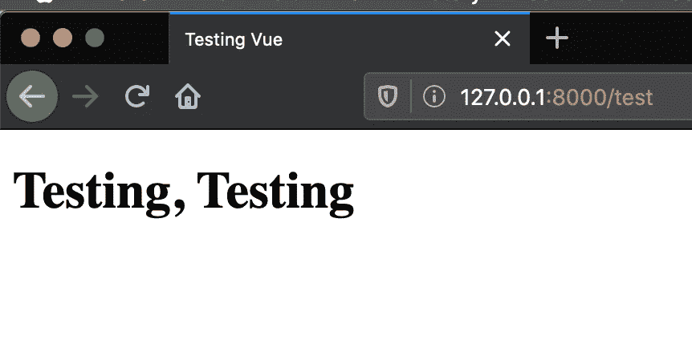
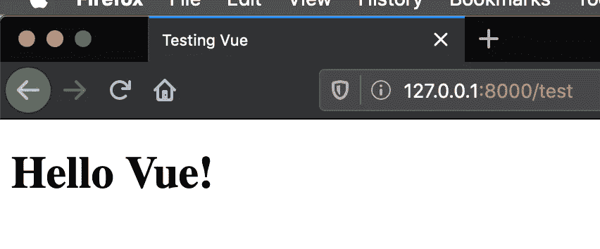

# Vue + Django:入门

> 原文：<https://levelup.gitconnected.com/vue-django-getting-started-88d3f4c2ba62>

## 将 Vue 添加到 Django 应用程序非常简单！



这两种技术配合得非常好。

将 Vue 添加到现有的 Django 应用程序非常容易，也是实现更复杂的前端功能的一个好方法。在这篇文章中，我们将看到如何用最简单的方法做到这一点。

# 为什么要加 Vue？

我们一会儿会谈到代码，但是首先值得问一下——“为什么要把 Vue 添加到你的 Django 项目中？”

如果您只想在页面上添加一些效果或动态呈现一些东西，那么普通 JavaScript 可能是更好的选择。只需给你的页面添加一个`script`标签，然后试着在那里进行操作。

然而，如果您有一个页面的整个部分需要在用户与它交互时共享数据并经常重新呈现，那么您可能有一个 JavaScript 框架的用例，Vue 是一个很好的选择！

Vue 允许您:

*   动态地将文本渲染到页面上(像 Django 模板，但是是交互式的！)
*   更新页面上各种元素的 CSS、类和属性
*   定义“组件”，即动态呈现并可重用的网页的整个部分
*   基于您从服务器端传递或通过 [REST API](https://medium.com/swlh/build-your-first-rest-api-with-django-rest-framework-e394e39a482c) 获取的属性(“props”)构建/恢复组件的状态

Vue 真的很酷，也很容易学。它类似于[学习反应](/new-to-react-you-need-to-understand-these-key-concepts-before-anything-else-2247efc1eaac)，但学习曲线不太陡峭，更容易设置。

这不是一个 Vue 教程，所以要学习 Vue 你需要访问[官方指南](https://vuejs.org/v2/guide/)(它做得很好，很容易理解)。

[](https://vuejs.org/v2/guide/) [## 简介- Vue.js

### vue . js——渐进式 JavaScript 框架

vuejs.org](https://vuejs.org/v2/guide/) 

我们来看看怎么给 Django 加 Vue！

## 视觉学习者？

别担心——我制作了这些步骤的视频:

## 有经验的开发者:只想要代码？

乐意效劳:

[](https://github.com/bennett39/vue_django) [## 本尼特 39/武埃姜戈

### 在 GitHub 上创建一个帐户，为 bennett39/vue_django 的发展做出贡献。

github.com](https://github.com/bennett39/vue_django) 

# 开始之前，创建一个新的 Django 应用程序

在我们将 Vue 添加到 Django 之前，我们需要一个 Django 项目！我将在接下来的所有例子中使用这个项目。

如果你有一个现有的 Django 应用，你不需要复制这个。但是你应该读一下，这样你就知道我的应用程序结构是什么样子了。

## 1.1 虚拟环境

我在我的环境中使用 [pyenv](https://github.com/pyenv/pyenv) 和 [pyenv-virtualenv](https://github.com/pyenv/pyenv-virtualenv) :

```
$ pyenv virtualenv vue-appLooking in links: /var/folders/tz/tjybwp513hd5zvdh166kbwnw0000gn/T/tmp2ler_knwRequirement already satisfied: setuptools in /Users/bennettgarner/.pyenv/versions/3.8.0/envs/vue-app/lib/python3.8/site-packages (41.2.0)Requirement already satisfied: pip in /Users/bennettgarner/.pyenv/versions/3.8.0/envs/vue-app/lib/python3.8/site-packages (19.2.3)$ pyenv local vue-app
```

# 1.2 安装 Django

现在，我们可以安装 Django:

```
$ pip install django
```

接下来，让我们开始一个新的 Django 项目:

```
$ django-admin startproject mysite
```

如果我们现在查看目录，我们会看到 Django 为我们创建了一个新文件夹:

```
$ ls
mysite/
```

如果我们看看这个文件夹，里面有我们运行 Django 站点所需的一切:

```
$ cd mysite/
$ ls
manage.py*  mysite/
```

让我们确保它有效。测试运行 Django 服务器:

```
$ python manage.py runserverWatching for file changes with StatReloader
Performing system checks...System check identified no issues (0 silenced).You have 17 unapplied migration(s). Your project may not work properly until you apply the migrations for app(s): admin, auth, contenttypes, sessions. Run 'python manage.py migrate' to apply them.July 24, 2020 - 12:14:09
Django version 3.0.8, using settings 'mysite.settings'
Starting development server at http://127.0.0.1:8000/
Quit the server with CONTROL-C.
```

转到 http://127.0.0.1:8000，您应该会看到 Django 欢迎屏幕！



# 1.3 创建 Vue 应用程序

我们可以像现在这样用文件夹结构构建我们的应用程序。然而，最佳实践是在构建新的东西时，将 Django 项目分成单独的应用程序。

因此，让我们为我们的 Vue 应用程序创建一个新的应用程序(如果您已经有一个现有的项目，这将是您想要在其中使用 Vue 的应用程序)。

```
$ python manage.py startapp vue_app
$ ls
db.sqlite3 manage.py  mysite/     vue_app/
```

# 1.4 向 mysite 项目注册 vue_app 应用程序

我们需要告诉 Django 识别我们刚刚创建的这个新应用程序。如果 Django 不知道 myapi，我们后面的步骤就不起作用。

所以，我们编辑`mysite/settings.py`:

```
INSTALLED_APPS = [
    'vue_app.apps.VueAppConfig',
    ... # Leave all the other INSTALLED_APPS
]
```

# 1.5 迁移数据库

我们可能需要 Django 附带的用户和会话模型，所以让 Django 将它们添加到数据库中。

(对于那些认为“我们没有创建数据库！”你说得对。但是 Django 会为我们创建一个简单的 SQLite 数据库，如果我们不另外指定的话。而且 SQLite 很牛逼！)

那么，让我们迁移那些初始模型:

```
$ python manage.py migrateOperations to perform:
  Apply all migrations: admin, auth, contenttypes, sessions
Running migrations:
  Applying contenttypes.0001_initial... OK
  Applying auth.0001_initial... OK
  Applying admin.0001_initial... OK
  Applying admin.0002_logentry_remove_auto_add... OK
  Applying admin.0003_logentry_add_action_flag_choices... OK
  Applying contenttypes.0002_remove_content_type_name... OK
  Applying auth.0002_alter_permission_name_max_length... OK
  Applying auth.0003_alter_user_email_max_length... OK
  Applying auth.0004_alter_user_username_opts... OK
  Applying auth.0005_alter_user_last_login_null... OK
  Applying auth.0006_require_contenttypes_0002... OK
  Applying auth.0007_alter_validators_add_error_messages... OK
  Applying auth.0008_alter_user_username_max_length... OK
  Applying auth.0009_alter_user_last_name_max_length... OK
  Applying auth.0010_alter_group_name_max_length... OK
  Applying auth.0011_update_proxy_permissions... OK
  Applying sessions.0001_initial... OK
```

我们已经让姜戈开始运行了！现在，让我们将 Vue 添加到我们的项目中！

# 喜欢你目前读到的吗？

我免费与我的电子邮件列表分享我最好的内容。

[加入目前在我的电子邮件系列中的 500 名其他开发者](https://sunny-architect-5371.ck.page/0a60026a5d)。

# 添加 Vue 的简单方法:在你的模板中包含 Vue

如果您只想在应用程序的单个页面上使用 Vue，最简单的方法是将其内联到模板中。

## 设置模板

在`vue_app/`中创建一个`templates/`文件夹。然后，创建`vue_app/templates/vue_app/`。这种命名空间在 Django 项目中很常见，有助于确保模板引擎为正确的文件服务。

现在，在`vue_app/templates/vue_app/`中创建`test.html`:

```
<!-- vue_app/templates/vue_app/test.html --><html>
  <head>
    <title>Testing Vue</title>
  </head>
  <body>
    <h1>Testing, Testing</h1>
  </body>
</html>
```

正如你所看到的，我们在模板中还没有 Vue，但我们很快会添加它。

首先，让我们定义一个 URL 和一个视图来呈现模板。

打开`vue_app/views.py`(应该已经存在):

```
# vue_app/views.pyfrom django.shortcuts import renderdef test_vue(request):
    return render(request, 'vue_app/test.html')
```

接下来，我们需要一个指向该视图的 URL。回到`manage.py`所在的文件夹(我叫它`mysite/`)。然后，打开`mysite/mysite/urls.py`。我们将全局定义这个 URL，因为目前它是我们测试应用程序中唯一的一个。

```
# mysite/mysite/urls.pyfrom django.contrib import admin
from django.urls import pathfrom vue_app import views as vue_views  # This line is newurlpatterns = [
    path('admin/', admin.site.urls),
    path('test', vue_views.test_vue),  # This line is new
]
```

如果您现在进入 http://127.0.0.1:8000/test ，您应该会看到我们的测试页面。



还没有 Vue

## 最后可以加 Vue！

将 Vue 添加到模板中最简单的方法是直接导入。如果你查看了官方的 Vue 指南，他们有 CDN 的链接，你可以快速的将 Vue 导入到你的网页中:

```
<!-- development version, includes helpful console warnings -->
<script src="https://cdn.jsdelivr.net/npm/vue/dist/vue.js"></script>OR<!-- production version, optimized for size and speed -->
<script src="https://cdn.jsdelivr.net/npm/vue"></script>
```

设置 Django 应用程序在开发和生产中使用不同的设置超出了本文的范围。有很多原因可以解释为什么你想在本地进行不同的设置，最重要的是`mysite/settings.py`中的`DEBUG = True`。值得学习如何做那件事。

一旦完成，您就可以像这样导入脚本:

```
<html>
  <head>
    
      <script src="[https://cdn.jsdelivr.net/npm/vue](https://cdn.jsdelivr.net/npm/vue)"></script>
    
      <script src="[https://cdn.jsdelivr.net/npm/vue/dist/vue.js](https://cdn.jsdelivr.net/npm/vue/dist/vue.js)"></script>
    
    <title>Testing Vue</title>
  </head>
  <body>
    <h1>Testing, Testing</h1>
  </body>
</html>
```

就是这样！您已将 Vue 添加到您的模板中。我们来试试吧！

# 在 Django 上写你的第一篇 Vue

现在，我们准备写一些 Vue 代码了！

```
<html>
  <head>
    <!-- development version, includes helpful console warnings -->
    <script src="[https://cdn.jsdelivr.net/npm/vue/dist/vue.js](https://cdn.jsdelivr.net/npm/vue/dist/vue.js)"></script>
    <title>Testing Vue</title>
  </head> <body>
    <div id="vue-app">
      <h1>[[ myTitle ]]</h1>
    </div> <script type="text/javascript">
      let app = new Vue({
        el: "#vue-app",
        delimiters: ['[[', ']]'],
        data: {
          myTitle: 'Hello Vue!',
        },
      });
    </script>
  </body>
</html>
```



起作用了！

这里需要注意一些事情:

1.  像所有 Vue 应用一样，我们定义了一个 Vue 可以运行的`<div>`。把它想象成我们网页的一个“窗口”, Vue 可以在这里渲染东西
2.  因为它是 Vue 的窗口，Vue 控制着那个`<div>`里面的一切。如果你试图在窗口中添加脚本标签或产生副作用，Vue 会把它去掉，这样它就能可靠地运行。因此，你应该使你的 Vue 窗口尽可能的小，并且逐渐地在 Vue 中组成页面。
3.  我们在这个 Vue 应用上设置了自定义分隔符。默认情况下，Vue 在其应用程序中使用`{{ }}`作为变量，但这与 Django 模板语法相冲突。所以，我们改变了 Vue 中的分隔符。
4.  好消息是，一旦你习惯了 Vue，你就不会经常需要那些分隔符了。没有分隔符，您通常也可以完成同样的事情:

```
// Same example as above, but w/ more advanced Vue & no delimiters<div id="vue-app">
  <span v-html="myTitle"></span>
</div><script type="text/javascript">
  let app = new Vue({
    el: "#vue-app",
    data: {
      myTitle: '<h1>Hello Vue!</h1>',
    },
  });
</script>
```

从 CDN 导入是目前为止将 Vue 添加到 Django 的最简单的方法，在你需要采用不同的策略之前，你实际上已经能够很好地使用它了…

# 清理—静态资产

如果你继续沿着这条路走下去，并试图构建一个 Vue 应用程序，当你定义组件和逻辑时，你将会在你的 HTML 中结束许多巨大的`<script>`标签。

最好将这些脚本作为静态资产来收集和服务，而不是将它们直接包含在模板本身中。然后，您还可以跨网页共享组件。

为 Django 设置[静态资产是整个教程的主题，所以我将在此省略。一旦你设置好了，你应该可以把所有的 Vue 文件保存在一个像`static/src/`这样的文件夹里。](https://docs.djangoproject.com/en/3.0/howto/static-files/)

然而，在某一点上，你会达到一个临界点，这些文件变得相当大，他们不能很容易地导入另一个。

最终，您会想要为 Vue 构建一个系统。

# 添加 Webpack 以使用 Vue CLI 和 Vue 模板

如果您想使用 Vue CLI 和的所有功能。vue 文件，那么这种方法就行不通了。你需要用 Webpack 编译资产。

这涉及到更多的配置，但不要担心！这并不难做到。我已经写了另一个帖子，提供了所有细节:

[](https://betterprogramming.pub/vue-django-using-vue-files-and-the-vue-cli-d6dd8c9145eb) [## Vue + Django:使用中。vue 文件和 Vue CLI

### 构建一个运行在 Django 上的全栈网站

better 编程. pub](https://betterprogramming.pub/vue-django-using-vue-files-and-the-vue-cli-d6dd8c9145eb) 

# 姜戈，我们成功了！

这并不难。现在你可以专注于在 Django 驱动的 API 上用 Vue 构建很酷的东西了。

您每天使用的大量很酷的现代 web 应用程序都使用这种技术组合，所以欢迎使用这两个伟大的工具进行开发。您将能够在 Python 后端和 JavaScript 前端之间构建几乎任何您能想到的东西。

有问题吗？评论？对我的方法的担忧？很高兴在下面的评论中或者在[vue@bennettgarner.com](mailto:vue@bennettgarner.com)听到他们的声音

# 免费访问 WebDevSprint

*获得一个为期两周的 web 开发内容的预定冲刺&电子邮件访问我作为你的工程导师…*

[加入我的免费电子邮件导师计划中的 500 名其他开发人员。](https://sunny-architect-5371.ck.page/0a60026a5d)