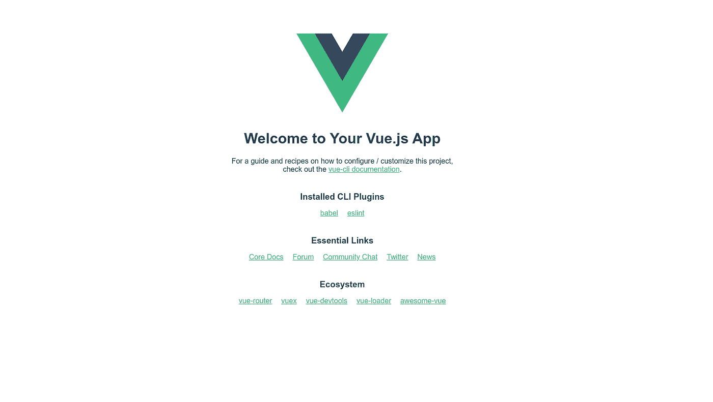
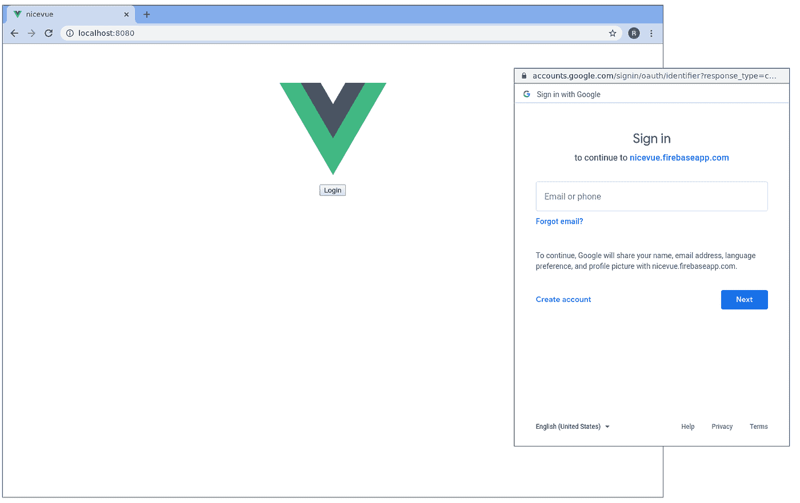
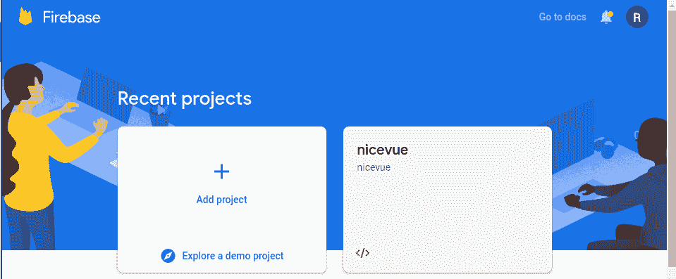
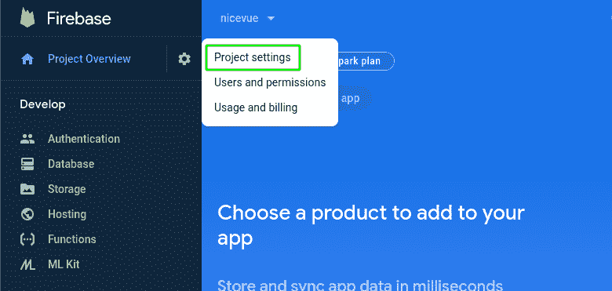
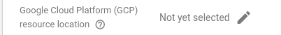
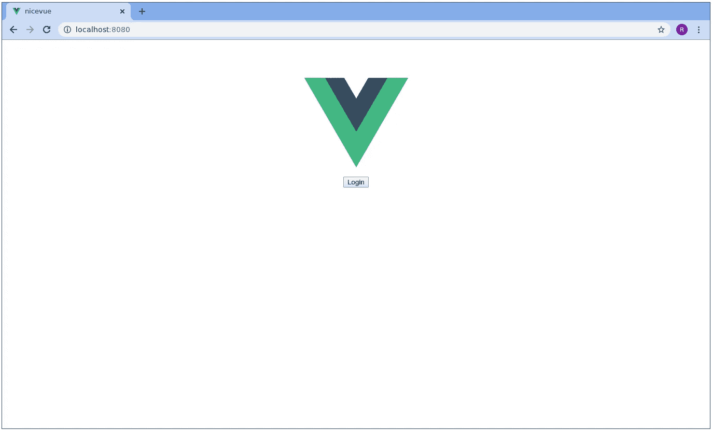
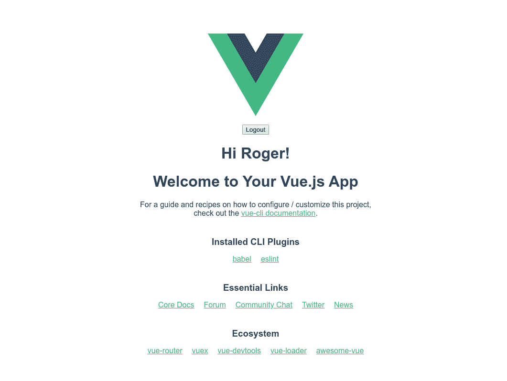

# Vue.js 和 Firebase 认证:一个简单的例子

> 原文：<https://levelup.gitconnected.com/vue-js-and-firebase-authentication-a-simple-example-8ecc8313aac6>

我喜欢简单的东西。Vue.js 是一个非常简单的 Javascript 框架。Firebase 身份验证是向 web 应用程序添加身份验证的一种非常简单的方式。因此，本着简单的精神，让我们用一个非常简单的例子把这两件简单的事情放在一起。

# 等等，我们在做什么？

当您创建一个新的 Vue 项目时，您会看到一个漂亮的默认页面，如下所示:



你好世界

看起来不错。它由一个单独的默认组件组成，恰当地命名为 HelloWorld。我们要做的只是对组件做一些更改，以便页面上可爱的欢迎消息和详细信息对未经身份验证的用户隐藏起来:



喂？世界？

用谷歌账户登录将会取消隐藏，这样你就可以见证它的辉煌。

我们开始吧。

# 设置一些东西

今天唯一的先决条件是你已经在你的系统上安装了[node . js](https://nodejs.org/en/download/)。

## vue . j

我们需要在全球范围内安装 npm install Vue:

```
npm install -g @vue/cli
```

接下来，我们将创建一个 Vue 项目。简单易行:

```
vue create nicevue
```

对于上面的命令，保留它们为您提供的默认选项。

正如 Vue CLI 所建议的，跳转到您新创建的项目目录(`cd nicevue`)，然后运行:

```
npm run serve
```

默认的欢迎页面应该在`localhost:8080`等着你:


那很容易。

## 重火力点

为了开始使用 Firebase，我们需要在你的 npm 系统上安装 **firebase-tools** 包。Firebase Tools 是让你做所有 Firebase 事情的 [Firebase CLI](https://firebase.google.com/docs/cli) (创建项目、部署应用、管理数据库等)。

让我们安装:

```
npm install -g firebase-tools
```

现在，我们将把 Firebase SDK 安装到我们的 Vue 项目中，以便它能够连接到我们的 Firebase 后端。从项目根目录运行此命令:

```
npm install firebase
```

Firebase 会想知道你是谁。登录告诉它:

```
firebase login
```

现在，接下来的几个步骤可以通过 [Firebase 控制台](https://console.firebase.google.com/)来完成，但是现在让我们继续使用命令行。我们必须创建一个项目，这是 Firebase 的顶级实体，本质上是一个谷歌云项目。下面是我们创建新项目的方法:

```
firebase projects:create
```

给你的项目一个时髦的 id 和名字。如果你的 id 不是全球唯一的，它会显示一个错误，所以请尽情发挥你的创造力。

现在，我们需要在项目中创建一个应用程序:

```
firebase apps:create --project <your-snazzy-and-unique-project-id>
```

当出现提示时，从提供的平台选项中选择 **Web** ,并随意命名。也许我们应该坚持使用我们创建 Vue 应用程序时使用的东西。

# 再来点燃烧基的东西

我们已经有了一个项目和一个应用程序，让我们调整一些设置。在一个新的浏览器窗口中，进入 [Firebase 控制台](https://console.firebase.google.com/)，找到你的项目并点击它。



然后，在项目概述页面上，找到左上角项目概述旁边的设置目录，并点击项目设置:



在这里，您必须设置 GCP 资源位置—单击铅笔并选择一个:



在你离开这一页之前，在**你的应用**框中往下看一点。在 Firebase SDK snippet 下，选择 Config 以获取代码片段。同时将其复制到剪贴板或粘贴到其他地方；我们稍后会需要它。看起来是这样的:

```
const firebaseConfig = {
    apiKey: <YOUR API KEY>,
    authDomain: <YOUR AUTH DOMAIN>,
    databaseURL: <YOUR DATABASE URL>,
    projectId: <YOUR PROJECT ID>,
    storageBucket: <YOUR APP STORAGE BUCKET>,
    messagingSenderId: <YOUR MESSAGING SENDER ID>,
    appId: <YOUR APP ID>
};
```

接下来，您必须启用 Google 作为登录方法。从左侧的开发窗格中点击**认证**并转到**登录方法**选项卡。有很多选择，但是现在，点击**谷歌**，切换**启用**。选择项目支持电子邮件，然后单击保存。这里都搞定了。

# 准备开始

看看你的项目目录。我们只关心位于`**src/components/**`目录中的`**Helloworld.vue**` 文件，我们将在`**src/**`目录中创建一个新的空白文件，命名为`**firebase.js**.`

让我们在那里开始聚会吧。

## 火情网

在 src 目录中创建`**firebase.js**`,并开始导入:

```
import * as firebase from 'firebase/app';
import 'firebase/auth';
```

然后，我们将添加我们的应用程序的 Firebase 配置对象。还记得我让你复制到你的剪贴板的那块吗？是的，我们现在就需要。将它添加到您的导入行下面，后跟 **initializeApp** 函数调用:

```
...
const firebaseConfig = {
    apiKey: <YOUR API KEY>,
    authDomain: <YOUR AUTH DOMAIN>,
    databaseURL: <YOUR DATABASE URL>,
    projectId: <YOUR PROJECT ID>,
    storageBucket: <YOUR APP STORAGE BUCKET>,
    messagingSenderId: <YOUR MESSAGING SENDER ID>,
    appId: <YOUR APP ID>
};firebase.initializeApp(firebaseConfig);
```

最后，让我们导出一些我们希望在组件中使用的内容:

*   firebase 身份验证功能
*   登录功能
*   注销功能

```
export default {
    auth: firebase.auth(),
    login() {
      const provider = new firebase.auth.GoogleAuthProvider();
      firebase.auth().signInWithPopup(provider)
      .then(function(result) {
        console.log(result);
      })
      .catch(function(error){
        const errorCode = error.code;
        const errorMessage = error.message;
        const email = error.email;
        const credential = error.credential;
        console.log(errorCode, errorMessage, email, credential);
        })
    },
    logout() {
      firebase.auth().signOut()
      .then(function() {})
      .catch(function(error) {
        console.log(error)});
    }
}
```

这就是`firebase.js.`前进到组件。

## HelloWorld.vue

Vue 为我们提供了一个现成的 HelloWorld 模块，它为我们提供了默认的登录页面。向上滚动到文件的顶部，这样我们可以对组件的**模板**部分做一些修改。我们需要一个登录按钮和一个注销按钮，这将启动我们的登录和注销功能。我们将从“hello”分区顶部的登录按钮开始:

```
<template>
<div class="hello">
**<button v-if="!authenticated"** [**@click**](http://twitter.com/click)**="login">Login</button>**
...
```

如您所见，我们的按钮的可见性是基于我们稍后将创建的名为**‘authenticated**’的属性自然地，我们想要在按钮上使用的动作将是**@点击**登录。

出于本练习的目的，我们希望将登录按钮下面的所有内容都包装在一个带有 **v-if** 的 div 中。我们将把它附加到 authenticated 属性上，这样只有当用户登录时内容才会显示。在 login 按钮和 logout 按钮之后添加 open div 标记。我们还将在`<h1>`标签的正上方添加一条个性化的线。哦，不要忘记在代码块的末尾添加一个结束的`</div>`:

```
...
<div class="hello">
<button v-if="!authenticated" [@click](http://twitter.com/click)="login">Login</button>
**<div v-if="authenticated">**
**<button** [**@click**](http://twitter.com/click)**="logout">Logout</button>
<h1>Hi {{ firstName }}!</h1>**
<h1>{{ msg }}</h1>
...
...
</ul>
**</div>**
</div>
</template>
...
```

在这一点上，运行`npm run serve`来看看我们得到了什么。这是你应该有的:



Oo 拉拉

点击登录按钮，次数不限；什么都不会发生。

让我们向下滚动到`<script>`块。首先，让我们确保导入那个`firebase.js`文件。在`<script>`标签内添加导入:

```
<script>
**import Firebase from '../firebase.js';**
...
```

在那下面，你会看到已经有一个小的出口阻塞，但它没有太多的进展。我们将添加一些东西，从一个`**data()**`函数开始。对于这个例子，让它返回一个东西:一个具有空的`data`对象和带有`false`布尔值的`**loggedIn**`状态的`**user**`对象:

```
export default {
    name: 'HelloWorld',
    props: {
    msg: String
    },
 **data () {
      return {
        user: {
          loggedIn: false,
          data: {}
        }
      }  
    },**
...
```

接下来，让我们添加几个计算属性:

*   一个基于用户对象中的`loggedIn` 属性的`**authenticated**`属性
*   基于用户对象的`displayName`属性的`**firstName**`属性。使用 Google auth，显示名称通常是用户的全名，所以我们将它分解，只使用前半部分:

```
...
    computed: {
        authenticated(){
          return this.user.loggedIn
        },
        firstName(){
          if (this.user.data.displayName) {
            return this.user.data.displayName.split(' ')[0]
          }
          return null
        }
    },
...
```

也许最重要的是，我们需要一些登录和退出的方法。他们将调用我们之前的 firebase 登录和注销功能:

```
...
    methods: {
      login() {
        Firebase.login();
      },
      logout() {
        Firebase.logout()
      }
    },
...
```

您可能已经注意到，我们的登录和注销功能不会更新我们的用户数据。您可以让它们中的每一个都这样做，但是如果我们希望我们的用户会话在刷新后仍然存在，并且跨多个窗口持续存在，我们需要一种方法在组件加载后立即获取身份验证数据。这里的关键是 Firebase 的`onAuthStateChanged()`功能。让我们把它放到组件的**挂载的**生命周期钩子中:

```
mounted: function() {
      Firebase.auth.onAuthStateChanged( user => {
        if (user) {
          this.user.loggedIn = true;
          this.user.data = user;
        }
        else {
          this.user.loggedIn = false;
          this.user.data = {};
        }
      })
    }
}
```

这意味着一旦组件被挂载，我们的用户对象将反映 Firebase 的用户认证状态。酷毙了。

# 让它裂开

现在让我们运行这个小狗，看看我们有什么。如果还没有，运行`npm run serve` load up localhost:8080:


非常好。关键时刻:点击登录！你会看到一个标准的谷歌认证弹出窗口，你可以用你的 gmail 账户登录。一旦你进去了，瞧！



这就是了。这是 Vue.js 中 Firebase 认证最简单的实现。