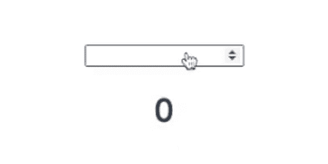

# 我如何在 Vue 2 中制作一个数字动画组件

> 原文：<https://levelup.gitconnected.com/vue-js-how-i-made-a-animating-number-component-in-vue-634371bc6a69>



我最近不得不在 vue 中制作一个组件，其中一个数字会随着变化而变化。我在想这有多难，所以作为一个真正的开发者，我坐下来开始谷歌“在 change vue.js 上制作一个数字动画”。我很惊讶的发现这个问题还没人回答的结论(也可能是我瞎了眼)。无论如何，我们在这里，我终于做到了，我很乐意与你分享我是如何做到的。

好了，我们现在都知道我们是怎么结束的了，让我们开始吧。

## 链接到项目

我在文章的最后添加了一个 **TLDR** 链接到这个项目

# 🧱建筑

因此，对于我们的小应用程序的结构，我将使用以下文件夹结构:

```
My Awesome Animating Number Project/
├── public/
│   ├── index.html
│   ├── favicon.ico
├── src/
│   ├──components
│   │  └── AnimateInteger.vue
│   ├── main.js
│   └── App.vue
└── package.json
```

现在请注意，如果你正在做一个项目，你想实现这个，你的结构看起来有点不同，不要担心它保持你的结构，任何时候我说 **AnimateInteger.vue** 我指的是你有你想要动画的数字的组件。

好了，当文件夹结构就位后，让我们在 App.vue 中放一些代码，我们将从模板开始。

对于我们的 **AnimateInteger.vue** 组件，我们将在模板中添加以下内容

现在，我们可以将 **AnimateInteger.vue** 导入到 **App.vue** 中，同时，我们还要将脚本标签添加到我们的两个组件和一些初始值中

我们将使用三个基本属性

1.  **value —** 在 App.vue 中使用，我们用`v-model`将它连接到输入，然后将它作为道具传递给我们的 AnimateInteger.vue 组件。
2.  **display value—**display value 是我们在应用程序中显示的值(我知道的聪明的命名约定)
3.  **tweenValue —** tweenValue 是一个值，我们将知道我们的显示值应该与哪个数字进行比较，因此也知道它应该动画到哪个数字。

好了，现在问题解决了，让我们进入下一步。

# 让我们安装 GSAP 软件包📦

因此，在我们开始更多的编码之前，我们必须安装来自 NPM 的包，GSAP 是“绿石动画平台”的缩写，它是由一个非常聪明的叫做绿石的开发团队制作的，用他们自己的话说，绿石团队是这样描述 GSAP 的:

> 一个强大的 JavaScript 工具集，将开发人员变成动画超级英雄。我们专注于性能、兼容性和支持，因此您不必担心。

有各种各样的方法来安装 GSAP，如果你曾经读过我的其他文章，你会知道我喜欢呈现各种选项，所以你可以选择你喜欢的方式。

# 经由 NPM 安装 GSAP

因此，安装 GSAP 的第一种方法是我的首选方式:通过 [NPM](https://www.npmjs.com) ，你可能已经知道 NPM，但对于你来说，如何没有使用它之前，我们将安装 GSAP 使用以下命令在我们的终端:

```
$ npm install gsap
```

然后我们将它导入到 **AnimateInteger.vue** 中

随着 GSAP 的安装和导入，每当`value`改变时，现在是时候使用 GSAP 来激活数字了。

# 让我们开始制作动画吧

首先，让我们谈谈我们想要做的事情——本质上，我们想要做的是从一个数字到另一个数字的动画，所以当当前数字改变时，我们想要将浏览器中显示的数字动画为新的数字。


期待结果

让我们把它分成两部分:

## 1.我们想知道属性"`value"`何时改变。

如果你是 Vue 的新手，了解这一点可能对你有用，因为这不会是你最后一次做类似的事情，如果你不是 Vue 的新手:嗯，做一点回顾不会有什么坏处。

那么，我们如何知道价值何时改变呢？有几种方法可以做到这一点，我们可以在输入字段上监听 v-on:input 事件，但有一种更方便的方法可以做到这一点。我们将使用我首选的方式:`watch` 属性。本质上，`watch` 属性所做的是监听我们告诉它要监听的属性的变化。

好了，Jannick，说得够多了，让我们来看一个关于我们项目的例子。

现在“所有”我们要做的就是在每次属性`value`改变时启动手表属性内的动画。我们将使用 GSAP 的`to()`补间，因为它允许我们定义目标值(value)。让我们看看它的背景，然后我会进一步解释。

GSAP 自动计算出当前值，我们只需向它提供 tweenValue —在本例中是我们的属性`value`。GSAP 提供了一个更新回调函数，这样当 when 值更新时，我们可以告诉 GSAP 做一些事情。在这种情况下，我们将 displayedValue 设置为 tweenValue，然后 GSAP 会为我们处理剩下的事情。

好了，这就是我关于这个话题的全部内容。我希望你喜欢阅读我构建这个组件的过程，并且我希望你能从中获得一些价值，可以为你的下一个项目带来一些价值。

如果您有任何问题或反馈，请留下您的评论！

# **TLDR —项目链接**