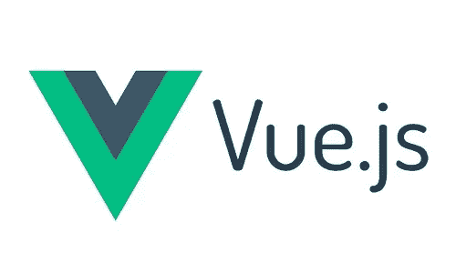

# Vue . js——在 Vue 2 中，我如何从组件外部调用组件中的方法

> 原文：<https://levelup.gitconnected.com/vue-js-how-to-call-a-method-in-a-component-from-outside-the-component-1ac090f6af45>

有时我们不得不在组件之外调用组件中的方法。但是我们到底该怎么做呢？有多种方式吗？最佳实践是什么？

在这篇文章中，我试图回答这些问题，向您展示我喜欢如何做，并给出一些代码示例，说明如何在您的 Vue 应用程序中实现我最喜欢的一些方法。

好吧，我们开始吧。

# 1.使用事件总线

使用事件总线是一种方法。事件总线可以用在大多数场景中:兄弟对兄弟，表亲对表亲，父母对孩子，孩子对父母。说到事件总线，我建议你在兄弟姐妹或者表亲之间的场景中调用方法时使用它，为什么？因为我相信在其他情况下还有其他更方便的方法。

## 什么是事件总线？

本质上，事件总线是一个 Vue.js 实例，它可以在一个组件中发出事件，然后在另一个组件中监听和响应发出的事件。

在项目中实现事件总线有两种方式:

## 1.将事件总线实现为实例属性

一句话解释的实例属性是一个属性(或变量),您希望它对所有组件都是全局可用的，而不会污染全局范围。

好吧，这听起来真的很酷，但我如何在我的应用程序中设置它呢？很好的问题，一旦你掌握了窍门，它其实很简单。

然后你可以在你的应用程序中的任何地方访问它，就像这样:`this.$eventBus`

## 2.将事件总线实现为 ES6 模块

实现事件总线的另一种方式是作为 ES6 模块。这听起来可能有点吓人，但是请相信我，这实际上并不难，只需要几行代码就可以完成。

首先，我们需要创建 ES6 模块。让我们开始吧:

1.  首先在项目中创建一个名为 event-bus.js 的新文件。
2.  然后将以下代码添加到同一个文件中:

可能已经注意到，这与实例属性非常相似。我们正在创建一个变量，然后导出该变量，以便在我们的应用程序中使用它。

Tada！！现在我们已经创建了一个 ES6 模块。看，没那么糟。

现在，我们要做的就是将它导入到我们想要使用它的组件中，我们将像这样导入它:

当我们在应用程序中实现了事件总线后，我们可以在我们的一个组件中发出一个事件，如下所示:

然后在另一个组件中，我们监听事件，然后像这样执行方法:

## 2.使用$refs

使用$refs 属性是从父组件调用组件方法的一种很好且简单的方式，因此要引用前面提到的场景，这就是父-子场景。

## 什么是$refs 属性，我们如何使用它？

$refs 属性用于引用 Vue 实例模板中的 DOM 元素。

要使用$refs 属性，请使用 ref 属性为要引用的子组件分配一个引用 ID。例如:

现在我们可以访问子组件方法，然后直接从父组件调用方法，如下所示:

# 3.古老的好$emit

$emit 属性是在组件外部调用组件方法的最后一种方式，我将在本文中向您展示这一点。

使用$emit 属性的场景是，当您想要从子组件调用父组件中的方法时，也就是我所说的子到父场景。

## 什么是$emit 属性，我们如何使用它？

$emit 属性用于从子组件发出自定义事件，然后我们可以在父组件中监听相同的自定义事件。与组件和道具不同，事件名称不提供任何自动大小写转换。相反，发出的事件的名称必须与用于侦听该事件的名称完全匹配。例如，如果发出类似“updateItem”的 camelCased 事件名称，则侦听 kebab cased 版本的“update-item”将没有任何效果。

在子组件中发出事件:

监听父组件中的事件:

# 结论

现在我已经向您展示了一些我最喜欢的在组件外部调用组件方法的方法，您可能仍然会有一个问题。最佳实践是什么？这是完全可以理解的，因为我并没有真正回答这个问题，原因是:没有一种正确的方法可以做到这一点，因为上面提到的一些方法只在特定的场景下有效，因此最佳实践不仅仅取决于文章中的某个人为你挑选一个。这取决于你的组件和你想调用方法的组件有什么关系，当然，你更喜欢什么或者你正在做的项目中已经使用了什么。

我希望这篇文章对你有所帮助，或者这篇文章让你更接近于决定在项目中使用哪种方法来调用组件外部的组件方法。

如果你在评论中有任何问题，我会尽我所能来回答，如果你有第四种(甚至第五种)调用组件方法的方法，把它写在评论中，这样我们可以互相学习。