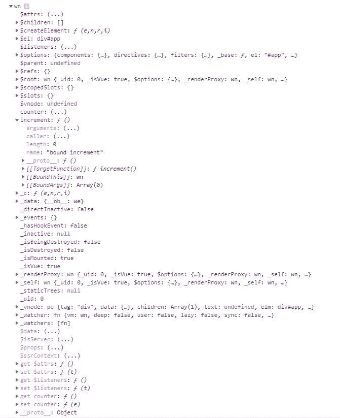
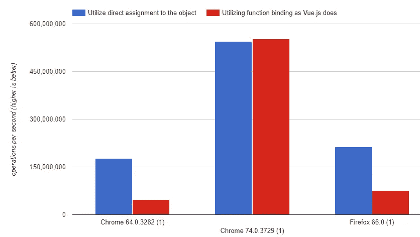

# Vue.js 内部——方法调用涉及什么？

> 原文：<https://levelup.gitconnected.com/vue-js-internals-whats-involved-in-a-method-call-7624c6994778>

Vue 是 Javascript ***魔法*** 。Vue 提供了快速创建交互式用户界面的工具。这是通过可重用的*组件*的概念来实现的，这些组件基于组件的*数据*来呈现和更新 html。在开发界，这被称为*双向数据绑定*。对数据进行更改，并观察 HTML 自动更新。有 HTML 输入元素吗？告诉 Vue 将表单绑定到数据中，并在输入文本时观察数据的变化。看到了吗？*魔法*。

Vue 组件也有你可以调用的方法。这些方法更常用作事件处理程序。想在点击按钮时运行代码吗？在 Vue 组件中分配一个函数作为它的处理程序。在您的方法中，您可以操作组件的数据，然后再次观察 html 如何变化。这是生命的循环。

这是一个 html 片段，可能在你的组件的 HTML 中。

这可能是您简单的 Vue 应用程序

请注意您是如何在名为*方法*的属性中创建一个名为*增量*的函数的。引用该方法时不使用该属性名。当你试图在组件外调用这个方法时，你根本不用*方法*属性。

那么，我们如何在不引用 methods 属性的情况下调用该方法呢？Vue 是如何做到这一点的？

如果我们直接在 Chrome DevTools 中检查 Vue 实例' *app* '，我们会看到一个非常丰富的对象，如下所示。

这个对象内置了大量的行为。您可以看到与观察器、生命周期事件等相关的属性和功能。在这个对象中，你还可以看到一个*增量*函数。该*增量*功能具有附加属性，包括*目标功能*、*边界*和*边界*。这告诉我们一些有趣的事情。秘密在于*增量*函数 ***根本不是我们的*** 增量*函数。这是一个*包装器*，它指向我们的*增量*函数。Vue 是如何？JS 这样做？*

# 您的 Vue 实例的内部构建

当我们使用 *new Vue({…})* 实例化一个新的 Vue 实例时，我们会传入一个 *options* 对象，它包含我们的应用程序的状态和行为。结果我们得到的是 Vue 对一个新对象的组合，它包装了所有围绕我们意图的动态绑定和行为。我们来看看 Vue 源代码中的 Vue 构造函数文件。

当我们调用 Vue 构造函数时，它在内部调用新 Vue 对象上的 *_init* 函数，传递我们的 options 对象。这个 *_init* 函数在 *initMixin* 中定义。在 *_init* 函数中，Vue 开始构建包装行为。在这个调用嵌套中有一个 *initMethods* 函数调用，当我们的 options 对象中有一个 Methods 属性时，这个函数调用就会发生。让我们来看看 *initMethods* 函数。

这个函数用一个 *vm* 参数调用，该参数指向正在构建的新 Vue 实例。*方法*参数包含了我们所有的方法定义，准备分配给我们的实例。

如果所有的错误检查看起来都很好，包括确保我们没有与数据属性相同的函数名，那么我们调用 *bind* 函数，传入我们自己的函数声明和对新 Vue 实例的引用作为 *vm* 。我们来看看 Vue 的*绑定*函数声明。

我们可以在实用程序文件中看到， *bind* 函数将为没有本机*function . prototype . bind*函数的 Javascript 环境使用自定义的 *bind* 实现。否则，它将利用内置的 Function.prototype.bind 函数，确保函数中的 *this* 上下文指向我们新的 Vue 实例。

回到我们的 *initMethods* 函数，在我们示例的上下文中，代码如下所示。

属于 *Function.prototype* 的 *bind* 函数返回一个新函数，当调用该函数时，会将 *this* 关键字设置为传递给 bind 的参数。然后使用括号符号将*绑定*调用的结果分配给我们的新 Vue 实例。关于*function . prototype . bind*函数的更多信息可以在 Mozilla 的 Web 开发者文档中找到。

 [## 函数.原型.绑定()

### bind()方法创建了一个新函数，当调用该函数时，它的 this 关键字被设置为提供的值，并带有一个…

developer.mozilla.org](https://developer.mozilla.org/en-US/docs/Web/JavaScript/Reference/Global_objects/Function/bind) 

一旦我们的 Vue 对象被创建并由 Vue 构造函数返回，最终的对象有一个增量属性，它引用了由*绑定*调用返回的新函数。这就是你的函数如何利用 *this* 关键字，该关键字现在正确地引用了它所属的 Vue 组件。

# 性能呢？

当您在我们创建的新 Vue 实例上调用 *increment* 方法时，您实际上是在调用由 *bind* 调用准备的函数。每个 Javascript 引擎都以不同的方式实现内部绑定，并且浏览器之间存在**和**性能差异。在 Chrome 的最近版本中，当 v8 引擎优化你的代码时，没有可察觉的差异。然而，在其他浏览器中，如 Microsoft Edge 和 Firefox，绑定函数和非绑定函数的性能差异可能非常显著。您可以查看这些测试的结果，并使用下面的 jsPerf 测试自己运行它们。

 [## 属于对象的绑定和非绑定函数之间的性能差异

### 利用 Function.prototype.bind 将函数的 this 绑定到对象的上下文，并将其执行时间与对象中直接定义的函数进行比较的测试。

jsperf.com](https://jsperf.com/performance-of-function-binding) 

jsPerf 测试显示了微软 Edge(显示为 Chrome 64)、谷歌 Chrome 和 Firefox 66.0 的最新版本的结果

最新版本的 Microsoft Edge 在 jsPerf 图表中标识为 Chrome 64。你可以看到使用 Function.prototype.bind 绑定的函数在调用性能上的显著差异。如果 Chrome 理解你在做什么，它的最新版本可以围绕这一点进行优化。

# 为什么这很重要？

对你来说可能无所谓。当你不需要考虑内部的时候，Vue.js 是很神奇的。就起来用吧。调用方法所涉及的潜在性能开销对您来说可能也无关紧要，因为 Vue.js 内部的交互不需要高度性能驱动来提供丰富的交互式用户体验。

# 为什么这对我很重要

我目前正在用 Vue.js 构建一个用 Javascript 编写的任天堂模拟器。这要求一切都尽可能快。Vue.js 中的每个包装行为都有性能成本，我发现自己不得不将更多的模拟器行为移出 Vue.js，以达到必要的速度。

现在我们知道魔法是有代价的。

通过跟随我的代码库，跟随我用 Vue.js 用 Javascript 编写的 8 位任天堂仿真器的开发。

 [## t 向下/三向力

### 用 VueJS - tdondich/triforce 用 Javascript 写的 8 位任天堂模拟器

github.com](https://github.com/tdondich/triforce)