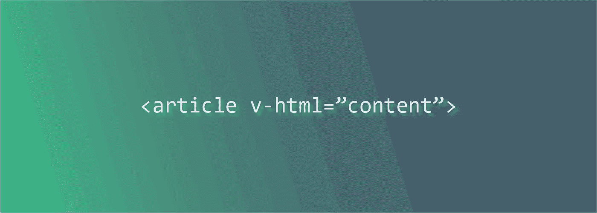

# Vue.js:在动态 HTML 中将替换为

> 原文：<https://levelup.gitconnected.com/vue-js-replace-a-with-router-link-in-dynamic-html-c423beea0d17>

当使用`v-html`(例如显示从你的 CMS 中提取的文章)时，最好用 Vue Router 的`<router-link>`替换内部链接，以确保当用户点击链接时，你的应用程序不会不必要地重新加载。

这个例子使用一个独立的组件来封装我们的功能:

注入发生在组件的`mounted()`回调中。首先，我们需要包含动态内容的 DOM 元素。在我们这里是直接:`this.$el`。现在检索动态内容里面的所有主播:`this.$el.getElementsByTagName('a')`

迭代每个元素，删除指向外部网站的链接。

Vue Router [文档](https://router.vuejs.org/guide/essentials/navigation.html#router-push-location-oncomplete-onabort)没有指出我们是否可以使用 URL 的开头(*https://example.com*)，所以我们只是移除它来获得路径。获取`<router-link>`的构造函数，并通过将*传递给* prop 来实例化它，就像我们在`<router-link to="/foo">`中使用的一样，并将父组件传递给上下文。没有上下文，我们的 RouterLink 将无法访问`this.$router`，这将剥夺它的功能。

组件对应的 DOM 元素还不存在，所以我们将组件`$mount()`到旧锚点，替换它。

现在组件有了一个`$el`属性，我们可以将属性(例如，`class`)和内部内容(它的标题)复制到这个属性中。

搞定了。单击该链接，它应该会打开新页面，而无需重新加载您的单页应用程序。使用在这里学到的基础知识，根据自己的意愿修改功能。

## 修改

Render 函数允许我们通过 props 为我们的容器选择不同的标签(例如， *section* 而不是 *div* )。否则，我们可以用可读性更好的*模板*替换`render()`函数: