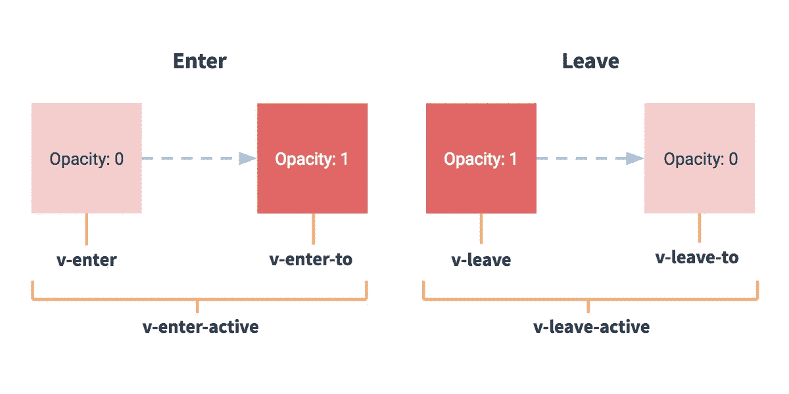

# Vue.js 过渡效果—进入和离开

> 原文：<https://levelup.gitconnected.com/vue-js-transition-effects-enter-and-leave-38fd917a618d>


照片由[清水久美子](https://unsplash.com/@shimikumi32?utm_source=medium&utm_medium=referral)在 [Unsplash](https://unsplash.com?utm_source=medium&utm_medium=referral) 上拍摄

Vue.js 是一个易于使用的 web 应用框架，我们可以用它来开发交互式前端应用。

在这篇文章中，我们将看看如何创建基本的过渡效果和动画。

# 过渡单个元素/组件

Vue 为我们提供了在 DOM 中添加、更新或删除元素时应用过渡效果的多种方式。它可以执行的操作包括:

*   自动为 CSS 过渡和动画应用类
*   集成第三方 CSS 动画库
*   在转换过程中使用 JavaScript 直接操作 DOM
*   集成第三方 JavaScript 动画库

Vue 有一个`transition`包装器组件，让我们在以下上下文中为元素或组件添加进入和离开转换:

*   用`v-if`进行条件渲染
*   用`v-show`进行条件显示
*   动态组件
*   组件根节点

例如，我们可以定义一个简单的渐变过渡，如下所示:

`src/index.js`:

```
new Vue({
  el: "#app",
  data: { show: false }
});
```

`src/styles.css`:

```
.fade-enter-active,
.fade-leave-active {
  transition: opacity 0.5s;
}
.fade-enter,
.fade-leave-to {
  opacity: 0;
}
```

`index.html`:

```
<!DOCTYPE html>
<html>
  <head>
    <title>App</title>
    <meta charset="UTF-8" />
    <script src="[https://cdn.jsdelivr.net/npm/vue/dist/vue.js](https://cdn.jsdelivr.net/npm/vue/dist/vue.js)"></script>
    <link
      rel="stylesheet"
      type="text/css"
      href="./src/styles.css"
      media="screen"
    />
  </head>
  <body>
    <div id="app">
      <button v-on:click="show = !show">
        Toggle
      </button>
      <transition name="fade">
        <p v-if="show">hi</p>
      </transition>
    </div>
    <script src="src/index.js"></script>
  </body>
</html>
```

在上面的代码中，我们将`name`属性设置为`fade`。

这意味着在 CSS 代码中，我们必须给类加上前缀`fade`。

在代码中:

```
.fade-enter-active,
.fade-leave-active {
  transition: opacity 0.5s;
}
.fade-enter,
.fade-leave-to {
  opacity: 0;
}
```

`enter-active`、`leave-active`、`enter`和`leave-to`是 Vue 的默认类名后缀，用于确定应用于各种过渡状态的样式。

## 过渡类

有 6 个类适用于进入/离开过渡:

*   `v-enter` —进入的开始状态。在插入元素之前添加，在插入元素之后移除一帧。
*   `v-enter-active` —进入活动状态。适用于整个进入阶段。在插入元素之前添加，并在过渡完成时移除。该类可用于定义进入过渡的持续时间、延迟和缓和。
*   `v-enter-to` —从 Vue 2.1.8 开始提供。进入的结束状态。在插入元素后增加一帧，与移除`v-enter`的时间相同。过渡完成时移除。
*   `v-leave` —休假开始状态。当离开过渡被触发并在一帧后移除时添加。
*   `v-leave-active` —休假活动状态，适用于整个休假阶段。当离开转换被触发时添加，当转换完成时删除。该类可用于定义进入过渡的持续时间、延迟和缓和。
*   `v-leave-to` —从 Vue 2.1.8 开始提供。休假结束状态。离开过渡被触发后增加一帧，同时`v-leave`被移除。当过渡完成时，它会被移除。

整个工作流程如下:



https://vuejs.org/的好意

`v-`是未设置`name`属性时的默认前缀。否则，`v-`会被我们设置的名字替换。在上面的例子中，我们用`fade-`替换`v-`。


格伦·卡斯滕斯-彼得斯在 [Unsplash](https://unsplash.com?utm_source=medium&utm_medium=referral) 上拍摄的照片

## CSS 过渡

我们可以如下指定 CSS 转换:

`src/index.js`:

```
new Vue({
  el: "#app",
  data: { show: false }
});
```

`src/style.css`:

```
.fade-enter-active {
  transition: all 0.3s ease;
}.fade-leave-active {
  transition: all 0.8s cubic-bezier(0.3, 0.5, 0.8, 1);
}
.fade-enter,
.fade-leave-to {
  transform: translateX(15px);
  opacity: 0;
}
```

`index.html`:

```
<!DOCTYPE html>
<html>
  <head>
    <title>App</title>
    <meta charset="UTF-8" />
    <script src="[https://cdn.jsdelivr.net/npm/vue/dist/vue.js](https://cdn.jsdelivr.net/npm/vue/dist/vue.js)"></script>
    <link
      rel="stylesheet"
      type="text/css"
      href="./src/styles.css"
      media="screen"
    />
  </head>
  <body>
    <div id="app">
      <button v-on:click="show = !show">
        Toggle
      </button>
      <transition name="fade">
        <p v-if="show">hi</p>
      </transition>
    </div>
    <script src="src/index.js"></script>
  </body>
</html>
```

在上面的代码中，我们在文本被切换时滑动它。我们还定义了淡入淡出效果的缓和。

我们用`cubic-bezier`改变不同阶段的速度。参数是线条中用于滑动文本的点。

## CSS 动画

我们也可以应用 CSS 动画，比如 CSS 过渡。不同之处在于`v-enter`不是在元素插入后立即移除，而是在`animationend`事件发生时移除。

当使用`v-if`切换内容时，我们可以创建弹跳动画效果，如下所示:

`src/index.js`:

```
new Vue({
  el: "#app",
  data: { show: false }
});
```

`src/styles.css`:

```
.bounce-enter-active {
  animation: bounce-in 1s;
}
.bounce-leave-active {
  animation: bounce-in 0.75s reverse;
}
[@keyframes](http://twitter.com/keyframes) bounce-in {
  0% {
    transform: scale(1.5);
  }
  50% {
    transform: scale(0.6);
  }
  100% {
    transform: scale(1);
  }
}
```

`index.html:`

```
<!DOCTYPE html>
<html>
  <head>
    <title>App</title>
    <meta charset="UTF-8" />
    <script src="[https://cdn.jsdelivr.net/npm/vue/dist/vue.js](https://cdn.jsdelivr.net/npm/vue/dist/vue.js)"></script>
    <link
      rel="stylesheet"
      type="text/css"
      href="./src/styles.css"
      media="screen"
    />
  </head>
  <body>
    <div id="app">
      <button v-on:click="show = !show">
        Toggle
      </button>
      <transition name="bounce">
        <p v-if="show">hi</p>
      </transition>
    </div>
    <script src="src/index.js"></script>
  </body>
</html>
```

动画代码在`src/styles.css`中，这里我们定义了`bounce-in`动画的关键帧，用`scale`拉伸和挤压文本。小于 1 表示挤压，大于 1 表示拉伸。

# 结论

我们可以通过为 Vue 用来呈现过渡的各种类设置 CSS 样式来定义基本的进入和离开过渡。

此外，我们可以为它们定义动画和关键帧，以看到与使用过渡类相同的效果。唯一的区别是`v-enter`不是在元素插入后立即移除，而是在`animationend`事件发生时移除。