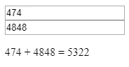

# Vue.js 转换效果-状态转换

> 原文：<https://levelup.gitconnected.com/vue-js-transition-effects-state-transitions-ac7efc75987f>


照片由[阿格巴洛斯](https://unsplash.com/@agebarros?utm_source=medium&utm_medium=referral)在 [Unsplash](https://unsplash.com?utm_source=medium&utm_medium=referral) 上拍摄

Vue.js 是一个易于使用的 web 应用框架，我们可以用它来开发交互式前端应用。

在本文中，我们将了解如何使用 GreenSock、tween.js 和 Color.js 创建状态转换

# 用观察器制作状态动画

观察器让我们将任何数字属性的变化制作成另一个属性的动画。

例如，我们可以用 GreenSock 和 Vue 对输入的数字进行动画处理，如下所示:

`src/index.js`:

```
new Vue({
  el: "#app",
  data: {
    num: 0,
    tweenedNumber: 0
  },
  computed: {
    animatedNumber() {
      return this.tweenedNumber.toFixed(0);
    }
  },
  watch: {
    num(newValue) {
      TweenLite.to(this.$data, 0.5, { tweenedNumber: newValue });
    }
  }
});
```

`index.html`:

```
<!DOCTYPE html>
<html>
  <head>
    <title>App</title>
    <meta charset="UTF-8" />
    <script src="[https://cdn.jsdelivr.net/npm/vue/dist/vue.js](https://cdn.jsdelivr.net/npm/vue/dist/vue.js)"></script>
    <script src="[https://cdnjs.cloudflare.com/ajax/libs/gsap/1.20.3/TweenMax.min.js](https://cdnjs.cloudflare.com/ajax/libs/gsap/1.20.3/TweenMax.min.js)"></script>
  </head>
  <body>
    <div id="app">
      <input v-model.number="num" type="number" />
      <p>{{ animatedNumber }}</p>
    </div>
    <script src="src/index.js"></script>
  </body>
</html>
```

当我们输入一个数字时，上面的代码将显示数字的变化。

我们观察了一下`num`值，然后叫:

```
TweenLite.to(this.$data, 0.5, { tweenedNumber: newValue });
```

通过增加或减少数字来更新数字显示，直到它达到我们键入的数字。

`TweenLite`是来自青岩。

我们也可以对其他东西做同样的事情，比如颜色绳。

例如，我们可以编写以下代码来模拟颜色字符串的更新:

`src/index.js`:

```
const Color = net.brehaut.Color;new Vue({
  el: "#app",
  data: {
    colorQuery: "",
    color: {
      red: 0,
      green: 0,
      blue: 0,
      alpha: 1
    },
    tweenedColor: {}
  },
  created() {
    this.tweenedColor = Object.assign({}, this.color);
  },
  watch: {
    color() {
      const animate = () => {
        if (TWEEN.update()) {
          requestAnimationFrame(animate);
        }
      };new TWEEN.Tween(this.tweenedColor).to(this.color, 750).start();animate();
    }
  },
  computed: {
    tweenedCSSColor() {
      return new Color({
        red: this.tweenedColor.red,
        green: this.tweenedColor.green,
        blue: this.tweenedColor.blue,
        alpha: this.tweenedColor.alpha
      }).toCSS();
    }
  },
  methods: {
    updateColor() {
      this.color = new Color(this.colorQuery).toRGB();
      this.colorQuery = "";
    }
  }
});
```

`src/styles.css`:

```
.color-preview {
  width: 50px;
  height: 50px;
}
```

`index.js`:

```
<!DOCTYPE html>
<html>
  <head>
    <title>App</title>
    <meta charset="UTF-8" />
    <script src="[https://cdn.jsdelivr.net/npm/vue/dist/vue.js](https://cdn.jsdelivr.net/npm/vue/dist/vue.js)"></script>
    <script src="[https://cdn.jsdelivr.net/npm/tween.js@16.3.4](https://cdn.jsdelivr.net/npm/tween.js@16.3.4)"></script>
    <script src="[https://cdn.jsdelivr.net/npm/color-js@1.0.3](https://cdn.jsdelivr.net/npm/color-js@1.0.3)"></script>
    <link href="./src/styles.css" type="text/css" />
  </head>
  <body>
    <div id="app">
      <input
        v-model="colorQuery"
        [@keyup](http://twitter.com/keyup).enter="updateColor"
        placeholder="Enter Color"
      />
      <button [@click](http://twitter.com/click)="updateColor">Update</button>
      <div
        class="color-preview"
        :style="{ backgroundColor: tweenedCSSColor }"
      ></div>
      <p>{{ tweenedCSSColor }}</p>
    </div>
    <script src="src/index.js"></script>
  </body>
</html>
```

上面的代码通过获取输入的`colorQuery`字符串，将其转换为`Color`对象并将其分配给`this.color`来工作。

一旦`this.color`更新，就会调用`watch`属性中`color` watcher 的`animate`函数。

然后`this.tweenedColor`将被更新为:

```
new TWEEN.Tween(this.tweenedColor).to(this.color, 750).start();
```

然后一旦`this.tweenedColor`被更新，则`tweenedCSSColor`被更新并显示在屏幕上。

`TWEEN.Tween`是来自 tween.js 的构造函数。


[布拉德利·齐夫](https://unsplash.com/@bradleyziffer?utm_source=medium&utm_medium=referral)在 [Unsplash](https://unsplash.com?utm_source=medium&utm_medium=referral) 上拍摄的照片

# 将转换组织成组件

我们可以将转换代码放入其组件中。这样，我们可以重用它，并将转换的复杂性从其他业务逻辑中分离出来。

例如，我们可以将原始示例重构为以下代码:

`src/index.js`:

```
Vue.component("num-transition", {
  props: ["num"],
  data() {
    return {
      tweenedNumber: 0
    };
  },
  computed: {
    animatedNumber() {
      return this.tweenedNumber.toFixed(0);
    }
  },
  watch: {
    num(newValue) {
      TweenLite.to(this.$data, 0.5, { tweenedNumber: newValue });
    }
  },
  template: `<p>{{animatedNumber}}</p>`
});new Vue({
  el: "#app",
  data: {
    num: 0
  }
});
```

`index.html`:

```
<!DOCTYPE html>
<html>
  <head>
    <title>App</title>
    <meta charset="UTF-8" />
    <script src="[https://cdn.jsdelivr.net/npm/vue/dist/vue.js](https://cdn.jsdelivr.net/npm/vue/dist/vue.js)"></script>
    <script src="[https://cdnjs.cloudflare.com/ajax/libs/gsap/1.20.3/TweenMax.min.js](https://cdnjs.cloudflare.com/ajax/libs/gsap/1.20.3/TweenMax.min.js)"></script>
  </head>
  <body>
    <div id="app">
      <input v-model.number="num" type="number" />
      <num-transition :num="num"></num-transition>
    </div>
    <script src="src/index.js"></script>
  </body>
</html>
```

在上面的代码中，我们将转换逻辑移到了它自己的组件中，方法是移出所有的转换逻辑，然后传递我们想要监视的数字，以创建作为道具的转换。

然后，我们可以对其稍作修改，以便可以如下重用它:

`src/index.js`:

```
Vue.component("num-transition", {
  props: ["num"],
  data() {
    return {
      tweenedNumber: 0
    };
  },
  computed: {
    animatedNumber() {
      return this.tweenedNumber.toFixed(0);
    }
  },
  watch: {
    num(newValue) {
      TweenLite.to(this.$data, 0.5, { tweenedNumber: newValue });
    }
  },
  template: `<span>{{animatedNumber}}</span>`
});new Vue({
  el: "#app",
  data: {
    num1: 0,
    num2: 0
  },
  computed: {
    result() {
      return this.num1 + this.num2;
    }
  }
});
```

`index.html`:

```
<!DOCTYPE html>
<html>
  <head>
    <title>App</title>
    <meta charset="UTF-8" />
    <script src="[https://cdn.jsdelivr.net/npm/vue/dist/vue.js](https://cdn.jsdelivr.net/npm/vue/dist/vue.js)"></script>
    <script src="[https://cdnjs.cloudflare.com/ajax/libs/gsap/1.20.3/TweenMax.min.js](https://cdnjs.cloudflare.com/ajax/libs/gsap/1.20.3/TweenMax.min.js)"></script>
  </head>
  <body>
    <div id="app">
      <input v-model.number="num1" type="number" />
      <input v-model.number="num2" type="number" />
      <p>
        <num-transition :num="num1"></num-transition> +
        <num-transition :num="num2"></num-transition> =
        <num-transition :num="result"></num-transition>
      </p>
    </div>
    <script src="src/index.js"></script>
  </body>
</html>
```

在上面的代码中，我们将`num-transition`的模板改为:

```
<span>{{animatedNumber}}</span>
```

然后在`index.html`我们把代码改成了:

```
<div id="app">
  <input v-model.number="num1" type="number" />
  <input v-model.number="num2" type="number" />
  <p>
    <num-transition :num="num1"></num-transition> +
    <num-transition :num="num2"></num-transition> =
    <num-transition :num="result"></num-transition>
  </p>
</div>
```

然后我们得到:



# 结论

我们可以通过观察组件状态并为它们创建计算值来为它们创建转换。

然后，我们可以使用 GreenSock 库从被监视的值生成新值。

然后，该值可以显示在屏幕上，创建一个动画效果。

我们可以将逻辑重构到它自己的组件中，这样就不会因为混合转换逻辑和其他业务逻辑而使组件过于复杂。