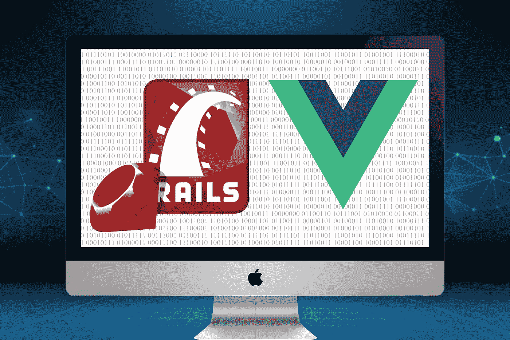
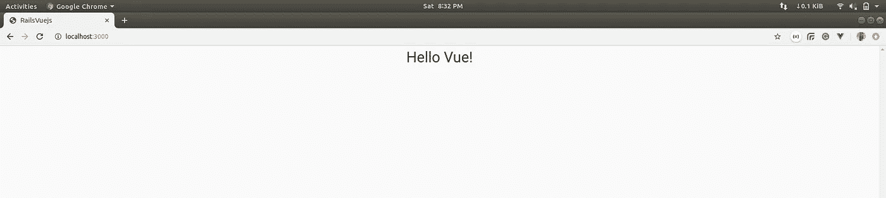
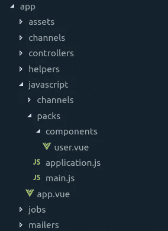
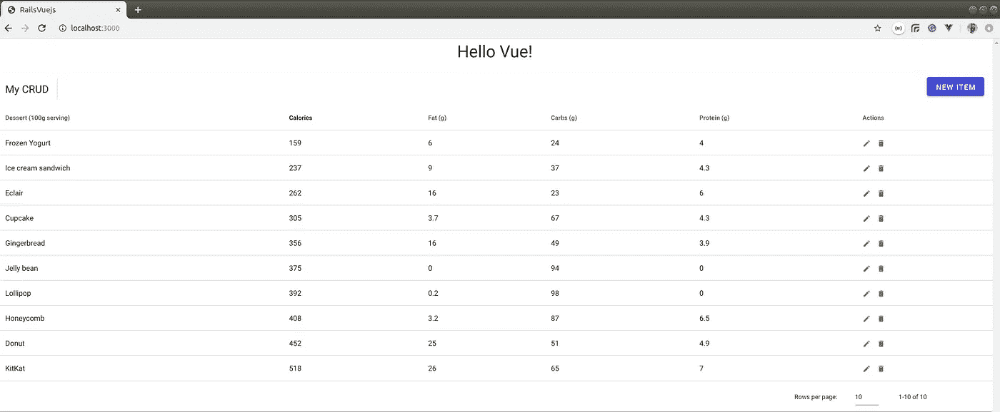
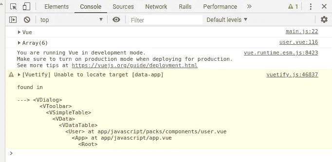
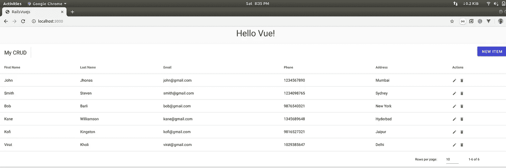

# Vue.js 使用 Rails 6 并执行 CRUD 操作

> 原文：<https://levelup.gitconnected.com/vue-js-with-rails-6-and-performing-crud-operations-b043ef3691f2>



在本教程中，我们将学习如何用 Rails 6 设置 Vuejs 并执行 CRUD 操作。

在我们开始之前，我假设您已经在您的机器上安装了 [Ruby](https://www.ruby-lang.org/en/) (版本高于 2 . 6 . 0)[Rails 6](https://rubyonrails.org/)、 [NodeJs](https://nodejs.org/en/) 和 [yarn](https://yarnpkg.com/lang/en/) 。

```
rails new rails_vuejs --webpack=vue
```

这将安装一个包含 Vue.js 的新项目。包是 Rail 对我们添加到项目中的任何 JavaScript 的术语。

打开项目并检查 Rails 为我们生成的 Javascript 包目录，即`app/javascript/packs/hello_vue.js`。从`hello_vue.js to main.js` 重命名该文件，并使用 javascript pack 标签将该文件包含在主布局文件中，即`app/views/layouts/application.html.erb`，方法是将片段 1.1 中的内容复制粘贴到`application.html.erb`

代码片段 1.1: application.html.erb

现在，我们通过运行以下命令创建一个带有索引操作的欢迎控制器

```
rails generate controller Welcome index
```

它将创建几个文件。打开`app/views/welcome/index.html.erb` 删除文件中所有现有的代码并保持它为空。这将是我们的主页，在这里我们显示我们的组件，在 routes.rb 文件中将索引操作 URL 更改为 root，即`config/routes.rb`

```
root to: 'welcome#index'
```

现在，我们通过运行以下命令创建一个用户控制器

```
rails generate controller Users
```

将 route.rb 文件中的路线添加为`resources :users`,对于索引操作，代替使用用户视图页面，即`app/views/users/index.html.erb` 文件，我们需要显示 Vue 组件，即 app.vue 文件。因此

```
resources :users
get 'app', to: 'users#index'
```

现在启动两台服务器
后端服务器`rails server`和
前端服务器`bin/webpack-dev-server`和
并访问`[http://localhost:3000](http://localhost:3000)`。您将看到如下图 1.1 所示的屏幕



图 1.1:你好，Vue

在 main.js 文件中添加 Vuetify 及其配置。想了解更多关于 Vuetify 的信息，请访问 https://vuetifyjs.com/en/

```
npm add vuetify
```

之后，我们需要告诉 Vue 使用 Vuetify(在大多数情况下，在 main.js 文件中),这就是为什么我们将 hello_vue.js 重命名为 main.js，将下面代码片段中的内容复制粘贴到`main.js`中

代码片段 1.2: main.js

一些组件正在使用图标，我们在 link 标签的第 8 行和第 10 行分别添加了 snippet 1.1 application.html.erb 中的 Google Fonts 和 Font Awesome 链接。

我们需要显示一个表格，以适当的格式显示数据。我们正在使用 Vuetify 数据表组件。要了解更多信息，请访问以下链接:

```
[https://vuetifyjs.com/en/components/data-tables#crud-actions](https://vuetifyjs.com/en/components/data-tables#crud-actions)
```

在项目的 packs 目录下创建一个名为 components 的目录，即`app/javascript/packs` ，在 components 目录下创建一个`user.vue`，复制粘贴 vuetify 数据表组件代码。



图 1.2:添加 user.vue 后

现在，导入一个用户组件，并将代码片段 1.3 中的内容复制粘贴到`app.vue`

代码片段 1.3: app.vue

运行两个服务器并访问 [http://localhost:3000](http://localhost:3000) ，您将看到如下图 1.3 所示的屏幕



图 1.3:虚拟化数据表

> *注:如果模式未打开，则检查浏览器控制台是否显示警告，如下图 1.4 所示*



图 1.4:验证错误

然后检查整个 app 都是用 <v-app></v-app> 包装的。因为在 Vuetify 中你需要在 <v-app></v-app> 中包装你的应用。v-app 组件设置此数据应用程序属性。

**安装 Axios Http 客户端** 现在该使用以下命令安装`[Axios](https://github.com/axios/axios)` 了:

```
yarn add axios
```

现在，在用户组件中导入 Axios，并将代码片段 1.4 中的代码替换为`user.vue`

代码片段 1.4: user.vue

由于我们项目中的当前数据是静态的，是时候从一些后端开始了。所以，让我们开始吧。

通过运行以下命令添加用户模型

```
rails g model User first_name:string last_name:string email:string    phone:integer address:string
```

之后运行`rails db:migrate`
下一步，从后端添加一些数据，即`rails console.`

**后端索引 API**

现在我们开始编写 API。我们有不同的终点。所以，我们先来看看/users 端点

```
#app/controllers/users_controller.rbdef index
  @users = User.all
  render json: @users 
end
```

**Vue 和 Axios 获取示例** 添加下面的代码，因为我们现在从 API 获取数据。

```
#app/javascript/packs/components/user.vueinitialize() {
return axios
  .get("http://localhost:3000/users")
  .then(response => {
     console.log(response.data);
     this.desserts = response.data;
   })
  .catch(e => {
     console.log(e);
  });
}
```

Vuetify Datatable 组件提供了一个观察属性。这个创建的函数是 Vuejs 的一个生命周期钩子，每当组件被创建时，它就会被调用。这将调用 initialize()方法，我们从响应中获取数据，然后从函数中返回一个承诺，该承诺将解析为一个用户数组或一个错误。

如果一切正常，没有任何错误，那么来自 API 请求的表中的更新数据如下图 1.5 所示



图 1.5:来自 api 的索引数据

我们还需要一种方法，通过使用 id 或主键来显示单个用户。让我们添加那个方法

**后端展示 API**

```
#app/controllers/users_controller.rbdef show
  @user = User.find(params[:id])
  render json: { data: @user, status: :ok, message: 'Success' }
end
```

**Vue 和 Axios 获得示例**

```
#app/javascript/packs/components/user.vuegetUser(item) {
  axios.get(`https://localhost:3000/${item.id}`)
   .then(response => {
     this.dessert = response.data;
    })
   .catch(error => {
    console.log(error);
    })
}
```

同样，该方法返回一个承诺，该承诺将解析到单个用户或错误。

**后端更新 API**

```
#app/controllers/users_controller.rbdef update
  @user = User.find(params[:id])
  if @user.update(user_params)
    render json: { status: :ok, message: 'Success' }
  else
    render json: { json: @user.errors, status: :unprocessable_entity }
  end
end
```

**Vue 和 Axios 摆放示例**

让我们来看看创建一个可用于更新数据的 HTTP PUT 方法的代码。

在此之前，在用户组件中添加以下方法，使我们的模型打开

```
#app/javascript/packs/components/user.vueeditItem(item) {
  this.editedIndex = item.id;
  this.editedItem = Object.assign({}, item);
  this.dialog = true;
}
```

Vue 组件的 data()方法中有一个变量 editedIndex，它的预定义值为-1。当我们单击编辑图标时，我们正在将一个 item 对象传递给 editItem(item)方法。在这里，我们使用 item 对象 id 检查 editedIndex 值，使其始终大于-1，我们将 item 对象值赋给 editedItem，用于在模式中显示该数据，并使对话框为 true。

现在单击 saving，我们通过将 editedItem 值作为对象传递来调用 save 方法。即`save(editedItem).`在用户组件中添加以下方法:

```
#app/javascript/packs/components/user.vuesave(item) {
  if (this.editedIndex > -1) {
    axios
      .put(`http://localhost:3000/users/${item.id}`, {
        id: this.editedItem.id,
        first_name: this.editedItem.first_name,
        last_name: this.editedItem.last_name,
        email: this.editedItem.email,
        phone: this.editedItem.phone,
        address: this.editedItem.address
      })
      .then(response => {
       console.log(response);
       this.initialize();
      })
      .catch(error => {
       console.log(error);
    });
  } else {}
  this.close();
}
```

在 save()方法中，我们使用 if 条件检查 editedIndex 值。如果值大于-1，那么我们使用 Axios.put()方法对 API 服务器进行 PUT 调用。

不要忘记在私有方法中添加强参数

```
#app/controllers/users_controller.rbprivate
def user_params
  params.require(:user).permit(:id, :first_name, :last_name, :email,       :phone,:address)
end
```

> 注意:更新数据时，您可能会收到此错误无法验证 CSRF 令牌的真实性，数据将不会更新。只需在 ApplicationController 中添加下面一行，即`app/controllers/application_controlle.rb`即可解决问题。
> 
> skip_before_action:验证真实性 _ 令牌

**后端创建 API**

```
#app/controllers/user_controller.rbdef create
  @user = User.new(user_params)
  if @user.save
    render json: { status: :ok, message: 'Success' }
  else
    render json: { json: @user.errors, status: :unprocessable_entity }
  end
end
```

**Vue 和 Axios 发布示例**

现在让我们看看如何通过使用 Axios 发送 HTTP POST 调用将数据发送到 RESTful API 服务器。
这里我们在更新和创建记录时使用相同的方法 save()，这次在 save()方法中，如果变为假，则**条件** **进入**否则**部分。在 save(item)方法的 else 部分的用户组件中添加以下方法**

```
#app/javascript/packs/components/user.vueelse {
 axios
  .post(`http://localhost:3000/users/`, {
     user: this.editedItem
   })
   .then(response => {
     console.log(response);
     console.log("Created!");
     this.initialize();
   })
   .catch(error => {
     console.log(error);
 });}
```

save(item)方法获取一个用户对象，并使用 Axios.post()方法通过 POST 请求发送它。该函数返回一个可以解析为成功或错误响应的承诺。

**后端删除 API**

```
#app/controllers/users_controller.rbdef destroy
  @user = User.find(params[:id])
  if @user.destroy
    render json: { json: 'User was successfully deleted.'}
  else
    render json: { json: @user.errors, status: :unprocessable_entity }
  end
end
```

**Vue 和 Axios 删除示例** 我们来看看如何添加一个删除用户的方法。在用户组件中添加以下方法

```
#app/javascript/packs/components/user.vuedeleteItem(item) {
  const index = this.desserts.indexOf(item);
  confirm("Are you sure you want to delete this item?"); axios
    .delete(`http://localhost:3000/users/${item.id}`)
    .then(response => {
      console.log(response);
      console.log(response.data.json);
      alert(response.data.json);
      this.initialize();
    })
    .catch(error => {
      console.log(error);
    });
    this.desserts.splice(index, 1);
}
```

delete()使用 Axios.delete()方法向 API 服务器发送删除请求。

**结论** 在这个关于 Vue 和 Axios 的教程中，我们已经看到了如何使用 Axios Http 客户端和 Vue.js 以及 Rails 6 作为 REST API 服务器来实现 CRUD(创建、读取、更新和删除)功能。

所有的源代码都可以在[https://github.com/akshch/rails_vuejs](https://github.com/akshch/rails_vuejs)获得

*如果你面临任何问题，请发表评论📝 👇提到这个问题。*

*击中* ***👏*** *如果你喜欢这篇文章或者它在某些方面帮助了你。掌声激励我写更多这样的文章/教程。*