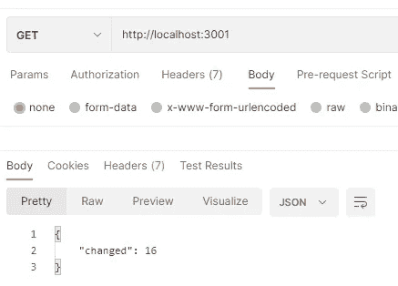
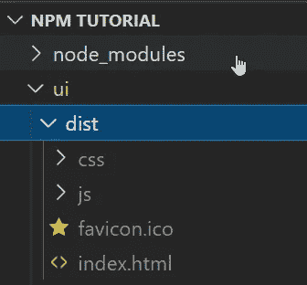

# 如何用 Node.js 和 Vue 创建 Web 应用

> 原文：<https://levelup.gitconnected.com/vue-node-web-application-59d3376e403e>

## 了解如何实现一个自包含的应用程序，它有一个节点后端和一个 Vue 前端

Node.js 是一个非常灵活的解决方案，用于多种目的，从构建角度应用程序到实现实时应用程序。因为它被用于所有的 Javascript 项目，所以这种技术也作为一个 API 平台正在传播。

在本文中，我们将学习如何设置首次使用的apt install nodejs npm # on ubuntu

安装完成后，您可以通过键入以下命令来检查安装的版本:

```
node -v
npm -v
```

现在 angular 已经安装好了，您只需要用`npm init`初始化您的节点项目。该命令提示一些问题，并将创建一个`package.json`文件。输出将类似于下面的代码片段，使用的数据是您对从 init 命令收到的各种提示的回答:

```
{
"name": "test",
"version": "1.0.0",
"description": "my fist package",
"main": "main.js",
"scripts": {
   "test": "test"
},
"author": "",
"license": "ISC"
}
```

这个文件包含一个对`main.js`文件的引用，为了运行这个应用程序，我们必须创建这个文件。我们将在初始配置完成之后再做这件事。

下一步是允许文件更改时热重新加载。这个特性在开发时非常有用，因为这样一来，每次我们更改文件时，节点服务器都会自动更新，这样就避免了每次停止和启动服务器并等待编译。该功能由`supervisor`模块提供，您可以通过以下命令安装该模块:

```
npm install supervisor --save
```

现在，您可以将命令定义到`package.json`文件中，更改以下几行:

```
"scripts": {
"serve": "node main.js",
"dev": "supervisor  main.js"
},
```

该设置允许:

*   run `npm serve`照常运行应用程序，就像在生产环境中一样
*   run `npm dev`用于在文件监听处于活动状态的开发环境中运行应用程序

既然设置已经完成，我们只需添加 main.js 文件，就万事俱备了。在下面的例子中，我们有一个简单的 API 来显示每秒递增的计数器值。

我们现在可以运行应用程序，并使用 Postman 测试输出:



邮递员调用的 API

这第一步已经完成，现在你可以开始使用 API 并构建你自己的应用程序了！

# **前端设置**

一旦后端应用完成，我们就可以专注于 UI 部分。您可以使用 Angular、React 或普通的 Javascript 库，但在本例中，我们将使用一个VUE_APP_APIURL=http://localhost:3000#.env
VUE_APP_APIURL=/

使用这种配置，当应用程序寻找`process.env.VUE_APP_APIURL`的值时，将获得生产环境中的相对路径(API 和 app 在一起)，但在本地，您将作为不同的应用程序访问后端。

现在是烘烤我们的应用程序的时候了！第一步是为构建配置 vue.js 应用程序。只需运行命令`npm run build`来创建输出目录。从下面的截图可以看到，这些文件位于`ui/dist`文件夹中。



生成的输出

我们可以告诉 Express 服务器在`app`路径上提供`index.html`文件。这可以通过添加以下代码行来完成。

```
app.use('/app', express.static(__dirname + '/ui/dist'));
```

这个命令将 URL `/app`映射到静态文件夹`./ui/dist`，构建命令在这里生成输出。

下一步是告诉 Vue 应用程序现在托管在子路径`/app`而不是`/.`中，这可以通过在`package.json`的同一文件夹中创建`vue.config.js`文件来完成，其内容如下:

```
module.exports = {
    publicPath: process.env.NODE_ENV == 'production' ? '/app/' : '/'
}
```

现在，我们能够打开浏览器进入`[http://localhost:3000/app](http://localhost:3000/app)`并使用构建的应用程序，同时在开发模式下运行应用程序。为了自动化构建过程，我们还需要一个步骤。将主应用程序的`package.json`更改如下:

```
"scripts": {
"serve": "cd ui & npm run build & cd .. & node main.js",
"dev": "supervisor  main.js"
},
```

注意`serve`命令。它构建前端应用程序，然后运行公开前一个命令输出的节点服务。

# 带什么回家

传统上，我们习惯于构建单一的应用程序并部署一个自包含的包。随着微服务模式的发展以及 UI(前端)和 API(后端)的分离，为单个应用程序进行多次部署变得越来越常见。例如，您可以让应用程序由一个 CDN 和许多为此提供 API 的容器提供服务。无论如何，仍然有很多情况需要在一个部署中同时部署两个部分(前端和后端)。

在本文中，我们看到了创建一个空应用程序并构建它是多么容易，嵌入前端和后端。此外，我们创建了一个 API，并从 Javascript 中使用它来呈现网页。这个简单的案例展示了将事情复杂化和实现真实应用程序的方法

喜欢这篇文章吗？成为 [*中等会员*](https://daniele-fontani.medium.com/membership) *继续无限制学习。如果你使用下面的链接，我会收到你的一部分会员费，不需要你额外付费。*

## 参考

*   [带有源代码的 git 库](https://github.com/zeppaman/node-vue-self-contained)