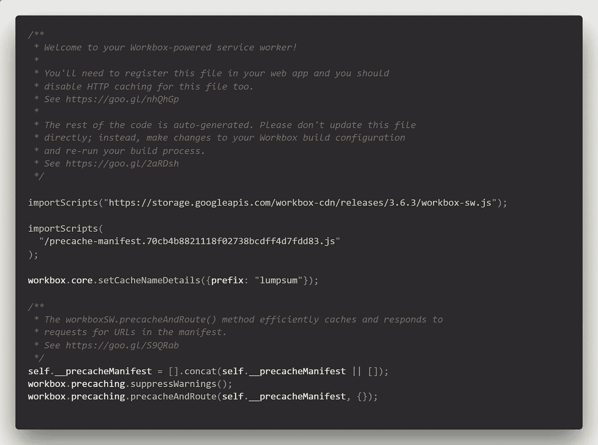
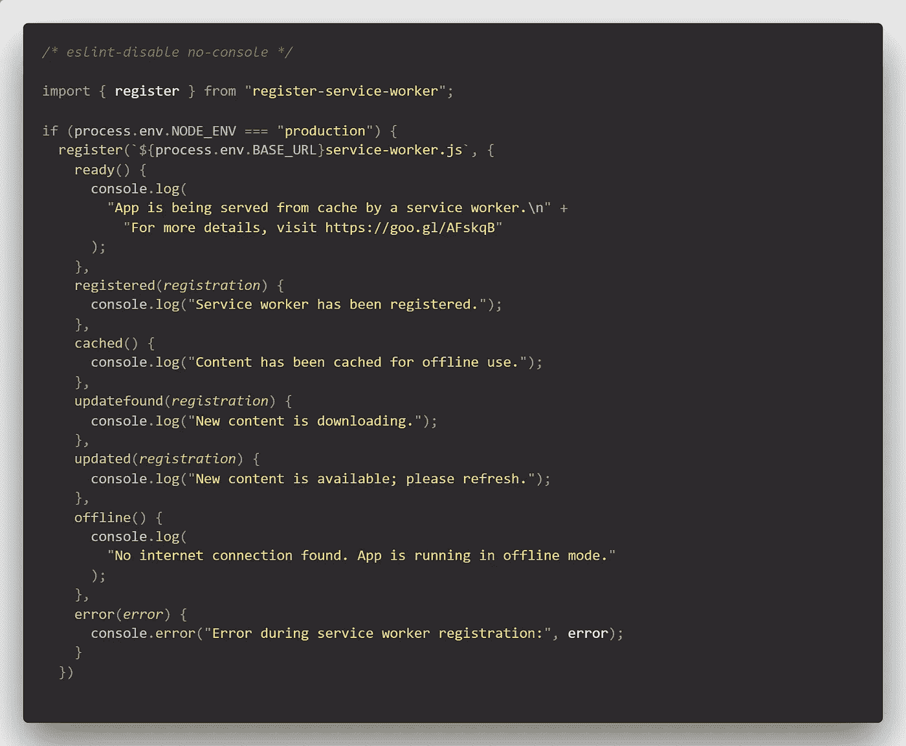
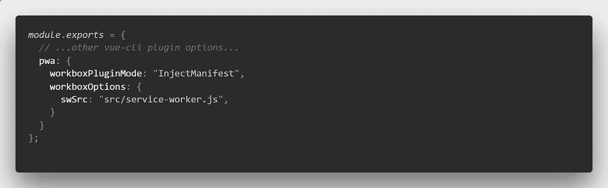
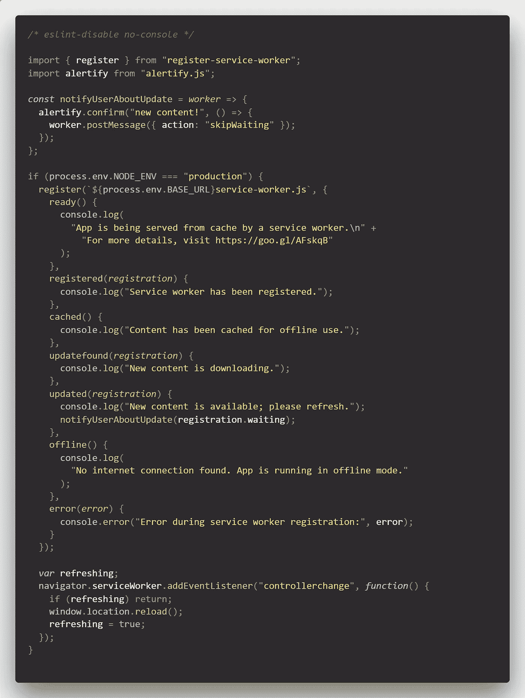
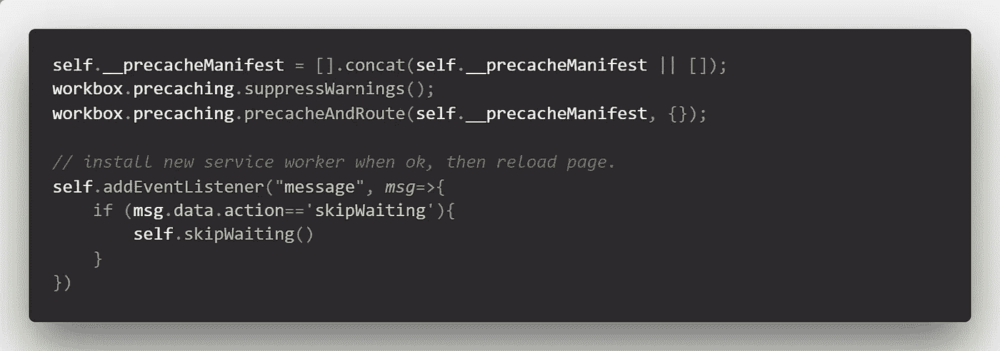
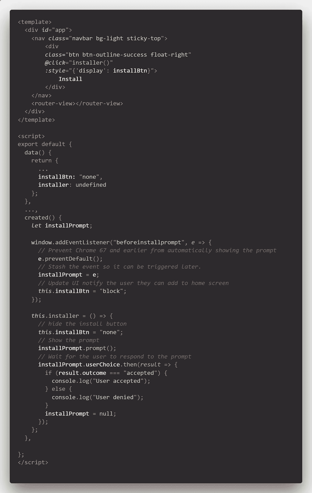

# Vue PWA 示例

> 原文：<https://levelup.gitconnected.com/vue-pwa-example-298a8ea953c9>

你好。在过去的几天里，我一直在尝试使用优秀的 [Vue CLI](https://cli.vuejs.org/guide/) 为我的公司运行 PWA。我特别希望能够离线使用该应用程序，使其可以在桌面上安装，并在 PWA 有新内容可用时通知用户，并触发页面重新加载。

关于这些可能性的文档相当分散，很难收集，而且没有很多是专门用于 Vue PWA 的。你可以在下面找到我的发现。

回购可以在[这里](https://gitlab.com/kobededecker/vue-pwa-example)找到。

# 默认服务人员

让我们从将 Vue/PWA 插件添加到我们的 Vue 应用程序开始(要使用 Vue CLI 生成新的应用程序，请阅读[这里](https://cli.vuejs.org/guide/creating-a-project.html#vue-create)的文档)。

```
vue add @vue/pwa
```

这将在`/src`目录中给你一个额外的文件:`registerServiceWorker.js`。该文件随后被导入`main.js`。该文件注册了运行`yarn build`生成的默认`service-worker.js`文件。该文件由集成在 Webpack 配置中的 Workbox 插件生成。

这个自动生成的`service-worker.js`文件如下所示:



自动生成的 dist/service-worker.js

如您所见，加载了一个 workbox CDN，然后加载了一个自动生成的`precache-manifest`。这个清单文件仅仅列出了由`vue build`进程产生的一些`js`文件。下面 3 行实际上是预缓存这个文件列表的过程。

`registerServiceWorker.js`文件如下所示:



默认 src/registerServiceWorker.js

这个文件从 VueJS 的人创建的`register-service-module`中导入了`register`函数，这使得注册服务人员和检测浏览器功能的过程更加容易。它给出了一些我们以后可以使用的事件注册。有些事件将注册对象作为第一个参数。

这个默认设置会给你提供:

*   所有构建文件的预缓存
*   离线加载应用程序的能力(一旦被缓存，当然)
*   许多服务人员注册事件，您可以在应用程序中对这些事件做出反应

对于更复杂的设置，包括通知、推送消息、“新内容”弹出窗口，你需要一个定制服务人员。

在下面的小节中，我们将配置 Vue 构建过程来使用一个定制的服务工作者文件，并且我们将配置它来注入和预缓存在`precache-manifest`中列出的构建文件。此外，我将向您展示一些您可以使用定制服务人员做的事情。

# 海关服务人员

要创建我们自己的`service-worker.js`文件，我们首先需要设置一些工具箱选项。这需要在`vue.config.js`文件中完成，如果你一直使用默认配置，可能需要创建这个文件。在 Vue 项目的根目录下创建文件，并使用以下配置选项填充它。



vue .配置. js

如您所见，我们将默认的`workboxPluginMode`从`GenerateSw`覆盖到`InjectManifest`。在`workboxOptions`中，我们将`swSrc` 指向我们需要在`src` 文件夹中创建的文件:`service-worker.js`。您也可以选择给服务工作者另一个名称，但是您需要在`registerServiceWorker.js`文件中更改默认的 sw 注册名称。

现在，创建一个空的`src/service-worker.js`文件。尝试运行`yarn build`，您将看到 Vue 构建过程将‘注入’清单文件，包括 Workbox CDN。然而，此时清单中列出的构建文件将不会用于预缓存，我们只导入服务工作者中的名称:因此我们需要复制默认自动生成的`service-worker.js`文件的底部 3 行，这是预缓存`precache-manifest`文件中列出的构建文件所必需的。

因此，我们现在拥有的是:我们有一个在构建阶段处理的自定义 service-worker.js 文件，我们最终得到一个 dist/service-worker.js，它几乎类似于当我们使用 GenerateSw 工作箱模式时自动生成的默认 service-worker.js 文件。现在，我们可以继续为定制服务工作者添加一些功能。

# 新内容通知

我们可以使用这个定制的服务工作器做的第一件事就是检测何时有新内容可用(当发现新的服务工作器时)，并向用户提供通知和刷新页面的选项。我们可以通过听一个事件来做到这一点，当一个新的服务工作器被找到并准备安装时，这个事件就会被触发。此时，服务工作人员将处于“等待”状态。如果您通读 PWA 在[上的解释 https://developer . Google . com/web/foundation/codelabs/you-first-pwapp/](https://developers.google.com/web/fundamentals/codelabs/your-first-pwapp/)，您可以看到服务工作器实际上只是在用户关闭浏览器时才被刷新。您可以通过单击 chrome devtools“应用程序面板”的“服务工作器”选项卡中的“skipWaiting”按钮，手动触发服务工作器的实际安装。

现在我们有了一个定制的服务工作器. js 文件，我们可以做的是:在`registerServiceWorker`(运行在浏览器窗口中)中，我们可以听到“更新”事件，并向`service-worker.js`(运行在另一个线程中)发送一条消息，告诉服务工作器“跳过等待”，然后自己安装。最后一步是监听服务工作器注册中的变化，并触发页面重新加载。新的服务工作人员带来的新内容将被加载。

所以，请查看我们修改后的`registerServiceWorker.js`文件如下:



修改了 src/registerServiceWorker.js

我们创建了一个函数`notifyUserAboutUpdate`，它将把一个`worker`对象作为参数。该功能将在服务人员更新时触发，如`updated`事件所示。一个重要的方面是通过`registration`对象的`waiting`工人。我们的自定义函数将触发一个确认弹出窗口，通知用户 PWA 有新的内容可用(使用优秀的 alertify.js 库)。一旦用户确认，则`registerServiceWorker.js`文件向`service-worker.js`文件“等待”发送消息，通知其到`skipWaiting`。

现在，在`service-worker.js`文件中，添加一个`eventListener`监听“消息”事件。检查该动作是否调用了“skipWaiting”，然后触发该`skipWaiting`功能。请在下面检查:



自定义 src/service-worker.js

所以，概括一下:当`registerServiceWorker.js`找到一个新的`service-worker.js`文件时，它会做必要的注册工作，当准备安装时，调用`updated`事件。这将要求用户确认重新加载新内容的应用程序，并将通知服务人员它可以跳过等待并自行安装。最后要做的一件事是:监听`registerServiceWorker.js`文件中的`controllerchange`事件，并触发页面重新加载(可以在上面显示的`registerServiceWorker.js`文件的底部看到)。平心而论，我并不完全理解上面的`refreshing`检查，但在这个 [SO](https://stackoverflow.com/questions/41891031/refresh-page-on-controllerchange-in-service-worker) 线程中发现了它。

# 安装弹出窗口

我们可以用新的 PWA 做一件额外的事情，就是要求用户将应用程序安装到桌面上。我们真的不需要定制`service-worker`，因为这可以通过默认的 Vue/PWA 设置来完成。

只需要添加一些东西，例如，主`App.vue`文件。添加一个按钮，例如下面的引导导航栏，默认情况下是隐藏的(使用 style=display:none)。该显示状态由反应数据属性决定，因此在 Vue SPC 的`data`部分注册`installBtn`。在`created`事件中，你可以监听“beforeinstalprompt”事件，一旦 chrome 检测到你的 PWA 应用符合一些要求，它就会启动这个事件。然后我们可以捕获事件，通过将`installBtn=none`状态修改为`block`来可视化我们的按钮。然后我们在一个`installer`函数中使用捕获的`installPrompt`，这个函数在点击按钮时被调用(使用`@click`处理程序)。该`installer`方法也需要在 SPC 的`data`部分进行初始化。用户点击我们的安装按钮，将得到默认的 Chrome 安装通知，我们的 PWA 将被安装到桌面上，准备离线使用。



App.vue 安装提示

[这个](https://love2dev.com/blog/beforeinstallprompt/)博客在构建 Vue 的安装设置时帮了我很多。

最后一点:首先令人困惑的是，服务工作者只有在从“localhost”或启用 https 的 URL 接受服务时才注册。此外，只有当您通过应用程序的生产版本加载应用程序时，服务人员才会工作。开发起来稍微复杂一点，但是你需要运行`yarn build`，然后使用一个小的服务器比如节点模块`http-server`来服务这个应用。

我希望这能帮助一些正在寻找正确信息的人，这些信息很难找到。

如果你发现任何可以改进的元素，请在下面发表评论！

[](https://levelup.gitconnected.com)[](https://gitconnected.com/learn/vue-js) [## 学习 Vue.js -最佳 Vue.js 教程(2019) | gitconnected

### 27 大 Vue.js 教程。课程由开发者提交并投票，让你找到最好的 Vue.js…

gitconnected.com](https://gitconnected.com/learn/vue-js)