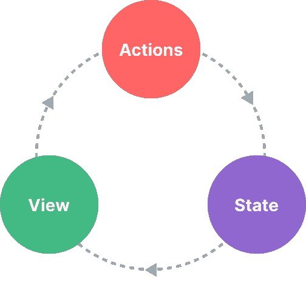

# Vue 反应系统比你想象的更强大

> 原文：<https://levelup.gitconnected.com/vue-reactivity-system-is-more-powerful-than-you-think-37b1924d681b>

Vue 3 及其组合 API 和增强的反应系统会让 web 开发人员笑逐颜开。我没开玩笑。


最近，我一直在我的项目中使用 Vue，从为大学作业开发应用程序到作为网络开发人员的自由职业者的需求。我现在已经对 Vue 上瘾了。

除了 Vue.js 的简单和渐进原则，这个框架还为前端开发提供了很多特性。起重要作用的主要部分是反应系统。

# 为什么反应？

前端开发很简单。在一般情况下，您只需要显示从后端获得的数据，无论是动态的还是静态的。剩下的只是让界面看起来像✨eye-catchy✨，让用户体验更好。至少，“好用”两个字就够了。

使用普通的 js 来处理逻辑是*好的*，但是这都是有趣的游戏，直到你需要处理当一些回调、条件或事件发生时需要在视图上更新的动态数据。简单地说，这就是用普通的 javascript 编写一个简单的计数器应用程序要做的事情。

对于普通的 js，我们需要大量的样板代码来保证工作正常。我们必须等待 DOM 准备好，查询 DOM 组件，设置`onclick`事件，然后在事件发生时手动更新视图。

是的，我知道这个例子过于简单，但是想象一下，你有复杂的应用程序，有复杂的特性和逻辑。做简单却显而易见的事情太费力了，不是吗？

现在让我们看看如何使用 Vue(使用 Vite 和 Typescript)实现相同的功能。

顺便说一下，上面的例子是用 Vue 的 Composition API 写的。它是 Vue 早期版本中引入的先前选项 API 的继承者。TLDR；Composition API 引入了一种新的方式，用更健壮、更简单、回调更少的 mess API 编写 Vue。我将在另一篇文章中解释这些 API 之间的区别。

请注意，在`src/components/Counter.vue`中，我在这个设置中添加了相同的计数器功能:

```
<script ... >
  ...

 **const count = ref(0);**
</script><template>
  ...
  <span>**{{ count }}**</span>
  <primary-button title="-"     **@click="count--"** />
  <primary-button title="+"     **@click="count++"** />
  <danger-button  title="Reset" **@click="count = 0"** />
</template>
```

使用带有`@click`事件绑定的`ref`就足以完成这项工作。Vue 的反应系统会处理剩下的。

简单而有趣。但是你猜怎么着？`ref`是一只巨猿。它能做一些超乎你想象的强大的事情。去看看`src/components/Video.vue`里的文件

```
<script ... >  
  ... **const video = ref<**[**HTMLVideoElement**](https://developer.mozilla.org/en-US/docs/Web/API/HTMLVideoElement)**>();**

  onMounted(async () => {
    await setupVideo(video);
    video.value.play();
  });

  async function setupVideo(video: HTMLVideoElement) {
    video.value.width = 640;
    video.value.height = 320;
    video.value.allowfullscreen = true;
    video.value.controls = true;
    video.value.type = "video/webm";
    video.value.src = " ... ";
  }
</script><template>
  **<video ref="video" />**
</template>
```

有了 Composition API，`ref`可以在接近 0 的配置下，用静态类型自动绑定 DOM 元素。你只需要声明与 HTML `ref`标签名和元素类型同名的`ref`变量。大多数 DOM 类型都是从`[HTMLElement](https://developer.mozilla.org/en-US/docs/Web/API/HTMLElement)`继承的，因此使用该类型就可以完成这项工作。

在以前版本的 Vue 中，可以通过`this.$refs`访问`ref`。在 Vue 3 中不再推荐这种方法，尤其是当您使用 Typescript 来避免静态类型问题时。

我还没说完。工作过度却报酬过低。但是在我继续深入之前，是时候谈谈 Vue 中的状态管理理论了。

# 会见州经理


由[卡通网](https://tenor.com/official/cartoonnetworkla)在[上拍摄的照片](https://tenor.com)

如果你尝试过一些前端框架(比如 Vue，React 等。)，听到“国家管理”二字是常有的事。但如果你没有，我就简单解释一下。

从技术上讲，每个 Vue 组件实例已经“管理”了它的反应状态。正如上面的例子中所解释的，我们已经使用了`ref`来管理组件实例状态。

“组件”是由以下部分组成的独立单元:

*   状态是驱动我们应用的真理的来源。
*   视图是状态的声明性映射。
*   这些动作是状态响应来自视图的用户输入而改变的可能方式。



“单向数据流”概念的简单表示:

根据给定的简单计数器示例，当用户单击递增、递减或重置按钮时，会发生相应的操作。状态是`count`变量，视图是显示给用户的计数文本。

这种行为被称为“国家管理”。

然而，当我们有多个共享同一状态的组件时，状态管理的简单性就开始失效了:

*   多个视图可能依赖于同一个状态。
*   来自不同视图的动作可能需要改变同一个状态。

# 使用反应性 API 进行状态管理


由[漫画网](https://tenor.com/official/cartoonnetworkla)在[上拍摄的照片](https://tenor.com)

有时候，随着你的应用变得越来越大，你需要管理全局应用的状态，而不仅仅是组件级的状态。这意味着每个组件都可以获得或改变应用程序全局上下文中的状态。

使用 Vue 的 Reactivity API 来实现这一功能是轻而易举的事情。如果您有一个应该由多个组件实例共享的状态，您可以使用`ref`创建一个反应对象，然后从多个组件导入它。

要在 Vue 中实现这样的功能，您只需要创建一个如下所示的`store`实例:

```
***// store.ts***
*import* { ref } *from* 'vue'

*export* const store = ref({
  count: 0,
  increment() {
    this.count++
  }
})
```

并将其应用于 Vue 组件中。

```
***<!-- ComponentA.vue -->***
<script setup lang="ts">
*import* { store } *from* './store'
</script>

<template>
  <button @click="store.increment()">
    From A: {{ store.count }}
  </button>
</template>
```

或者在其他 Vue 部件中。

```
***<!-- ComponentB.vue -->***
<script setup lang="ts">
*import* { store } *from* './store'
</script><template>
  <button @click="store.increment()">
    From B: {{ store.count }}
  </button>
</template>
```

现在每当`store`变异的时候，`<ComponentA>`和`<ComponentB>`都会自动更新自己的观点。我们现在有了唯一的真相来源。这也意味着任何导入`store`的组件都可以随意改变它，例如通过调用 store 对象中的`increment()`。

> *注意按钮的点击处理程序使用带括号的* `*store.increment()*` *。因为它不是一个组件方法，所以有必要用适当的* `*this*` *上下文调用该方法。*

# 州管理图书馆

虽然使用 Reactivity API 解决方案的状态管理在简单的场景中就足够了，但是在大规模生产应用程序中还有许多事情需要考虑:

*   团队协作的更强约定。
*   与 Vue DevTools 集成，包括时间轴、组件内检查和时间旅行调试。
*   热模块更换。
*   服务器端渲染支持。


照片由[海龟 223](https://tenor.com/users/turtlepirate223) 在[男高音](https://tenor.com)上拍摄

考虑到以上需求，可以使用 Vue 的状态管理库比如 [Pinia](https://pinia.vuejs.org) 或者 [Vuex](https://vuex.vuejs.org) 。

Pinia 是一个实现上述所有需求的状态管理库。它由 Vue 核心团队维护，可用于 Vue 2 和 Vue 3。现有用户可能对 Vuex 很熟悉，它是 Vue 以前的官方状态管理库。

# 结论

在一个简单的场景中，使用`ref` Reactivity API 作为状态管理器是如此轻而易举。对于复杂的用法、HMR 和 SSR 支持，我们可以使用其他 Vue 的状态管理器，如 Pinia 或 Vuex。没问题。

Vue 的反应 API 使用起来简单有趣。然而，关于反应性 API 还有很多要讨论的。我迫不及待地想再写一篇关于这个的文章。