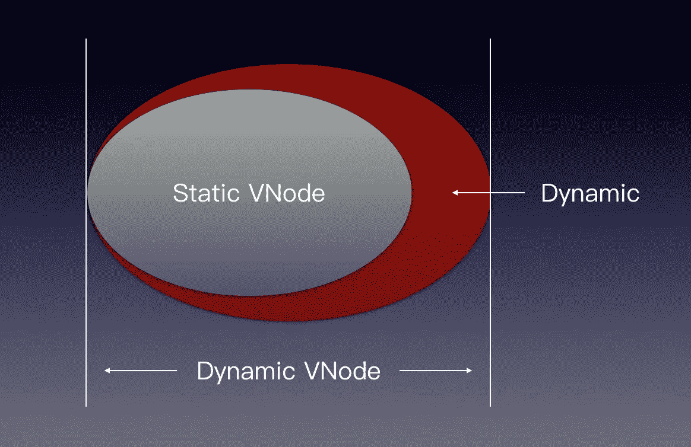
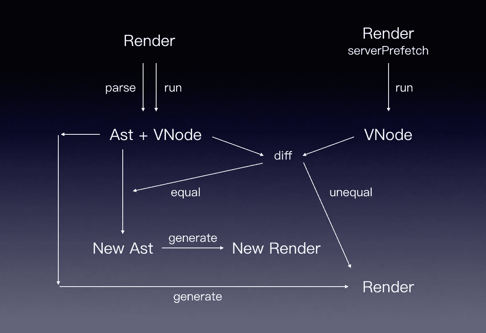

# Vue SSR 实时编译

> 原文：<https://levelup.gitconnected.com/vue-ssr-just-in-time-compilation-9a8949245c7c>

> 当我们在服务器端渲染 Vue 应用时，无论服务器进行多少次渲染，VNode 渲染的大部分字符串都是不变的，有些是来自模板的静态 html，有些是来自模板动态渲染的节点(虽然有可能动态节点在客户端可能发生变化，但在服务器端是不变的)。提取这两种类型的节点并在服务器端仅呈现真正动态的节点(那些与服务器预取预取数据相关联的节点)可以显著提高服务器端的呈现性能。

从 Vue 模板中提取静态 HTML 只需要在编译时解析模板结构。要确定动态节点在服务器端呈现阶段是否是静态的，需要在运行时区分 VNode。将动态节点转换为静态 HTML 需要修改呈现函数的源代码，我们将这种用于在运行时优化服务器端呈现函数的技术命名为 SSR 即时编译(JIT)。**Github:**[vue-SSR-JIT](https://github.com/SmallComfort/vue-ssr-jit)

# **JIT 差分算法**

第一个问题是如何区分，为此您需要两个 VNode，一个通过 serverPrefetch / asyncData 加载动态数据，我们称之为动态 VNode，另一个不加载任何数据，我们称之为静态 VNode。我们大胆假设静态 VNode 为任何用户呈现一致的 html，静态 VNode 是动态 VNode 的子集，不同用户的差异点在于静态 VNode 和动态 VNode 的互补。



> 上述假设对于绝大多数 web 应用程序来说都是成立的，一些意外情况会在本文的最后讨论。


预优化的动态虚拟节点渲染流程图如下。


优化的动态虚拟节点渲染流程图如下。


# **如何修改渲染函数的源代码**

修改渲染函数的难点在于如何建立 VNode 和源代码的对应关系，否则我们无从得知要优化的节点是从哪段代码生成的，这显得非常困难。幸运的是，Vue 的模板语法提供了很好的约束，内置的编译引擎确保了渲染函数的可预测代码结构。

通过编译下面的模板代码生成的呈现函数的结构是有据可查的。

```
<template> <div> <static-view/> <dynamic-view/> </div></template>
```

上面的模板将被编译成下面的函数

```
_c("div", [ _c("static-view"), _c("dynamic-view")], 1)
```

Execute _c(xxx)生成一个 VNode 节点，parse _c(xxx)生成一个 AST。将 AST 绑定到 VNode，如果当前 VNode 是静态节点，则修改 AST，并在 VNode 树遍历之后将 AST 转换为可执行代码。可执行代码包含我们为 VNode 所做的优化。详细的技术实现可以在项目中的 patch.js 和 patch-context.js 文件中找到。

下面的流程图演示了修改渲染函数源代码的过程。



一个简单的例子如下

```
<template> <div> <router-link to="/">{{name}}</router-link> <router-view></router-view> </div></template><script>export default { data() { return { name: 'vue-ssr-jit' } }}</script>
```

由官方编译器生成的代码

```
_c("div", [ _c("router-link", {attrs: { to: "/" }}, [ _vm._v(_vm._s(_vm.name)) ]), _c("router-view")], 1)
```

由实时编译器生成的代码

```
_c("div", [ _vm._ssrNode( "<a href=\"/\" class=\"router-link-active\">vue-ssr-jit</a>" ), _c("router-view")], 1);
```

# 如何使用它

**安装**

```
npm install --save vue-ssr-jit
```

**使用**

```
const { createBundleRenderer } = require('vue-ssr-jit')
```

` createBundleRenderer '与官方同名函数接口一致，参见 [vue ssr 指南](https://ssr.vuejs.org/api/#createbundlerenderer)

建议使用“serverPrefetch”预取数据，也支持使用“asyncData”预取数据，参见[演示](https://github.com/SmallComfort/vue-ssr-jit-demo)

# **这些导致优化失败。**

**饼干**

除非您确定这些数据与用户无关，否则不要在服务器端呈现周期中使用 cookies。Cookies 可以在 serverPrefetch / asyncData 方法中使用，也可以在服务器渲染周期之后使用，例如“已安装”、“已更新”等。

不推荐使用。

```
data() { let cookie = cookie; try { cookie = document.cookie; } catch(e) { cookie = global.xxx.cookie; } return { cookie };},
```

推荐用法。

```
mounted() { this.cookie = document.cookie;},
```

**v-代表**

“v-for”指令建议单独包装 DOM 元素，不建议与其他组件一起使用。因为 for 循环破坏了 AST 与 VNode 节点的对应关系，所以包含 v-for 指令的节点将不会被优化，除非节点级别都是静态的。

不推荐使用。

```
<template> <div> <div v-for="item in items" :key="item.id">{{item.value}}</div> <static-view></static-view> </div></template>
```

推荐用法。

```
<template> <div> <div> <div v-for="item in items" :key="item.id">{{item.value}}</div> </div> <static-view></static-view> </div></template>
```

**关闭**

在某些场景下，渲染函数引用一个闭包变量，进而影响一个动态节点，通过 ast 反向生成的渲染函数无法跟踪之前的闭包引用，执行时会因为找不到变量而抛出错误。发生这种情况时，解析引擎将放弃当前组件的 AST 优化，而使用预优化的呈现函数。

不推荐使用。

```
<template> </template>
```

推荐用法。

```
<template> </template>
```