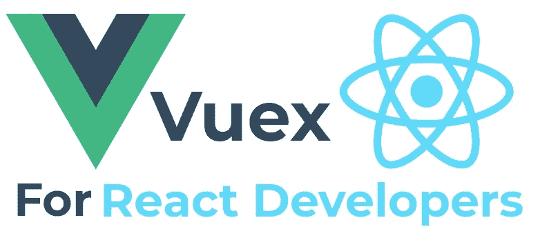
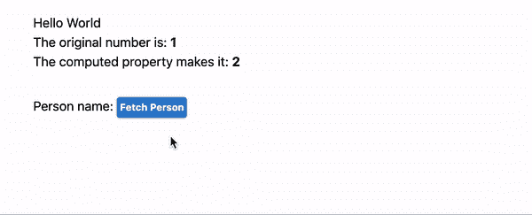
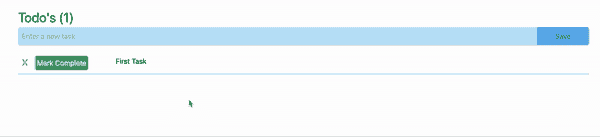
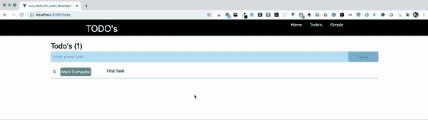

# 面向 React 开发人员的 Vue 状态管理(Vuex)

> 原文：<https://levelup.gitconnected.com/vue-state-management-vuex-for-react-developers-4ae032d9c75e>



这篇文章的目标读者是那些有兴趣了解更多关于 Vue.js 中状态管理的人，但是我相信那些没有接触过 Vue 如何处理状态的 [react](https://reactjs.org/) 开发者也会特别感兴趣。

# 写这篇文章的原因

我为什么要写这篇文章？好吧，我在 React 中应用程序状态管理的所有体验都是负面的，说得好听点，我其实很喜欢使用 Vuex。我想分享我认为更好的陈述方式。如果你很少或没有 Vue 的经验，并且来自 React / Redux 背景。我希望你会喜欢我给你看的东西，并带走一个积极的信息。

我想让 React 开发人员看到 Vue 是如何处理组件和应用程序状态的，以及它是如何集成这两者的，我认为这是一种非常优雅的方式。

react 中的组件状态是正常的，对于一个非常基本的 SPA 来说，可能需要比 Vue 稍少的代码。我仍然会讨论 Vue 的组件状态，因为它是如何将应用程序状态集成到组件中不可或缺的一部分。

React 中的应用状态是事情变得混乱的地方，它是狂野的西部(冷静下来，爱，这只是我的观点)，但我不会为我的观点道歉。作为一名开发人员，你要靠自己。你得自己选择一个状态包，每个选择都有妥协。

react 中的应用程序状态管理有一些优点，但那是一篇让其他人去尝试和编写的文章。

# 什么是 Vuex

[Vuex](https://vuex.vuejs.org/) 是用于 Vue 中应用状态管理的包。它是由维护 Vue 的同一个团队维护的，所以可以保证你的兼容性。Vuex 与 Vue 紧密耦合，所以它被设计得尽可能简单，而且(我认为)使用起来很愉快。这种紧密的耦合并不妨碍你使用 [redux](https://redux.js.org/) ，如果你真的不想把那些针推进你的眼睛的话:-)。

# 我的例子将涵盖什么

*   组件状态
*   应用状态
*   将外部 API 集成到组件和应用程序状态中。(使用 [SWAPI](https://swapi.dev/) API)
*   持续状态(浏览器刷新后状态持续)

**完整代码:**本教程的完整代码可以在 GitHub 上获得，因此您可以快速克隆和实验。[https://github . com/simonjcarr/vue _ state _ for _ react _ developers](https://github.com/simonjcarr/vue_state_for_react_developers)

# 组件状态

**没有状态的组件**

Vue 中的组件可以像下面的代码一样简单，但是它没有状态。

**数据方法**

然而，要在组件级别启用状态，我们必须添加一个`script`部分。在最简单的场景中，我们只需导出一个数据方法，该方法返回一个对象，该对象中的每个键都可以在模板部分中使用字符串插值来引用。

**计算属性**

向 Vue 添加计算属性就像导出另一个属性一样简单，令人惊讶的是，这个属性叫做`computed`

我们再次使用字符串插值来调用计算属性`addOne()`，它简单地返回值`myNumber`并加 1。

**方法**

我们可以做更复杂的事情，比如用方法访问远程数据源。下面的代码有点复杂，但我会带您浏览一下。

在我们浏览代码之前，下面是结果。



这里发生了什么？

我将`swPerson`添加到 data()中，并将其初始化为`null`

我在与`data`和`computed`相同的级别上创建了一个新的`method`属性。在属性内部，我添加了一个接受一个属性`id`的`getPerson`方法。该方法使用`fetch`通过传入的 idi 连接到 swapi api，并获取一个星球大战角色。它将结果转换为 JSON 并存储在`swPerson`中

我创建了一个`computed`属性`personName`。它检查`swPerson`是否为空。如果它是 null，那么它简单地返回 null，如果它不是 null，它返回星球大战角色的名字。

有了上面的内容，我就可以更新下面的`template`

`{{ personName }}`是计算出的属性。如上所述，它将返回 null 或星球大战角色名。

我在按钮中再次使用了`personName`，这次使用了一个叫做 Vue 指令的东西。在这种情况下是`v-if`指令。`v-if="!personName"`表示如果 personName 为空，则显示该元素，在本例中是一个按钮。如果不为空，按钮应该隐藏。按钮上还添加了一个`@click`事件处理程序。这个处理程序调用`getPerson(1)`方法，传入我们想要获取的字符的 id。

总之，当点击按钮时，`getPerson`从 SWAPI api 获取数据并更新`swPerson`。这导致计算属性 personName 更新 DOM。显示角色的名字，隐藏按钮。我希望你同意，这真的很优雅。

组件中还有许多其他可用的属性，但是我不打算在这里介绍它们。如果你想要更多的细节，你可以看看 Vue 网站上的 [Vue 组件](https://vuejs.org/v2/guide/components.html)。

# 应用状态

现在我们来看看 Vuex，以及它是如何在应用层管理状态的。

这将加快我们在上面看到的简单组件状态的步伐，但是我希望你会同意，它仍然是相对简单的，并且使用起来很愉快。

**安装**

当你用`Vue create myapp`创建一个新的 Vue 应用时，你会被问一系列关于你想在应用中包含什么的问题，Vuex 是其中一个选项。即使您在创建应用程序时没有安装 Vuex，以后安装它也非常容易。

完整的安装说明可以在这里找到，但是很简单

```
npm install vuex
```

最佳实践是在应用程序的根目录下创建一个名为`store`的文件夹。对于简单的状态管理，我们只需要一个文件。随着你的应用程序越来越大，我们使用模块，每个模块在不同的文件中，因此最好把你的状态文件放在一个文件夹中。如果你在使用 Vue 创建新应用时选择了 Vuex，这个文件夹已经存在，里面是一个文件`index.js`

这个文件将保存一个简单应用程序的所有状态配置。

您将看到 Vue 和 Vuex 被导入到文件的顶部。

`Vue.use()`是我们教 Vue 做新东西的说法。所以`Vue.use(Vuex)`本质上是教 Vue 它需要知道的关于 Vuex 的一切。

在文件的底部，创建并导出了一个新的`Vuex.store`实例。当我们创建一个新的商店时，我们传递配置，它由`state`、`mutations`、`actions`和`modules`组成。如果你使用过 redux，你会很清楚这些是如何工作的。

当然，Vue 不知道这个文件的存在，所以我们必须在`main.js`中导入它，然后告诉我们的应用程序使用它。我在相关的两行中添加了注释。正如我上面所说的，如果你使用`vue create xxxx`创建一个新的应用程序，所有这些都是为你创建的。

**向 Vuex 添加一些状态**

我将创建一个非常简单的 todo 应用程序，它将 ToDo 任务存储在 Vuex 中。

让我们从创建一个新模块开始，以保持我们的应用程序在逻辑上的分离。

我将创建一个新文件`/store/todo.js`

并将其导入`/store/index.js`

我已经注释了两行代码。就是这样！我们的新模块已经可以使用了。让我们创建一个任务对象并用第一个 todo 预加载它。

在`/store/todo.js`

现在我将添加一些突变，因为我们不应该直接改变状态。很快我将向您展示一个 chrome dev tools 插件，它为我们提供了所有更改和时间旅行功能的日志。

我增加了 3 个突变。`addTask`、`setTaskStatus`、`deleteTask`

这里有几件值得注意的事情。

我导入了`lodash`来帮助过滤任务，导入了`uuid`来为每个任务创建一个 ID。

如果我们愿意，我们可以在这里停下来，直接从我们的组件中调用这些突变，但为了完整起见，我还将创建一些操作，这些操作将调用，反过来，它们将提交这些突变。

在这种情况下，我们所做的就是调用变异，然而，当它们被用来调用外部 api 时，动作是非常强大的。稍后我们会看到更多的星球大战角色使用 Vuex 动作。

商店现在可以使用了。我现在将向您展示从一个组件与状态交互是多么容易。

**待办事项组件**

在文件`/views/Todo.vue`中，我将从下面的基本代码开始。

我要做的第一件事是将 Vuex 状态绑定到组件。我们使用 Vuex `mapState`提供的助手来完成这项工作

我们在计算属性中使用映射状态，如下所示

我导入了`mapstate`，然后使用扩展操作符`...`从`Todo`模块映射`tasks`的状态。如果我在那个模块中有不止一个状态，我也可以把它包含在数组中。如果我想映射另一个模块的状态，我可以添加另一个`...mapState`

让我们做一个类似的动作。

你会发现这真的很简单，唯一的区别是我们映射的 Vuex `actions`被包含在`methods`属性中。

**建筑出模板**

现在剩下要做的就是为组件模板部分编写 HTML，并为添加任务表单添加一些本地状态。

这是不带表单的 Todos，它允许我们使用一个硬编码的 todo。我们可以删除它并改变它的状态。

在上面的代码中，我添加了一个删除任务的按钮。这将调用我们已经映射的`deleteTask`方法，并传入`task.id`

我创建了另一个按钮来改变任务的完成状态。当\@click 事件触发到`setTaskStatus`时，它发送一个包含我们想要分配给任务的`id`和`status`的对象。

```
@click="setTaskStatus({ id: task.id, status: !task.complete })"
```

我使用一个名为 v-bind 的 Vue 特性来映射动态类，并根据 task.complete 为按钮设置了正确的文本。

```
:class="{
'bg-green-500 text-white': !task.complete, 
'bg-red-500 text-white': task.complete
}"{{ task.complete ? "Mark not Complete" : "Mark Complete" }}
```

我还根据 task.complete 为任务标题设置了一些文本样式

```
:class="{ 'text-red-500 line-through': task.complete }"
```

**添加新的任务表单**

让我们添加一个表单。实际上，我将为表单创建另一个组件，但是为了让您完整地看到该组件，我将在该组件中执行所有操作。

这是完整的组件。我为 data()设置了一个新属性`newTask`,并使用`v-bind`到`newTask`绑定了表单输入

你会注意到表单使用了一个\@submit.prevent，这个`.prevent`被称为 Vue 修饰符，这样我们就不用手动获取表单对象和`preventDefault`。无论如何，当提交表单时，会调用`addTaskSubmit`方法。这是 turn 调用 Vuex 中的`addTask`并传入`newTask`的值

Vuex 一更新，我们的待办事项列表就会显示新任务。


# 使用 Vuex 访问远程数据

我们快到了，我要给你看一些没有意义但你可能会感兴趣的东西。

我将为每个任务添加一个`completedBy`属性，当任务被标记为完成时，将从 SWAPI 中获取一个随机的星球大战字符，并使用名称字段来更新 completedBy。

我们在组件中唯一需要改变的是将 completedBy 字段添加到 Todo 列表中。我会先做的

现在我将更新`/store/todo.js`

您将看到我已经将新属性`completedBy`添加到了`tasks`中，并在创建新任务时包含了它。

当一个任务被更新时，我简单地调用 SWAPI API 上的 fetch，这次传入一个 1 到 10 之间的随机数，并用角色名更新了`compltedBy`字段。



# Vuex 持续状态

我想与你分享的最后一件事是，我们如何能够非常容易地在浏览器刷新之间保持状态。

我将安装一个 npm 模块【https://www.npmjs.com/package/vuex-persistedstate 让它变得如此简单，简直是疯了。

在主存储文件`/store/index.js`中导入它

```
*import* createPersistedState *from* 'vuex-persistedstate'
```

然后添加一个新属性`plugins`并告诉 Vuex 加载它。

有了这两行代码，我们现在可以刷新浏览器，我们的状态得到了维护。



# 摘要

我希望你喜欢这篇文章。它比我想象的要长得多，但是有相当多的东西需要解释。

这篇文章的目的是向 React 开发者展示 Vue 在状态管理方面提供了什么。我希望我做到了。不管你喜不喜欢这篇文章，请留下评论，让我知道你的想法。