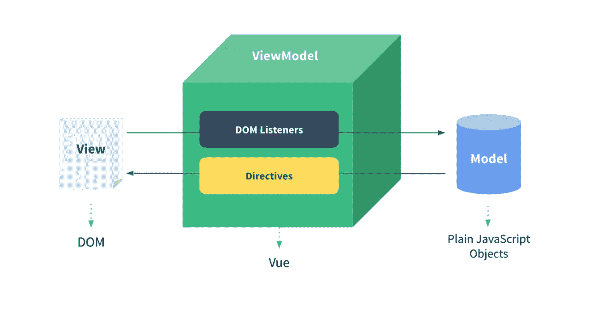
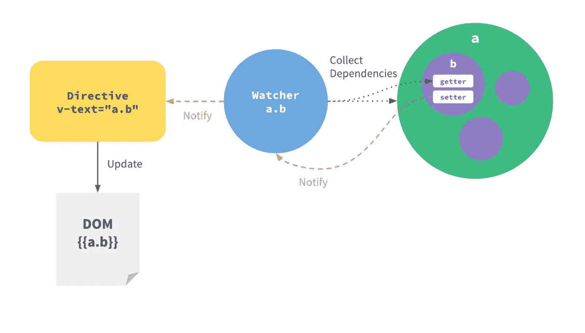
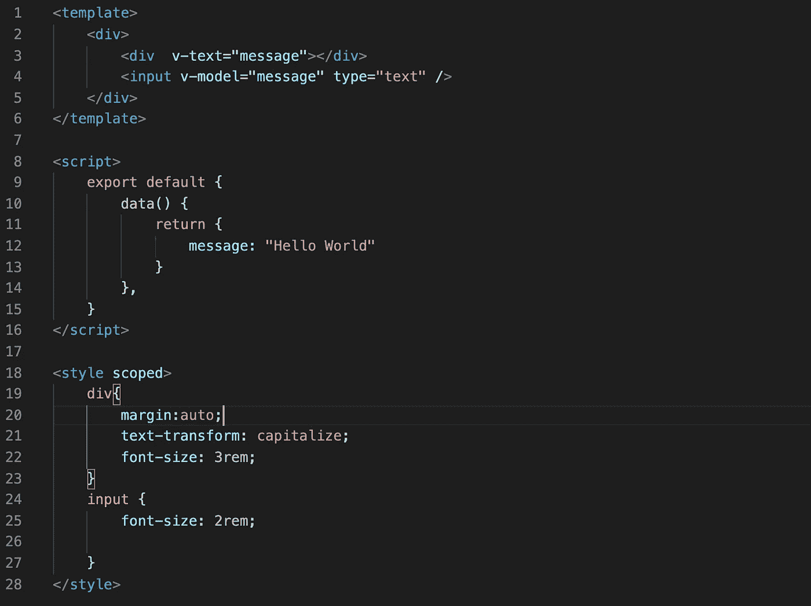
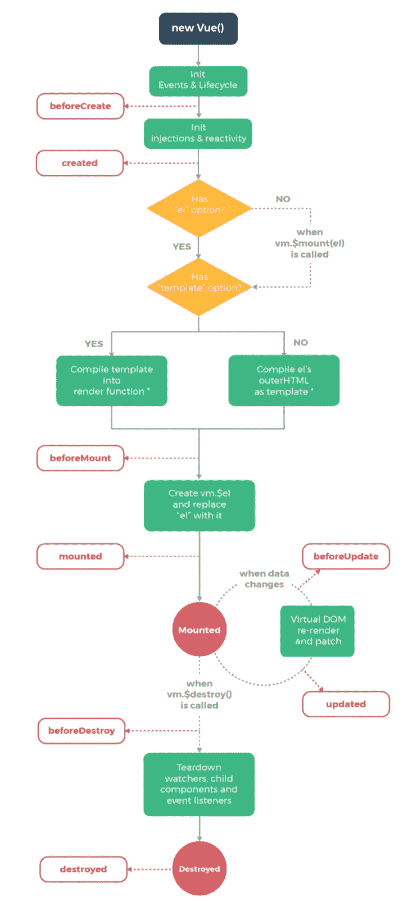

# Vue 与竞争对手

> 原文：<https://levelup.gitconnected.com/vue-vs-the-competition-bea57a45a117>

Vue.js 是一个广泛使用的前端框架，但它有什么独特之处呢？它与其他顶级前端框架有什么不同？


Vue.js 徽标

Vue 是一个流行的、被广泛采用的开源 javascript 框架，可以让你构建网页布局和单页应用。但是它与其他框架的区别是什么呢？这篇文章将深入探究 Vue 与其他顶级框架的不同和独特之处。

1.  **Vue 的起源**
2.  **MVVM 结构**
3.  **独特的文件结构(。vue 文件)**
4.  **组件生命周期**
5.  **面向对象的结构**

# **Vue 的起源**

Vue.js 是一个开源的 MVVM Javascript 框架，用于构建 UI 和单页面应用程序。它是由尤雨溪在 2014 年创建的，由他自己和其他活跃的核心团队成员维护。Vue.js 是开源的，所以如果你有你认为应该添加到核心系统的特性，考虑做一个拉请求，或者一个支持包。

Vue 被设计成可增量采用的。这意味着核心引擎被设计成易于使用，没有一大堆花里胡哨的东西，所以你可以从零开始，并在进行中添加功能和插件。你可以直接把 Vue 作为一个脚本标签导入到你的 HTML 中，并在另一个脚本标签中开始原型化一个 Vue 实例，不需要编译器。有一些用于路由、服务器端渲染或状态管理的包，您可以根据需要慢慢地将它们集成到您的构建中。较大规模的应用程序可以利用编译器和捆绑器。

在 React、Angular 和 Vue 这三个主要框架中，Vue 可能是最接近普通 Javascript、HTML 和 CSS 的框架。如果你熟悉 HTML、CSS 和 Javascript 在 web 应用程序中的交互方式，那么 Vue 就很容易掌握和理解。

# **Vue 的 MVVM 结构**



Vue 的 MVVM 如 [Vue 文档](https://012.vuejs.org/guide/#Concepts_Overview)所示

MVVM 代表模型-视图-视图模型。它是传统模型-视图-控制器(MVC)模型的变体，允许双向数据绑定。

在 MVVM 模式中，Vue 是 ViewModel，它是将视图与数据联系起来的对象，通过一个调用和观察器系统以及一个称为指令的简单工具来更新视图和数据以保持彼此同步。

```
<div v-on:click="exampleFunction" v-text="message"></div>
```

这些 HTML 标签表示 Vue 实例控制和更新的动态绑定数据点。这简化了表单创建，例如，通过更改搜索参数来更新数据。有几种方法来表示这些绑定:就像上面看到的 HTML 属性一样，通过像{{data_pt}}这样的 mustache 绑定，以及基本绑定的变体或扩展。下图是 Vue 实例中典型的数据更新流程。



如 [Vue 文档](https://012.vuejs.org/guide/#Concepts_Overview)所示的指令更新示例

Vue 的模型是一个修改过的 javascript 对象，已经被创建，然后用 getters 和 setters 实现。这些很重要，因为 Vue 是基于监听这些 getters 和 setters 来设置绑定的。因此，你实际上从来没有直接改变数据，Vue 是为你做的。

# **Vue 独特的文件结构**

Vue 采用了 DOM 模板，这使得它们独特的 Vue 扩展文件看起来非常像普通的 HTML 文件。Vue 文件有一个包含 HTML 模型的模板、一个包含表示组件模型的 javascript 对象的 script 标签和一个包含 CSS 或一些确定模板样式的 CSS 编译变体的 style 标签。



Vue 文件模板的一个简单例子。显示由数据绑定输入控制的文本标题。

上面的文件代表了一个由用户输入控制的简单文本头。数据表示是组件对象上的一个方法，由 Vue 获取，绑定到适当的 HTML 元素，然后插入到更大的模型中。绑定的 HTML 元素可以像标题一样反映数据，有时还可以通过它们的绑定来更新数据，比如输入。

Vue 的语法被设计成尽可能地与原始 HTML 文件相似，以便于使用。应该注意的是，这并不完全是 HTML，因为 Vue 支持在 HTML 模板中插入子组件，属性被解析并相应地改变你的模板，如果你有兴趣使其适应你的代码库以获得更多的 Javascript 能力和灵活性，Vue 甚至支持 JSX。

# **Vue 组件生命周期**



Vue 的组件在创建、安装、更新和销毁时会经历生命周期触发器。

每个生命周期方法都可以作为一个方法放在 Vue 实例对象上，当组件触发那个动作时，函数就会运行。

钩子 beforeCreate 和 created 在呈现 Vue 实例之前运行。创建的钩子可以访问数据和反应性，所以如果您想触发数据库调用，在元素被呈现之前，这将是一个很好的地方。Created 将新的 Vue 实例放在虚拟 DOM 中。

beforeMount 和 mounted 生命周期触发器围绕 Vue 模板的实际 DOM 插入发生。如果您想查询$el 数据点，Mounted 可以访问它。

beforeUpdate 和 updated 挂钩围绕触发 Vue 实例更新的数据变化触发。在上面的例子中，输入模型更改数据触发了更新和重新呈现。

beforeDestroy 和 destroyed 挂钩在 Vue 实例的卸载和取消引用时触发。beforeDestroy 钩子可以访问功能完整的组件，所以如果您需要取消订阅数据库侦听器，或者将任何数据保存到 cookie 中，这将是一个好地方。

如需更多示例，请查看关于生命周期挂钩的视频。

# **面向对象结构**

虽然这在本文的后面看起来很明显，但是 Vue 利用一个对象结构来定义它的数据、方法、生命周期挂钩和任何其他挂钩。然而，这个结构是从直接用户那里抽象出来的，所以他们不必直接更新对象，而是通过 Vue 实例在创建期间设置的 getters 和 setters 来操作。这有助于避免在编码中可能发生的脏读或写，这些脏读或写通常会导致难以发现的错误。

编写组件的模块化本质也有助于解决大型应用程序中可能出现的一些困惑。每个组件都是一个单独的 Vue 实例，因此您编写的每个方法都有一个唯一的“this”上下文，并且数据初始化对于特定的实例是局部的。这有助于分离关注点，使开发更容易。


照片由[戈兰·艾沃斯](https://unsplash.com/@goran_ivos?utm_source=medium&utm_medium=referral)在 [Unsplash](https://unsplash.com?utm_source=medium&utm_medium=referral) 上拍摄

Vue 是一个流行的框架，它的易用性和社区性使新的和有经验的开发人员很容易使用它。虽然在当今的环境下，Vue 的下载量可能不如 React 多，但它拥有强大的追随者，并且被许多公司使用和支持。


[React 篇](https://medium.com/@aptricou/react-vs-the-competition-d8cbb09baf9a)

[棱角分明的文章](https://medium.com/@aptricou/angular-vs-the-competition-e02410b4014a)