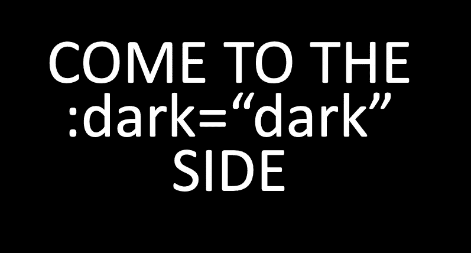
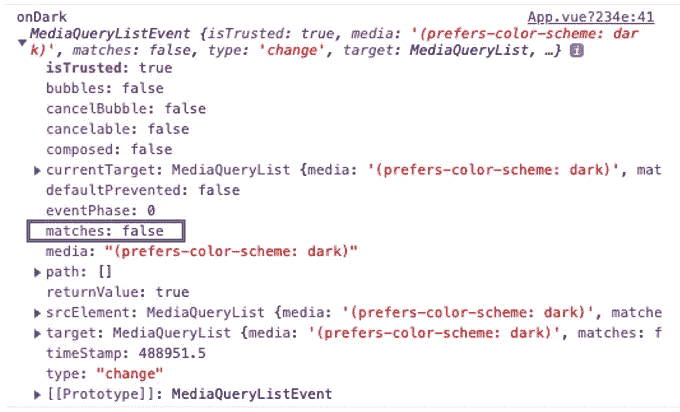

# Vue，Vuetify.js &黑暗模式

> 原文：<https://levelup.gitconnected.com/vue-vuetify-js-dark-mode-5237a43b4a2f>

从浏览器中读取**黑暗模式**并在 Vue 中使用的简单方法。



是的，我自己做的！

在你的 store/index.js 中跟踪`dark: true/false`

```
state: {
  dark: false
},
mutations: {
  SET_DARK(state, dark) { state.dark = dark }
},
actions: {
  setDark({commit}, dark) { commit("SET_DARK", dark) }
}
```

在你的 App.vue 中，订阅`prefers-color-scheme: dark`中的变化

```
data() {
  return {
    matcher: null
  }
},
methods: {
  async onDark(evt) {
    console.debug('onDark', evt)
    await this.$store.dispatch('setDark', evt.matches) 
  }
},
async created() {
  this.matcher = window.matchMedia('(prefers-color-scheme: dark)')
  // set the initial state from the matcher  await this.onDark(this.matcher)
  this.matcher.addListener(this.onDark)
}
```



evt.matches = true(黑暗模式！！)

现在你可以在任何组件中使用`dark`！

```
<v-card :dark="dark">...</v-card>
```

在代码中使用 mapState:

```
import {mapState} from 'vuex'
// ...
computed: {
  ...mapState(['dark']),
}
```

如果你喜欢的内容，请鼓掌和/或关注我更多。

> 编辑 2022.04.07 : H. Kamran 的解决方案在直接在“主题”中设置“黑暗”方面做得很好，因此我们不需要跟踪每个组件中的黑暗模式。

```
this.$vuetify.theme.dark = true | false
```

请务必在此阅读[的帖子](https://hkamran.medium.com/using-local-storage-to-store-vuetifys-dark-theme-state-6158786449c) …