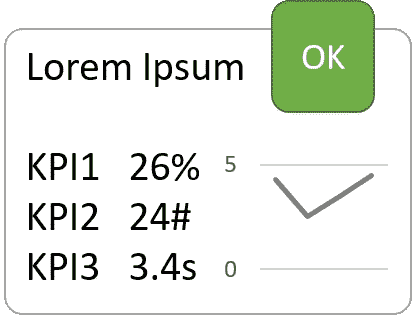

# Vue —仅观看一次

> 原文：<https://levelup.gitconnected.com/vue-watch-only-once-63597466dc74>

我最近有一个项目，我必须使用 KPI 图块可视化机器数据，如下图所示。图块本身是一个具有`isLive`属性的组件(默认为 false)。一个视图包含所有的图块，并通过将`isLive`改为 true 来告诉它们何时开始运行，因此所有的图块都建立了它们的 websocket 连接。问题是，只要不改，我就只想看物业。否则，websocket 连接将被建立多次，或者当我用一个`if`包装观察器时，观察器将被免费调用。

KPI 图块

这就是我想出来的。

## KPI 平铺逻辑(子)

子进程通过调用返回一个`unwatch`处理程序的`this.$watch()`在其`created`钩子中注册一个`isLive`上的监视器。处理程序存储在实例中(`unwatchIsLiveProp`)。

## 查看逻辑

视图只需要在其绑定到子视图的`data`属性中有一个`isLive`变量。

## 结论

当视图上的`isLive`发生变化时，子视图上的观察器触发回调并停止观察属性。完整的例子可以在这里找到:[https://stackblitz.com/edit/vue-watch-only-once](https://stackblitz.com/edit/vue-watch-only-once)

//BMA