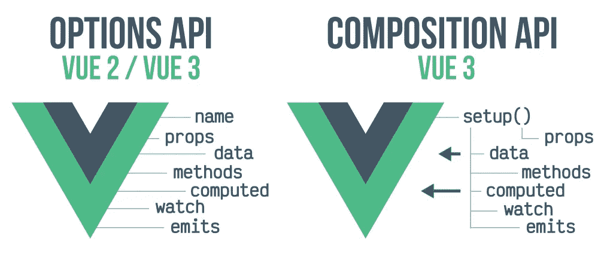

# Vuejs 3:从选项迁移到组合 API

> 原文：<https://levelup.gitconnected.com/vuejs-3-migrating-from-options-to-composition-api-e8a765e57b8d>

## 轻松切换到组合 API


由[乔纳森·肯珀](https://unsplash.com/@jupp?utm_source=medium&utm_medium=referral)在 [Unsplash](https://unsplash.com?utm_source=medium&utm_medium=referral) 上拍摄

组合 API 是在 Vue 3 中引入的，是在 Vuejs 3 中开发应用程序的新推荐模式。我们仍然可以一起使用选项和组合 API，享受这两种模式的美妙之处。

如果你使用 Vuejs 已经有一段时间了，那么你很有可能熟悉 Options API。options API 是用于组织和编码 Vuejs 2 应用程序的默认标准模式。

引入 Composition API 是为了解决 options API 带来的一些限制。它还解决了 mixin(Options API 的主要逻辑重用机制)的缺点。

Composition API 的一些显著优势包括:

*   更小的线束尺寸和更高的性能。
*   更容易重用组件逻辑。
*   改进的类型脚本支持。
*   更容易的应用维护。

让我们看一下从 Options API 到新的 Composition API 的变化。

## **选项 API &组合 API 结构**

选项和组合 API 逻辑结构的图示。



图片来自 lenguajejs.com

我们将在本文中讨论部分内容包括:

*   组件设置方法。
*   道具(定义&传球道具)。
*   事件(声明和发出事件)。
*   模板参照(访问子元件属性)。
*   反应性(参考和反应性原料药)。
*   生命周期挂钩(选项/组合)

## **组合 API 设置方法**

组合 API 逻辑是在设置函数中编写的。这是我们所有组件的逻辑所在之处。

**组件基础知识**

组件使得分离应用程序逻辑、UI 关注点变得更加容易，同时保持应用程序的可重用性。在 Vue 2 中，我们必须在使用它们之前导入并注册组件，如下所示。

```
<script>
import { defineAsyncComponent} from "vue";//import footer component
const Footer = defineAsyncComponent(() =>
  import(/*webpackChunkName: "Footer"*/ "@/components/Footer")
);export default {
  name: "App",
  components: {
  //Register the component here    
  Footer,
  },
};
</script>
```

Vue 3 引入了全局和自动组件导入。我们只需要导入组件，Vue 就会自动为我们注册组件。类似地，您可以将组件声明为 ***全局*** 以在整个应用程序中重用它们，而无需默认导入。

**全局组件注册**

我们可以通过导入并注入到`main.js`的应用入口文件中来注册全局组件，如下图所示。

```
import GlobalComponent from '@/components/GlobalComponent'const app = createApp({})app.component('global-component-name', GlobalComponent)
```

现在我们可以在应用程序的任何地方使用`global-component-name`。Vuejs 3 修正了 API 引入的限制选项，同时使我们的组件结构变得简单、清晰、易于理解。

## 组合 API 中的反应性

在任何消耗和处理数据的应用程序中，状态反应都是非常重要的。在组合 API 中，我们有两个主要的 API 函数(`refs`和`reactive`)用于处理状态反应。虽然它们有所不同，但由于 reactive 的一些限制，我们还是广泛推荐使用`refs`。

**无功**

反应式 API 函数可用于创建对象、数组和集合类型(如集合和映射)的反应式状态。若要声明反应状态，请将对象或数组作为参数传递给反应函数。我们还可以使用模板语法将反应状态变量呈现给 DOM。

要访问反应状态，您需要一个对状态的引用，如下所示。

```
<script setup lang="ts">
import { reactive } from 'vue'//declaring reactive state
const state = reactive({ version: `Vuejs 2`})//accessing reactive state
state.version//updating reactive state
state.version=`Vuejs 3`</script><template>
//rendering state to DOM
 <p>{{state.version}}</p>
</template>
```

虽然`reactive` API 功能强大，但它也有一些局限性:

*   当我们通过调用`reactive` API 函数更新反应状态时，反应状态连接丢失。我们必须始终保持对反应对象的同一个参照。
*   反应式 API 不支持字符串、布尔和整数等基本类型。Reactive 只能用于声明数组、对象和集合类型。

**Ref**vue js 3 Ref API 函数也可以用来声明反应状态。ref 函数中传递的状态参数被包装在一个对象中，可以使用`.value`属性访问它的值。

```
<script setup lang="ts">
import { ref} from 'vue'//declaring ref state
const state = refs(false)//accessing ref state
state.value//updating ref state
state.value= true;</script><template>
//rendering state to DOM
 <p>{{state}}</p>
</template>
```

## **生命周期挂钩**

Vuejs 3 引入了脚本设置功能。这消除了创建生命周期挂钩的需要。引入了一些组件生命周期挂钩来取代 Options API 中的挂钩。见下文。

`beforeCreate`和`created`都被设置函数本身取代，我们不需要像使用选项 API 那样声明它们。您需要从 vue 导入生命周期挂钩，以便在我们的应用程序中使用它们。

**组合 API 生命周期挂钩的选项**

命名生命周期挂钩从选项到组合 API 的变化。

`beforeMount`->-`onBeforeMount`

`beforeDestroy`->-`onBeforeUnmount`

`beforeUpdate`->-`onBeforeUpdate`

`mounted` > `onMounted`

`updated`->-`onUpdated`

`destroyed`->-`onUnmounted`

## **道具和道具定义**

Props 允许我们将数据从父组件传递到子组件。虽然我们可以根据需要传递尽可能多的道具数据，但是我们需要小心防止我们的组件被过多的道具所膨胀(道具钻取)。

在 Composition API 中声明道具有点不一样。我们需要使用 ***defineProps*** 宏在我们的子组件中注册道具。

要将道具从父组件传递到子组件，请如下所示传递它们。

```
<script setup lang="ts">
import { ref } from 'vue';
import { forums } from '@/config/forums';import ForumList from '@/components/ForumList.vue';</script><template>
 <article>
  <ForumList v-for="forum in forums" :key="forum.id" :text="forum.content" :bg-image="forum.bg-image" />
 </article>
</template>
```

在子组件上，您可以使用 ***定义道具*** 注册道具，如下所示。

```
defineProps({
 text: {
  type: String,
  required: true,
 },
 bgImage: {
  type: String,
  required: true,
 },
});
```

或者更好的是，我们可以使用`withDefaults`宏，它允许我们在基于类型的声明中用默认的 props 值来声明 props

```
 withDefaults(
defineProps<{
 text: string,
 bgImage: string,
 }>(),
 {
//Declare default values here
text: `Vuejs is awesome`,
}
)
```

## **发射事件**

使用 Vuejs 开发应用程序时，发出事件是非常重要的。它允许我们将动作、方法和属性从子组件传递到父组件。为了在组合 API 中发出事件，我们使用了 ***$emit*** 宏。

**声明发射**

为了声明发出的事件，我们在子组件脚本设置函数中使用了`defineEmits`宏。`defineEmits`宏接受一个包含要发出的事件的字符串数组的参数。我们可以在子组件中发出和注册发出的事件，如下所示。

```
<script setup lang="ts">defineEmits(['close']);</script><template>
<div>
     <button [@click](http://twitter.com/click)="$emit(`close`)">Cancel</button>
 </div>
</template>
```

在父组件中，我们可以监听`close`发出的事件，并传递一个方法来处理它。你可以使用`v-on:`指令或者使用简写`@name-of-emitted-event`。

```
<script setup lang="ts">
import { ref } from 'vue';
import Cancel from '@/components/Cancel.vue';

const cancelPopup = ref(false);</script><template>
  <div>
   <Cancel [@close](http://twitter.com/close)="cancelPopup = true" />
  </div>
</template>
```

## **模板参考**

Options API 中的模板引用使得访问子组件中的方法成为可能。默认情况下，使用 Options API 或 Composition API 且没有 ***<脚本设置>*** 的 Vuejs 组件是打开的。由于 Vue 2 组件的默认开放特性，模板引用使得访问组件属性成为可能。

Composition API 引入了一种使用`defineExpose`宏来公开组件属性的新方法。传递给 defineExpose 宏的组件属性将是开放的，父组件可以通过模板引用访问这些属性。

在我们的例子中，我们希望从子组件中公开`updateBlog`方法。请记住，您可以公开任意多的属性，用逗号分隔它们，如下所示。

```
defineExpose({ updateBlog, updateDate});
```

**访问暴露的组件属性**

为了访问公开的属性，父组件将使用子组件的模板引用。

```
<script setup lang="ts">
import EditBlog from '@/components/EditBlog.vue'import { ref } from 'vue';

const settings = ref();function update() {
  settings.value.updateBlog();

}
</script><Template>
<div>
<EditBlog
     ref="settings"
     class="mb-4"
/>
</div>
</Template>
```

查看 Vuejs 官方文档，了解更多相关信息。

## **最终想法**

接触过 Vuejs 3 中的组合 API 之后，这些是我从默认选项 API 模式到组合 API 的显著变化。Vue 发生了很大的变化，随着应用程序性能的普遍提高，它变得越来越好。

同样重要的是要注意，组合 API 是选项 API 的替代，两者可以一起使用。Vuejs 3 中的选项 API 支持仍将继续得到支持，不会被取消，因为它仍在维护中。

你使用 Composition API 的体验如何？到目前为止，你注意到了哪些变化？

偶尔，我会发一封独家邮件，里面有我发现的有用的和与技术写作相关的技巧、文章、应用程序、书籍和想法👇。

[***加入像你一样想提高写作技巧的人。***](https://artisanal-thinker-2556.ck.page/6e2ba71172)

## **更读**

[](https://betterprogramming.pub/programming-motivation-how-to-keep-the-coding-dream-alive-97fc56a560ca) [## 如何激励自己每天坚持编码

### 在构建编程生涯的充满挑战的旅程中保持专注和坚持

better 编程. pub](https://betterprogramming.pub/programming-motivation-how-to-keep-the-coding-dream-alive-97fc56a560ca)