# Vuejs 基本组件

> 原文：<https://levelup.gitconnected.com/vuejs-basic-components-d55f427c25dc>

## 如何在 Vue 中制作简单的 modal

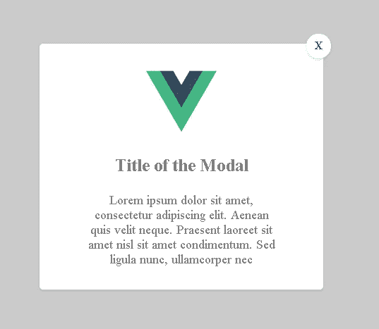

模特的最后作品

在某些情况下，当你开发一个网站时，你需要弹出一个模态。情态动词基本上是出现在网页前面的一个元素，用来显示一些信息或者帮助用户做一个新的动作。

## 工作工具:

我们将使用:
- Yarn 管理依赖关系
- Vue CLI 设置项目
- Visual Code 编辑代码

## 开始项目

我们将从获取依赖项开始。当您安装了 yarn 或 npm 时，请在终端中键入以下命令:

```
npm install -g @vue/cli
# OR
yarn global add @vue/cli
```

之后，我们可以通过键入以下命令来启动我们的 Vue 项目:

```
vue create modal-tutorial
```

**【modal-tutorial】***是你的项目名称，如果你愿意，可以随意更改。在终端内，选择我将在图像中显示的功能:*

*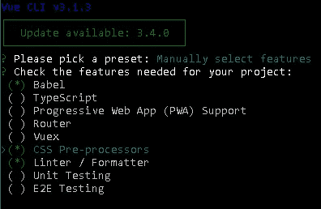*

*终端的图像*

***Babel:** 是一个工具链，用于将新 ECMAScript 转换为旧版本，以便在几乎所有浏览器中运行。*

***CSS 预处理程序(手写笔):**通过添加一种新的语法来帮助程序员编写更好的代码，从而帮助你更好地组织你的 CSS。*

***Linter:** 向您的项目中添加一个林挺，它可以纠正您的代码错误，从而得到一个更好的模式。*

*安装结束后，我们可以转到目录，并开始编码我们的新项目。*

*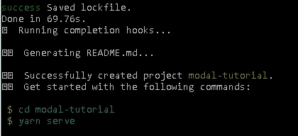*

*结束后，你会得到这样一条信息*

*类型:*

```
*cd modal-tutorial
code .
yarn serve*
```

*“cd modal-tutorial”转到项目主目录和“code”启动可视化代码，在你的终端文件夹里，用" yarn serve "创建一个本地网站给你看你在做什么。*

*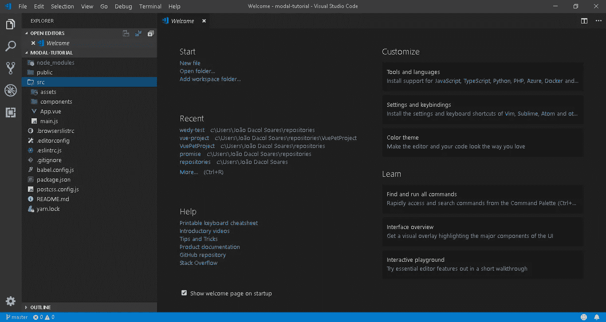*

*这就是你的项目应该有的样子*

*在本教程中，我们将主要关注“src”文件夹，这是所有神奇事情发生的地方。好了，进入最精彩的部分，让我们开始建立我们的模型。*

## *开始编码*

*我们将转到“组件”,对“HelloWorld”做一点更改*

*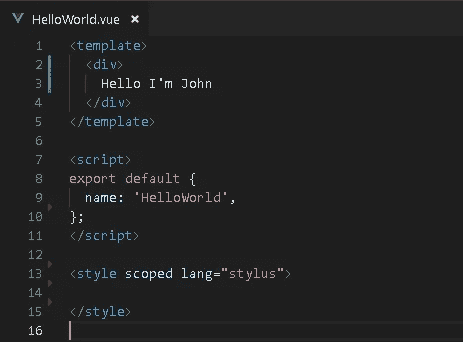*

*删除 Hello World 组件中的默认文本*

*删除默认代码后，我们将转到“App.vue”并做一些调整，开始构建模型*

*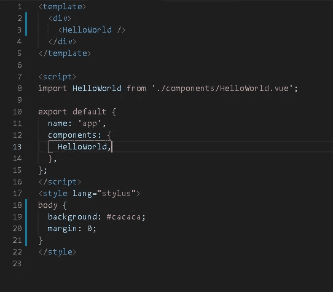*

*在所有的更改之后，你可以进入“ [http://localhost:8080/](http://localhost:8080/) ”并查看项目是否是这样的*

*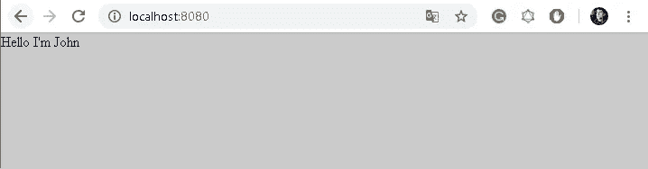*

*你的网站应该是这样的*

*现在我们将开始构建模态组件，我也可以给你一个提示，当你在可视化代码中使用 VueJs 时，你应该下载 Vetur 扩展来帮助你使用 Vue 文件。*

*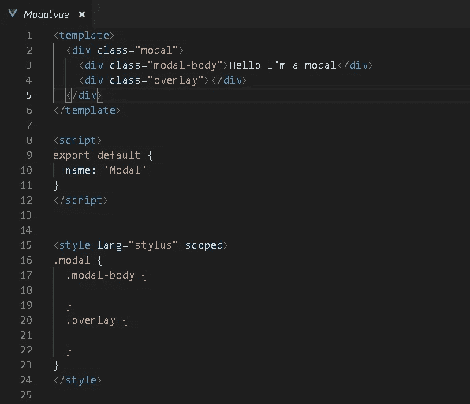*

*创建了我们的模态组件(骨架)*

*现在，我们可以在“HelloWorld”组件中导入组件，让我们这样做:*

*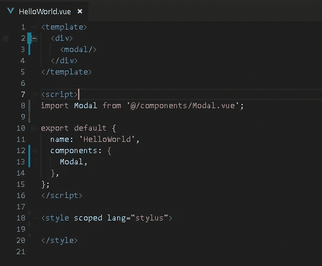*

*好的，我们已经导入了我们的模型，你可以在你的网站上看到*

*既然我们的模型已经导入到“HelloWorld”组件中，我们就可以开始构建模型的其余部分了。最后，模态的代码应该是这样的:*

*“模态”代码*

*现在我们有了一个模态，我们将制定方法使它消失和出现。首先，我们要添加一个值为 isOpen 的“v-if ”,这是我们的 Vue 组件的数据，start 值将为 false，在这种情况下，我们不希望网站加载时模式开始打开。*

*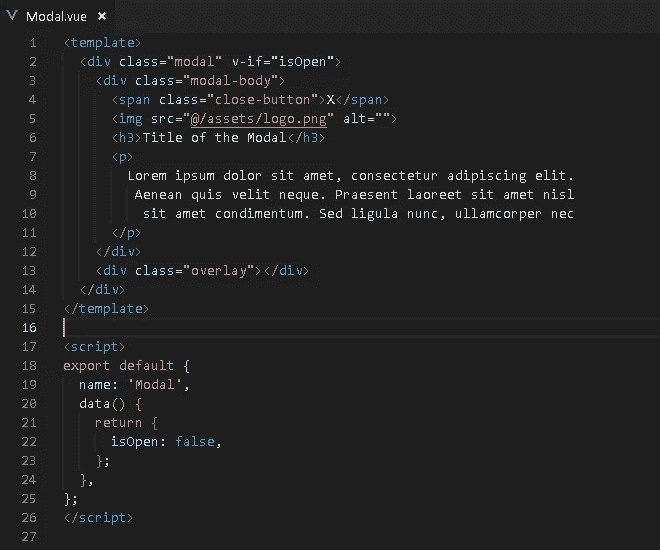*

*现在我们将编写模式事件的切换，我们将创建一个切换模式的方法。之后，我们将添加一个事件监听器，等待某人发出来切换模态(我们使用这个。$开始收听事件)*

*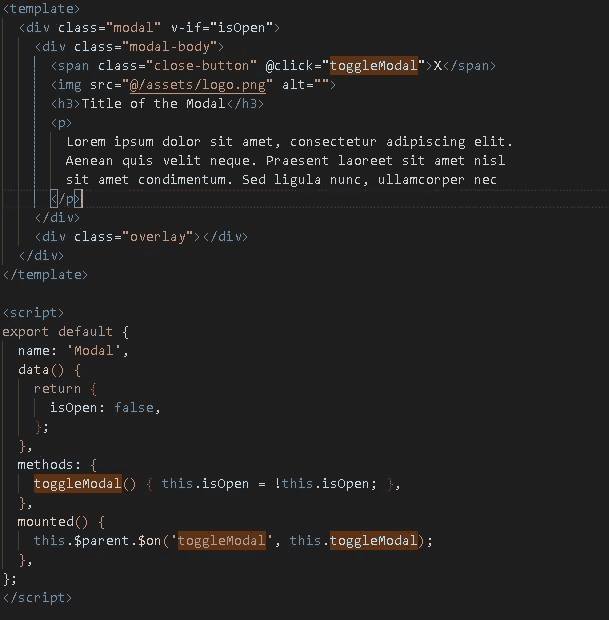*

*应该是这样的。*

*我们要添加一个按钮来打开 Hello World 中的模态，让我们这样做。*

*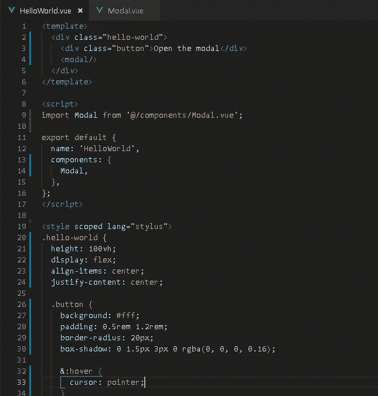*

*在添加了按钮的 HTML 和 CSS 之后，让我们让他打开模态。我们将向按钮添加一个 click 事件侦听器，还将添加一个方法来发出“toggleModal”的事件*

*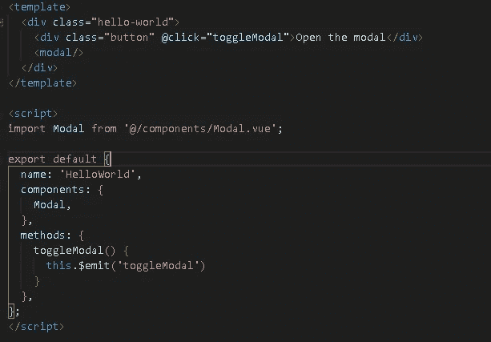*

*“HelloWorld.vue”应该是这样的*

*现在让我们给模态添加一个过渡，以给出一个更好的渐变效果，而不仅仅是让一个模态突然出现在屏幕上*

*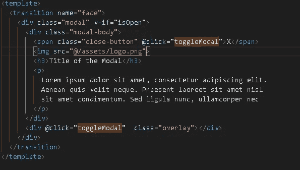*

*在 modal 周围添加了标记转换，并将其命名为*

*我们将转换标签放在组件周围，并在 CSS 中添加这个*

*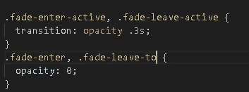*

*增加了不透明度周围的过渡*

*经过我们所有的工作，项目应该是这样的(点击前后):*

*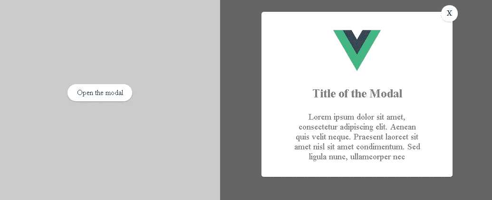*

*在左边的按钮没有被点击，在右边我们点击了按钮，弹出了模态*

*恭喜，我们已经完成了我们的模块，我们还学习了发射事件和监听事件。感谢阅读，我希望这将有助于了解一点点 VueJS 的巨大世界。*

*感谢阅读，如果你想要这个 GitHub 的链接，你可以在下面找到*

*[](https://github.com/joaodacolsoares/vue-modal-tutorial) [## joodacolsoares/vue-modal-教程

### 如何在 Vuejs 中创建一个简单的模态？为 joodacolsoares/vue-modal-tutorial 开发作出贡献，创建一个…

github.com](https://github.com/joaodacolsoares/vue-modal-tutorial)* *[](https://levelup.gitconnected.com)**[](https://gitconnected.com/learn/vue-js) [## 学习 Vue.js -最佳 Vue.js 教程(2019) | gitconnected

### 27 大 Vue.js 教程-免费学习 Vue.js。课程由开发人员提交并投票，使您能够…

gitconnected.com](https://gitconnected.com/learn/vue-js)*