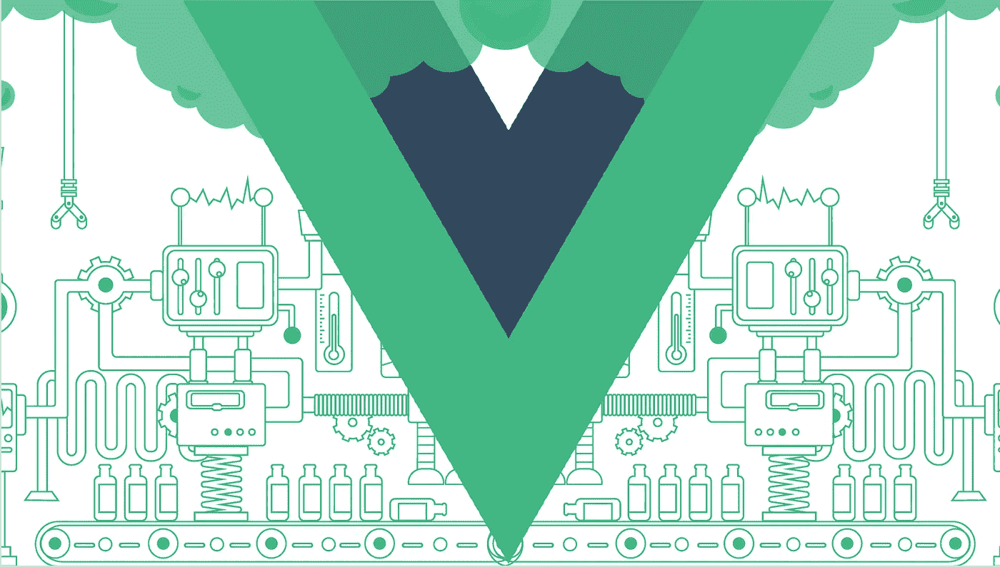

# Vuex 超级简单！— Vue.js

> 原文：<https://levelup.gitconnected.com/vuex-is-super-simple-vue-js-d8da2e552766>



## Vuex 概述，Vue.js 的状态管理库

今天的文章旨在教你 Vuex 的概念和实现。在我们开始之前，我们应该定义一下术语 Vuex。Vuex 的官方文档将其定义为:Vuex 是 Vue.js 应用的**状态管理模式+库**。这意味着，首先我们应该熟悉状态管理模式以及 Vuex 如何使用它。

我将介绍:

*   状态管理模式
*   状态
*   吸气剂
*   突变
*   行动

# 1.流量

Flux 是由脸书开发的一种可伸缩的数据处理模式(不是一个库)，这个概念很快在前端框架中被采用。那么，Flux 解决的是什么问题呢？众所周知的问题之一是脸书的通知错误。当用户登录脸书时，他/她会在消息图标上看到通知。但是，当用户点击它时，将不会有任何消息，通知也消失了。过了一会儿，它又回来了，出现了同样的故事——用户点击了消息图标，但没有新消息。

脸书开发团队修复了这个 bug 几次，在一段时间内运行良好，但最终它会再次出现。最后，他们决定解决问题并修复一次错误，并开发了一种数据管理模式 Flux。

Flux 有 4 个主要组件(动作、调度器、存储、视图)和 2 个原则(单一真实来源、只读数据)。


单向数据流

我将在 Vuex 部分详细介绍它们各自的功能。解释原则:

> **1。真相的单一来源**
> 
> 基本上，每个 Vue 应用程序应该有两种类型的数据:本地和全局数据。
> 
> 本地数据:每个组件都有自己的本地数据，这些数据可以在该组件中访问，并可以通过发出事件和道具传递给其他组件。
> 
> 全局数据:应用程序的全局数据应该可以通过所有组件访问，并且应该保存在一个单独的地方，与组件分开。这个单一的地方就是商店，这个概念被称为 SSOT(真理的单一来源)。
> 
> **2。只读数据**
> 
> 每个组件都能够从存储中读取全局应用程序数据，但不能对其进行更改。如果任何组件打算改变存储中的数据，它们应该通过**突变和动作来完成。这是因为我们不希望任何组件有意或无意地改变我们的全局状态。**

# 2.Vuex

回到 Vuex。正如我上面提到的，Flux 不是库，它是一种架构，Vuex 是实现这种模式并使用其原理的库。要使用 Vuex，我们可以通过 CDN 链接或作为 npm 包将其连接到我们的应用程序。

**CDN 链接:**

```
**//It requires ES6 Promises**
<script src="https://cdn.jsdelivr.net/npm/es6-promise@4/dist/es6-promise.auto.js"></script><script src="[https://unpkg.com/vuex@3.1.0/dist/vuex.js](https://unpkg.com/vuex@3.1.0/dist/vuex.js)"></script>
```

**NPM 套餐:**

```
//Run this commands to install
npm install vuex --save//Use it like
import Vue from 'vue'
import Vuex from 'vuex'

Vue.use(Vuex)
```

Vuex 有 4 个主要概念，在 Flux 部分提到过:**状态、Getters、突变和动作。**


商店的基本设置:

```
const store = new Vuex.Store({
  state: {     
    myVariable: 0   
  },
  getters: {
   someFilter: state => {
    return state.myVariable[0]
   }
  },
  mutations: {
     addToArray(state, value) {
       state.myVariable.push(value)
     }
  },
  actions: {
     addToArray(context) {
      context.commit('addToArray');
     }
  }
});
```

***我们来看看细节！***

# **3。状态**

状态与 Vue 实例数据属性相同，但数据属性是本地的，这意味着只能在该范围内访问。状态是我们应用程序的真理的单一来源。我们在那里定义和存储我们的应用程序数据。Vuex 的状态也是反应性的，这意味着每当我们更新其中的任何数据时，所有使用该数据的组件都会相应地重新呈现。

```
***state: {     
  myVariable: []   
}***
```

# 4.吸气剂

Getters 很像 Vue 实例中的计算属性。我们获取状态数据，进行一些过滤，然后在 Getter 方法中返回。

```
***getters: {
  someFilter: state => {
    return state.myVariable[0]
  }
}***
```

# 5.突变

突变只是改变我们状态数据的一个途径。我们通过提交一个突变来实施我们的改变，每个突变都有一个名字和一个处理程序。

> **突变是同步的**

```
***mutations: {
   addToArray(state, value) {
     state.******myVariable******.push(value)
   }
}*****//To commit**
store.commit('***addToArray***', 'Hey! I am added!');
```

# **6。行动**

动作与突变非常相似，但也有一些不同。它们是提交突变的函数。

```
**actions*: {
   addToArray(context) {* context.commit('*addToArray*'); *}
}*****//Dispatching action**
store.dispatch('***addToArray***')
```

> 动作被分派，突变被提交。

问题是，为什么我们在做同样的事情时，既有动作又有突变？动作和突变之间有两个主要区别。

1.  *突变是* ***同步，*** *但动作是* ***异步。***

```
That means we cannot request any data with axios or fetch API in mutations because mutations are synchronous. Instead we should request any data in actions along committing mutations.
```

2.动作更**复杂**，但突变**简单**。

```
Actions handle application functionality and logic by committing more than a mutation, requesting data etc. while mutations are individual changes that aims to do one and certain thing.
```

这就是今天的文章。希望是熟悉 Vuex 的一个好的开始。

更多:**鼓掌分享**:)

## 如有任何疑问:contact@ilkin-guluzada.com

[](https://levelup.gitconnected.com)[](https://gitconnected.com/learn/vue-js) [## 学习 Vue.js -最佳 Vue.js 教程(2019) | gitconnected

### 27 大 Vue.js 教程-免费学习 Vue.js。课程由开发人员提交并投票，使您能够…

gitconnected.com](https://gitconnected.com/learn/vue-js)