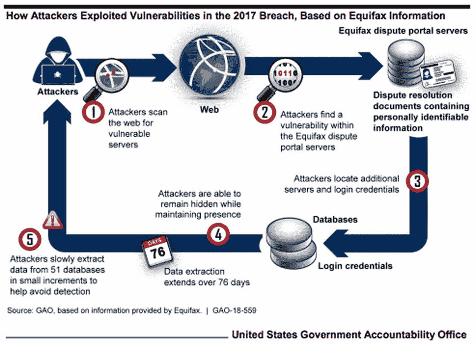

# 漏洞管理—查找和修复开源漏洞的 5 种方法

> 原文：<https://levelup.gitconnected.com/vulnerabilities-management-5-ways-to-find-and-fix-open-source-vulnerabilities-ad4c046eb88>

尽管开放软件对组织和开发者来说有许多优势，但它也暴露了相当多的不同类型的漏洞，这些漏洞带来了巨大的风险。

主要问题是，与商业软件相比，开源软件很少通过类似级别的安全检查。由于开源依赖经常被部署到各种 web 应用程序中，因此一个 bug 通常会使所有这些应用程序面临潜在的风险。

我们将讨论两个最近由开源软件带来的安全问题，以及如何防止这种破坏。

漏洞是如何侵入的—了解 Equifax 违规和 ESLint 事件

# 埃斯林事件

2018 年 7 月，一个名为[‘eslint-scope’的模块在 npm 上被劫持](https://nodesource.com/blog/a-high-level-post-mortem-of-the-eslint-scope-security-incident/)。有问题的模块试图在`.npmrc`内窃取令牌。劫持者为该模块发布了一个新的补丁，并向许多使用该库的开发者推出。

随后为`eslint-scope`的 GitHub repo 创建了一个[问题](https://github.com/eslint/eslint-scope/issues/39)，该问题指向一个意外的错误消息，表明该模块的一个特定版本是恶意的。GitHub 的问题导致了快速反应，并很快成为事件的中心，所有的讨论都发生在这里。

该模块的恶意版本将从 pastebin 加载一个文件，并试图将用户的`.npmrc`文件重定向到劫持者。由于`.npmrc`附带了用户账户的认证令牌，劫持者的代码可能会表现得像一个蠕虫，即获得对其他没有启用发布时 2FA 的账户的发布权。

发现错误的原因是代码写得不好。由于代码的性质，怀疑黑客对 JavaScript 和 Node.js 最佳实践的某些方面没有清晰的理解。

为了纠正这个问题，npm 团队宣布被劫持模块发布前创建的令牌无效。这使得模块劫持者收到的任何凭证完全无用，反过来，有助于确保其他模块的安全。

# Equifax 漏洞

2017 年 9 月 [Equifax 宣布](https://investor.equifax.com/news-and-events/news/2017/09-07-2017-213000628)恶意用户从他们的服务器上窃取了超过 1.47 亿美国人的敏感信息。Equifax 进一步解释说，客户姓名、社会安全号码、地址和出生日期都在被盗数据之列。

黑客通过在网络上搜索易受攻击的服务器来发起攻击。几个月后，他们找到了 Equifax 的争议门户，用户可以在那里讨论索赔。在这里，黑客使用了已知的 Apache Struts 漏洞 T2，并获得了其中 3 台服务器的登录凭证。他们随后意识到，这些凭证让他们能够访问另外 48 台存有个人信息的服务器。

在被发现之前，黑客们在 Equifax 的网络中呆了大约 2.5 个月。据报道，黑客以零碎的方式从 50 多个数据库中窃取数据，以避免被发现。

描述 Equifax 如何被攻破的图表。政府问责办公室。

为了增强组件和依赖项的安全性，建议采用以下五种最佳实践。这将帮助你[管理开源代码](https://resources.whitesourcesoftware.com/blog-whitesource/open-source-vulnerability-management)中的漏洞，更好地检查依赖关系，并在发现漏洞时修补漏洞组件。

# 在使用和发布依赖项时，设置严格的安全规则和标准

一个好主意是强制执行策略，要求使用开源组件的开发人员证明它们确实包含任何已识别的漏洞。

最重要是让开发人员了解开放源代码组件可能产生的漏洞的风险，以及对应用程序或程序的负面影响，而对公司的整体影响。

这种策略可能需要您的内部安全团队的明确审查和批准，或者需要开发人员来证明软件的安全性。让开发人员意识到风险对减少可能的风险大有帮助。

# 跟踪依赖项的安全更新

维护贵组织正在使用的开源库的最新清单。这应该包括在开发和生产中使用的库。一些组织没有为其应用程序使用的开源组件定期更新这些信息。

此外，许多更流行的应用程序包含间接开源组件，这些组件可能没有活跃的开发或支持社区。在这种情况下，这些组件大多没有打补丁，可能成为不安全的久而久之。忽略这些可能的漏洞会使您的应用程序面临风险。

# 测试组件和依赖项

测试您正在使用的开源组件的安全性可能是确保您的应用程序以及您的组织的安全性的最佳方式。

对开源组件的及时和频繁的分析与专有代码一样重要。尤其是当所讨论的组件可能有未知的安全漏洞，或者它的依赖关系可能因每个用例而异时。一个组件在特定应用中可能是安全的，但在另一个应用中却是易受攻击的。

# 开发和使用内部工具，而不是不受支持的库

当涉及到不受支持或过期的库时，建议在内部开发工具，您可以定期使用这些工具来识别和修复漏洞。构建工具的初始时间和金钱投资可能看起来像是一种阻碍。然而，从长远来看，始终可用的内部工具的功能将是开发人员的资产。

# 使用安全工具检查可能的安全漏洞

已经开发了各种不同的商业和开放源代码工具来解决识别不同源代码组件中的安全漏洞的问题。每种工具处理问题的方式都不同。

下面列出了一些比较流行的工具

# 1.NPM 审计(原节点安全项目)

[NPM 审计](https://docs.npmjs.com/cli/audit)是审计 NPM 依赖项和 Node.js 模块的事实上的工具。它以前被称为 NSP，但最新版本的 npm 集成了 NSP 并实现了 npm 审计脚本。这使它能够检查节点模块及其相关依赖项中的已知漏洞。您必须运行`npm audit`来查看应用程序中潜在漏洞的列表，并运行`npm audit fix`来修复它们。

# 2.退休人员 j

一个开源的依赖检查器，RetireJS 是特定于 JavaScript 的。它的 USP 是它的易用性。RetireJS 包括不同的组件，比如 Chrome、Firefox、Gulp、Grunt、Burp 和 ZAP 等插件。以及命令行扫描器。

# 3.OSSIndex

[OS index](https://github.com/OSSIndex)支持许多不同的技术。它可以覆盖。NET/#C、JavaScript 和 Java 生态系统。它还有免费的 API 漏洞支持。

# 4.依赖性检查

依赖检查支持。NET、Java、JavaScript 和 Ruby。它使用 NIST NVD 提取其漏洞信息。有一个类似的工具叫做 [depcheck](https://www.npmjs.com/package/depcheck) ，它检查所有的依赖项，并报告节点应用程序中未使用的依赖项。

# 5.商业工具

除了免费工具之外，还有一些商业工具可以帮助您找到开源代码中的漏洞。受欢迎的包括:

hakiri——为基于 Ruby 和 Rails 的 GitHub 项目提供依赖检查的商业工具

WhiteSource——目前包括对 NPM、Ruby、PHP、Python 和 Bower 的支持

SRC:CLR——Source Clear 拥有各种 ide、源代码库和部署系统的不同插件，以及一个命令行界面

# 结论

当开放源码组件有一大群人审查代码时，它们通常是安全的。也就是说，发布源代码或让多双眼睛审查源代码并不总是能保证所有的安全问题都被识别和修复。因此，将行业标准安全策略纳入应用程序至关重要。

 [## 查找最佳编码教程和课程-学习编码| gitconnected

### 使用我们完整的编码资源列表学习任何编程语言或框架。我们分享、汇总和排名…

gitconnected.com](https://gitconnected.com/learn)