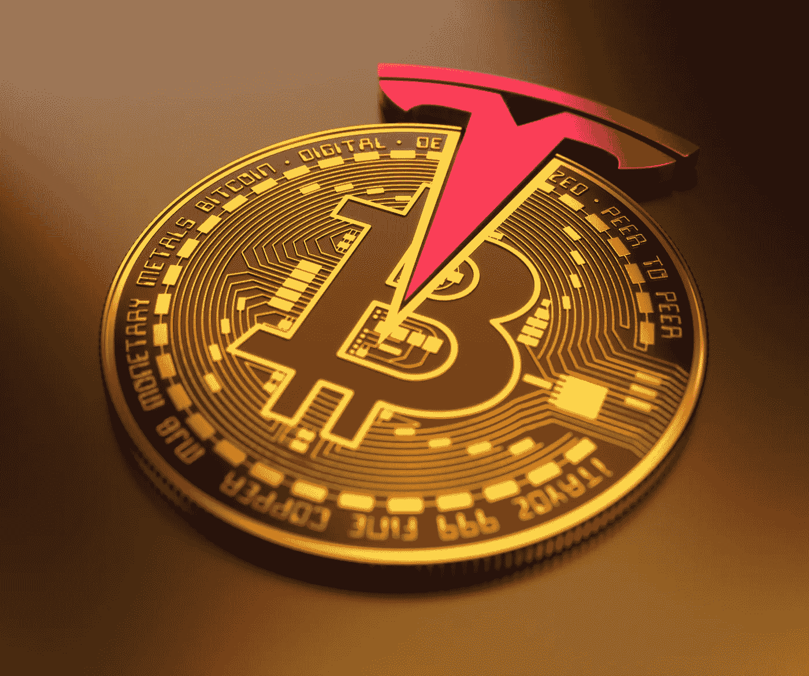

# 等等——所以埃隆·马斯克卖掉了他的比特币？

> 原文：<https://levelup.gitconnected.com/wait-so-elon-musk-sold-his-bitcoin-29be65b3c6f8>

## 他对比特币最近的价格下跌负责吗？

俄耳甫斯 FX/[Shutterstock.com](https://www.shutterstock.com/image-illustration/united-states-february-2021tesla-buys-dollar-1913763295)

4 月 22 日[主流媒体](https://www.independent.co.uk/life-style/gadgets-and-tech/bitcoin-price-crash-latest-crypto-2021-b1836265.html)兴高采烈地报道称，自 2021 年初以来，加密货币的价格持续攀升至前所未有的高位，约有 5000 亿美元从加密货币的价值中抹去；比特币的价格今年首次跌破 5 万美元。

密码怀疑论者和反对者争先恐后地推出反对比特币的老一套论据:

*   这是世界觉醒的标志，比特币没有任何基础来赋予它价值。
*   波动性[使得它作为资产、价值储存手段或货币毫无用处。](https://fortune.com/2021/04/25/bitcoin-btc-value-drop-use-case-currency-digital-gold/)
*   它对能源的贪婪需求使它对社会不负责任。

这些都是老生常谈的比喻和谬误，大多数花时间研究和理解比特币的人都知道它们是不正确的，或者至少是站不住脚的论点。

# 价格下跌的可能原因？

有很多原因可能实际上在价值下降中发挥了作用，而不是标志着比特币末日的开始。

纳斯达克[报告称计算能力](https://www.nasdaq.com/articles/bitcoin-mining-hash-rate-drops-as-blackouts-instituted-in-china-2021-04-16)(支撑和维护比特币网络并支持挖掘新比特币的计算机处理能力)下降。这是由中国西北地区强制停电造成的。超过 50%的比特币开采是在中国的新疆和四川地区进行的，这可能会在需求下降时暂时降低价格。

期待已久的比特币基地 IPO 也被一些人认为是降低比特币价格的一个因素。虽然最大的加密交易所的上市被普遍认为是成功的，但有一种情况是，那些选择投资比特币基地的人可能会有效地稀释对比特币的需求，导致资产价格下跌。

2021 年，像[特斯拉](https://www.cnbc.com/2021/02/08/tesla-buys-1point5-billion-in-bitcoin.html)和 MicroStrategy 这样的机构投资者在创造比特币价格上涨压力方面发挥了重要作用。虽然预计其他公司可能会效仿，将部分资金置于加密中，但一个稍微规避风险的策略可能是投资比特币基地，而不是比特币本身。这当然是一种理论，但也许只有在未来几个月才会得到检验。尽管如此，从理论上讲，随着需求的减少，它可能会降低比特币的价格？

来源:[推特——微软首席执行官迈克尔·塞勒](https://twitter.com/michael_saylor/status/1386673063962583042?s=20)

价格下跌的最后一个猜测原因是最新推出的加密令牌——[safe moon](/how-safe-is-safemoon-the-defi-token-described-as-cryptos-newest-ponzi-b49ddc1c9a4f)——其价格被无情地推高，在一些希望快速致富的爱好者中引起了大肆宣传和咆哮。虽然这种事件确实让一些人变得富有，但连锁效应往往会降低更可信的加密货币的价格，因为一些买家将替代硬币与比特币混为一谈，并决定出售他们的持有物，因为他们担心自己会被骗。如果你有兴趣，你可以[在这里](/how-safe-is-safemoon-the-defi-token-described-as-cryptos-newest-ponzi-b49ddc1c9a4f)了解更多关于 SafeMoon 的信息。

比特币价格下跌可能还有许多其他原因——有些比其他更合理。但是在 4 月 26 日，另一个潜在的更重要的因素出现了。埃隆·马斯克似乎参与了 2.7 亿美元比特币的销售。

# 当埃隆说话时，比特币会听

加密货币社区普遍认为，某些有影响力的人和迷因艺术家在塑造公众对比特币的看法方面具有影响力。这可能是福也可能是祸，但事实就是如此。

埃隆·马斯克就是这样一个人物。

他在 Twitter 上的行动因影响价格而闻名，但这不仅仅是虚张声势，其影响因他的财富和影响力而被放大。从根本上说，他是比特币的粉丝、投资者，以及更广泛意义上的加密货币的支持者。一个信徒。

当他把自己的 Twitter 简历改成简单的“比特币”时，价格有所上涨。当他宣布他的公司特斯拉将投资 15 亿美元的公司金库，并且很快可以用比特币支付汽车时，价格飙升了很多。当他发布关于另一种加密货币 [DogeCoin](/deconstructing-dogecoin-not-all-cryptocurrencies-are-equal-ee347b29700f) 的帖子时，这种货币的价格也飙升了，这种货币开始时只是创始人之间的一个笑话。

来源:[推特——埃隆·马斯克](https://twitter.com/elonmusk/status/1284291528328790016?s=20)，Dogecoin 粉丝

# 比特币的大量销售

当昨天发现埃隆与出售 2.7 亿美元的比特币有关时，媒体和社交媒体上的比特币狂热分子的反应非常激烈。此举引起了一些人的歪曲分析和批评，也引起了其他人的恐慌。

一些人认为这是一个迹象，表明马斯克只是为了自己的利益而推高比特币的价格，以便他可以卖掉它来获利。其他人认为这是比特币最大的支持者之一的背弃。抛弃 HODL 的原则似乎是一个故意和疏忽的举动，这个原则对加密投资者来说是如此珍贵，他们渴望摆脱与喜欢日内交易的暴富朋友的联系。

酒吧运动的老板戴夫·波特诺伊在推特上表达了他的想法:

来源:[推特——戴夫·波特诺伊](https://twitter.com/stoolpresidente/status/1386797551794499592?s=20)

他的断言肯定引起了埃隆·马斯克的共鸣，后者很快做出了回应:

来源:[推特——埃隆·马斯克](https://twitter.com/elonmusk/status/1386821144037236737?s=20)

现实是——埃隆仍在和其他比特币狂热分子一起 HODL 化。实际上是特斯拉出售了一些比特币，原因多种多样，现在看来相当积极。

# 特斯拉卖比特币证明了一个观点

特斯拉出售其持有的 10%比特币的决定是一个经过深思熟虑的举动，在报告季度数据之前[向其底线](https://www.bbc.co.uk/news/business-56897457)注入了 1 . 01 亿美元。尽管面临长期的生产问题，同时受到[全球微芯片短缺](https://www.theguardian.com/business/2021/mar/21/global-shortage-in-computer-chips-reaches-crisis-point)的阻碍，但这笔交易为特斯拉提供了帮助，帮助他们报告了强劲的业绩。其他制造商也在这个问题上挣扎，一些[不得不暂时停止生产](https://www.theguardian.com/business/2021/apr/22/jaguar-land-rover-to-suspend-work-at-major-uk-car-plants-amid-computer-chip-shortage)。

马斯克报告称，供应链问题导致了[“疯狂的困难”](https://www.businessinsider.com/elon-musk-tesla-supply-chain-issues-chip-shortage-insane-difficulties-2021-4?r=US&IR=T)——加上随着全球经济从新冠肺炎复苏，全球运输和对接问题，这些因素都有利于像特斯拉这样的大公司轻松获得财政部的资金。

这些因素与特斯拉选择清算其持有的部分比特币有关——自特斯拉投资比特币以来，这些资金的价值大幅增加，当时比特币的定价在 40，000 美元左右，本月早些时候超过了 60，000 美元。

正如马斯克在 Twitter 上回复戴夫·波特诺伊时指出的那样，比特币的快速流动性现在也已被证明是有规模的。这将无意中让比特币的持有者受益，因为这进一步证明了加密货币作为价值储存手段的优势。它有明显的升值潜力，此外，当持有者需要获取传统货币以满足其业务或个人需求时，它可以很容易地变现。

想想看，其他传统投资，尤其是黄金，以及债券、股票和其他存款，都无法在这么短的时间内变现并获得资金——这是比特币的另一个已被证明的优势。

# 接下来会发生什么

正如比特币世界中经常发生的那样，它的价值会有升有降。每一次上涨都会吸引新的投资者投资，而每一次下跌都会导致那些一开始犹豫不决的投资者卖出手中的股票。价格的下降也将引发怀疑论者通常的批评，他们正在等待价格永远降到零。

与此同时，像特斯拉持有并清算其部分美国国债以支付商业成本这样的事件再次表明，比特币*在金融和商业领域确实有真正的用途。*

愿埃隆·马斯克继续开辟比特币之路！

*如果你喜欢阅读这样的故事，并且愿意支持 Medium 上的作家，考虑注册成为 Medium 会员。一个月 5 美元，给你无限的故事。如果你注册使用我的链接，我会赚一小笔佣金。*

 [## 阅读托比·黑兹伍德(以及媒体上成千上万的其他作家)的每一个故事

### 作为一个媒体会员，你的会员费的一部分会给你阅读的作家，你可以完全接触到每一个故事…

tobyhazlewood.medium.com](https://tobyhazlewood.medium.com/membership) 

注:*本文仅供参考。不应将其视为财务或法律建议。在做任何重大财务决定之前，先咨询财务专家。*

## 如果你喜欢这篇文章，我希望你能加入我的电子邮件列表。