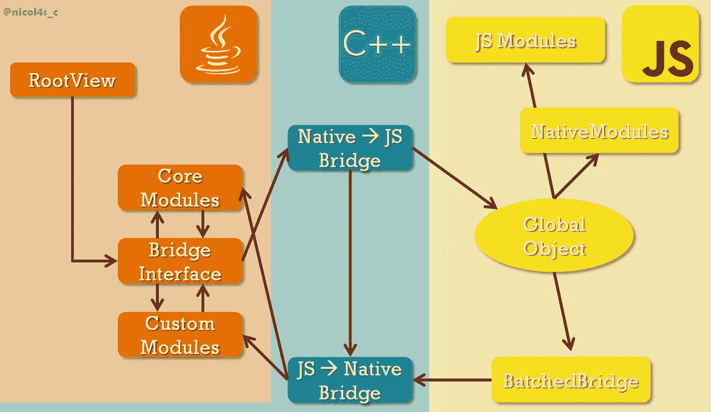
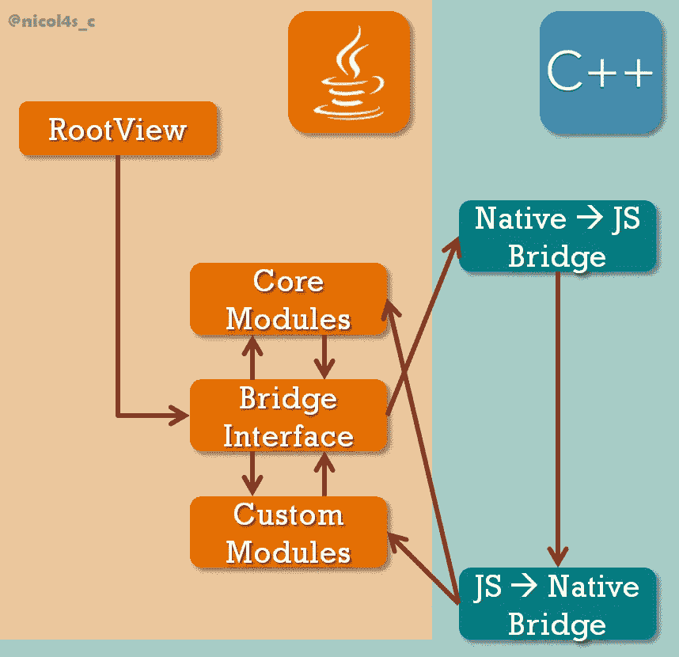
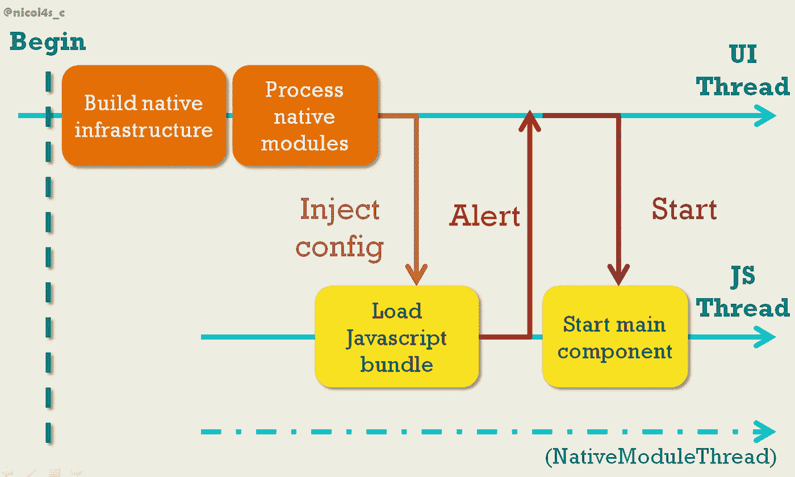

# 等等…当我的 React 本机应用程序启动时会发生什么？—深入了解 React Native

> 原文：<https://levelup.gitconnected.com/wait-what-happens-when-my-react-native-application-starts-an-in-depth-look-inside-react-native-5f306ef3250f>

## 了解本机函数如何在内部反应，以及它在您不知道的情况下为您做了什么。

*免责声明:本文假设对 React 本机和本机模块有(非常)基本的了解。如果你从未玩过它们，我建议你先看看* [*官方文档*](https://facebook.github.io/react-native/docs/native-modules-android.html) *。*

***编辑:*** *本文基于我在伦敦为 2018 年 3 月的*[*react fest*](https://reactfest.uk/)*会议所做的一次演讲。你可以在这里看到我说的***！**

*当我开始使用 React Native 时，一些事情很快困扰了我:*那里发生了什么？的确，从那些仅仅使用 React Native 来构建(伟大的)应用程序的人的角度来看，事情有时看起来很神奇。想从 Javascript 中获得一些可用的原生代码吗？直接用`@ReactMethod`(或者 iOS 上的`RCT_EXPORT_METHOD`)！想要将事件从本机发送到 Javascript 吗？没问题，只需获取适当的 Javascript 模块，并像调用任何本机方法一样调用它！更不用说，同样的 Javascript 代码会在 iOS 和 Android 上运行…**

*正如人们可能会猜测的那样，这些事情不是微不足道的。事实上，相当复杂。**那么是什么让 React Native 实现了这样的壮举呢？**简单且常见的答案是:*

> *React 原生“桥”，咄！*

*换句话说:*

**

*有些人对本土的解释做出了反应…*

*但是谁想要简单的答案呢？这一次我们将详细讨论。但是要注意:事情可能会变得一团糟。*

# *React 本地基础设施*

*让我们开门见山:**为了发挥作用，React Native 依赖于运行时构建的完整基础设施。**哒哒！*

> *等等…你刚才不是给了我们另一个隐晦的解释吗？*

*我有吗？但是这里有两点需要注意。首先，基础设施:著名的“桥”只是其中的一部分——我敢说，还不是最不可思议的。第二，*运行时*:每次启动 React 原生应用程序时，在执行任何自定义代码之前，都会构建上述基础设施*。换句话说，**在您的应用程序上线并可见之前，它会经历一个过渡状态，在这个状态下，React Native 会忙于为您构建应用程序的基础**。**

*你说这个所谓的基础设施是什么样子的？好吧，让我们画一个地图，显示各个部分(由箭头连接，大致意思是“存储对的引用”)。*

**

*react Native infra structure——对于 iOS，Java 徽标可以替换为 Objective-C 徽标*

*喔，这有点复杂，不是吗？这是一个简化的版本…为了理解这种混乱，我们将按照它们在发布时被创建的顺序，一个接一个地描述它的各个部分。我们走吧！*

# *启动 React 本机应用程序*

*请记住，每当 React 本机应用程序启动时，整个过程都是构建的。让我们来看看几个步骤，把你在手机上按下应用程序图标的那一刻和一切都变得可见的那一刻分开。*

*首先，您的应用程序只有两件事要处理:*

*   *应用程序的代码，*
*   *一个独特的线程，**主线程*** ，由手机操作系统自动分配给它。*

*为了简化解释，我们将在概念上把代码分成两部分:框架代码*—*—您不必每次都编写的代码——和定制代码*—它实际上描述了您的应用程序。两者都分布在 Javascript 和 native 上，这给了我们总共四部分代码**来浏览。在主线程上，首先要处理的是框架代码的本机部分。****

****也称为* UI 线程*，作为——初始化之外——主要负责 UI 相关的工作***

# **创建本地基础**

**需要意识到的一件重要的事情是，尽管大多数 UI 代码——`<View>`、`<Text>`……——是用 Javascript 编写的，但最终呈现的只是原生视图。就是这样。这意味着 React 本机框架需要:**

1.  **创建本地视图并将它们的连接映射到 Javascript 组件，**
2.  **存储这些本地视图并显示它们。**

**虽然第一步将由 **UIManagerModule** 处理(稍后我们将描述)，但是 **RootView** 将处理第二步。`RootView`或多或少是一个容器，其中本地视图被组织在一个大树中——如果你愿意，是 Javascript 组件树的本地表示——手机屏幕上显示的所有内容都将存储在那里。**

**回到我们的初始化过程:一切都从创建上面的`RootView`——现在是一个空容器——开始，然后继续到**桥接口**。**

> **桥梁不是应该在原生和 Javascript 之间吗？为什么你需要一个接口呢？**

**确实是！但是尽管大部分本机部分——包括`RootView`——是用特定于平台的语言(Objective-C 或 Java)编写的，桥完全是用 C++实现的。因此，桥接口充当 API，允许前者与后者进行交互。桥本身由两端组成，原生于 Javascript，反之亦然。**

**然而，如果没有端点来调度调用，那么这个桥就什么都不是。这些端点是**本地模块**，并且最终将成为 Javascript 环境中唯一可用的*东西。换句话说，除了本机模块之外的所有东西最终对您的 Javascript 应用程序都是不可见的。因此，除了您可能决定创建或不创建的**定制模块**之外，框架还包括**核心模块**。后者的一个例子是 **UIManagerModule** ，它存储了所有 Javascript UI 组件及其相关本地视图的映射。每当 Javascript UI 组件被创建、更新或删除时，`UIManagerModule`将使用这个映射来相应地创建、更新或删除相应的本地视图。它还会将更改转发到存储在`RootView`中的本地视图树，以便使它们可见。***

**从初始化的角度来看，所有本机模块都被同等对待:为每个模块创建一个实例，对该实例的引用存储在 Javascript 到本机桥上，以便以后可以从 Javascript 调用它们。此外，对桥接口的引用也被传递给每个本机模块，允许它们直接调用 Javascript。最后，将创建两个额外的线程:JS 线程**和 NativeModulesThread*。****

****严格来说，在 React Native 的 iOS 实现的情况下，它不是一个唯一的线程，而是一个线程池。***

# **Intermezzo:设置 Javascript 引擎**

**在继续之前，让我们快速总结一下到目前为止发生的事情:**

*   **在主线程上创建了一堆本地内容，**
*   **我们现在有三个线程要处理，**
*   **绝对没有 Javascript 被处理过。**

**回到我们最初的地图，我们得到的是这个:**

****

**反应当地人的本性**

**这意味着现在是加载 Javascript 包的时候了——框架和定制代码都是如此！**

**作为一种解释型脚本语言，Javascript 不能按原样运行:它需要被转换成字节码，然后被执行。这是 **Javascript 虚拟机**(又名 Javascript 引擎)的工作。现在有很多 Javascript 引擎，包括 Chrome 的 V8，Mozilla 的 SpiderMonkey 和 Safari 的 Javascript core……如果在调试模式下，React Native 将使用 **V8** 并直接在浏览器中运行，否则，它将默认使用 **JavaScriptCore** 并在设备上运行。顺便说一句，默认情况下，Android 中不包含 JavaScriptCore(尽管它在 iOS 中)，因此 React Native 会自动在 Android 应用程序中捆绑一份 JavaScript core，这使得 Android 应用程序比 iOS 应用程序略重。**

**无论如何，在有效地启动 Javascript 引擎之前，React Native 必须给它一个表示执行环境的上下文。这包括 Javascript 全局对象，意味着这个全局对象实际上是在 C++桥上创建和存储的。为什么这如此重要？**因为全局对象不仅可以从 Javascript 环境内部访问，还可以从外部访问**。因此，它是 C++(本机)和 Javascript 之间的主要通信方式，因为通过全局对象，一些本机函数将对 Javascript 可用——这些函数反过来将用于将数据从 Javascript 传回本机。**

**很多东西都存储在全局对象上，但是 **ModuleConfig** 数组和 **flushQueue()** 函数尤其重要。`ModuleConfig`数组的每个元素都描述了一个本机模块(无论是核心模块还是自定义模块)，包括它的名称、导出的常量、方法……`flushQueue()`函数在确保 Javascript 和本机环境之间的通信方面起着关键作用，因为它将被定期用于将调用从第一个传递回第二个。**

**一旦 Javascript 上下文被完全创建和填充，它就被提供给 Javascript 引擎，该引擎开始在 **JS 线程**上加载 React 原生 Javascript 包**。****

# **加载 Javascript 包**

**随着虚拟机开始处理框架代码的 Javascript 部分，它将创建 **BatchedBridge** 。这个名字可能听起来很耳熟，因为它有时会出现在错误消息中！尽管它的名字很奇特，但它只是一个简单的队列，存储“从 Javascript 到 native 的调用”。“调用”是包含本机模块 ID、方法 ID(对于指定的本机模块)以及调用本机方法所用的参数的对象。定期地(默认情况下每隔 5 毫秒)，`BatchedBridge`将调用`global.flushQueue()`，将它的内容——一个“调用”数组——传递给 C++桥本地端的 Javascript。这些小数组被称为**批处理**，它们被索引以确保一个批处理中包含的所有 UI 更改同时可见(这是必要的，因为整个过程是异步的)。桥的本地端的 Javascript 将最终在一个批处理中迭代每个调用，并使用指定的模块 ID 将它们分派到适当的本地模块——它能这样做是因为它有一个指向每个和任何本地模块的引用，记得吗？**

**下一步是创建`NativeModules`对象——是的，每次你想调用一个本机模块时，这个对象必须从‘react-native’导入。将使用前面提到的`ModuleConfig`数组填充`NativeModules`对象。我不会在这里详细介绍这个过程，但它大致相当于对包含在`ModuleConfig`中的每个`module_name`执行`NativeModules[module_name]={}`，然后对给定模块的每个导出的本机方法执行`NativeModules[module_name][method_name]=fillerMethod`。`fillerMethod`只是用来存储它在`BatchedBridge`上接收到的所有参数，以及方法和模块 ID(类似于`fillerMethod = function(...args) { BatchedBridge.enqueueNativeCall(moduleID, methodID, args)}`)，有效地创建了一个从 Javascript 到 native 的“调用”。话虽这么说，后来写`MyNativeModule.myMethod(args)`被炒的其实是上面的`fillerMethod`！**

**我们快到了。最后需要做的是创建核心 JS 模块，其中的`DeviceEventEmitter`——将用于将事件从本机发送到 Javascript——或`AppRegistry`—存储对应用程序主要组件的引用。为了能够从本机调用，这些模块被注册在 Javascript 全局对象上…**

**…至此，完整的 React 本机基础架构已经构建完成！**

# **使 React 本机应用程序可见**

**尽管初始化已经完成，但是我们的应用程序在这个阶段仍然是不可见的！事实上，Javascript 包的加载发生在 JS 线程上，它独立于主线程(也称为 UI 线程)。因此，JS 线程必须警告主线程它的任务已经完成，作为响应，主线程使用`AppRegistry` (JS 模块)请求 JS 线程处理主定制组件——通常是`App.js`。**

**从线程角度总结一下，React 本机应用的启动过程如下所示:**

****

**React Native 的启动例程**

**包含在应用程序主组件中的 Javascript 组件树将被遍历，每次遇到 UI 组件时调用`UIManagerModule`。`UIManagerModule`(在 UI 线程上)将依次负责创建本地视图并将它们存储在`RootView`中:恭喜，您的应用程序现在可见了！🎉 🎉**

# **附加外卖**

***本文基于我 2018 年 3 月在伦敦*[*react fest*](https://reactfest.uk/)*上的一次演讲。以下是我在会议期间被问到的一些问题的答案。***

> **如果我们不使用 NativeModuleThread，那么创建它有什么意义呢？**

**确实，这个线程在启动过程中没有被积极地使用。然而，这一点在后面真的很重要，因为 Javascript 对 native 的每一次调用——在被分派到适当的 native 模块之后——都将在这个线程上运行。实现细节:在 iOS 版本的 React Native 上，这个线程并不存在。相反，每个本机模块在实例化时被赋予一个`GCDQueue`(并且系统负责线程管理)。**

> **哎，为什么 C++里桥的两端**都是**？我们不是应该一头用 Javascript，一头用 native 吗？**

**这确实有点令人困惑。但是一旦我们明确了 React Native 需要弥补的差距，这就有意义了。这个“差距”在这里是双重的:**

*   **一个**语言缺口**(原生，Javascript)，以及**
*   **一个**螺纹间隙** (JS 螺纹，主螺纹，NativeModuleThread)**

**如前所述，语言问题主要通过 Javascript 全局对象来解决，该对象可从 C++和 Javascript 环境中访问。因此，我们在 React Native 中通常所说的“桥”只需要处理不同线程上的工作分派。在这方面,“原生 Javascript”和“原生 Javascript”这两个名称非常有意义，尽管它们都是用同一种语言实现的:第一个从本地线程(无论是主线程还是 NativeModuleThread)调用*，并将工作*转发给 JS 线程*，而第二个将从 JS 线程*(使用`global.flushQueue()`函数)调用*，并将调用*分派给本地线程*。***

*就是这样！这是一个稍微详细一点的关于什么样的异能是天生反应的概述。我希望它触发了您的好奇心，并且——谁知道呢——让您想要为这个框架做贡献？*