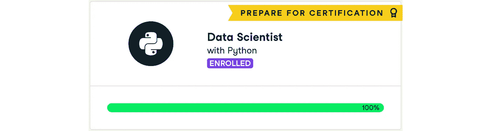
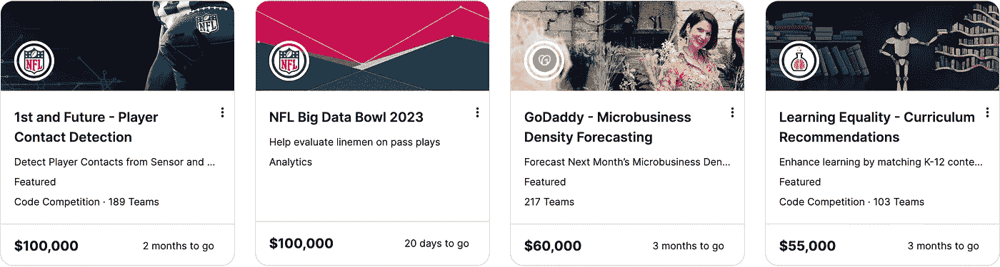
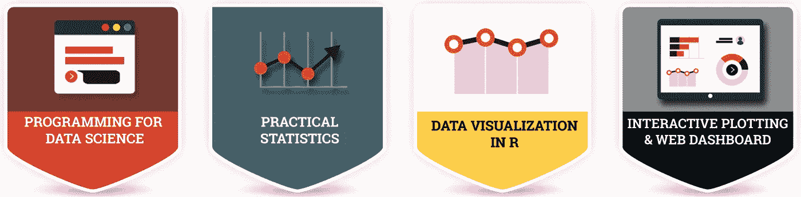
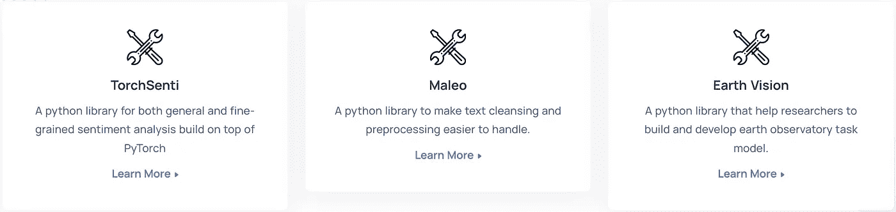
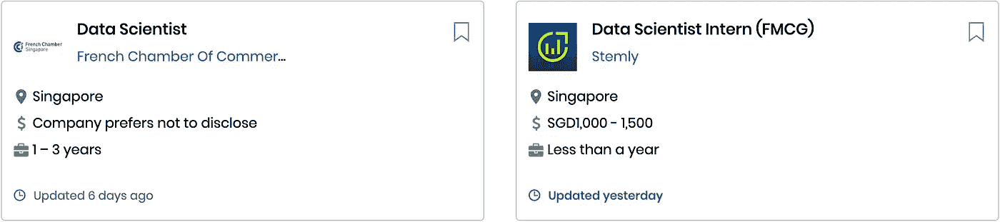

# 想在 2023 年进军数据科学？三思而后行！

> 原文：<https://levelup.gitconnected.com/wanna-break-into-data-science-in-2023-think-twice-26842e9a87fe>

## 办公时间

## 对你来说不会是一帆风顺的

我是一名难民。我没有数据科学、计算机科学、数学或统计学的背景。但我已经成功过渡到数据科学工作。一些朋友也想这样做，并向我征求意见。我总是以“你确定吗？”。

```
**Table of Contents**

**·** [**What did it Cost Me?**](#72f9)
  ∘ [Time](#3608)
  ∘ [Resources](#7d90)
**·** [**What I Didn’t Tell You**](#46c0)
  ∘ [My Background](#3195)
  ∘ [The Starting Point](#2eba)
  ∘ [Motivation Became Discipline](#bea6)
**·** [**Summary**](#ef40)
```

我在这个故事里说的可能不适用于你。一个成功的例子不足以得出任何结论。作为一个新手，我可能不会告诉全貌。然而，我希望分享我的经验能确保像你这样的人开始变得更强大，并至少给你一个大致的方向去冒险。

# 我付出了什么代价？

人们倾向于看到故事中光明成功的部分。他们不想听隐藏在内心的黑暗冒险。他们期待类似“5 个 Python 库让你获得作为数据科学家的第一份工作”或“赢得数据科学面试的 10 个技巧”这样的即时信息。我知道，我知道，这类事情会有帮助，但从统计数据来看，它们往往是不够的。


[风暴探索者](https://unsplash.com/@sseeker?utm_source=medium&utm_medium=referral)在 [Unsplash](https://unsplash.com?utm_source=medium&utm_medium=referral) 上的照片

在这个信息时代，你只需要四样东西就能从头开始学习:

1.  **砂砾**。这是最重要的。如果你没有勇气，其他的都无关紧要。
2.  **时间**。勇气是内在的，时间是外在的。记住，没有什么是瞬间的。你需要时间训练你的肌肉记忆。
3.  **笔记本电脑**。没有花哨或硬核。一台功能简单的笔记本电脑就可以完成这项工作。
4.  **资源**。何处学习:youtube、课程、文章、竞赛、社区和项目。

对我来说，勇气和笔记本电脑就在那里。时间，没有那么多，即使有所有的周末。也许这就是为什么没有公司想让我成为他们的数据科学家之一:*飞行时间不足*。

## 时间

如何在繁忙的全职工作中有足够的时间快速学习？可悲的是，有时候答案是“你就是不能”。所以，我辞职了。

但是事情并没有*那么简单。*

我在 2019 年年中考虑辞职，但又呆了一年。即使牺牲了那么多时间，改变生活的决定也不应该仓促做出。我不得不事先询问相关人士:

1.  当然是我的亲戚。理解他们是如何看待问题的，试着有不同的视角。
2.  一些我在大学认识的朋友和一些一直从事数据科学家工作的人。我问:他们对成为数据科学家有什么理解？这与数据分析师有什么不同？作为一名数据科学家，他们每天都做些什么？一个新人应该做些什么来赶上他们必须知道的所有广泛的事情？

时间越来越少了。此外，许多数据科学家工作的资格之一是至少拥有计算密集型学科的学士学位，例如数学、计算机科学和物理。

仅仅为了达到资格要求，我需要采取极端的行动，接受高等数学教育。这次遭遇把我带到了下一个障碍:*去哪里学*。

## 资源

资源这么多，你会应接不暇的。没关系，你说。也有很多善良的人喜欢分享他们所知道的来帮助你。但是你没有世界上所有的时间，因此必须只挑选最好的资源。

首先，不要看书。它们花费了比预期更长的时间来完成，并且不实用。剩下的曲目就看你的口味了。我来分享一下我的:

**№1。DataCamp —使用 Python 的数据科学家**



DataCamp |图片来自[作者](http://dwiuzila.medium.com/membership)

我不喜欢直接跳到难的部分，比如数学。所以，我先学习了 python 编程语法。有朋友建议在[datacamp.com](https://www.datacamp.com/)上[有 Python](https://www.datacamp.com/tracks/data-scientist-with-python) 职业轨迹的数据科学家。有 25 门课程和 6 个项目，可以按照自己的进度完成。

DataCamp 的优点是，即使对于从未做过编程的人来说，也很容易理解。缺点是，一切都是在网上完成的，所以感觉不真实。还有就是[付费课程](https://www.datacamp.com/pricing)。

课程结束后，我仍然对在我的机器上(而不是在 web 上)何处编码感到困惑。但至少我知道 python 库和数据科学中使用的一般语法。

> 我在 2019 年 2 月完成了这条赛道，花了两个月的时间完成。所以，我的建议是:按月计费，而不是按年计费。

**№2。Coursera —机器学习专业化**


Coursera | Image 上的机器学习专门化作者[作者](http://dwiuzila.medium.com/membership)

这就是数学的用武之地。这个 [3 门课程的专业化](https://www.coursera.org/specializations/machine-learning-introduction)是[吴恩达](https://en.wikipedia.org/wiki/Andrew_Ng)在 2012 年首创的机器学习课程的更新版本。当我学旧课程时，它是免费的。但是通过额外的高级学习算法和强化学习，它现在是 coursera.org[的一门付费课程。](https://www.coursera.org/)

数学真的很有内涵，你会明白常见的机器学习模型是如何工作的。还将向您介绍机器学习库，如 NumPy 和 scikit-learn。

> 我在 2019 年 4 月完成了旧版本，就在完成 DataCamp 之后。

**№3。anaconda&ka ggle——最大的数据科学社区**



一些 Kaggle 比赛|图片由[作者](http://dwiuzila.medium.com/membership)

为了巩固到目前为止我所知道的一切，我必须在我的本地机器上实现它们。毕竟，我将来要做的数据科学实现将首先在本地构建。Anaconda 是最好的工具。

所以，我从 anaconda.com[下载了它，并了解了它的工作原理。从那以后，我对 Jupyter、Spyder、VS Code、如何管理环境以及如何自己安装库有了一些了解。](https://www.anaconda.com/)

我准备建立一些项目。我在 kaggle.com 寻找灵感，并尝试免费学习一些课程。他们肯定比 DataCamp 难，但值得努力。

与此同时，我也参加了几个 Kaggle 比赛。我什么也没赢得，但至少我可以阅读人们的笔记本，看到他们解决现实世界问题的方法，所以我更好地理解了我过去在数据营学到的东西。

> 最后我至少参加了[十几场比赛](https://github.com/dwiuzila/data-science-competitions)。这花了很长时间，直到 2020 年 7 月。

**№4。Coursera —深度学习专业化**


Coursera | Image 上的深度学习专门化作者[作者](http://dwiuzila.medium.com/membership)

是时候深入了！重新访问 Coursera，我开始学习神经网络的艺术和工艺，如何使用超参数调整和正则化来改善它们，构建机器学习项目，CNN 和序列模型。

巧合的是，在那个时候，我的大学和 Coursera 有一个合作，所以我免费获得了 [5 门课程的专业](https://www.coursera.org/specializations/deep-learning)。

> 我又花了两个月才完成，直到 2020 年 9 月。

**第五名。Algoritma 数据科学学院—通过构建学习**



一些算法课程|图片作者[作者](http://dwiuzila.medium.com/membership)

2020 年 8 月底开始读硕士。老实说，学位并没有特别提供关于数据科学的学习，所以我寻找非正规教育。

我找到了位于我祖国的数据科学学校 algorit.ma。挺贵的，不过还好，他们有学生奖学金项目。课程是 R 中的一般[数据科学工作流，如数据清理、数据争论、统计、建模和](https://dwiuzila.medium.com/list/0a8179814b50)[创建仪表板](https://dwiuzila.shinyapps.io/Spotify/)。

> 该计划在网上举办，持续约 4 个月，直到 2021 年 2 月。对我来说幸运的是，我的硕士课程安排得很好。

**№6。雅加达研究—回馈社区**



雅加达研究项目|图片由[作者](http://dwiuzila.medium.com/membership)

到目前为止，感觉我只知道理论，但从未尝试过现实世界。所以，我申请了一个叫做[雅加达研究](https://jakartaresearch.com/)的开源社区。在那里，我们开发了一个 python 库来解决专门针对卫星图像的计算机视觉任务，名为 [earth-vision](https://github.com/jakartaresearch/earth-vision) 。

我学会了如何正确使用 VS 代码，了解了如何在终端中执行 bash 命令，并使用 GitHub 进行协作。

> 2021 年 4 月申请，5 月加入他们。

**№7。中等——分享就是学习**


我的一个媒介[出版物](https://medium.com/geoclid) |图片由[作者](http://dwiuzila.medium.com/membership)

我也从 2021 年 4 月开始活跃在 Medium 上。基本上，我的想法是自学数据科学，不管是什么主题，然后把学习笔记写成文章。此外，分享一些东西提高了我理解它的信心，并在总体上帮助了数据科学社区。

我在写作时学到的一些东西:

*   [梯度下降等参数搜索中使用的高级优化方法](https://dwiuzila.medium.com/list/26e264a361e4)。
*   Algoritma 中研究的[数据科学工作流程](https://dwiuzila.medium.com/list/0a8179814b50)最初是作为小项目发布，然后写成文章。
*   Coursera 研究的机器学习和深度学习模型的[内部运作](https://dwiuzila.medium.com/list/b35db8650093)。
*   数据科学中使用的最新工具。

2021 年 11 月，我的论文终于成型了，我发现写论文、在媒体上写作、同时在雅加达做研究很困难。至少需要删除一个。所以，不久后我就离开了雅加达研究中心。

> 直到今天，我仍然在介质上写作。

**№8。端到端项目—求职**



求职|图片由[作者](http://dwiuzila.medium.com/membership)

长话短说，2022 年 7 月，我已经写了差不多 60 篇文章，硕士毕业了。我已经做好了充分的准备，除了一件事:我没有一个端到端的数据科学项目。

于是，我赶紧抓起[我最喜欢的一篇媒介文章](https://towardsdatascience.com/fd05f9f80900)打磨的很漂亮。在建模的顶部，我准备了问题陈述、数据准备、特性工程以及技术和业务度量的模型评估。我还制作了一个 PowerPoint 演示文稿来帮助项目面试。

> 我花了 28 份申请和将近 4 个月的时间才找到一份体面的工作，我对此很满意:)

# 我没告诉你的是


由[布鲁克·卡吉尔](https://unsplash.com/es/@brookecagle?utm_source=medium&utm_medium=referral)在 [Unsplash](https://unsplash.com?utm_source=medium&utm_medium=referral) 拍摄的照片

看起来很简单，不是吗？当然有些运气在起作用，但一切都在大计划之内。

但是我对你撒了谎。当我说我不是数学出身时，有一个隐藏的事实。我的学士学位可能没有学过数学，但我是数学的朋友。

## 我的背景

很久以前，我参加了国际数学组织(IMO)的数学奥林匹克团队选拔考试，所以拥有数学硕士学位是自然而然的事情。唯一的大问题是学习如何编程。如果不是这样，还有许多其他原因，我肯定会从一开始就放弃闯入数据科学的任务。

> 这是别人不告诉你的。这就像说比尔·盖茨是哈佛辍学生的亿万富翁，却不承认他确实擅长编程。

当你接受别人的建议时，你应该考虑到这一点:看看他们的背景，并将其与故事和你自己联系起来。这至关重要。当你发现胜利比人们告诉你的要困难得多时，你不想在战斗中气馁。

还有一点:对数据科学家的需求一直在快速变化。在一些工作资格中，除了建模，你会发现你最好也熟悉 GCP 或 AWS 生态系统，或者拥有使用大数据工具的经验，如 BigQuery、Spark 或 Hadoop。

## 起点

我是一名应届毕业的工程师，2018 年开始在能源行业工作。我唯一一次接触编程是在我的教授谈到他在外汇交易中使用代码做的随机事情时，当时我们的大学项目是在 [VBA](https://learn.microsoft.com/en-us/office/vba/api/overview/) 创建一个[水库](https://wiki.aapg.org/Reservoir)模型。

所以，即使我当时的工作不需要任何编程知识，我也尝过一些。我知道调试的痛苦和当你的代码不能按预期运行时的沮丧。

我在日常工作的头几个月开始学习 python，因为坦率地说，你在 VBA 身上做不了什么。这不是什么密集的工作:只有当我回家后不太累时，才在晚上进行半小时到一小时的轻度编码。

这个习惯越来越严重，开始占用我的周末时间。而且差不多过了一年，我决定用自己不成熟的知识去应聘数据科学的工作。当然，没有公司在乎。

> 所以，我其实并没有从零开始。当我开始探索数据科学时，我有一点点编程经验。

如果你没有，就选择一种语言并尝试一些。总比以后什么都后悔好。

## 动机变成了纪律

拥有激情很重要。对我来说，除此之外，我还有另一个动机。

你看，我以前的公司不是以永久雇员的身份雇用我，而是以年度合同为基础，由第三方公司作为我的实际雇主，把我安排在我工作的公司。这种方案被称为第三方合同。

对于很多人来说，这是可以的。但我面临一个道德困境，我的工作量与我的永久同事相同，但报酬却更少，因为第三方公司砍掉了一部分。此外，作为一名合同雇员，减少了在合同期结束时获得遣散费的可能性。

不要误解我。这家公司很棒，有许多思想开放的人。但如果你是合同工，几乎没有职业发展道路。更有甚者，我开始对这么多的报道任务感到厌烦。

我试图向其他相关公司申请，但毫无结果。这让我退一步思考:“这是最好的做法吗？这真的是我想要的吗？有什么事是我每天都想做而不会觉得无聊的？”

> 所以，在做任何事情之前，你需要回答“为什么”。为什么要闯入数据科学？是因为你现在的工作很烂吗？是因为工资吗？炒作？你好奇去探索吗？是这些的组合吗？

如果你无法解释，请再想想。

# 摘要


伊万·阿列克西奇在 [Unsplash](https://unsplash.com?utm_source=medium&utm_medium=referral) 上的照片

闯入数据科学可能不像人们说的那么容易。有很多潜在的隐藏努力，他们没有告诉你，或者随机事件在起作用，造成了生存偏见。当然，你的努力会有回报，但你应该在一开始就减少这种偏见。

如果你有疑问，就问他们。还是那句话，总比以后什么都后悔好。慢慢来。但是一旦你确定了，不要停止相信。

祝你好运！


🔥*你好！如果你喜欢这个故事，想支持我这个作家，可以考虑* [***成为会员***](https://dwiuzila.medium.com/membership) *。每月只需 5 美元，你就可以无限制地阅读媒体上的所有报道。如果你注册使用我的链接，我会赚一小笔佣金。*

🔖*想了解更多关于经典机器学习模型如何工作以及如何优化其参数的信息？或者 MLOps 大型项目的例子？有史以来最优秀的文章呢？继续阅读:*


[艾伯斯·乌兹拉](https://dwiuzila.medium.com/?source=post_page-----26842e9a87fe--------------------------------)

## 从零开始的机器学习

[View list](https://dwiuzila.medium.com/list/machine-learning-from-scratch-b35db8650093?source=post_page-----26842e9a87fe--------------------------------)8 stories

[艾伯斯·乌兹拉](https://dwiuzila.medium.com/?source=post_page-----26842e9a87fe--------------------------------)

## 高级优化方法

[View list](https://dwiuzila.medium.com/list/advanced-optimization-methods-26e264a361e4?source=post_page-----26842e9a87fe--------------------------------)7 stories

艾伯斯·乌兹拉

## MLOps 大型项目

[View list](https://dwiuzila.medium.com/list/mlops-megaproject-6a3bf86e45e4?source=post_page-----26842e9a87fe--------------------------------)6 stories

[艾伯斯·乌兹拉](https://dwiuzila.medium.com/?source=post_page-----26842e9a87fe--------------------------------)

## 我最好的故事

[View list](https://dwiuzila.medium.com/list/my-best-stories-d8243ae80aa0?source=post_page-----26842e9a87fe--------------------------------)24 stories

[艾伯斯·乌兹拉](https://dwiuzila.medium.com/?source=post_page-----26842e9a87fe--------------------------------)

## R 中的数据科学

[View list](https://dwiuzila.medium.com/list/data-science-in-r-0a8179814b50?source=post_page-----26842e9a87fe--------------------------------)7 stories