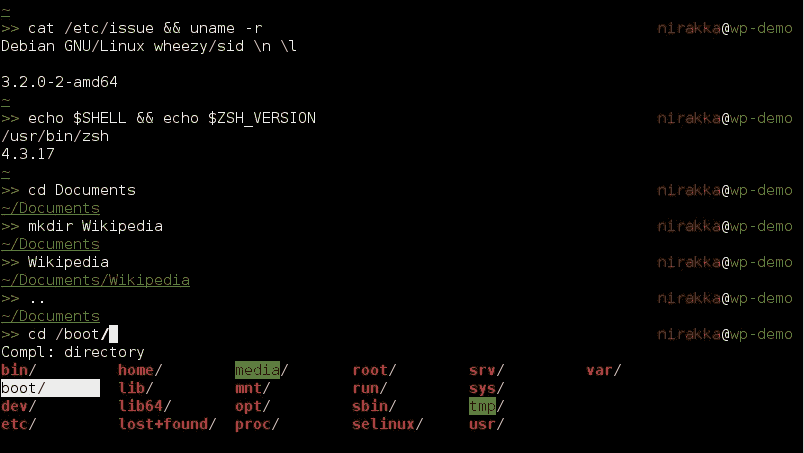
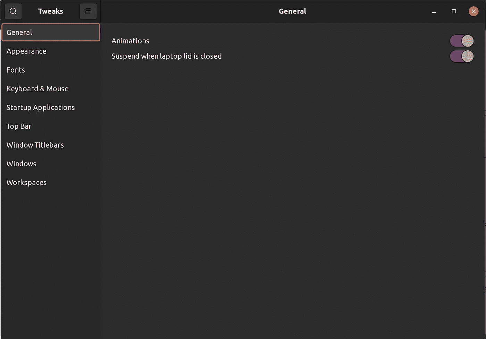

# 想要一个开发者友好且高效的 Ubuntu 吗？使用这些定制

> 原文：<https://levelup.gitconnected.com/want-a-developer-friendly-and-productive-ubuntu-use-these-customisations-c03a28b60beb>

## 简单却有效的改变！

亚历克斯·库利科夫在 [Unsplash](https://unsplash.com?utm_source=medium&utm_medium=referral) 上的照片

软件开发人员更喜欢调整他们的工具和操作系统，使它们更有效，对程序员更友好。我更喜欢 Linux 作为操作系统的原因是因为可以在其上进行定制。

使用 Linux 作为我最喜欢的软件开发操作系统有很多原因——***它是免费的、开源的、强大的命令行*** 等等。使用 Linux 的另一个重要原因是它提供的 ***定制*** 的数量。

Ubuntu 发行版在定制和修改方面也没有什么不同。我爱 Ubuntu，用了十几年了。我每天都使用这些调整来让我的一天更有效率

## Zsh

Bash 是 Ubuntu 上的默认 shell，毫无疑问它是最好的 shell 之一。日常工作我更喜欢 [Zsh](https://ohmyz.sh/) 。Zsh 扩展了 Bourne shell 并有许多新特性，支持插件和主题。它包括 Bash、ksh 和 tcsh 的特性。

来源:[维基共享](https://commons.wikimedia.org/wiki/File:Zsh-demo.png)

Zsh 很棒，很好用。它让你的终端看起来酷炫多彩。这些颜色不仅吸引人，而且可以很好地区分文件、选择等的不同特征。

插件和主题也很棒。值得一试。

## 令人敬畏的桌面环境

如果你喜欢使用终端，并且能够有效地使用像 vim 这样的终端编辑器，那么 [Awesome](https://awesomewm.org/) 对你来说是一个很好的桌面环境。

它在屏幕上用各种图案出色地排列了终端。您可以在终端之间无缝导航，并且可以轻松地添加或删除终端。

这种环境最好的部分是它简单的视角，很少让人分心。

## Gnome 调整工具

我不总是用牛逼。我喜欢在所有非编程活动中使用 GNOME。谈到这个默认的桌面环境，我使用 [GNOME 调整](https://gitlab.gnome.org/GNOME/gnome-tweaks)来定制环境。

GNOME 调整

它允许你定制环境的几乎每一个视觉元素。您可以更改字体，添加新的启动应用程序，在顶栏中添加或更改新元素，并且可以更改工作区参数。

## 武德勒

我喜欢用 Vim 写代码。准系统 vim 是一个很棒的编辑器，但是我对它进行了修改。像我自己的快捷键，配色方案，标签设置，键盘映射等的改变。为此，我使用了 [Vundle](https://github.com/VundleVim/Vundle.vim) 。它是 Vim 的一个插件管理器。

Vundle 帮助您使用、管理和定制众多可用的插件。定制的 Vim 让我可以更快地编写代码和导航。它为我节省了很多时间。

# 结束语

我没有在本文中介绍 ide 及其插件。这些是我更喜欢的操作系统的变化和帮助我写代码和更有效率的视觉效果。

***我希望你喜欢读这篇文章。如果你愿意支持我当作家，可以考虑报名*** [***成为中等会员***](https://singhamrit.medium.com/membership) ***。每月只需 5 美元，你就可以无限制地使用 Medium。***

 [## 通过我的推荐链接加入 Medium-Amrit Pal Singh

### 作为一个媒体会员，你的会员费的一部分会给你阅读的作家，你可以完全接触到每一个故事…

singhamrit.medium.com](https://singhamrit.medium.com/membership)