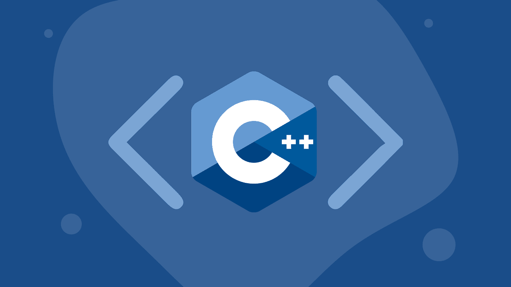

# 想成为一名软件开发人员？先学 C++，以后谢我。

> 原文：<https://levelup.gitconnected.com/want-to-be-a-software-developer-learn-c-first-and-thank-me-later-30a447f32037>

你有没有想过电子游戏是如何在幕后运作的？Windows、Mac OS、iOS 之类的操作系统呢？智能设备或无人机的幕后是什么？谷歌 Chrome 是用什么语言写的？嗯，我的朋友，我很高兴地告诉你，C++语言是所有这些事情的背后，甚至更多！C++是一种强大的语言，几乎可以开发你能想象的任何东西，从 PC 应用程序到游戏、操作系统、机器人等等。用 C++天空真的是极限。

有很多其他的编程语言有很多很酷的特性，使得开发应用程序相对简单。你可能听说过其中的一些语言，比如 Python、Java 和 JavaScript。但是，如果你是软件世界的新手，想把软件开发作为职业，你应该先学习 C++。这是因为其他现代语言虽然更方便、更简单，却剥夺了您学习每个成功的软件开发人员都应该知道的重要概念的能力！也就是说，这是我认为你应该首先学习 C++的 7 个理由:

# 1.它迫使你学习计算机是如何工作的

C++语言不牵你的手。它期望你知道一些关于计算机如何工作的事情，这为你提供了一个学习的机会！例如，指针是 C++的一个关键特性。为了有效地使用它们，有效地编写 C++程序，你必须理解什么是内存，什么是内存地址，以及你的程序如何使用内存。C++的本质迫使你声明你的变量是什么类型的数据，以及你的函数有什么返回类型。因此，你必须了解计算机能理解的变量类型，如整数、浮点、双精度、字符等等。C++是一种编译语言，所以要运行你的程序，你必须先编译它。等等什么是编译？这是另一个重要的概念，你将学习编写 C++程序！通过学习 C++你可以学到很多概念，这确实为你的职业生涯打下了坚实的基础。

# 2.到处都用！

没有 C++我就写不出这篇文章，你也看不懂！它用于构建运行互联网的网络应用程序，我们用于工作和学校的应用程序，它用于运行电视、相机和我们日常使用的几乎所有数字产品。C++应用程序可以在任何操作系统上运行，甚至可以在没有操作系统的计算机上运行！这意味着通过学习 C++，你将能够更好地理解你所使用的设备，并能够为任何你想要的东西编写应用程序！

# 3.功能强大，速度超级快！

C++是所有编程语言中最快的。这是因为我们编写的 C++程序被转换成计算机几乎可以以电的速度运行的位和字节。这种转换发生在我们编译代码的时候！C++也是一种非常强大的语言，它可以利用任何运行它的计算机的全部功能，并且能够在资源非常非常少的计算机上运行。这种灵活性使它成为运行在从超级计算机到微型芯片上的完美语言。总而言之，C++是编程语言的宙斯！

# 4.它将永远受欢迎

C++无处不在，这意味着对 C++开发人员的需求永远存在。大多数公司都有用 C++开发的软件，因此他们需要懂它的人。像英特尔，谷歌，微软，英伟达，VM Ware，波音等公司对 C++程序员有很高的要求。尤其是现在 C++开发人员更难找了。通过学习 C++，你将能够更好地将自己与那些选择掌握更简单语言的同龄人区分开来。

# 5.这使得学习其他语言变得更容易

想让学习其他语言变得简单吗？掌握 C++。我甚至可以从个人经历来说。我第一次学习 C++是在 14 岁的时候，从那以后，学习其他语言变得轻而易举。当你对 C++有很深的理解时，理解其他语言的概念并欣赏它们的便利和进步就容易多了。许多其他流行的语言都是用 C++开发的，所以先学习它，你会更擅长用这些语言开发。

# 6.这会让你成为更好的开发者

C++既有挑战性又乏味。它让你考虑你的应用程序将如何与运行它的机器交互。它促使你编写高效和足智多谋的代码。它不受限制的特性使你更加关注如何编写代码。这将使你成为更好的软件开发人员。一个优秀的开发人员需要做的不仅仅是工作。他们需要能够高效、可靠地工作，并且他们需要理解他们的代码决策的后果。C++开发强化了这些东西，这将增加你作为开发人员的意识。

# 7.越来越好了

是的，没错，C++与现代的特性、范例和工具保持同步。作为一名 C++开发人员，你不会错过太多。自诞生以来，C++已经有了 5 个版本。第一个版本是 C++99，当前版本是 C++17。每一个版本都有新的特性添加到语言中，以跟上现代编程特性的发展。微软最近发布了一个包管理器 C++，它使开发人员更容易管理 C++库。诸如此类的发展使得用 C++开发应用程序更加方便。

我可以没完没了地说 C++为什么伟大，但这是我的前 7 条。如果你想开始你的 C++开发之旅，我强烈推荐这个免费的教程。你可以在这里找到一个关于 C++ [的免费视频课程。](https://www.udemy.com/course/free-learn-c-tutorial-beginners/)