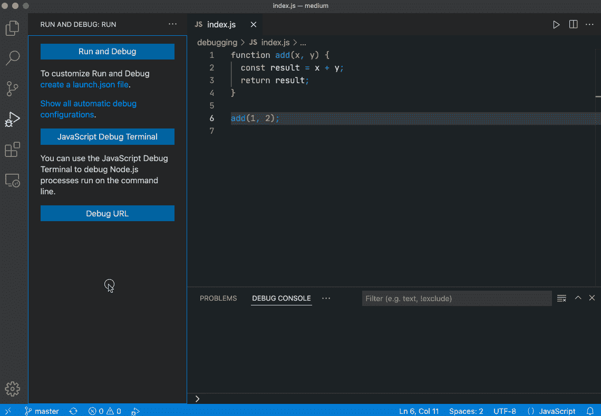

# 如何用 VS 代码调试 Node.js 程序？

> 原文：<https://levelup.gitconnected.com/want-to-become-a-senior-frontend-developer-you-must-master-debugging-f577ee569687>

调试是高级前端的必备技能。


照片由[西格蒙德](https://unsplash.com/@sigmund?utm_source=medium&utm_medium=referral)在 [Unsplash](https://unsplash.com?utm_source=medium&utm_medium=referral) 拍摄

如果你也想成为一名高级前端开发人员，掌握调试是一项关键技能。它会帮助你理解程序是如何工作的，并逐步提高你的编码水平。

对于复杂的开源项目，使用调试可以快速了解代码的作用和作者的意图，帮助你理解其内部原理，使你在编程上不断进步，最终成为高级前端开发人员，获得更高的薪水。

# 概观

调试在 Node.js 方向和 web 方向有很多要介绍的，所以我决定把这一系列文章分成以下几篇:

1.  本文(我将重点介绍如何用 VS 代码调试 Node.js 程序)
2.  [如何像专家一样调试 Web 程序](/how-to-debug-web-program-like-a-pro-ebc8995201bf)

# 快速启动

VS 代码有一个强大的内置 Node.js 调试器，不用安装任何扩展就可以调试 Node.js 程序或者 web 程序。



你可以看到我们在 VS 代码中很容易启动调试器，我来详细介绍一下。

# 启动配置

首先，您可以看到我在 gif 中创建了一个启动配置文件，它很有用，因为它允许您配置和保存调试设置细节。接下来，我们选择 Node.js，VS 代码自动生成相应的配置，回到 File Explorer 视图你会看到 VS 代码已经创建了一个`.vscode`文件夹，并将 launch.json 文件添加到你的工作区。

在 launch.json 配置文件中，调试模式可以分为两种核心模式，Attach 和 launch。

attach 模式需要提前准备调试服务器。我们可以在调试模式下启动 app 获取调试服务器，然后通过程序端口连接 VS 代码调试器，而启动则帮助我们完成这一切，直接帮助我们在调试模式下启动 app，所以启动模式可以满足大部分使用场景。

有很多 Launch.json 属性，你可以在 [VS 代码官方文档](https://code.visualstudio.com/docs/editor/debugging#_launchjson-attributes)中找到它们的详细描述。

在这个演示项目中，我将使用以下配置。

```
{
  "version": "0.2.0",
  "configurations": [
    {
      "type": "pwa-node",
      "request": "launch",
      "name": "Launch Program",
      "skipFiles": ["<node_internals>/**"],
      "program": "${file}"
    }
  ]
}
```

# 断点选项

断点可以通过点击当前行的编辑器页边来切换，如果是鼠标右键点击，会出现一个选项菜单。


第一个选项与用鼠标左键单击的效果相同。

第二个选项是添加一个条件断点。您可以稍后输入 JavaScript 表达式。只有当表达式结果为 true 时，此断点才会生效。

第三个选项是 Logpoints，它是断点的变体，不会“中断”到调试器中，而是向控制台记录一条消息。在调试无法暂停或停止的生产服务器时，日志点对于注入日志记录特别有用。

# 调试应用程序

现在我们可以开始调试了，我们可以使用快捷键 F5 或左边的开始按钮来启动它。

当程序运行到断点时，它将停止。此时截图如下。


# **左侧面板**


*   **变量**

您可以在这里查看当前断点下所有可访问的环境变量，它们可能来自当前作用域、闭包作用域、全局作用域等。

*   **手表**

在这里，您可以添加变量或计算表达式，并在当前断点的上下文中观察它们的值。如果我们想在代码逻辑之外做一些表达式计算，这是一个非常有用的特性。

*   **调用堆栈**

在这里可以查看当前函数的调用栈，这对于明确函数调用的顺序很有帮助。

*   **断点**

此处包含所有带有断点的文件列表。如果检查了未捕获的异常，这意味着如果程序中出现未捕获的异常，它将在出现异常的行停止。对于被捕获的异常也是如此，但它只表示被捕获的异常。

# 调试操作


您可以通过单击这些图标来控制调试行为。它们如下:

*   **继续/暂停**

这意味着继续运行代码，直到遇到下一个断点。

*   **跨过** `**F10**`

根据代码执行逻辑跳过当前函数执行，直接执行下一条语句。

*   **踏入** `**F11**`

当断点到达函数时，您可以使用此选项跳转到函数的执行中，以查看函数内部发生了什么。

*   **踏出**

可以在执行过程中跳出当前函数。

*   **重启**
*   **停止**

# 调试控制台 REPL


这个区域称为调试控制台 REPL，在这里您可以获取当前断点环境中的变量，并组合它们来执行表达式。

最后，我是李。我会继续输出前端技术相关的故事。如果你喜欢这样的故事，想支持我，请考虑成为 [*中等会员*](https://medium.com/@islizeqiang/membership) *。每月 5 美元，你可以无限制地访问媒体内容。如果你通过* [*我的链接*](https://medium.com/@islizeqiang/membership) *报名，我会得到一点佣金。*

你的支持对我来说非常重要——谢谢。